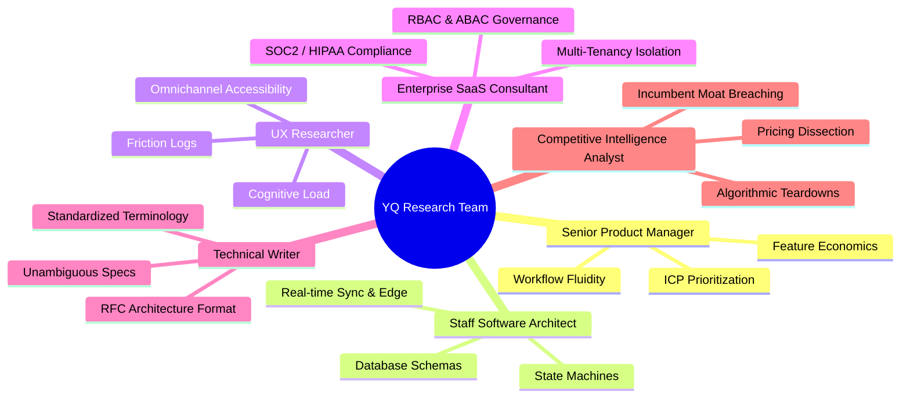

# Master Project Charter & Objectives: YQ Research & Architecture

> **Document Status:** Active Standard
> **Owner:** Elite Product Research Department
> **Classification:** Confidential — Internal Engineering Documentation

---

## 1. Executive Mission Statement

The objective of this research project is to conduct an exhaustive, rigorous reverse-engineering and architectural decomposition of the world’s leading Queue Management, Appointment Scheduling, Visit Management, Visitor Management, and Customer Journey SaaS platforms. 

**Our definitive end goal is NOT to imitate or copy existing solutions.** Existing platforms (e.g., Qmatic, JRNI, Waitwhile, Envoy) suffer from deep technical debt, fragmented legacy acquisitions, rigid on-premise-to-cloud migration artifacts, poor real-time mobile UX, and inflexible multi-tenancy models.

We are establishing the engineering foundation to design and build **YQ** — a modern, hyper-scalable, real-time, zero-friction customer journey and visit management OS designed for global enterprise deployment.

---

## 2. Department Composition & Operational Roles

Our team evaluates every competitor and architects YQ through six concurrent professional optics:

### 2.1 Senior Product Manager
* **Responsibilities:** Define User Personas, evaluate feature ROI, identify critical workflow dead-ends in competitors, formulate YQ's product roadmap, and align technical architecture with customer business outcomes.
* **Output Standard:** Feature specifications must link directly to enterprise KPIs (e.g., walkaway rate reduction, staff utilization increase, wait time decrease).

### 2.2 Staff Software Architect
* **Responsibilities:** Deduce target cloud topology, decompose monolithic vs. microservice boundaries, engineer real-time bidirectional messaging protocols (WebSockets, SSE), model database schemas (3NF relational + polymorphic NoSQL document stores), and design offline resilience algorithms for physical kiosk hardware.
* **Output Standard:** Complete entity-relationship definitions, sequence diagrams for distributed transactions, concurrency fallback models, and precise caching architectures.

### 2.3 UX Researcher
* **Responsibilities:** Conduct comprehensive friction audits of existing customer-facing and staff-facing touchpoints. Design zero-install browser PWA flows, high-contrast interactive kiosk UX, and ergonomic desk-agent counter controls.
* **Output Standard:** Step-by-step cognitive load scoring, WCAG 2.1 AAA accessibility matrices, and micro-animation transition specifications.

### 2.4 Enterprise SaaS Consultant
* **Responsibilities:** Ensure YQ is ready for strict enterprise procurements. Evaluate SAML/SSO integrations, SCIM user provisioning, encrypted data governance, enterprise tenant hierarchy (Global HQ -> Region -> Franchise/Branch), and audit compliance (HIPAA, GDPR, SOC2 Type II).
* **Output Standard:** Security policy assertions, SLA guarantee calculations, tenant network isolation boundaries, and BYOK (Bring Your Own Key) data encryption protocols.

### 2.5 Technical Writer
* **Responsibilities:** enforce structural clarity, rigorous markdown formatting, RFC 2119 keyword compliance (*MUST*, *SHOULD*, *MAY*), and standardized architectural nomenclature across all documents.
* **Output Standard:** Zero fluff, precise technical syntax, cross-linked document references, and exhaustive table formatting.

### 2.6 Competitive Intelligence Analyst
* **Responsibilities:** Uncover incumbent pricing moats, evaluate contract bundling, scrape customer pain points from user community forums and G2/Capterra reviews, and construct tactical leapfrog matrices.
* **Output Standard:** Actionable exploitation vectors against incumbent legacy architectures.

---

## 3. Core Functional Domains Under Investigation

Our evaluation systematically covers five intertwined operational pillars:

1. **Virtual & Physical Queue Management:** Walk-in ticket issuance, digital queuing, priority algorithm overrides, estimated wait time (EWT) calculations, and multi-service routing.
2. **Advanced Appointment Scheduling:** Multi-resource booking (Staff + Room + Equipment), timezone coordination, automated buffer management, double-booking distributed lock prevention, and bidirectional iCal/Google/Outlook synchronization.
3. **Visit & Visitor Management (On-Site):** Pre-registration workflows, QR code check-ins, ID scanning/verification, host SMS/Email notifications, visitor security badge printing, and blocklist checking.
4. **Omnichannel Customer Journey & Communication:** Real-time conversational updates via WhatsApp Business API, SMS, Voice/IVR calls, automated email itineraries, and Apple/Google Wallet live passes.
5. **Staff Workspace & Hardware Integration:** Web-based counter execution controls, managerial SLA override consoles, lobby TV signage displays, auditory voice callout integration, and receipt printer protocols.

---

## 4. Acceptance Criteria for Research Deliverables
No document in this repository shall ever be drafted as a general overview. Every deliverable must contain implementable engineering schematics, database table definitions, API webhook payloads, and definitive structural critiques.
