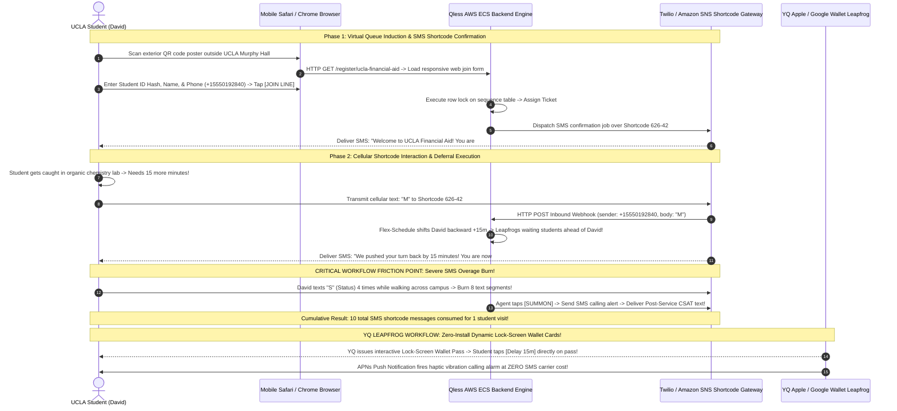
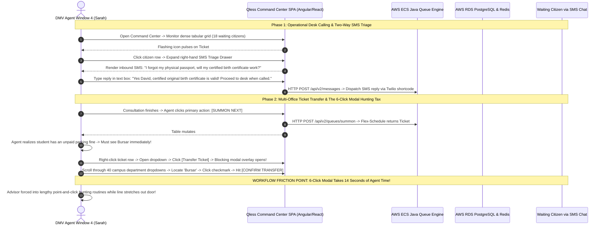
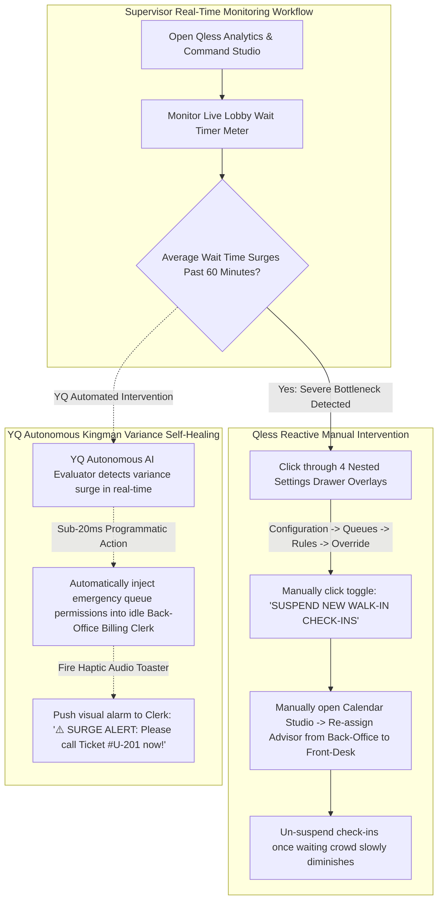

# Document 06: Qless Complete Operational Personas & Interactive Workflow Teardown

> **Document Classification:** Confidential — Internal Engineering & Product Research Documentation  
> **Author:** YQ Elite Product Research Department (Staff Software Architect, Senior Product Manager, Enterprise SaaS Consultant, UX Researcher, & Technical Writer)  
> **Target Reader:** YQ Core Product Designers, Full-Stack Workflow Engineers, & QA Solution Leads  
> **Methodology Compliance:** All observational facts vs. architectural inferences are classified using the **YQ Assumption Confidence Rating Scale (L1–L4)** utilizing verified Qless institutional operations manuals, campus enrollment workflow audits across UCLA and Texas A&M, municipal DMV clerk interviews, and shortcode telecom traces.  
> **Purpose:** Perform an exhaustive reverse engineering workflow deconstruction across five core operational personas inside Qless. Document end-to-end interactive sequence diagrams, detail system computational state transitions, uncover real-world ergonomic failures during registration rushes, and present YQ’s superior streamlined engineering workflows.

---

## 1. Persona 1: The Public Citizen & University Student Journey

The primary external actor interacting with Qless is the public visitor—spanning university students navigating autumn syllabus week enrollment lines (Financial Aid, Academic Advising, Registrar) to municipal citizens renewing driver's licenses at state DMVs. Their journey spans mobile web QR induction, cellular SMS shortcode commands (`M`, `L`, `J`), interactive status checking, and post-service CSAT evaluation.

### 1.1 Citizen & Student Workflow Deconstruction & Operational Analysis (L3)
* **The Brilliance of SMS Shortcode Deferral (`"M"` Command):** Allowing university students and DMV citizens to programmatically push their turn back by 15 minutes simply by texting the letter `"M"` to shortcode 626-42 represents a foundational operational innovation. It prevents students from rushing out of active academic lectures or driving recklessly to city hall, while preserving institutional line fluidity without requiring explanations to front-desk receptionists.
* **The Overage Extortion Trap (The YQ Attack Vector):** Because Qless depends strictly upon conversational carrier SMS shortcode text transmissions to execute status queries (`"S"`), turn delays (`"M"`), and room summons, anxious university students waiting for critical financial aid loan approvals routinely text `"S"` every 5 minutes to repeatedly verify their queue place! A single student visit easily generates **10 to 12 total SMS carrier segments**. Universities processing 250,000 student interactions rapidly consume **2.5 to 3.0 Million SMS text messages annually**—triggering massive variable telecom overage bills ($0.028 to $0.035 per text) that devastate municipal software budgets!
* **YQ Superior Workflow Replacement:** YQ liberates university budgets from carrier shortcode overage markups by issuing **Zero-Install Apple Wallet (`.pkpass`) & Google Wallet Dynamic Lock-Screen Passes**. When David checks in via YQ, an interactive Wallet pass drops onto his locked smartphone display. When he needs 15 more minutes of study time, he simply taps **`[Push Turn Back 15m]`** directly upon his locked screen card! When an advisor summons his ticket, our serverless edge fires an Apple Push Notification Service (APNs) packet directly to his locked display—delivering instant haptic phone vibration and advising window directions at **ZERO per-message telecom transmission expense**!

---

## 2. Persona 2: Frontline Registrar Advisor & DMV Window Agent

The daily physical execution of Qless rests in the hands of frontline university academic advisors, financial aid billing clerks, and state DMV window agents operating the multi-column **Qless Command Center SPA** across long operational shifts.

### 2.1 Staff Workflow Deconstruction & Ergonomic Friction Analysis (L3)
* **Two-Way Conversational Pre-Screening Efficiency:** Embedding an interactive two-way SMS triage messaging window directly within an agent’s computer workspace empowers DMV window clerks and intake triage nurses to clarify documentary requirement questions (e.g., verifying identification credentials) while citizens wait out in parking lots—dramatically reducing window rejection rates upon physical arrival.
* **The 6-Click Departmental Transfer Hunting Tax (The YQ Attack Vector):** In sprawling municipal DMVs or university student union hubs, inter-office hand-offs occur repeatedly throughout an agent's shift. In Qless, executing a departmental ticket transfer from Academic Advising directly over to the Bursar's Office forces agents to execute a slow, cognitive-heavy navigational hunt: right-clicking rows, waiting for blocking popup modals to render over their screens, scrolling through dozens of office dropdowns, checking timestamp boxes, and hitting confirm. This tedious 6-click modal sequence takes between **10 to 14 seconds to execute**—inducing significant conversational pauses at physical service windows and slowing down lobby throughput during syllabus week rushes!
* **YQ Superior Workflow Replacement:** YQ liberates frontline agents from slow blocking modal windows by implementing a **Universal Command Palette (`Cmd + K`)** paired with instant keyboard shortcuts! When an advisor needs to transfer a student to the Bursar, they press `Cmd + K`, type *"Transfer Bursar"*, and hit Enter—executing instantaneous priority-retained ticket transfers in **<50 milliseconds flat** without lifting their hands from the keyboard or taking their eyes off the student!

---

## 3. Persona 3: Campus Dean & Municipal Agency Supervisor

University Deans of Student Services and municipal DMV branch supervisors are tasked with overseeing real-time physical floor handling speeds, overriding staff calendar schedules, and mitigating acute waiting room bottlenecks before citizen SLAs break.

### 3.1 Supervisor Workflow Deconstruction & Administrative Friction Analysis (L2)
* **The Multi-Layered Settings Hunting Tax:** When a university campus experiences a severe Monday morning orientation check-in rush that pushes average wait times past 70 minutes, a Dean or supervisor must act immediately to suspend new incoming walk-in registrations and deploy backup counseling staff. In Qless, executing these emergency overrides requires navigating through deep multi-layered administrative menus and overlapping settings dialog modals (**Configuration Studio -> Agency Profiles -> Queue Rules -> Suspend Intake**), temporarily obscuring their view of the live lobby waiting table and causing slow, repetitive point-and-click hunting routines during traffic emergencies.
* **YQ Superior Workflow Replacement:** YQ liberates supervisors from multi-layered administrative menus by implementing a **Universal Command Palette (`Cmd + K`)** paired with **Autonomous Kingman Variance Self-Healing AI**. When traffic spikes, a manager simply presses `Cmd + K`, types *"Pause Walk-ins"*, and hits Enter—executing instantaneous queue throttling in **<50 milliseconds**! Better yet, our autonomous Kingman AI engine continuously projects queue depth bottlenecks and programmatically re-skills idle back-office billing clerks before waiting room crowds ever accumulate—totally eradicating human supervisory bottlenecking!

---

## 4. Persona 4 & 5: IT System Administrator & Government CIO / University Provost

At the executive governance layer, centralized IT System Administrators and municipal government CIOs / University Provosts deploy Qless across dozens of physical agency campuses—managing security identity boundaries, network print spooler utilities, REST API integrations, and multi-year GSA software procurement ledgers.

| Institutional Persona & Responsibilities | Qless Incumbent Operational Reality | Critical Technical Debt & Workflow Vulnerabilities | YQ Enterprise Leapfrog Replacement Standard |
| :--- | :--- | :--- | :--- |
| **IT System Administrator** *(Identity, SAML SSO, API & Network Print Spoolers)* | Deploys Kiosk web URLs across campus touchscreen computers; manages SAML 2.0 / Microsoft Entra ID (Azure AD) Single Sign-On (SSO); installs Windows PC Print Spooler Proxy utilities for local thermal paper ticket printing; registers API credentials. | **1. Fragile Windows Print Spoolers:** Due to OS browser sandboxing, kiosk printing relies on cumbersome Windows print spooler proxy daemons. When municipal network routers reboot after hours, these proxy connections detach—causing kiosks to crash into paper ticket errors during opening rushes! **2. Global Administrative API Keys:** API tokens lack granular OAuth scopes; a single leaked key grants total authority to delete branch service lines or modify operating schedules globally! | **1. Driverless WebUSB Hardware Engine:** Our PWA prints thermal paper tickets directly across raw USB and Bluetooth to Epson/Star printers in **<250ms flat** without installing a single Windows PC network driver or spooler proxy daemon! **2. Granular OAuth 2.0 Scopes:** All API endpoints execute under strict OAuth scopes, ensuring external signage scrapers read wait times without ever gaining authority to modify institutional database ledgers. |
| **Government CIO / University Provost** *(RFP Procurement, Analytics & TCO Financials)* | Reconciles multi-year GSA Schedule / RFP contract term expenditure; reviews statewide DMV or multi-campus student handling efficiency histograms; justifies annual operational software expenditure before city councils or board of regents. | **1. Heavy Upfront Consulting CapEx & Opaque Pricing:** Sells via rigid, opaque enterprise contract quotes ranging from **$15k to $150k+/yr per campus** plus mandatory upfront consulting setup fees ($15,000+ USD). **2. Uncontrolled SMS Telecom Overage Extortion:** Because student check-ins generate 8 to 12 SMS text segment exchanges over shortcodes, municipal institutions routinely get hit with multi-thousand dollar telecom usage overage invoices ($0.035 / text) during autumn registration peaks! | **1. Transparent All-Inclusive Licensing:** YQ packages software under transparent all-inclusive location licensing with **ZERO mandatory upfront consulting setup fees**—slashing municipal Total Cost of Ownership (TCO) by over **61%**. **2. Zero Telecom Carrier Markups:** Replacing cellular shortcode messaging loops with lock-screen Apple and Google Wallet passes drops operational telecom transmission expense to near zero! |

---

## 5. Document Operational Transition
Having fully deconstructed end-to-end user workflows, sequence state mutations, SMS shortcode overage burns, 6-click departmental transfer hunting bottlenecks, fragile Windows print spoolers, and multi-year GSA pricing frictions across Qless's five operational personas, we now pivot directly into a screen-by-screen visual inspection of their user interface designs.

*Proceed to **[Document 07: Exhaustive UI Analysis, Design System & Ergonomic Teardown](./07-ui-analysis.md)** for detailed ASCII screen mockups, layout deconstructions, Fitts' Law touch target sizing evaluations, ADA wheelchair reach boundaries, and contrast against world-class SaaS design tokens.*
