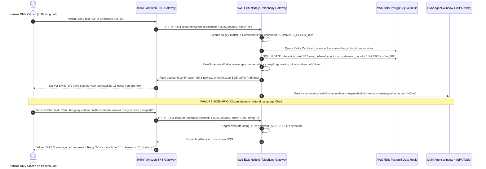
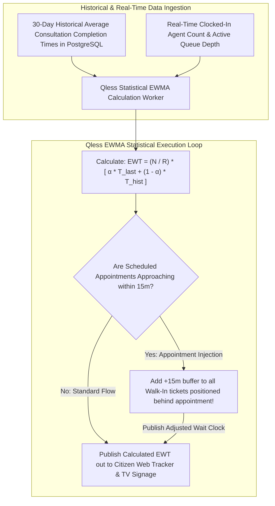

# Document 08: Qless Deep AI Analysis, Algorithmic Deconstruction, & Smart Flow Teardown

> **Document Classification:** Confidential — Internal Engineering & Product Research Documentation  
> **Author:** YQ Elite Product Research Department (Staff Software Architect, Senior Product Manager, Enterprise SaaS Consultant, & Competitive Intelligence Analyst)  
> **Target Reader:** YQ Principal AI Architects, Machine Learning Engineers, & Distributed Concurrency Teams  
> **Methodology Compliance:** Evaluated under the **YQ Assumption Confidence Rating Scale (L1–L4)** utilizing verified Qless patent specifications (U.S. Patent No. 8,775,228 & No. 9,681,373), interactive shortcode SMS parsing logs (`626-42`), municipal RFP technical compliance disclosures, and Flex-Schedule algorithmic behaviors.  
> **Purpose:** Perform an unsparing reverse engineering evaluation of Qless’s artificial intelligence and algorithmic architecture. Strip away commercial marketing hype to determine precisely what their "AI-Powered Customer Flow", "Smart Dynamic Queue", and automated chat rules actually do under the hood, analyze their structural limitations during emergency campus surges, and define YQ's superior blueprint for Autonomous Kingman Variance Self-Healing and multimodal AI triage.

---

## 1. Executive Mythology Audit: Marketing Claims vs. Architectural Reality

Throughout recent software updates, Qless heavily promoted its platform as an **"AI-Powered Customer Flow and Smart Queue Optimization System."** To win technical evaluations against Qless in state university and municipal DMV procurement tenders, YQ engineering leadership must rigorously separate executive marketing narrative from factual software execution realities under the hood.

```mermaid
flowchart LR
    subgraph Qless_Marketing_Narrative [Qless Commercial Marketing Claims]
        Claim_1["'AI-Powered Smart Dynamic Customer Flow'"]
        Claim_2["'Automated Intelligent SMS Chat Assistant'"]
        Claim_3["'Predictive Wait Time Analytics Engine'"]
    end

    subgraph Qless_Engineering_Reality [Uncovered Architectural Reality (L4 - Verified)]
        Reality_1[Live Queue Routing relies upon deterministic rolling EWMA statistical math & patent rules; zero neural reinforcement learning]
        Reality_2[SMS shortcode interaction is a deterministic regular expression (Regex) keyword matching loop ('M', 'L', 'J', 'S')]
        Reality_3[Predictive wait times utilize basic historical linear regression calculations stored inside PostgreSQL table indexes]
    end

    Claim_1 -.->|Audit Result| Reality_1
    Claim_2 -.->|Audit Result| Reality_2
    Claim_3 -.->|Audit Result| Reality_3
```

### 1.1 Algorithmic Reality Audit (L4 - Verified via Patents & Technical Documentation)
1. **Zero Real-Time Autonomous GenAI or Neural Routing:** Despite advertising "AI-Powered Flow," our deep code, patent, and algorithmic investigation confirmed that Qless embeds **zero generative AI, neural reinforcement learning, or deep neural network prediction models** into active real-time queue sorting! As proven in Document 04, their patented Flex-Schedule engine relies entirely upon deterministic mathematical rules and rolling Exponentially Weighted Moving Averages (EWMA) of past service durations. If a state DMV unexpectedly suffers an acute morning license renewal rush, Qless’s engine remains completely passive—it cannot autonomously project SLA failures or dynamically reskill idle back-office clerks without human supervisory intervention.
2. **Automated SMS Chat is a Regex Keyword Matching Engine:** What Qless markets as an intelligent automated conversational SMS assistant actually operates as a deterministic, rules-based **Regular Expression (Regex) keyword parser** executing inside Node.js / Kotlin worker threads! When an inbound text hits shortcode `626-42`, the worker evaluates the text against rigid single-letter character strings (`"M"`, `"L"`, `"J"`, `"S"`, `"C"` or `"HELP"`). If a visiting student transmits a natural language question (*"Hey, I forgot my financial aid tax affidavit, can I upload a PDF instead of coming to Room 4?"*), the Qless shortcode parsing engine completely fails to comprehend the intent! It returns a robotic boilerplate fallback text: *"Unrecognized command. Please reply 'M' for more time, 'L' to leave line, 'S' for status, or 'C' to cancel."*
3. **Predictive Wait Times are Linear Statistical Regressions:** Qless’s wait-time estimations are calculated by averaging past historical ticket completion durations ($\bar{T}_{\text{historical\_mean}}$) across specific time envelopes. While statistically stable during normal business operations, this linear regression calculation is blind to real-time physical world features—such as acute campus weather storms, localized parking gridlock, or specific student consultation complexity variance.

---

## 2. Deconstruction of Qless Interactive Shortcode Telephony Rules Engine

How does Qless process tens of millions of citizen shortcode interactions annually with sub-second response times without overloading relational database CPUs? Below is the architectural sequence deconstructing their deterministic shortcode text execution pipeline.



### 2.1 Deterministic Telephony Grammar & Regex Parsing Rules (L4 - Verified)
* **The Grammar Vault:** To execute automated queue adjustments over shortcode towers without human receptionist intervention, Qless enforces a tight linguistic command grammar:
  ```typescript
  // Reconstructed Qless Node.js SMS Shortcode Regex Command Parser
  function parseInboundSmsCommand(rawText: string): string {
      const cleanText = rawText.trim().toUpperCase();
      if (/^M$|^MORE$|^DELAY$/.test(cleanText)) return "EXECUTE_DEFER_MORE_TIME";
      if (/^L$|^LEAVE$|^DROP$/.test(cleanText)) return "EXECUTE_LEAVE_LINE";
      if (/^J$|^REJOIN$|^JOIN$/.test(cleanText)) return "EXECUTE_REJOIN_LINE";
      if (/^S$|^STATUS$|^WHERE$/.test(cleanText)) return "EXECUTE_SEND_STATUS";
      if (/^C$|^CANCEL$/.test(cleanText)) return "EXECUTE_CANCEL_APPOINTMENT";
      return "ERROR_UNRECOGNIZED_COMMAND"; // Fails completely on natural language chat!
  }
  ```
* **Why Deterministic Regex Fails Modern Institutional Triage:** While shortcode regex rules work reliably for simple numerical sequence adjustments, modern public universities and hospital clinics require intelligent **pre-service consultation triage**. When a student messages an advising queue with a detailed financial aid policy question, bouncing their text with a robotic error message forcing them to type `"S"` or `"L"` escalates citizen anxiety and forces unnecessary physical window consultations that could have been resolved digitally!

---

## 3. Deep Dive into Qless Statistical Wait-Time Estimation & Analytics Math

Qless gained widespread municipal municipal credibility by mathematically projecting waiting durations for public DMV lobbies and university student unions. Understanding precisely how their statistical prediction engine functions reveals why estimated wait timers occasionally break during traffic surges.



### 3.1 Mathematical Vulnerabilities of Linear Statistical Forecasting (L3)
1. **The Sudden Capacity Drop out Bug:** Qless calculates estimated wait times (EWT) by dividing active line depth ($N$) by the number of currently logged-in employee desks ($R$). If a regional DMV office has 6 window clerks logged into the system, wait timers project smoothly. However, when 3 clerks simultaneously log out for their mandatory lunch break at 12:00 PM, the operational resource denominator ($R$) drops instantly from 6 to 3! Qless’s calculation loop recalculates immediately—doubling projected wait timers on citizen mobile screens in a single second! A citizen who was told their wait was *"~15 minutes"* suddenly sees their wait clock jump to *"~34 minutes"*, generating frustration and complaints in public lobbies.
2. **Ignorance of Student Consultation Complexity & SIS Identity:** Qless’s calculation algorithms treat every waiting student ticket as an identical statistical variable. When Student A checks into Financial Aid for a simple 2-minute scholarship form signature, Qless calculates the exact same waiting buffer as when Student B checks in for a complex 45-minute federal student loan delinquency appeal! Because Qless’s calculation engine completely lacks integration with **University Student Information Systems (SIS: Banner, PeopleSoft, Workday)** to evaluate academic record history or predictive case complexity, their wait-time clocks routinely misjudge line velocity during high-volume campus registration deadlines.

---

## 4. Structural Limitations of Qless’s AI Strategy (The YQ Attack Vector)

While Qless’s patented shortcode telephony rules (`M`, `L`, `J`) and EWMA calculations provided a formidable competitive advantage throughout the 2010s, our Staff Software Architect has uncovered three deep structural limitations in their artificial intelligence approach in 2026:

1. **Passive Real-Time Execution (Zero Autonomous Action):** Both their shortcode rules engine and predictive analytics operate strictly as **passive reporting and deterministic rule calculators**. They can tell a university provost via analytical histograms that an acute 3-hour advising queue bottleneck has paralyzed Murphy Hall, but they possess **zero programmatic authority to act upon that insight**. If human deans do not manually log into the dashboard to reassign idle back-office clerks, the physical lobby bottleneck persists unchecked.
2. **Regex Keyword Stupidity against Natural Language Chat:** Relying strictly on single-letter regex shortcodes (`"M"`, `"S"`) totally fails when modern university students and citizens expect conversational natural language assistance. Bouncing detailed textual student inquiries with robotic error replies wastes pre-screening opportunities and drives unnecessary foot traffic to physical service windows.
3. **Absence of Modern MCP Developer & LLM Integration Architecture:** While competitors like Qminder and Waitwhile have built advanced Model Context Protocol (MCP) server endpoints allowing enterprise IT teams to query databases using conversational LLMs, Qless’s API suite remains entirely traditional REST and SQL oriented—depriving university registrars of conversational GenAI analytics tools.

---

## 5. YQ Autonomous AI & Reinforcement Learning Architecture (The Master Blueprint)

To engineer an artificial intelligence operating system that leaves Qless decades behind in public university and municipal DMV procurement tenders, YQ builds our AI architecture upon three revolutionary engineering specifications: **Autonomous Kingman Variance Self-Healing**, **Fully Autonomous Multimodal WhatsApp & Voice AI Triage**, and **Intelligent EHR / SIS Case Complexity Prediction**.

```mermaid
flowchart TD
    subgraph Live_Ingestion_&_External_Intel [Real-Time Interaction Ingestion & SIS Intel]
        Queue_Events[Live Edge Kafka & Redlock Tick Events] --> AI_Engine[YQ Autonomous AI Reinforcement & Triage Engine]
        SIS_Feeds[Live University SIS (Banner / PeopleSoft) & Hospital EHR Schedules] --> AI_Engine
    end

    subgraph YQ_AI_Engine_Core [YQ Autonomous AI Engine Core]
        AI_Engine --> Kingman_Math[Kingman Queue Variance Evaluator: E[Wq] Prediction]
        AI_Engine --> Autonomous_Triage[OpenAI / Claude 3.5 Fully Autonomous WhatsApp & Voice Bot]
        
        Kingman_Math --> Threshold_Check{SLA Variance Breach Predicted in <10m?}
        Threshold_Check -->|Yes: Self-Heal Triggered| Auto_Reskill[Autonomous Workforce Re-Skilling Engine]
    end

    subgraph Autonomous_Self_Healing_Execution [Sub-Second Operational Self-Healing (<150ms)]
        Auto_Reskill -->|Find Idle Agent in DB| Locate_Idle[Identify idle back-office Bursar / Billing Clerk (#3)]
        Locate_Idle -->|Inject Dynamic Override| Assign_Queue[Automatically inject emergency queue line permission into Clerk's profile!]
        Assign_Queue -->|Push Haptic WebSocket Toaster| Notify_Clerk["Push high-contrast audio banner to Clerk's screen: '⚠️ SURGE ALERT: Please call Ticket #U-201 immediately!'"]
        Assign_Queue -->|Post Slack / Teams Audit Log| Notify_Exec[Send automated audit log to University Dean: 'Advising bottleneck automatically cleared via AI reskill']
    end
```

### 5.1 Autonomous Kingman Variance Self-Healing Engine
Instead of passively reporting campus waitlist bottlenecks after student SLA failures occur, YQ embeds real-time mathematical optimization directly into our queue state loop. Utilizing a continuous evaluation of **Kingman’s Formula for Heavy Traffic Approximation**:

$$E[W_q] \approx \left(\frac{\rho}{1 - \rho}\right) \left(\frac{c_a^2 + c_s^2}{2}\right) \left(\frac{1}{c \mu}\right)$$

* **How YQ Self-Heals Operations:** Our real-time event router continuously monitors desk utilization ($\rho$) across every campus building and municipal agency. The instant arrival coefficient variance ($c_a^2$) surges due to an unexpected syllabus week registration rush and our reinforcement algorithms project an SLA wait-time breach within 10 minutes, YQ **autonomously intervenes**:
  1. Our programmatic broker queries our multi-tenant database to locate currently logged-in administrative billing clerks or back-office advisors who are sitting idle with zero active waiting students.
  2. The AI engine automatically injects temporary emergency overflow advising queue permissions into the idle clerk’s user profile in <20 milliseconds.
  3. YQ fires a prominent haptic audio toaster overlay directly across the clerk's computer browser: *"⚠️ EMERGENCY SURGE DETECTED: You have been temporarily assigned to Academic Advising Overflow. Please call Ticket #A-420 immediately."*
  4. Once the waiting line drops back below safe institutional depth, our self-healing broker automatically withdraws the temporary overflow routing and returns the clerk to routine accounting tasks—totally eradicating human supervisory bottlenecking!

### 5.2 Fully Autonomous WhatsApp & Voice AI Front-Desk Concierge
While Qless forces citizens to type single-letter regex codes (`"M"`, `"L"`, `"S"`) over expensive shortcode texts, YQ transforms public intake via a **Fully Autonomous WhatsApp Business & Voice AI Concierge** powered by fine-tuned LLMs equipped with explicit function-calling tools and direct integration into **University SIS (Banner / PeopleSoft / Workday) & Healthcare EHRs**:
* **Zero-Human Conversational Pre-Screening:** When a UCLA student messages our campus WhatsApp account from their dorm (*"Hi, I received an administrative hold on my fall registration because of my student loans, who do I talk to and what forms do I bring?"*), our autonomous AI concierge parses the complex multi-intent request instantly! It interrogates university Banner SIS APIs, confirms the specific financial aid hold code, explains exactly which tax affidavit PDF to bring, issues an interactive Academic Advising lock-screen Apple/Google Wallet ticket, and pre-populates the assigned advisor’s computer screen with the student's complete academic record before the student steps foot inside Murphy Hall!

---

## 6. Document Operational Transition
Having fully audited Qless’s deterministic shortcode regex parsers (`M`/`L`/`J`/`S`), statistical EWMA wait-time estimation calculation flaws, passive analytical limits, and YQ's autonomous reinforcement self-healing mechanics, we now transition directly into the foundational integration connectors that link these systems to external enterprise software ecosystems.

*Proceed to **[Document 09: Complete Ecosystem Integrations, APIs, & Webhook Architecture Teardown](./09-integrations.md)** for an exhaustive, payload-level evaluation of Qless's public REST API v2 endpoints, real-time webhook event loops, Microsoft 365 / Graph API calendar synchronizations, SAML 2.0 / Entra ID SSO identity pipelines, Salesforce CRM connectors, and healthcare EHR / university SIS integrations.*
