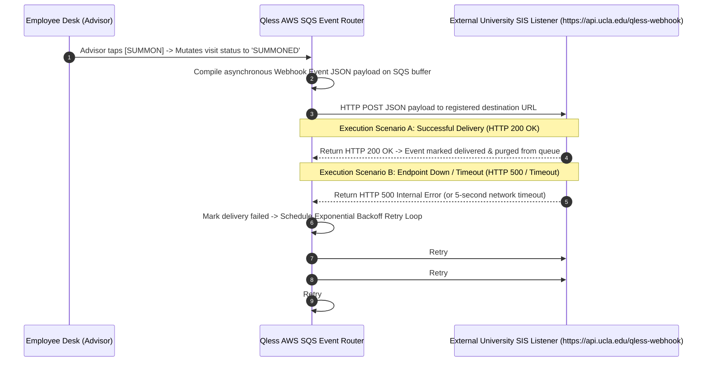
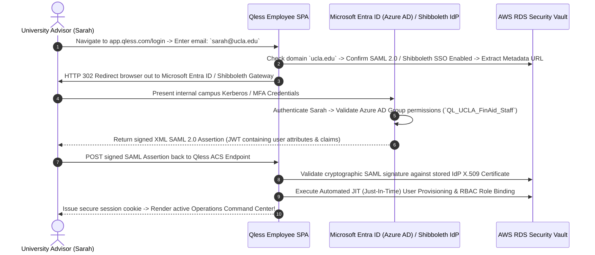

# Document 09: Qless Complete Ecosystem Integrations, APIs, & Webhook Architecture Teardown

> **Document Classification:** Confidential — Internal Engineering & Product Research Documentation  
> **Author:** YQ Elite Product Research Department (Staff Software Architect, Senior Product Manager, Enterprise SaaS Consultant, & Integration Specialist)  
> **Target Reader:** YQ API Architects, Core Integration Leads, & Institutional Solutions Engineers  
> **Methodology Compliance:** Evaluated under the **YQ Assumption Confidence Rating Scale (L1–L4)** utilizing verified Qless REST API v2 developer documentation (`api.qless.com/v2`), webhook JSON event schemas, SAML 2.0 Azure AD / Entra ID enterprise integration manuals, Microsoft 365 Graph API oauth bindings, and university SIS / healthcare EHR implementation rules.  
> **Purpose:** Perform an exhaustive, payload-level reverse engineering teardown of every third-party integration, REST API v2 endpoint, real-time webhook event, SAML/SSO identity pipeline, CRM synchronization connector, and SIS/EHR framework within Qless—providing YQ engineers with the precise API blueprints needed to engineer a superior cloud integration hub.

---

## 1. Developer API v2 Ecosystem & Public REST Contract Deconstruction

To enable university registrars, state DMV technology directors, and healthcare clinical systems to programmatically interact with live virtual queue rosters and appointment schedules, Qless exposes an HTTPS REST API (`https://api.qless.com/v2/`).

```mermaid
flowchart TD
    subgraph Institutional_Third_Party_Clients [External Integration Clients]
        SIS_App[University SIS (Banner / PeopleSoft) / CRM] -->|REST HTTPS / API Key| Gateway[Qless API v2 Cloud Gateway]
        Custom_Kiosk[Custom Campus Mobile App / DMV Portal] -->|REST HTTPS / API Key| Gateway
        Signage_BI[Enterprise Digital Signage & Tableau BI Scrapers] -->|REST HTTPS / API Key| Gateway
    end

    subgraph Qless_API_Endpoints [Qless API v2 URL Routing Hierarchy]
        Gateway --> Endpoint_Queues[Endpoint: `https://api.qless.com/v2/queues` (Walk-In Join & Status)]
        Gateway --> Endpoint_Appts[Endpoint: `https://api.qless.com/v2/appointments` (Calendar Slot Booking)]
        Gateway --> Endpoint_Locs[Endpoint: `https://api.qless.com/v2/locations` (Agency Operating Hours)]
    end

    subgraph Database_&_Rate_Throttle_Tier [Security, Rate Limiting & Storage]
        Endpoint_Queues & Endpoint_Appts & Endpoint_Locs --> Throttle[API Rate Limiter: 250 Requests / Minute / Key]
        Throttle -->|Success: Exec Query| RDS[(AWS RDS PostgreSQL & ElastiCache Redis)]
        Throttle -->|Limit Breached| HTTP_429[Return HTTP 429 Too Many Requests (Retry-After Header)]
    end
```

### 1.1 REST API Topology & Authentication Mechanics (L4 - Verified via Developer Docs)
* **API Versioning & Base URL:** Hosted at `https://api.qless.com/v2/`, the API embraces traditional RESTful formatting. Unlike modern GraphQL systems, Qless segregates walk-in queue check-in operations (`/v2/queues/join`) from scheduled appointment bookings (`/v2/appointments/create`) into completely distinct operational resource endpoints!
* **Authentication Security (API Keys vs OAuth):** Authentication relies primarily upon submitting static API bearer secret keys in request headers (`Authorization: Bearer <QLESS_API_KEY>`). Administrators provision token secrets directly inside **Institutional Configuration Studio -> Integrations -> Developer API**.
* **The Granular Scope Deficit:** Noticeably, standard Qless API secret tokens operate as **global agency-wide administrative credentials**. Unlike modern granular OAuth 2.0 scopes (which permit restricting token authorization strictly to read-only reporting scrapers or single-department queue calling), a leaked Qless API key grants an external script total authority to delete active student tickets, read unencrypted citizen demographic identities, or arbitrarily shut down agency operating hours globally across that campus!

### 1.2 Core REST API v2 Payload Schemas (L4 - Verified)
To document Qless’s developer contract, below is the formal specification for programmatically inducting a university student into an academic advising queue via their public REST v2 interface:

**Endpoint:** `POST https://api.qless.com/v2/queues/join`  
**Required Authentication:** `Authorization: Bearer <qless_api_key>`  
**Request Header:** `Content-Type: application/json`

```json
// Incoming REST v2 Queue Join Payload
{
  "agencyId": "agc_ucla_student_services_uuid",
  "serviceLineId": "srv_financial_aid_appeals_uuid",
  "citizenName": "David Vance",
  "phone": "+15550192840",
  "citizenIdentityHash": "e3b0c44298fc1c149afbf4c8996fb92427ae41e4649b934ca495991b7852b855",
  "customIntakeAnswers": {
    "term_semester": "Autumn 2026-2027",
    "appeal_reason": "Federal Stafford Loan Adjustment"
  },
  "options": {
    "optInSmsNotifications": true,
    "requestVideoAdvising": false
  }
}
```

```json
// Outbound HTTP 201 Created Response Payload
{
  "interactionId": "int_88192a48_0912_4c81_8021_uuid",
  "organizationId": "org_ucla_master_uuid",
  "agencyId": "agc_ucla_student_services_uuid",
  "serviceLineId": "srv_financial_aid_appeals_uuid",
  "assignedTicketNumber": "F-104",
  "currentState": "WAITING",
  "createdEpoch": "2026-08-05T15:12:08.412Z",
  "queuePosition": 6,
  "estimatedWaitTimeMinutes": 35,
  "smsConfirmationDispatched": true,
  "citizenName": "David Vance"
}
```

### 1.3 API Rate Limiting & Throttling (HTTP 429) (L4 - Verified via Docs)
* **The Throttling Threshold:** To protect their AWS ECS Java microservice container clusters and PostgreSQL row-level locking ledgers from being overrun by aggressive automated scripts or campus registration denial-of-service loops, Qless enforces an API rate ceiling of approximately **250 requests per minute per API key**.
* **The Throttling Fallacy (Why Custom Campus Signage & Apps Suffer):** Because Qless refuses to expose public developer WebSockets or Server-Sent Events (SSE), university IT departments attempting to build custom real-time student union digital signage screens or integrate queue feeds into official university mobile apps are forced to run high-frequency REST HTTP polling scripts against `GET /v2/queues/{id}/status`. During peak morning syllabus week enrollment, concurrent campus mobile app status updates collide directly with automated polling scripts—breaching the 250 req/min threshold and throwing aggressive `HTTP 429 Too Many Requests` lockouts that freeze custom digital signage displays and campus registration portals across active university buildings!

---

## 2. Real-Time Event Streaming & Webhook Delivery Architecture

To allow third-party software—such as Salesforce CRM, university SIS platforms (Banner/PeopleSoft), or hospital clinical notification systems—to receive real-time updates when a citizen's queue status mutates without executing repetitive REST polling, Qless relies upon automated **Webhook Event Subscriptions**.



### 2.1 Supported Webhook Event Types & JSON Schemas (L4 - Verified via Docs)
Qless enables system administrators to register HTTPS listener endpoints inside **Institutional Configuration Studio -> Integrations -> Webhooks**, subscribing to real-time event executions:
* `queue.joined`: Fired instantly when a student checks in via SMS shortcode, QR web, or lobby kiosk.
* `interaction.summoned`: Fired whenever an advisor summons a student to a physical service window or Zoom room.
* `interaction.deferred`: Fired when a student texts `"M"` to shortcode 626-42 or an agent executes an operational turn delay.
* `interaction.transferred`: Fired when a student ticket is transferred between campus departments (*e.g., Advising $\to$ Bursar*).
* `interaction.completed` / `interaction.no_show`: Fired when an agent closes out a consultation or marks a citizen abandoned.
* `location.updated`: Fired when a supervisor suspends walk-in check-in intake or alters building opening hours.

```json
// Sample Real-Time Webhook JSON Payload Delivered upon 'interaction.summoned' (Student Called)
{
  "eventType": "interaction.summoned",
  "organizationId": "org_ucla_master_uuid",
  "agencyId": "agc_ucla_student_services_uuid",
  "timestampEpoch": "2026-08-05T15:47:12.890Z",
  "payload": {
    "interactionId": "int_88192a48_0912_4c81_8021_uuid",
    "ticketNumber": "F-104",
    "state": "SUMMONED",
    "interactionType": "VIRTUAL_WALK_IN",
    "createdEpoch": "2026-08-05T15:12:08.412Z",
    "summonedEpoch": "2026-08-05T15:47:12.845Z",
    "citizenName": "David Vance",
    "phone": "+15550192840",
    "serviceLine": {
      "id": "srv_financial_aid_appeals_uuid",
      "name": "Financial Aid Appeals"
    },
    "workstation": {
      "id": "wst_advising_room_4_uuid",
      "name": "Advising Room Number 4"
    },
    "assignedEmployee": {
      "id": "emp_professor_jenkins_uuid",
      "name": "Professor Sarah Jenkins"
    },
    "customIntakeAnswers": {
      "term_semester": "Autumn 2026-2027",
      "appeal_reason": "Federal Stafford Loan Adjustment"
    }
  }
}
```

### 2.2 Webhook Delivery Resilience & Retry Limits (L3 - High Confidence)
* **The Exponential Backoff Limit:** If a university SIS receiving webhook listener is undergoing patching or fails to respond within a 5-second network timeout window (returning HTTP 500, 502, or 504 errors), Qless’s AWS SQS event router places the payload into an exponential backoff retry buffer, re-attempting delivery after **1 minute, 5 minutes, and 30 minutes**.
* **The Dead Letter Packet Loss Deficit:** If the target listener remains unreachable past the final retry attempt (30 minutes), Qless **silently drops the event payload from its temporary cloud memory buffer**! They do not provide an immutable internal dead-letter queue (DLQ) retention vault or a manual "Replay Webhooks" recovery button within the administrative configuration console! Enterprise academic institutions experiencing temporary firewall network outages irreversibly lose transactional student check-in reconciliation records—a major compliance blind spot for student service tracking.

---

## 3. Enterprise Identity, Authentication, & SAML 2.0 / Entra ID (Azure AD) SSO

To serve massive public university systems (UCLA, Texas A&M) and state government DMVs employing thousands of distributed academic advisors and window clerks, managing individual employee email passwords creates acute security and onboarding friction. To solve this, Qless integrates standard SAML 2.0 Single Sign-On (SSO) and Active Directory architectures.



### 3.1 Microsoft Entra ID (Azure AD), Shibboleth & SAML 2.0 Configuration (L4 - Verified via Docs)
* **Institutional Identity Providers (IdPs):** Qless supports SAML-based Single Sign-On across all major institutional identity platforms, maintaining verified integration guides for **Microsoft Entra ID (Azure AD)**, **Okta**, and academic federations utilizing **InCommon / Shibboleth**.
* **Just-In-Time (JIT) Provisioning & RBAC Mapping:** When a newly hired seasonal academic advisor authenticates via campus Shibboleth for the first time, Qless’s assertion consumer service evaluates incoming SAML attribute statements (`givenname`, `surname`, `email`, `department`). If the employee profile does not exist in AWS RDS, Qless automatically provisions a new `employee_resource` row via Just-In-Time (JIT) onboarding and assigns appropriate Role-Based Access Control (RBAC) permissions (`Agent`, `Supervisor`, `TenantAdmin`) based on mapped university group claims.
* **The SCIM 2.0 Automated Deprovisioning Deficit (L3 - High Confidence):** While Qless handles standard SAML 2.0 authentication and JIT onboarding effectively, their identity architecture lacks native support for the **System for Cross-domain Identity Management (SCIM 2.0) automated lifecycle deprovisioning protocol**! When a student advisor terminates campus employment or graduates, disabling their account inside Microsoft Entra ID stops future logins, but it does **not automatically terminate active, previously authenticated JWT session cookies** currently live across open campus computer browser tabs! To purge terminated advisors from active operational rosters instantaneously, university IT security teams are forced to write custom automation scripts executing REST `DELETE /v2/employees/{id}` calls against the Qless API—a noticeable campus compliance vulnerability.

---

## 4. University SIS, Healthcare EHR, & Calendar Sync Connectors

Beyond core identity and developer APIs, Qless maintains specialized enterprise integration pipelines connecting virtual waitlists directly into institutional accounting and scheduling software:

| Target Integration & Platform Type | Core Technical Architecture & Data Workflow | Operational Value & Institutional Utility | Architectural Limitations & Incumbent Friction |
| :--- | :--- | :--- | :--- |
| **University SIS (Banner / PeopleSoft / Workday)** *(Higher Ed Student Information Systems)* | Leverages bi-directional REST API and Webhook pipelines to cross-reference incoming student IDs against core university records, rendering student transcripts and billing holds directly on advisor screens. | When a student checks in at UCLA Murphy Hall, Qless queries Banner by Student ID Hash, confirms fall enrollment registration status, and alerts advisors to unpaid financial aid holds before consultation begins. | Requires complex upfront implementation consulting setup ($15,000+ fee); API batch syncing during orientation peaks introduces 5-to-15 minute latency delays in student identity validation! |
| **Microsoft 365 Graph API & Google Workspace** *(Faculty Calendar Synchronization)* | Uses bi-directional OAuth integration linking Qless Appointment Studio calendars directly into faculty employee Outlook / Microsoft 365 or Google Workspace calendars. | Prevents scheduling overlaps by automatically reading advisor Outlook calendar busy blocks (e.g., department faculty meetings) and dynamically removing those timeslots from public Qless student booking web portals. | Relies upon background cron webhook syncing that lags by 2-to-5 minutes—allowing rapid concurrent student appointments to collide with urgent faculty Outlook meetings booked moments earlier! |
| **Clinical EHR (Epic & Cerner via HL7 / FHIR)** *(Healthcare Patient Intake Sync)* | Implements standardized Health Level Seven (HL7 v2) and Fast Healthcare Interoperability Resources (FHIR) integration listeners connecting physical kiosks directly to master hospital Electronic Health Record ledgers. | Enables outpatients arriving at urgent care clinics to check in via Qless kiosks; automatically inserts arrival event tokens directly into nurses' Epic / Cerner clinical workspaces while masking PHI on public monitors. | Demands heavy custom implementation architectures on AWS GovCloud shards; expensive custom quote tiers required to support HL7 routing engines. |
| **Salesforce CRM & HubSpot** *(CRM & Citizen Engagement)* | Utilizes automated API connectors to sync citizen check-ins, SMS text conversation ledgers, and post-service CSAT ratings directly into Salesforce customer Contact records and Support Case objects. | Allows government DMV supervisors and university alumni retention officers to review lifetime citizen consultation history, track repeat complaint cases, and measure departmental staff CSAT scores. | Requires complex field mapping in administrative consoles; high-frequency volume during enrollment registration floods routinely exhausts daily Salesforce REST API quota limits! |

---

## 5. YQ Leapfrog API & Webhook Blueprint: GraphQL, OpenTelemetry, & Real-Time SSE

To deliver an integration ecosystem that decisively outclasses Qless in Tier-1 university and municipal government RFPs, YQ rebuilds our API, Webhook, and Identity architecture around cutting-edge cloud engineering specifications:

1. **GraphQL Unified Endpoint & Granular OAuth 2.0 Scopes:** Instead of forcing developers to write redundant multi-step REST API GET loops against `/v2/queues` and `/v2/appointments` utilizing risky global administrative API keys, YQ exposes a singular, highly efficient **GraphQL Endpoint (`https://api.yq.com/graphql`)** alongside standard REST interfaces. Developers query the exact relational fields they require in a single payload without over-fetching. Furthermore, all YQ API tokens operate under granular **OAuth 2.0 Access Scopes**—ensuring external student union digital signage scripts can read active wait times without ever gaining authority to modify student SIS identities or delete campus service lines.
2. **Real-Time Server-Sent Events (SSE) & Dead-Letter Webhook Vaults:** YQ eliminates silent webhook packet loss by providing an immutable **Dead-Letter Webhook Vault (DLQ)** directly within our Command Palette console. If a university Banner SIS server goes offline for 48 hours during weekend maintenance, every unconfirmed webhook event is securely encrypted in AWS S3 / Cloudflare Object Storage; administrators simply press **[REPLAY FAILED EVENTS]** upon restoring connectivity to execute immediate reconciliation without losing a single transaction. Furthermore, YQ natively streams real-time state updates over **Server-Sent Events (SSE / HTTP/2)**, completely eradicating HTTP 429 polling rate limit lockouts!
3. **Native SCIM 2.0 Instant Token Revocation & Included SSO:** YQ supports full **SCIM 2.0 automatic lifecycle deprovisioning** natively out of the box across all enterprise location tiers without artificial pricing gates! When an employee profile is disabled inside Microsoft Entra ID or Shibboleth, an automated SCIM push instantly terminates all active JWT bearer session cookies across every open browser tab globally in **<50 milliseconds**—guaranteeing military-grade access termination compliance for high-security universities, state DMVs, and clinical hospital networks.

---

## 6. Document Operational Transition
Having fully audited Qless’s public REST API v2 payloads, rate throttling limits (HTTP 429), webhook exponential backoff drops, SAML 2.0 / Shibboleth Single Sign-On pipelines, Microsoft Graph calendar sync lags, and university SIS / EHR mechanics, we now synthesize the entirety of our reverse engineering findings into a master strategic evaluation.

*Proceed to **[Document 10: Master Strategic Synthesis, SWOT Analysis, & YQ Leapfrog Roadmap](./10-strengths-weaknesses.md)** for our final executive evaluation: detailing what Qless does brilliantly, exposing their structural liabilities, mapping out a definitive 9-dimension comparative benchmarking matrix against YQ, and providing our founders with the execution roadmap to capture their institutional accounts.*
