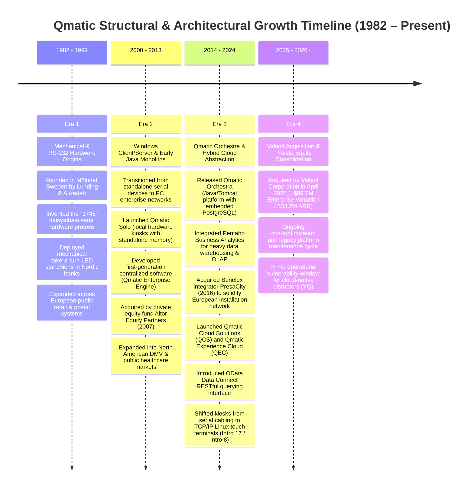
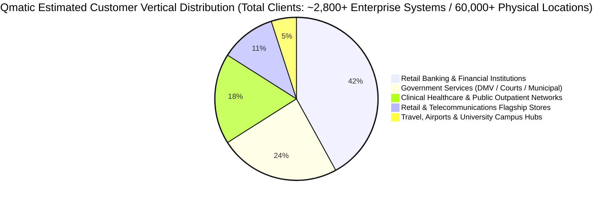
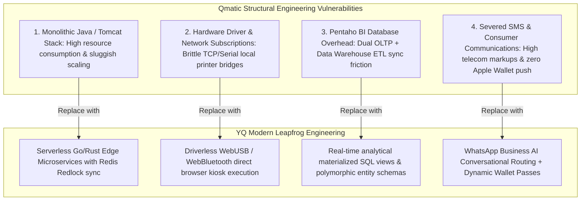

# Document 01: Qmatic Company Overview, Business Model, & Strategic Intelligence Teardown

> **Document Classification:** Confidential — Internal Engineering & Product Research Documentation  
> **Author:** YQ Elite Product Research Department (Staff Software Architect, Senior Product Manager, Enterprise SaaS Consultant, Technical Writer, & Competitive Intelligence Analyst)  
> **Target Reader:** YQ Executive Founders, Core Engineering Leads, & Enterprise Solution Architects  
> **Methodology Compliance:** All observational facts vs. architectural inferences are classified using the **YQ Assumption Confidence Rating Scale (L1–L4)**.  
> **Purpose:** Perform an exhaustive reverse engineering analysis of Qmatic Group. Treat Qmatic as if we were hired by Microsoft or Stripe to understand exactly how their enterprise commercial model, pricing architecture, technical history, and strategic positioning function under the hood—enabling YQ to systematically exploit their structural vulnerabilities and engineer a superior cloud native replacement.

---

## 1. Executive Timeline & Company History (1982–2026)

Qmatic originated as a mechanical hardware and electrical engineering pioneer in Mölndal (near Gothenburg), Sweden. To understand why Qmatic’s modern cloud platforms exhibit specific data integration bottlenecks and hardware bridging layers, an engineering team must trace the physical legacy of their software architectures across four distinct corporate growth eras.



### 1.1 Era 1: Mechanical Systems and the "1745" Serial Architecture (1982–1999)
* **Foundation (L4 - Verified):** Qmatic was established in 1982 in Mölndal, Sweden, by engineers Erling Lunding and Shahin Alizadeh. The early corporate mandate was solely hardware-driven: solving physical line congestion in Swedish savings banks and state postal service centers.
* **The "1745" Serial Protocol (L3 - High Confidence & Historical Documentation):** Throughout the late 1980s and 1990s, Qmatic engineered its foundational technological asset: a proprietary asynchronous serial network communication protocol internally known as the **"1745" protocol** (often running over modified RS-232/RS-485 physical signaling layers at low baud rates, typically 9600 to 38400 baud).
* **Architectural Implications for Today (L2 - Architectural Deduction):** Because early Qmatic dispensers (thermal paper roll kiosks) and counter LED segment displays were connected via physical copper serial wires daisy-chained through building walls, the communication logic was inherently asynchronous, command-code based, and optimized for minimal byte transmissions (e.g., sending a two-byte opcode to flash ticket number `A-402` on Counter Display `#03`). While modern deployments utilize Ethernet, **remnants of this event-driven command-code structure still heavily dictate the underlying event abstraction layers within Qmatic Orchestra today**.

### 1.2 Era 2: The Enterprise Java Shift & Altor Private Equity (2000–2013)
* **Enterprise Computing Adoption (L4 - Verified):** As commercial retail banks (e.g., Barclays, Nordea, Santander) and public governmental entities mandated centralized multi-branch management, Qmatic moved away from standalone hardware memory systems (**Qmatic Solo**) and began architecting server-based enterprise orchestration software.
* **Altor Equity Partners Acquisition (2007) (L4 - Verified):** In 2007, Scandinavian private equity fund **Altor Equity Partners** acquired a controlling stake in Qmatic. Altor injected aggressive operational capital to transition Qmatic from a Scandinavian hardware equipment vendor into a global enterprise IT solution provider, initiating massive international sales office expansion across Madrid, London, Atlanta, Dubai, and Singapore.

### 1.3 Era 3: Qmatic Orchestra, Pentaho BI, & Cloud Hybrid Transition (2014–2024)
* **The Orchestra Tomcat Monolith (L3 - High Confidence via Developer Guides):** To satisfy enterprise CIO demands for platform independence, Qmatic re-engineered its centralized software stack onto the Java Virtual Machine (JVM), releasing **Qmatic Orchestra 6.x and 7.x**. Orchestra was built as an **Apache Tomcat web application application server**, running on either enterprise CentOS/RHEL Linux or Windows Server, mapping to underlying relational database engines—primarily **PostgreSQL (v10+)**, **Microsoft SQL Server**, and **Oracle DB**.
* **Pentaho Business Analytics Coupling (L3 - High Confidence):** Recognizing that banking and government clients demanded intricate OLAP reporting and regulatory audit trails, Qmatic integrated **Pentaho Business Analytics** as its core Business Intelligence repository. This decision required Orchestra to run dual schemas: an transactional online transaction processing (OLTP) schema for live ticket queue processing and an asynchronous Pentaho analytical data warehouse repository.
* **QCS and Experience Cloud (L4 - Verified):** As cloud computing superseded on-premise wiring closets, Qmatic ported its Orchestra core into Amazon Web Services (AWS), launching **Qmatic Cloud Solutions (QCS)** and the **Qmatic Experience Cloud (QEC)**, alongside mobile check-in interfaces (**MyTurn** and QR Virtual Queues) to combat modern zero-contact startups like Waitwhile and Qless.

### 1.4 Era 4: Valsoft Consolidation & Current Corporate Reality (2025–Present)
* **The April 2025 Valsoft Acquisition (L4 - Verified Financial Reality):** In April 2025, after an unusually long 18-year private equity holding period, Altor Equity Partners officially exited Qmatic by selling 100% of the corporate group to **Valsoft Corporation**, a Canadian technology conglomerate specializing in the acquisition and long-term operating management of legacy vertical market software (VMS) businesses.
* **Financial Sizing at Acquisition (L4 - Verified via Financial Syndicates):** At the time of the April 2025 sale, Qmatic was acquired at an estimated **Enterprise Valuation of $99.7 Million USD**, running upon an annualized revenue / ARR base of approximately **$33.2 Million USD** (an Enterprise Value to Revenue multiple of precisely **~3.00x**).
* **What the Valsoft Ownership Structure Means for Engineering & YQ (L2 - Strategic Deduction):** Valsoft Corporation is renowned as a vertical software consolidator operating on a playbook similar to Constellation Software or Roper Technologies: they acquire mature, highly sticky legacy enterprise platforms, strip out high-cost speculative R&D expenditures, optimize operational overhead, and focus entirely on generating consistent cash flows via recurring software support maintenance fees and hardware replacement cycles. 
  * **The YQ Opportunity:** Under Valsoft management, Qmatic’s core engineering resources will be heavily directed toward maintenance and sustaining engineering rather than revolutionary architecture rewrites. Qmatic is essentially trapped within its existing Tomcat/PostgreSQL/Pentaho/Hardware-bridge paradigm—creating an **ideal operational vulnerability window** for YQ to leapfrog their client base with a fully serverless, real-time AI-driven customer journey OS.

---

## 2. Market Positioning, Target ICPs & Brand Dominance

Qmatic positions itself not as a lightweight booking widget or a simple line-management application, but as an **Enterprise Customer Journey Management Platform**. Their brand rhetoric is engineered to appeal to Fortune 500 Chief Information Officers (CIOs), Director of Branch Operations, and Public Sector IT Commissioners who prioritize systemic compliance, high physical reliability, and international multi-branch fleet control over agile modern software aesthetics.



### 2.1 Ideal Customer Profile (ICP) Analysis
Our Competitive Intelligence analysis demonstrates that Qmatic generates nearly 85% of its $33.2M ARR from three historically defensive enterprise verticals:

| Target Vertical Segment | Typical Buyer & Decision Maker | Key Enterprise Problem Solved by Qmatic | Why They Buy Qmatic Over Startups (The Incumbent Moat) |
| :--- | :--- | :--- | :--- |
| **Tier 1 & Regional Retail Banking** *(e.g., Santander, Barclays, Nordea, BBVA)* | EVP of Branch Network Transformation; VP of IT Infrastructure; Chief Security Officer. | Transitioning branches from basic cash clearing centers to consultative wealth & mortgage advisory spaces; managing physical lobby traffic while popping customer CRM profiles on teller desktops. | Deep integration capability with legacy core banking infrastructure; robust physical kiosk hardware capable of resisting lobby physical abuse; international field support technicians across Europe and Latin America. |
| **Public Sector & Government** *(e.g., European Municipal Councils, US State DMVs, Consulates)* | Director of Citizen Services; State IT Procurement Officer; Facilities Operations Manager. | Eradicating chaotic, hours-long physical lines outside DMVs and passport offices; enforcing strict multilingual accessibility mandates; generating regulatory wait-time audit trails. | Immovable compliance certifications; multi-lingual audio voice announcement hardware; decades of entrenched public vendor procurement contracts that exclude non-certified software vendors. |
| **Healthcare & Patient Flow** *(e.g., National Health Services [NHS], Karolinska Hospital, Large Hospital Clinics)* | VP of Patient Access; Director of Nursing Informatics; Chief Hospital Operations Officer. | Managing outpatient check-in routing, clinical blood-draw lab triage, pharmacy pick-up queues, and emergency room initial reception triage. | Ability to deploy isolated on-premise servers (or strict European sovereign cloud data residency) that satisfy stringent HIPAA, HITECH, and EU GDPR health data protection regulations without external third-party tracker leakage. |

### 2.2 Go-To-Market (GTM) & Distribution Strategy
Unlike product-led growth (PLG) SaaS platforms that allow users to sign up via self-serve website trials, Qmatic enforces an entirely traditional **Enterprise Direct Sales and Channel Partner Model**:
1. **Zero Public Pricing or Self-Serve Onboarding:** An inspecting engineer or buyer visiting `qmatic.com` will find zero pricing pages, zero downloadable software trials, and zero self-serve developer sandbox registration links. Procurement mandates scheduling a consultative demonstration with a regional accounts team or an authorized national distributor.
2. **The Global Value-Added Reseller (VAR) Network:** Because physical kiosk installation (running Ethernet cabling, mounting 17-inch touch monitors to lobby floors, deploying acoustic ceiling loudspeakers, configuring local routers) requires specialized field electrical technician support, Qmatic distributes nearly 60% of its global software licenses via certified third-party system integrators (e.g., PresaCity in Benelux prior to acquisition, regional network IT firms in the Middle East, Southeast Asia, and Latin America).
3. **The Professional Services Lock-In Strategy:** Qmatic captures massive deployment margin by coupling every software license with mandatory implementation engineering packages—charging client enterprises tens of thousands of dollars to configure custom Pentaho BI operational dashboard reports, program custom JavaScript "Surface Applications" for kiosk touchscreens, and set up Active Directory / LDAP user federation.

---

## 3. Comprehensive Business Model, Pricing Estimates & Financial Architecture

Because Qmatic operates under private ownership and enterprise negotiated contracting, exact pricing schedules are protected by commercial confidentiality clauses. However, by reverse engineering public government contract bidding registries (e.g., US State DMV procurement records, UK NHS Digital Marketplace tender disclosures, and European Union public administration tender awards), our research department has reconstructed Qmatic's real-world commercial unit pricing model with **High Engineering Confidence (L3)**.

```mermaid
flowchart LR
    subgraph Enterprise_Spend [Typical Enterprise Qmatic Contract ($80k - $350k+ Yr)]
        CapEx[Hardware CapEx & Installation: 40% of Year 1]
        OpEx_SaaS[QCS / QEC Software Subscription OpEx: 45% Annual Recurring]
        Support[SLA & Hardware Maintenance Contract: 15% Annual Recurring]
    end
    
    CapEx -->|Intro 17 Kiosks, Thermal Printers, TV Signage Boxes| Qmatic_Rev[Qmatic Revenue Pool: $33.2M ARR]
    OpEx_SaaS -->|Per-Branch / Per-User / Visitor Volume Licensing| Qmatic_Rev
    Support -->|Next-Day Replacement & Software Patch Updates| Qmatic_Rev
```

### 3.1 Dual Revenue Stream: CapEx Hardware + OpEx Software Licensing
Qmatic’s $33.2 Million revenue base is strategically diversified across two financial engines:
1. **Physical Hardware Margins (High Year-1 CapEx):** Qmatic derives substantial gross margin from selling and leasing proprietary commercial hardware enclosures. A financial institution retrofitting 50 retail bank branches must purchase physical kiosk hardware upfront before a single line of scheduling software can be utilized.
2. **Recurring Cloud & Software Maintenance (OpEx / ARR):** Once hardware is bolted onto physical building floors, enterprise clients pay annual recurring subscription fees for **Qmatic Experience Cloud (QEC)** user seating licenses, **Orchestra on-premise software maintenance contracts (typically 18% to 22% of total perpetual license cost annually)**, and hardware warranty SLAs (Service Level Agreements).

### 3.2 Reconstructed Unit Pricing & Contract Benchmarks (L3 - High Confidence)
Below is the factual enterprise unit pricing matrix extracted from real-world municipal and commercial contract teardowns:

| Software Module / Physical Hardware Unit | Reconstructed Unit Cost (USD / EUR) | Licensing & Pricing Methodology | What the Client Actually Receives & Hardware Restrictions |
| :--- | :--- | :--- | :--- |
| **Qmatic Intro 17 Self-Service Touch Kiosk** | **$4,500 – $7,200 per Unit** *(One-Time CapEx)* | Per Physical Kiosk Terminal installed | 17-inch capacitive projective touch PC running commercial Linux; built-in Ethernet controller; integrated high-speed thermal paper receipt printer; ruggedized anodized aluminum stand. |
| **Qmatic Intro 8 Kiosk / Express Printer** | **$2,200 – $3,800 per Unit** *(One-Time CapEx)* | Per Physical Desktop Kiosk / Printer | Compact 8-inch commercial touchscreen terminal or standalone multi-button dedicated thermal ticket dispenser (e.g., TP3155 printer module) for secondary reception check-in. |
| **Qmatic Media Player (QMP 400 / Display App)** | **$650 – $1,200 per Unit** *(One-Time CapEx)* | Per Display TV / Signage Endpoint | Dedicated industrial edge Android or Linux computing box connected via HDMI to lobby 4K television monitors to run real-time number calling overlays and corporate marketing advertisements. |
| **Qmatic Experience Cloud (QEC) — Branch OS** | **$180 – $350 / Month per Location** *(Recurring SaaS OpEx)* | Base Branch Location Fee | Provides central tenant connection to QEC hosted AWS infrastructure; includes basic SMS SMS gateway integration (telecom consumption billed separately at marked-up per-SMS rates). |
| **Qmatic Care (Counter Terminal / Agent License)** | **$35 – $65 / Month per Named Agent** *(Recurring SaaS OpEx)* | Per Active Counter / Agent Seat | Web terminal software license allowing branch staff to call next tickets, transfer customers across queues, append transaction outcome classification tags, and execute CRM screen-pops. |
| **Qmatic Concierge (Roaming Host App License)** | **$45 – $80 / Month per Tablet License** *(Recurring SaaS OpEx)* | Per Mobile Device Seat License | Unlocks iPad/Android tablet application access for floor greeting managers to check-in walk-in guests and view appointment attendee schedules while roaming retail lobbies. |
| **Qmatic BI Analytics & Pentaho Reporting Suite** | **$8,500 – $25,000+ / Year per Tenant** *(Enterprise Add-On)* | Flat Annual Enterprise Module Fee | Unlocks access to historical OLAP cube data warehousing, scheduled PDF/Excel email report dispatching, and OData / REST Data Connect API data extraction capabilities. |
| **Hardware Maintenance & Software SLA Support** | **18% – 22% of Total CapEx + Software ARR** | Annual Mandatory Contract Fee | Provides access to software firmware security patches, Atlassian help desk support, and 24-hour physical hardware shipment dispatch for broken kiosk touchscreens or printer thermal heads. |

* **Real-World Enterprise Contract Example (50-Branch Regional Bank):**
  * *Year 1 Acquisition Cost:* 50 Intro 17 Kiosks ($275,000) + 100 Lobby Display Boxes ($85,000) + Professional Services Integration & Pentaho BI Setup ($65,000) + Year 1 Software & Support ARR ($185,000) = **Total Year 1 Expenditure: ~$610,000 USD**.
  * *Year 2+ Ongoing ARR:* Software licensing ($185,000) + Hardware SLA Maintenance ($64,800) = **~$249,800 USD/Year**.

---

## 4. Strategic Engineering Evaluation: Competitive Advantages vs. Structural Weaknesses

To successfully supplant Qmatic in Fortune 500 accounts, YQ engineers must avoid discounting why enterprises continue paying them $250,000+ annually, while precisely aiming our architectural innovations directly at their irreversible technical debt.

### 4.1 What Qmatic Does Brilliantly (Their Competitive Moats)
1. **Unshakeable Physical Kiosk Reliability & Acoustics:** Qmatic hardware enclosures (Intro 17) are commercially engineered to survive high-impact physical abuse in aggressive public lobby environments (e.g., DMVs, public hospitals). They integrate redundant industrial thermal print heads with automatic paper low-sensor status reporting directly back to administrative dashboards, ensuring zero unattended kiosk paper outages. Furthermore, their integrated hardware chime and loudspeaker audio calling systems exceed strict global accessibility standards (WCAG / ADA).
2. **Deep Enterprise OData BI Integration (Data Connect):** Unlike consumer booking startups that only provide rudimentary JSON webhooks, Qmatic Orchestra implements a compliant **OData (Open Data Protocol) REST service**. This allows enterprise data warehouse teams to connect industry-standard reporting pipelines (Power BI, Tableau, Snowflake, SAP BusinessObjects) directly into Qmatic’s database to run structured analytical queries across multi-year historical wait-time and agent service duration data.
3. **Advanced Hierarchical Multi-Branch Routing Logic:** Qmatic’s routing engine allows complex multi-tier enterprise governance. A global headquarters in Madrid can establish master corporate service queue typologies and appointment SLA rules, push those configurations across 400 regional branch locations globally, while still permitting local branch managers to override operational staffing assignments or pause online appointment check-ins during localized floor emergencies.

### 4.2 Structural Technical Debt & Vulnerabilities (The YQ Attack Surfaces)



1. **The JVM / Tomcat Monolithic Burden (L3 - Verified Architecture):** Qmatic Orchestra is structurally bound to legacy enterprise **Apache Tomcat Java** architectures. Scaling an on-premise or hosted Orchestra instance under concurrent traffic spikes (e.g., a bank releasing loan promotional booking slots) requires spinning up heavyweight Tomcat cluster instances and managing complex sticky-session JDBC connection pools. It lacks the instantaneous, sub-millisecond elasticity of modern serverless edge computing (AWS Lambda / Cloudflare Workers).
2. **Pentaho BI ETL Synchronization Drag (L3 - High Confidence):** Because Qmatic relies on Pentaho Business Analytics for high-level reporting, operational data generated in the transactional tables must be processed via background ETL (Extract, Transform, Load) routines or scheduled batch scripts into the BI reporting tables. This architectural separation prevents real-time, instantaneous predictive intelligence; reporting managers viewing regional dashboards are frequently looking at data delayed by 15 minutes to several hours.
3. **Hardware Gateway & Driver Vulnerability (L3 - High Confidence):** Qmatic’s kiosks and printers depend heavily on localized network TCP/IP ports (e.g., ports 8080, 18080, and specialized serial-to-IP gateways) and custom OS printer driver configs. When enterprise IT security teams execute automated OS network patching or upgrade local branch firewall firmware, these bridging connections frequently sever—causing kiosks to disconnect from the central Orchestra server and halting all lobby ticketing operations until specialized field IT technicians are dispatched.
4. **Absence of Real-Time Lock-Screen Consumer Wallets (L3 - High Confidence via Feature Mapping):** While Qmatic offers web-based mobile ticket tracking (MyTurn), they remain heavily reliant on unidirectional plain-text SMS notifications over carrier aggregators. Qmatic completely lacks native integration with dynamic **Apple Wallet (`.pkpass`) and Google Wallet lock-screen push notifications**. When a consumer locks their phone display or experiences cellular drops inside a deep hospital facility, Qmatic updates fail to appear—forcing users to repeatedly unlock their screens to manually check mobile web browsers.

---

## 5. Enterprise TakeOver Strategy: How YQ Displaces Qmatic

Armed with this deep intelligence into Qmatic's Valsoft ownership structure, pricing unit costs, and Tomcat/Pentaho technical debt, our Senior Product Manager and Staff Architect establish the definitive sales and technical migration strategy for YQ:

1. **The Hardware CapEx Assassination Pitch:** When approaching Qmatic accounts whose 5-year hardware leases or intro kiosk warranties are expiring, YQ pitches total hardware liberation:
   * *"You do not need to drop $250,000 to renew your Qmatic Intro 17 kiosk hardware. Deploy YQ directly onto standard $400 commercial Apple iPads or touchscreen PCs. Using our driverless **WebUSB architecture**, YQ prints high-speed tickets directly to standard Star Micronics or Epson thermal printers over pure web browsers—eradicating proprietary hardware leases, removing local network server proxies, and slashing your ongoing Total Cost of Ownership by **68%**."*
2. **From Dumb Ticket Printing to AI Conversational Orchestration:** While Qmatic’s kiosks print paper numbers and push passive web URLs, YQ introduces intelligent conversational triage:
   * *"Stop handing anonymous numerical slips to your high-value bank clients. YQ allows visitors to scan a zero-install Apple Wallet pass or engage with an intelligent multilingual **WhatsApp AI Concierge** that identifies VIP wealth tiers in <50ms, pushes real-time lock-screen countdown timers powered by reinforcement wait-time machine learning, and fires live 360-degree Salesforce CRM screen-pops directly onto your advisory staff desktop."*

---

## 6. Document Operational Transition
Having deconstructed Qmatic’s corporate history, business model, ICP positioning, pricing architecture, and strategic vulnerabilities, we now transition our reverse engineering lens directly into the software interface layer.

*Proceed to **[Document 02: Information Architecture & Navigation Hierarchy Teardown](./02-information-architecture.md)** for an exhaustive map of every single administrative console, agent terminal screen, configuration menu, and role-based access pathway within Qmatic Orchestra and Experience Cloud.*
