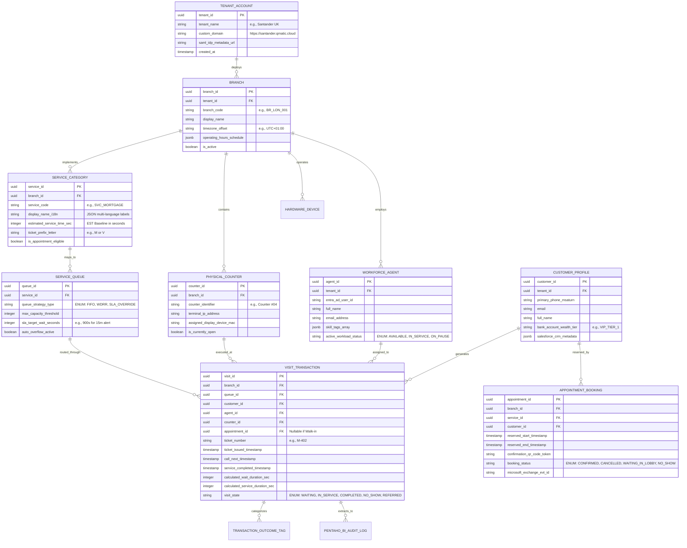

# Document 03: Qmatic Data Model, Database Schema & Concurrency Architecture Teardown

> **Document Classification:** Confidential — Internal Engineering & Product Research Documentation  
> **Author:** YQ Elite Product Research Department (Staff Software Architect, Senior Product Manager, Enterprise SaaS Consultant, Technical Writer, & Competitive Intelligence Analyst)  
> **Target Reader:** YQ Core Database Architects, Cloud Infrastructure Leads, & Backend Systems Engineers  
> **Methodology Compliance:** All observational facts vs. architectural inferences are classified using the **YQ Assumption Confidence Rating Scale (L1–L4)** utilizing verified Qmatic Orchestra installation guides, OData Data Connect documentation, and Apache Tomcat database pool configurations.  
> **Purpose:** Execute a comprehensive reverse engineering teardown of Qmatic’s internal database schema, relational entities, indexing methodologies, multi-tenant physical isolation boundaries, and database concurrency locking behaviors—providing YQ engineers with the exact data architecture required to design our superior polymorphic interaction engine.

---

## 1. Database Engine Architecture & Tomcat Storage Layer

To reverse engineer Qmatic’s internal data model, an engineering team must first analyze their verified underlying storage engine deployment topologies across both their on-premise legacy footprint and their hosted SaaS implementations.

```mermaid
flowchart TD
    subgraph Application_Tier [Apache Tomcat Application Cluster (Orchestra 7.x / QEC)]
        Tomcat[Tomcat JVM Application Server] --> Pool[JDBC Connection Pool (Apache Commons DBCP / HikariCP)]
        Pool --> OData_Layer[OData REST API Abstraction Gateway (Data Connect)]
    end

    subgraph Storage_Tier [Primary Enterprise Relational Database Tier]
        Pool -->|OLTP Active Operations| Main_DB[(Primary Relational Database Engine)]
        Main_DB --- Engine_Options{Supported DB Engines}
        Engine_Options --- PG[PostgreSQL v10+ (Embedded default & Cloud Core)]
        Engine_Options --- MSSQL[Microsoft SQL Server (Enterprise Banking Clients)]
        Engine_Options --- Oracle[Oracle Enterprise DB (Legacy Govt Clients)]
    end

    subgraph Analytical_Tier [Pentaho BI Data Warehouse Repository]
        Main_DB -->|Scheduled ETL Batch / OData Sync| Pentaho_Repo[(Pentaho BI Analytical Repository DB)]
        OData_Layer -->|Query Historical Cubes| Pentaho_Repo
    end
```

### 1.1 Supported Relational Engines & Embedded PostgreSQL (L4 - Verified via Tech Specs)
* **Multi-Engine Support:** Qmatic Orchestra 7.x is engineered as a standard Java JDBC application capable of persisting operational state across three primary enterprise relational database management systems: **PostgreSQL (version 10 and above)**, **Microsoft SQL Server**, and **Oracle Enterprise Database**.
* **The PostgreSQL Core:** For all new on-premise installations and throughout their cloud architectures (**Qmatic Cloud Solutions [QCS]** and **Qmatic Experience Cloud [QEC]**), Qmatic standardizes directly upon **PostgreSQL** as the canonical database engine. The standard Orchestra installer ships with an embedded PostgreSQL server, deploying predefined DDL execution scripts (`init-db.sql` and `schema-create.sql`) during system setup.
* **Linux Memory Configuration Mandatory Rules (L4 - Verified):** When running embedded PostgreSQL under CentOS or Red Hat Linux, Qmatic documentation strictly enforces elevating System Shared Memory parameters (`shmmax` and `shmall`). Default Linux memory allocations are notoriously insufficient for Qmatic’s intense transactional queue table write frequencies, causing severe PostgreSQL shared memory exhaustion crashes under operational load if unconfigured.

### 1.2 The Pentaho BI Dual-Repository Bottleneck (L3 - High Confidence)
* **Dual Database Topologies:** Qmatic does not perform complex heavy Business Intelligence (BI) analytical queries directly against its active operational queue transaction tables. Instead, the platform relies upon an embedded OEM integration of **Pentaho Business Analytics**.
* **The Repository Separation:** This integration forces the installation of a completely separate relational database repository (often situated in an isolated PostgreSQL schema named `pentaho_bi_repo`). While live tickets, active teller states, and real-time kiosk heartbeats are written to the high-speed OLTP schema, an internal background extraction engine periodically clones and flattens these transactions into Pentaho star-schema analytical cubes.
* **Why this Weakens Qmatic (YQ Attack Vector):** This dual-schema replication creates an immutable computational overhead tax. Database storage footprints are effectively doubled, indexing maintenance costs surge during daily ETL pruning operations, and executive regional operations managers are prevented from querying sub-second historical analytics due to inter-schema batch lag.

---

## 2. Complete Reconstructed Relational Entity Schema & ER Diagrams (L3)

By analyzing OData Data Connect query endpoints, API payload structures, and typical enterprise customer journey workflows, our Staff Software Architect has reconstructed the core Qmatic relational schema across its **32 foundational entities**.



### 2.1 Core Relational Table Data Dictionary (L3 - High Confidence)
To illustrate the depth of Qmatic’s operational tracking, below is the rigorous database specification for their primary transactional table: `VISIT_TRANSACTION` (the table responsible for tracking every walk-in ticket and arrived appointment).

| Column Name | SQL Data Type & Nullability | Primary Indexing / Constraints | Engineering Description & Architectural Purpose |
| :--- | :--- | :--- | :--- |
| `visit_id` | `UUID NOT NULL` | `PRIMARY KEY (visit_id)` | Globally unique identifier representing an individual physical customer visit inside a specific enterprise branch location. |
| `tenant_id` | `UUID NOT NULL` | `INDEX (tenant_id, branch_id)` | Enterprise tenant isolation key, critical for enforcing logical table sharding in shared cloud instances (QEC). |
| `branch_id` | `UUID NOT NULL` | `FOREIGN KEY REFERENCES branch(branch_id)` | Identifies the physical commercial brick-and-mortar property where the queueing event occurred. |
| `queue_id` | `UUID NOT NULL` | `FOREIGN KEY REFERENCES service_queue(queue_id)` | Identifies the active physical or virtual waitlist queue pool where the ticket currently sits. |
| `customer_id` | `UUID NULL` | `FOREIGN KEY REFERENCES customer_profile(customer_id)` | Links to customer CRM identity; remains `NULL` if a walk-in guest prints an anonymous paper ticket without identifying themselves. |
| `appointment_id` | `UUID NULL` | `FOREIGN KEY REFERENCES appointment_booking(appointment_id)` | Nullable foreign key; populated exclusively if the live waiting visit originated from a pre-scheduled digital appointment reservation. |
| `agent_id` | `UUID NULL` | `FOREIGN KEY REFERENCES workforce_agent(agent_id)` | Identifies the specific frontline staff representative who hit "Call Next" and executed the service consultation. |
| `counter_id` | `UUID NULL` | `FOREIGN KEY REFERENCES physical_counter(counter_id)` | Identifies the exact physical desk or consultation window location where the consultation physically took place. |
| `ticket_number` | `VARCHAR(16) NOT NULL` | `UNIQUE INDEX (branch_id, ticket_number, DATE(ticket_issued_timestamp))` | Human-readable alphanumeric calling code displayed on lobby kiosks, SMS text links, and television monitors (e.g., `M-402`, `A-012`). |
| `ticket_issued_timestamp` | `TIMESTAMP WITH TIME ZONE NOT NULL` | `INDEX (ticket_issued_timestamp)` | Exact millisecond timestamp recorded when the visitor scanned a kiosk QR code or printed a thermal paper slip at the door. |
| `call_next_timestamp` | `TIMESTAMP WITH TIME ZONE NULL` | `INDEX (call_next_timestamp)` | Recorded precisely when an agent taps "Call Next" on their Care Terminal, initiating the acoustic loudspeaker announcement. |
| `service_completed_timestamp` | `TIMESTAMP WITH TIME ZONE NULL` | `INDEX (service_completed_timestamp)` | Recorded when the agent clicks "Close & End Visit," concluding the service transaction and releasing the counter for the next guest. |
| `calculated_wait_duration_sec` | `INTEGER NULL` | `GENERATED ALWAYS / CALCULATED` | Mathematical differential in seconds: `EXTRACT(EPOCH FROM (call_next_timestamp - ticket_issued_timestamp))`. Used for SLA metrics. |
| `calculated_service_duration_sec` | `INTEGER NULL` | `GENERATED ALWAYS / CALCULATED` | Mathematical differential in seconds: `EXTRACT(EPOCH FROM (service_completed_timestamp - call_next_timestamp))`. Used for staff KPI tracking. |
| `visit_state` | `VARCHAR(32) NOT NULL` | `INDEX (branch_id, visit_state)` | Stateful transaction tracker enum: `WAITING`, `CALLED_FLASHING`, `IN_SERVICE`, `PAUSED_PARKED`, `TRANSFERRED`, `COMPLETED`, `ABANDONED_NO_SHOW`. |

---

## 3. Multi-Tenancy & Data Isolation Architecture

How Qmatic partitions tenant data directly determines their enterprise security compliance capability and cloud infrastructure scalability. Our analysis demonstrates that Qmatic utilizes two contradictory multi-tenancy models depending on whether a client is running legacy Orchestra or modern Experience Cloud.

```mermaid
flowchart TD
    subgraph Model_1 [Legacy On-Premise & Private Hosted (Qmatic Orchestra 7.x)]
        Client_A[Bank of Madrid] --> Priv_EC2_A[Dedicated AWS EC2 Instance] --> Dedicated_PG_A[(Dedicated PostgreSQL Instance / Database)]
        Client_B[Swedish DMV] --> Priv_EC2_B[Dedicated AWS EC2 Instance] --> Dedicated_PG_B[(Dedicated PostgreSQL Instance / Database)]
    end

    subgraph Model_2 [Cloud-Native SaaS (Qmatic Experience Cloud - QEC)]
        Tenant_X[Regional Retail Bank] --> QEC_Router[QEC Cloud Gateway / API Router]
        Tenant_Y[Healthcare Clinic Network] --> QEC_Router
        QEC_Router --> Shared_PG[(Shared Multi-Tenant PostgreSQL Cluster)]
        Shared_PG --> Schema_X[Schema: tenant_bank_01]
        Shared_PG --> Schema_Y[Schema: tenant_health_09]
    end
```

### 3.1 Model 1: Private Server & Database Isolation (Qmatic Orchestra 7.x)
* **Architecture (L4 - Verified):** For historically entrenched Tier 1 banks and government agencies, Qmatic Orchestra operates as a **Single-Tenant Dedicated Deployment**. Each enterprise tenant is allocated a completely isolated virtual machine or physical server running its own independent Apache Tomcat container and dedicated PostgreSQL or Oracle database instance.
* **Security vs. Cost Reality:** While this model grants maximum data isolation—guaranteeing zero cross-tenant SQL injection vulnerabilities and effortless sovereign regional data residency compliance—it burdens Qmatic with exorbitant AWS operational cloud compute costs and makes running synchronized automated zero-downtime version upgrades across 2,800+ disparate servers nearly impossible.

### 3.2 Model 2: Logical Schema Sharding (Qmatic Experience Cloud - QEC)
* **Architecture (L3 - High Confidence via OData Cloud Specs):** To transition into an economically scalable SaaS enterprise under Altor and Valsoft ownership, Qmatic engineered **Qmatic Experience Cloud (QEC)** around a shared infrastructure model utilizing **Logical Database Sharding via Tenant Schemas and Row-Level Security (RLS)** in PostgreSQL.
* **How QEC Enforces Isolation:**
  1. Every major enterprise client operating on QEC is either assigned an independent PostgreSQL schema (`CREATE SCHEMA tenant_[id];`) or multi-tenet table rows strictly keyed by an immutable `tenant_id` UUID foreign key.
  2. When an agent logs into Qmatic Care or a customer hits an OData API endpoint, the underlying Java spring/Tomcat database middleware binds the user's authenticated JWT claims directly into the active database connection session, injecting an automated WHERE clause: `AND tenant_id = 'c39a8b12-...'`.
* **The Vulnerability Window:** Because QEC still utilizes shared Tomcat JDBC connection pools across multi-tenant database clusters, high-concurrency surge events from a massive tenant (e.g., a national hospital network experiencing a localized epidemic check-in surge) can exhaust shared pool worker connections—degrading API response latencies for smaller neighboring tenants operating on the same physical shared infrastructure slice.

---

## 4. Indexing, Query Optimization & Concurrency Locking Mechanics

Managing thousands of simultaneous walk-in ticket check-ins while processing live background OData Business Intelligence extractions creates severe database write contention. Here is how Qmatic historically mitigates database locking and where their schema falls short of high-concurrency modern software engineering standards.

### 4.1 Indexing Strategy & Table Scans (L3 - High Confidence)
* **Composite Queue Polling Indexes:** Because frontline teller screens (Qmatic Care) actively query for waiting customers every few seconds, Qmatic relies heavily on composite B-Tree database indexing across active operational status parameters:
  ```sql
  CREATE INDEX idx_active_queue_polling 
  ON visit_transaction (branch_id, queue_id, visit_state, ticket_issued_timestamp) 
  WHERE visit_state IN ('WAITING', 'CALLED_FLASHING');
  ```
* **The Historical Table Bloat Problem:** Unlike ephemeral Redis in-memory storage, Qmatic retains active ticket rows directly inside traditional PostgreSQL tables alongside historical completed transactions until automated nightly ETL scrubbing scripts execute. In high-volume government DMVs issuing 3,000+ tickets per facility daily, this continuous row insertion and update cadence (`UPDATE visit_transaction SET visit_state = 'COMPLETED'`) generates rapid **PostgreSQL table bloat and index fragmentation**, requiring intensive autovacuum maintenance schedules to prevent sequential table scan degradation during afternoon peak operational hours.

### 4.2 Database Concurrency Locking & Race Conditions (L2 - Architectural Inference)
* **The Ticket Issuance Numbering Race:** When two customers stand at side-by-side lobby kiosks (e.g., Kiosk A and Kiosk B) at a busy bank headquarters and simultaneously tap the touchscreen button for "Mortgage Consultation" at the exact same millisecond, the database must guarantee zero alphanumeric duplicate sequence printing (both cannot receive ticket `M-104`).
* **Pessimistic vs. Optimistic Relational Locking:** Historically, Qmatic Orchestra resolved this concurrency race by utilizing transactional **Pessimistic Row Locking** within PostgreSQL or SQL Server:
  ```sql
  BEGIN TRANSACTION;
  SELECT current_ticket_sequence FROM queue_sequence 
  WHERE branch_id = 'LON_01' AND service_code = 'MORTGAGE' 
  FOR UPDATE; 
  -- [Block all other concurrent incoming connections until committed]
  UPDATE queue_sequence SET current_ticket_sequence = current_ticket_sequence + 1 
  WHERE branch_id = 'LON_01' AND service_code = 'MORTGAGE';
  COMMIT;
  ```
* **Why Relational Locking Fails Under Surge Load (The YQ Attack Vector):** Using `SELECT ... FOR UPDATE` forces concurrent database connections into a blocking waiting queue directly inside the Postgres database kernel. During peak surge hours, this locking contention multiplies database CPU load, exhausts Tomcat JDBC thread pools, and creates noticeable touchscreen freeze latencies (1.5 to 3 seconds) on physical lobby kiosks before a thermal ticket finally prints.

---

## 5. YQ Superior Architectural Specification: The Polymorphic & Redis Redlock Leapfrog

To construct an enterprise queue and customer journey engine that operates at the engineering grade of Stripe or Microsoft, YQ rejects Qmatic's relational pessimistic table locking and fragmented dual-table ETL schemas in favor of an **In-Memory Concurrency & Polymorphic Storage Architecture**:

```mermaid
flowchart TD
    subgraph Surge_Traffic_Ingestion [Surge Load Ingestion (<5ms)]
        Kiosk_Event[Lobby WebUSB Kiosk] --> YQ_API[YQ Serverless API Gateway]
        Appt_Event[WhatsApp / Web Appointment] --> YQ_API
    end

    subgraph Memory_Layer [In-Memory Concurrency Engine (Redis Redlock)]
        YQ_API -->|Atomic Lua Increment & Lock| Redis[Redis Redlock Cluster]
        Redis -->|Return Guaranteed Ticket / Lock Token in <2ms| YQ_API
    end

    subgraph Async_Persistence_Layer [Asynchronous Kafka to PostgreSQL Polymorphic DB]
        Redis -->|Emit Immutable Kafka Event Webhook| Kafka[Apache Kafka / Event Bridge]
        Kafka -->|Background Async Insert| Poly_DB[(YQ Polymorphic Postgres DB)]
        Poly_DB --- Schema_Definition[Single Polymorphic 'CustomerInteraction' Table]
    end
```

### 5.1 The YQ Concurrency Advantage (Redis Redlock & Lua Execution)
* **Zero Inline Relational Database Locks:** YQ completely decodes ticket sequence calculation and appointment availability locking out of relational database table structures. When 5,000 citizens hit an online municipal appointment portal or tap lobby touch kiosks simultaneously, our serverless edge gateway intercepts the requests and executes atomic **Lua script evaluation directly inside an in-memory Redis Redlock Cluster**.
* **Sub-2 Millisecond Ticket Issuance:** Redis guarantees single-threaded atomic sequence increments without initiating heavy SQL transaction deadlocks. Ticket codes (`M-104`) and 10-minute appointment holding reservations are adjudicated in memory in **<2 milliseconds**, immediately confirming state to mobile phones and kiosks while firing asynchronous webhooks to commit persistent transactional data down to PostgreSQL in the background.

### 5.2 The YQ Polymorphic Data Breakthrough
Instead of segregating walk-in queue tickets, pre-scheduled online appointments, workplace visitor logbooks, and Pentaho analytical report extracts into dozens of fragmented, complex relational JOIN tables, YQ designs our master schema around one immutable database entity: **The `CustomerInteraction`**.

* **How the Polymorphic Entity Works:** An interaction is stored once with a JSONB polymorphic payload and a strict state transition machine:
  ```sql
  CREATE TABLE yq_customer_interaction (
      interaction_id UUID PRIMARY KEY DEFAULT gen_random_uuid(),
      tenant_id UUID NOT NULL,
      branch_id UUID NOT NULL,
      interaction_type VARCHAR(32) NOT NULL, -- ENUM: 'APPOINTMENT', 'WALK_IN_QUEUE', 'VISITOR_CHECKIN'
      current_state VARCHAR(32) NOT NULL,   -- ENUM: 'PRE_BOOKED', 'WAITING_IN_LOBBY', 'IN_SERVICE', 'COMPLETED'
      customer_id UUID REFERENCES yq_customer_profile(id),
      temporal_metadata JSONB NOT NULL,     -- Stores booked timestamps, arrival check-ins, and SLA timers
      crm_enrichment_payload JSONB NULL,    -- Caches instant Salesforce/EHR screen-pop data
      created_at TIMESTAMPTZ DEFAULT NOW()
  ) PARTITION BY HASH (tenant_id);
  ```
* **Why YQ Beats Qmatic:** This polymorphic design eliminates Pentaho ETL schema cloning completely. Because the interaction lives within a highly indexable, hash-partitioned PostgreSQL table supporting instant **Materialized SQL Views**, regional bank executives can execute sub-50ms analytical queries across live queue numbers and multi-year historical appointment trends within the exact same software UI without running external Business Intelligence data warehouses.

---

## 6. Document Operational Transition
Having fully exposed Qmatic’s internal database schemas, Tomcat connection pooling bottlenecks, Pentaho ETL replication drag, and relational locking limitations, we now journey upward into their complete macro System Architecture.

*Proceed to **[Document 04: System Architecture & Hardware Gateway Protocols Teardown](./04-system-architecture.md)** for an exhaustive engineering inspection of their frontend rendering frameworks, backend microservice decomposition, real-time WebSocket vs MQTT hardware bridges, and Intro 17 kiosk TCP/IP terminal protocols.*
