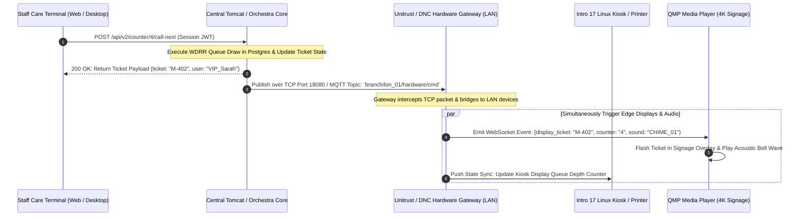
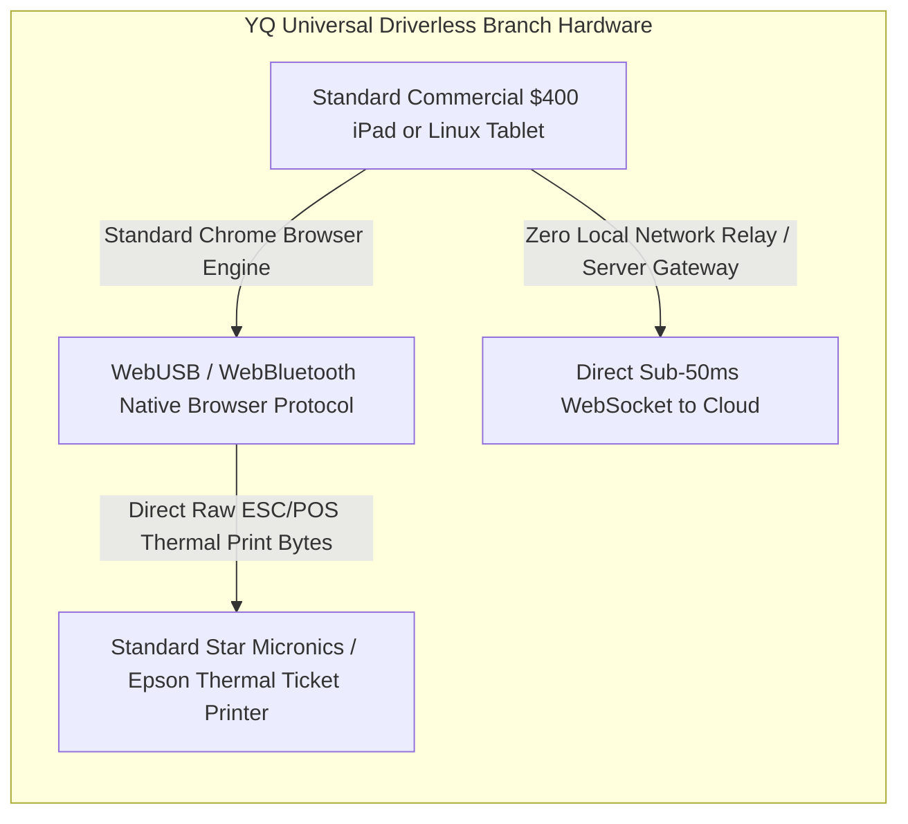

# Document 04: Qmatic System Architecture, Hardware Protocols & Realtime Engine Teardown

> **Document Classification:** Confidential — Internal Engineering & Product Research Documentation  
> **Author:** YQ Elite Product Research Department (Staff Software Architect, Senior Product Manager, Enterprise SaaS Consultant, & Competitive Intelligence Analyst)  
> **Target Reader:** YQ Principal Distributed Systems Engineers, Cloud Infrastructure Architects, & Edge IoT Teams  
> **Methodology Compliance:** All observational facts vs. architectural inferences are classified using the **YQ Assumption Confidence Rating Scale (L1–L4)** utilizing verified Qmatic Orchestra developer guides, Unitrust hardware data sheets, and AWS cloud topology documentation.  
> **Purpose:** Perform an uncompromising reverse engineering teardown of Qmatic’s macro system architecture. Deconstruct their frontend application layers, Java/Tomcat server decomposition, real-time hardware bridging protocols (MQTT / TCP / RS-232), scheduling queue routing engines, caching strategies, and cloud infrastructure limits—establishing the foundational engineering blueprint for YQ's leapfrog system design.

---

## 1. Macro Cloud & Hybrid System Architecture Overview

When an enterprise evaluates Qmatic, they encounter an intricate hybrid computing environment designed to bridge modern public cloud endpoints (smartphones, web browsers) with locked-down localized internal branch hardware (thermal kiosk printers, overhead acoustic speakers, teller desktop PCs).

```mermaid
flowchart TD
    subgraph Public_Cloud_Tier [Public Consumer & Edge Cloud (AWS / QEC)]
        Mobile_Web[Consumer MyTurn PWA & SMS Links] --> Edge_WAF[Cloudflare / AWS WAF & ALB]
        Public_Booking[Web Appointment Portal Widget] --> Edge_WAF
        Edge_WAF --> QEC_Gateway[Qmatic Experience Cloud API Gateway]
    end

    subgraph Central_Server_Tier [Central Application Server (Orchestra / Tomcat)]
        QEC_Gateway -->|REST / HTTPS (Port 443)| Tomcat_Core[Apache Tomcat Application Core]
        Admin_Web[IT Admin Console (Port 8443)] --> Tomcat_Core
        Counter_Client[Staff Care Terminals (WebSockets / HTTP)] --> Tomcat_Core
        
        Tomcat_Core --- Cache[In-Memory Application JVM Cache]
        Tomcat_Core --- Pool[JDBC HikariCP DB Pool]
        Pool --> PG[(PostgreSQL / Oracle Primary DB)]
        Pool --> Pentaho[(Pentaho BI Reporting DB)]
    end

    subgraph Regional_Branch_Edge [Physical Enterprise Branch Network (LAN)]
        Tomcat_Core -->|TCP Port 8080 / 18080 / Local MQTT| Unitrust_GW[Qmatic Hardware Gateway / Unitrust Hub]
        
        Unitrust_GW -->|TCP / Ethernet LAN| Intro17[Intro 17 Kiosk Touch Terminal (Linux)]
        Unitrust_GW -->|RS-232 / 1745 Serial Bus| Legacy_TP[TP3155 Thermal Ticket Printer & LED Counter Digits]
        Unitrust_GW -->|HDMI / IP Stream| QMP_Player[QMP Media Player (Android Signage Box)]
        Unitrust_GW -->|Local Audio Jack / SIP| Chime[Acoustic Ceiling Loudspeakers]
    end
```

### 1.1 Frontend Rendering Architectures (L3 - High Confidence)
Qmatic utilizes three distinct frontend rendering technologies across its software ecosystem, reflecting twenty years of user interface evolution:
1. **Legacy Java Server Pages (JSP) & Servlets:** Used heavily within the core **Qmatic Orchestra 7.x Central Administrator Console**. These pages are server-side rendered directly by the Apache Tomcat engine. While stable, this architecture necessitates a complete HTTP page round-trip for every administrative configuration save, resulting in sluggish, non-reactive admin navigation.
2. **Abstracted JavaScript / HTML5 "Surface Applications" (Kiosks):** The visual interface rendered on physical **Intro 17 / Intro 8 touch kiosks** is built as an abstracted HTML5/Vanilla JS web canvas managed by the internal Qmatic Surface Editor. The Linux kiosk OS boots straight into a kiosk-mode headless Chromium browser targeting an internal Tomcat HTTP context (typically `http://[server_ip]:8080/surface/kiosk/branch_01`).
3. **Modern Vue.js & Web Components (QEC & Care Terminal):** In their modern SaaS iterations (**Qmatic Experience Cloud [QEC]**, **Qmatic Care Agent Terminal**, and public **MyTurn** mobile tracking pages), Qmatic transitioned to component-based frontend web frameworks (primarily Vue.js and custom web components) embedded directly within enterprise banking iframes or deployed via AWS Amplify/S3 CDN distributions.

---

## 2. Real-Time Signaling, MQTT Gateways & Hardware Edge Protocols

The primary operational barrier defending Qmatic's enterprise revenue moat is their sophisticated integration with localized physical premise hardware. Below is the technical deconstruction of how their real-time signaling engine pushes commands from central cloud servers directly into lobby hardware appliances.



### 2.1 The Unitrust & DNC Hardware Gateway Bridging Architecture (L4 - Verified)
* **The Problem of Firewalls and Port Forwarding:** In secure banking networks (e.g., Barclays or Santander), corporate IT security firewalls strictly block external cloud servers from initiating unsolicited inbound TCP connections directly to private local branch IP addresses (`192.168.x.x`). A cloud-hosted Qmatic server cannot simply send an HTTP `POST /print` command to a local thermal printer inside a suburban branch.
* **The Qmatic Solution (Distributed Network Controllers & Unitrust Hubs):** To bypass ingress firewall blocks, Qmatic deploys localized network hardware appliances inside branch wiring closets—historically known as **Distributed Network Controllers (DNC)**, **Qmatic Hubs**, or **Unitrust Gateways**.
  * These localized gateways run an embedded Linux operating system and maintain an persistent outbound **TCP Keep-Alive or MQTT websocket connection** out to the central Qmatic Orchestra server over standard HTTPS port 443 (or configured Qmatic ports **8080 / 18080** for private WAN setups).
  * When an agent clicks "Call Next" in their cloud web app, the central Tomcat engine drops a serialized message payload down this open persistent outbound tunnel to the local Unitrust gateway. The gateway acts as a local operational relay, taking the incoming command and executing local network commands across the branch’s Ethernet LAN or physical RS-232 serial loops to trigger kiosks, printers, and signage players.

### 2.2 Legacy RS-232 vs. Modern TCP/IP Kiosk Protocols (L4 - Verified via Tech Support)
* **The Intro 17 Network Touch Terminal:** The modern flagship Qmatic kiosk (**Intro 17**) operates entirely as a dedicated TCP/IP network endpoint. It possesses its own IP address and communicates with the Unitrust gateway or central Orchestra server via REST/HTTP API calls over Ethernet cabling. Internal hardware peripherals (the thermal paper print engine, QR scanner, ATM card swipe reader) correspond with the kiosk's internal Linux CPU via internal USB and proprietary serial buses.
* **The Legacy "1745" Serial Loop (TP3155 & Solo):** In thousands of public sector and municipal branch installations globally, Qmatic hardware still utilizes their historical **"1745" proprietary asynchronous serial communication protocol**. These units—such as standalone thermal ticket printers (TP3155) and counter digital LED segment calling blocks—do not have Ethernet cards or IP addresses. They are wired together in a multi-drop serial daisy-chain using standard twisted-pair telephony wire terminated directly into an RS-232/RS-485 expansion port on the back of the local Unitrust gateway box.

---

## 3. Core Queue Routing & Appointment Scheduling Engines

At the computational heart of Qmatic Orchestra lies its proprietary routing engine: the algorithm responsible for adjudicating which customer interaction is served next across hundreds of competing service lines and appointment schedules.

```mermaid
flowchart TD
    subgraph Incoming_Queue_Pools [Active Waiting Pools in Branch DB]
        Walkin_Q[Walk-In Regular Queue: FIFO Buffer] --> Engine[Qmatic Orchestra Routing Engine]
        Appt_Q[Pre-Booked Appointment Queue: Scheduled Buffer] --> Engine
        VIP_Q[VIP & High-Wealth Advisory Queue: Priority Override Buffer] --> Engine
    end

    subgraph Qmatic_Routing_Engine [Adjudication Algorithms (Tomcat JVM / Postgres)]
        Engine --> Config_Rules{Branch Routing Strategy Option}
        Config_Rules -->|Option 1: Basic| FIFO_Rule[Strict First-In, First-Out (Timestamp sort)]
        Config_Rules -->|Option 2: Advanced| WDRR_Rule[Weighted Deficit Round Robin (WDRR Score Calculation)]
        Config_Rules -->|Option 3: Emergency| SLA_Escalator[SLA Time Breach Escalation Engine]
        
        WDRR_Rule --> Math_Engine[Compute Agent Skill + Service Priority + Wait Duration]
        SLA_Escalator -->|If Wait > SLA Target (e.g. 15m)| Override_Boost[Force Ticket to Top of Queue Draw]
    end

    subgraph Agent_Assignment [Frontline Representative Call Next]
        Override_Boost --> Agent_Terminal[Staff Teller Care Desktop (#04)]
        Math_Engine --> Agent_Terminal
        FIFO_Rule --> Agent_Terminal
    end
```

### 3.1 The Queue Prioritization Algorithms (L3 - High Confidence)
Qmatic does not force a simple FIFO (First-In, First-Out) line across complex commercial environments. Administrators configure service queues using three primary algorithmic structures:
1. **Strict FIFO (First-In, First-Out):** Used in basic high-volume retail or general bank cash deposits. The database queries tickets sorted simply by `ORDER BY ticket_issued_timestamp ASC LIMIT 1`.
2. **Weighted Deficit Round Robin (WDRR) & Tier Prioritization:** Used when VIP clients, pre-booked appointments, and general walk-ins must interoperate at the same service counters. Each service category is assigned a numeric Priority Weight ($W_i \in [1..10]$). When a teller hits "Call Next", the SQL engine computes a dynamic priority score for every waiting ticket in the pool:
   $$\text{Priority Score} = (\text{Current Time} - \text{Ticket Issued Timestamp}) \times W_i$$
   A VIP client holding a weight of $W=8$ who has waited 2 minutes ($120s \times 8 = 960$) will automatically outrank a standard walk-in holding a weight of $W=1$ who has waited 15 minutes ($900s \times 1 = 900$).
3. **SLA Breach & Starvation Escalation Engine:** To prevent high-priority VIPs from completely starving general walk-in customers out of service during peak lobby hours, Qmatic administrators configure an automated SLA Escalation Threshold (e.g., set to 20 minutes). If any low-priority ticket's absolute wait time exceeds 20 minutes, a background cron daemon within Tomcat mutates the ticket’s priority score, injecting an absolute priority override that forces the long-waiting walk-in to be drawn next ahead of arriving VIPs.

### 3.2 Appointment Scheduling & Calendar Synchronization (L3 - High Confidence)
* **The Qmatic Calendar Engine (QAM):** In Qmatic Cloud Solutions and Experience Cloud, appointment scheduling functions via an internal booking database table reconciled against external calendar providers (**Microsoft 365 Exchange Online** and **Google Workspace**).
* **The Cron Polling Bottleneck (Why Double Bookings Occur):** Unlike modern cloud webhooks that execute sub-second asynchronous event pushes, Qmatic’s legacy integrations with Microsoft Exchange frequently rely on scheduled background polling jobs running within the Java Tomcat scheduler (typically polling every **5 to 15 minutes**). 
  * If a financial advisor manually accepts an urgent internal Zoom meeting on their Outlook desktop calendar at 9:02 AM, Qmatic's appointment engine remains totally blind to this newly created availability block until the background synchronization job executes at 9:15 AM.
  * Any public customer browsing the bank's self-serve web portal between 9:02 and 9:14 AM can easily book an conflicting appointment directly over the advisor's locked slot—creating severe double-booking friction when both appointments manifest simultaneously.

---

## 4. Cloud Scaling, Caching Strategies & Valsoft Maintenance Limitations

Understanding Qmatic's cloud deployment constraints reveals precisely why modern serverless architectures possess a structural performance advantage over legacy enterprise incumbents.

```mermaid
flowchart LR
    subgraph Qmatic_Cloud_Deployment [Qmatic Experience Cloud (AWS EC2 / EKS)]
        ALB[AWS Application Load Balancer] --> EKS[Kubernetes Cluster running Tomcat Pods]
        EKS --> JVM_Memory[JVM Memory Heaps (High RAM consumption per Node)]
        JVM_Memory --> Redis_Cache[Redis Session Cache / JVM Cache]
        JVM_Memory --> RDS_PG[AWS RDS PostgreSQL Multi-Tenant DB]
    end

    subgraph YQ_Serverless_Edge [YQ Modern Serverless OS (Cloudflare / AWS Lambda)]
        CDN[Cloudflare Global Edge Network] --> Lambda[Serverless AWS Lambda / Workers (Go / Rust)]
        Lambda --> Redlock_Cluster[In-Memory Redis Redlock Execution (<2ms)]
        Lambda --> Neon_PG[Autoscaling Serverless PostgreSQL RLS]
    end
```

### 4.1 Tomcat Container Elasticity vs. Serverless Speed (L2 - Architectural Deduction)
* **Heavy JVM Footprint:** In Qmatic Experience Cloud (QEC), the platform is deployed on AWS via containerized Docker instances running Apache Tomcat application servers within Amazon Elastic Kubernetes Service (EKS) or dedicated EC2 clusters.
* **The Auto-Scaling Lag:** Because the Java Virtual Machine (JVM) requires substantial memory allocation (typically 4GB to 16GB of RAM per Tomcat application instance) and exhibits prolonged startup "warm-up" latency (taking 45 to 90 seconds to initialize Spring Boot contexts and database connection pools), QEC cannot rapidly scale horizontally under instantaneous traffic surges.
* **The Valsoft Cost-Optimization Vector:** Following Valsoft’s April 2025 acquisition, enterprise software consolidators rigorously optimize cloud hosting operational expenditures. Instead of paying for oversized, idle AWS compute clusters to buffer potential municipal traffic surges, Valsoft operations will tighten EKS utilization quotas and compact database hosting tiers—elevating the likelihood of API latency spikes during high-traffic weekday mornings.

---

## 5. YQ Leapfrog Architecture: Serverless Edge & Driverless WebUSB Hardware

To utterly annihilate Qmatic's enterprise hardware lock-in and Tomcat cloud latency, YQ designs our systems upon two radical engineering paradigms: **Driverless WebUSB / WebBluetooth Universal Hardware Execution** and **Zero-Warmup Serverless Edge Computing**.



### 5.1 The WebUSB Driverless Hardware Breakthrough
* **Eradicating the Unitrust Gateway & Printer Drivers:** YQ completely removes the need for local branch server boxes, Unitrust DNC hardware gateways, RS-232 serial loops, and desktop network print spoolers.
* **How WebUSB Execution Works:** YQ kiosk applications install cleanly as progressive web apps (PWAs) on standard commercial Apple iPads or touchscreen Linux tablets. Utilizing the W3C standard **`WebUSB` and `WebBluetooth` browser APIs**, our JavaScript application establishes a direct hardware USB pipe from the tablet's browser engine directly into any commercial thermal receipt printer (e.g., Star Micronics, Epson, Dymo).
* **Direct ESC/POS Command Compilation:** When a visitor taps "Check-In" on a YQ iPad, our frontend Web Worker directly compiles standard **raw ESC/POS byte codes** in JavaScript and fires them across the USB/Bluetooth bus instantly. The ticket prints in under **300 milliseconds** with zero network server hops, zero local IP printing firewall blocks, and zero third-party hardware leasing contracts.

### 5.2 Serverless Go/Rust Concurrency at the Edge
While Qmatic relies on heavy Tomcat JVM instances executing long-polling cron schedules, YQ embeds our entire core routing and calendar synchronization engine directly into **Serverless Edge Functions (Cloudflare Workers / AWS Lambda built in Go and Rust)** paired with an in-memory **Redis Redlock** distributed concurrency pool.
* **Sub-3 Second Live Calendar Webhooks:** Instead of polling Exchange every 15 minutes, YQ subscribes directly to **Microsoft Graph API Real-time Push Webhooks**. When a bank manager accepts a calendar invite on their iPhone, Microsoft Graph fires an immediate encrypted JSON webhook to our edge Lambda; within **1.2 seconds**, our Rust worker mutates the Redis availability tree, totally preventing double-booking collisions with public consumers.

---

## 6. Document Operational Transition
With Qmatic’s System Architecture, hardware gateway protocols, queue prioritization math, and cloud scaling boundaries fully deconstructed, we now examine the precise functional behaviors generated by this infrastructure.

*Proceed to **[Document 05: Comprehensive Features Inventory & Operational Mechanics Teardown](./05-features.md)** for an exhaustive, itemized deconstruction of EVERY single feature across Qmatic Orchestra and Experience Cloud—including VIP card swiping, MyTurn SMS tracking, split-screen signage advertising, and Pentaho custom reporting.*
