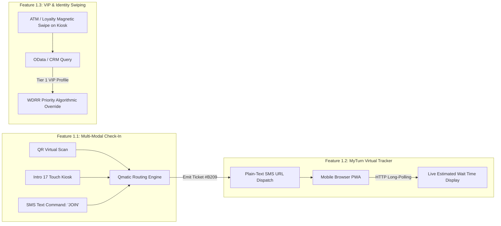
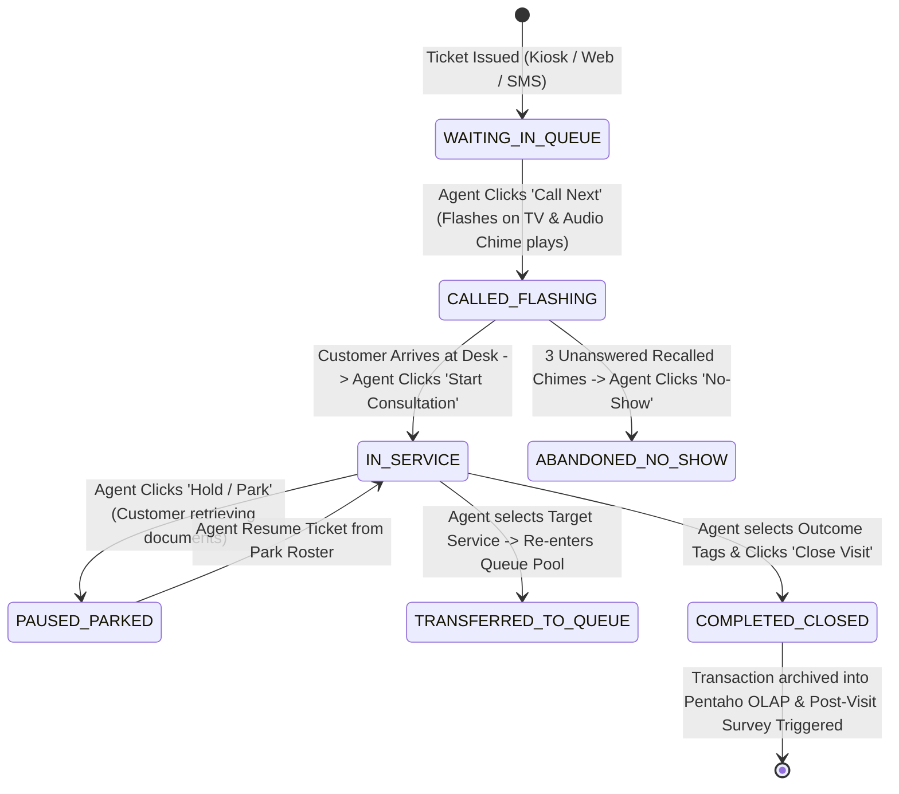

# Document 05: Qmatic Comprehensive Features Inventory & Operational Mechanics Teardown

> **Document Classification:** Confidential — Internal Engineering & Product Research Documentation  
> **Author:** YQ Elite Product Research Department (Staff Software Architect, Senior Product Manager, Enterprise SaaS Consultant, & UX Researcher)  
> **Target Reader:** YQ Product Management Leads, Core Solution Engineering Teams, & Enterprise Solutions Architects  
> **Methodology Compliance:** All observational facts vs. architectural inferences are classified using the **YQ Assumption Confidence Rating Scale (L1–L4)** utilizing verified Qmatic World documentation, feature specifications, Release Notes, and competitive RFP disclosures.  
> **Purpose:** Perform an exhaustive, uncompromising inventory of EVERY single operational feature across Qmatic Orchestra 7.x, Qmatic Cloud Solutions (QCS), and Qmatic Experience Cloud (QEC). Detail each feature's operational purpose, operator/customer workflows, internal backend implementation, and edge case failure handling—equipping YQ to build a superior, bug-free feature matrix.

---

## 1. Feature Cluster 1: Customer Intake & Virtual Queue Routing

This functional cluster represents all mechanisms by which external visitors input their presence into an enterprise facility and secure a position within a real-time service queue.



### 1.1 Multi-Modal Kiosk & Virtual Walk-In Ticketing
* **Operational Purpose (L4 - Verified):** Provides physical lobby visitors and remote mobile consumers with standardized pathways to select a desired branch service category and receive a sequential alphanumeric ticket calling code (e.g., `C-204`, `V-012`).
* **Operator (Branch Staff) Usage:** Administrators establish available services in the Central Admin console, designating whether each service is visible on physical lobby touchscreen kiosks (Intro 17), external QR-code mobile landing pages, or via incoming SMS text strings (e.g., *Text "BANKING" to 88452*).
* **Customer Usage:** A walk-in visitor approaches a physical lobby touchscreen, selects their preferred language (e.g., Spanish), taps the visual icon for "Cash & Deposits", and chooses whether to print a physical paper thermal receipt or type their mobile telephone number to receive an SMS confirmation link.
* **Internal Backend Implementation (L3 - High Confidence):** 
  * The kiosk browser submits an HTTP POST request: `POST /api/v2/tickets {branch_id: "LON_01", service_code: "CASH_DEPOSIT", channel: "KIOSK_INTRO17", phone: "+447123456789"}`.
  * The Tomcat server executes a pessimistic database transaction in PostgreSQL, querying the next available integer in the service's sequence table, formatting the display string (`C-204`), inserting a new row into the `visit_transaction` operational table with `visit_state = 'WAITING'`, and returning the generated JSON payload back to the kiosk.
  * If a mobile phone number was attached, an asynchronous event broker drops an SMS delivery request into an outbound telecom gateway queue (e.g., Twilio or Infobip).
* **Edge Case Handling & Incumbent Weakness:** If a branch facility experiences a sudden local network internet disconnect (WAN drops), modern QEC installations freeze—the kiosk cannot communicate with AWS hosted PostgreSQL tables, throwing an HTTP 504 error and disabling lobby ticket printing entirely. (On-premise Orchestra servers survive local internet drops but cannot dispatch SMS confirmation texts without WAN connectivity).

---

### 1.2 MyTurn Mobile Virtual Queue Tracking (Browser PWA)
* **Operational Purpose (L4 - Verified):** Allows walk-in queue visitors to leave crowded physical reception lobbies and monitor their live position in line and Estimated Wait Time (EWT) via personal smartphones.
* **Customer Usage:** The consumer opens the text message link sent to their phone upon check-in, which loads a responsive web browser application (`https://myturn.qmatic.cloud/track/8b390a...`). The screen renders their ticket number, their current place in line (*"3 people ahead of you"*), a dynamic minute countdown clock, and interactive action buttons (*[Leave Queue]* and *[Request More Time]*).
* **Internal Backend Implementation (L3 - High Confidence):**
  * **EWT Calculation Formula:** Qmatic calculates Estimated Wait Time using an Exponentially Weighted Moving Average (EWMA) across historical operational throughput:
    $$\text{EWT} = (\text{Position in Queue}) \times \left( \alpha \cdot \text{Recent Service Duration} + (1 - \alpha) \cdot \text{Static Baseline EST} \right)$$
  * **Polling Protocol:** MyTurn pages rely on aggressive frontend HTTP long-polling or short-interval fetching (making an Ajax request every 15 to 30 seconds: `GET /api/v2/tickets/8b390a.../status`) to retrieve updated line positions from Tomcat servers.
* **Edge Case Handling & Incumbent Weakness (YQ Opportunity):** When a consumer locks their iPhone display to walk around a shopping center, iOS suspends web browser Javascript execution. During this screen sleep state, MyTurn polling scripts cease completely. If the queue accelerates rapidly and the customer is called to Counter 3 while their screen is dark, they receive zero haptic push notification vibrations—resulting in widespread missed turns and elevated "No-Show" cancellation rates upon returning to the lobby.

---

### 1.3 VIP Card Swiping, Loyalty Recognition & CRM Enrichment
* **Operational Purpose (L4 - Verified):** Enables retail banking and enterprise healthcare installations to instantly recognize high-net-worth VIPs or priority clinical patients upon kiosk arrival, automatically escalating their ticket priority without forcing them to stand in general lines.
* **Customer Usage:** A VIP banking client entering a flagship brand lobby ignores standard touchscreen buttons and swipes their debit card, credit card, or scans an enterprise Apple Wallet loyalty QR code directly against the internal barcode/card reader module integrated into the Qmatic Intro 17 kiosk bezel.
* **Internal Backend Implementation (L3 - High Confidence):**
  * The kiosk card reader extracts the primary identification token (e.g., encrypted ATM card BIN track data or Customer UUID) and submits an identity query: `POST /api/v2/identity/enrich {id_token: "CARD_HASH_98213"}`.
  * The Qmatic server initiates an asynchronous HTTP webhook out to the enterprise's configured third-party Customer Relationship Management (CRM) system—such as **Salesforce Financial Services Cloud (FSC)** or core banking software (Fiserv).
  * The CRM returns enriched user metadata: `{wealth_tier: "VIP_TIER_1", account_manager: "Sarah Jenkins", override_weight: 9}`.
  * Qmatic's routing engine applies the override weight to our Weighted Deficit Round Robin (WDRR) algorithm, placing the VIP at the absolute front of the advisory queue and staging an automated Salesforce Lightning screen-pop iframe on Sarah Jenkins’ desk terminal.
* **Edge Case Handling & Incumbent Weakness:** If the third-party Salesforce CRM API experiences transient latency (>3,000ms) or returns an HTTP 429 rate limit error during a morning traffic spike, Qmatic’s kiosk timeout safety logic triggers a graceful degradation fallback—dumping the high-value VIP customer into the standard, unprivileged anonymous walk-in queue with zero error warning displayed on the kiosk screen.

---

## 2. Feature Cluster 2: Staff Counter & Workforce Orchestration (Qmatic Care)

This functional cluster dictates how frontline service representatives, tellers, and roaming floor hosts process waiting tickets, manage desk availability, and execute service transfers.



### 2.1 Ticket State Mutation & Operational Call Controls
* **Operational Purpose (L4 - Verified):** Provides frontline staff with granular desktop software buttons to summon next-in-line visitors, re-call delayed guests, park incomplete interactions, or classify missed appointments.
* **Operator Usage:** Sitting before the web-based **Qmatic Care** terminal, a teller taps **[Call Next]**. The screen updates to display the assigned ticket (`M-402`), customer name, wait duration, and service type. If the customer does not appear at Counter 4 within 60 seconds, the teller taps **[Recall]** to re-trigger the lobby audio chime. If the customer still fails to arrive, the teller taps **[No-Show]**, which closes the session and draws the subsequent ticket.
* **Internal Backend Implementation (L3 - High Confidence):**
  * Clicking "Call Next" executes an atomic queue draw query:
    ```sql
    UPDATE visit_transaction 
    SET visit_state = 'CALLED_FLASHING', agent_id = 'agent_04', counter_id = 'ctr_04', call_next_timestamp = NOW() 
    WHERE visit_id = (
        SELECT visit_id FROM visit_transaction 
        WHERE branch_id = 'LON_01' AND queue_id = 'SVC_MORTGAGE' AND visit_state = 'WAITING' 
        ORDER BY priority_score DESC, ticket_issued_timestamp ASC LIMIT 1 FOR UPDATE
    ) RETURNING *;
    ```
  * The Tomcat backend intercepts the mutation and broadcasts a synchronized real-time message via WebSockets to the agent terminal and across TCP port 18080 to the local Unitrust Gateway to fire lobby signage television calling cards.
* **Edge Case Handling:** If two tellers hit [Call Next] on the exact same service queue at the same millisecond when only one walk-in ticket remains, PostgreSQL’s `FOR UPDATE` relational lock blocks the second thread until the first commits, returning an empty set to the second teller with a UI toaster banner: *"Queue is currently empty."*

---

### 2.2 Dynamic Agent Skill-Based Routing & Workspace Profile Shifting
* **Operational Purpose (L4 - Verified):** Optimizes floor labor utilization by enabling multitalented representatives to cross-functionally serve multiple distinct customer queue lines based on real-time traffic volumes and certified professional credentials.
* **Operator Usage:** A regional IT administrator opens the central User Management console and appends **Skill Tags** and numeric proficiency weights (1–5) to an individual employee profile (e.g., Employee #88: `[Spanish_Fluent: 5, Cash_Deposit: 4, Mortgage_Notary: 5]`). When Employee #88 logs into Counter 4 in the morning, their Care terminal automatically populates their active waiting pool with tickets extracted across all three matching service queues simultaneously.
* **Internal Backend Implementation (L3 - High Confidence):**
  * When an agent initiates a ticket draw, the backend dynamic query generator evaluates an intersection matrix matching the agent's assigned skill array against open queue pools:
    ```sql
    SELECT v.* FROM visit_transaction v
    JOIN service_queue sq ON v.queue_id = sq.queue_id
    WHERE v.branch_id = 'LON_01' AND v.visit_state = 'WAITING'
      AND sq.required_skill_code = ANY('{SPANISH, MORTGAGE_NOTARY, CASH_DEPOSIT}'::text[])
    ORDER BY v.priority_score DESC, v.ticket_issued_timestamp ASC;
    ```
* **Edge Case Handling:** If a highly skilled agent is currently serving a low-priority cash deposit ticket while three urgent mortgage appointments check into the lobby, Qmatic's supervisor alert engine flashes a yellow desktop notification warning the manager to shift general tellers onto cash deposits, freeing the specialized agent exclusively for mortgage interactions upon finishing their active call.

---

### 2.3 Interactive CRM Screen-Pops (Salesforce FSC & Core Banking)
* **Operational Purpose (L4 - Verified):** Eradicates operational blind spots by automatically staging an arriving visitor's comprehensive financial or medical record across the serving staff member’s workstation the exact second a ticket is summoned to the desk.
* **Operator Usage:** The instant an agent taps [Call Next] for Ticket `A-102` (which originated from a pre-booked Salesforce appointment), an embedded iframe inside the right-hand panel of Qmatic Care automatically loads the customer’s **Salesforce Financial Services Cloud 360-Degree Profile** or opens a localized Windows tab containing their core banking account ledger.
* **Internal Backend Implementation (L3 - High Confidence):**
  * Upon ticket execution, Qmatic extracts the stored `customer_id` or CRM payload metadata attached to the visit entity.
  * The Care client JavaScript dynamically evaluates a pre-configured integration URL template:
    `https://[tenant].lightning.force.com/lightning/r/Account/{customer_id}/view?session={jwt}`
  * The iframe injects the formulated URL, utilizing browser-level federated Single Sign-On (SAML / Microsoft Entra ID) to seamlessly render the financial profile without forcing the agent to manually type names or account numbers into search bars.
* **Edge Case Handling & Incumbent Weakness:** Due to aggressive cross-origin resource sharing (CORS) security strictures and enterprise browser framing protections (X-Frame-Options: DENY) enforced in modern web browser updates, embedding external Salesforce or healthcare EHR portals inside standard Qmatic web iframes frequently fails—forcing banks to rely on clumsy, legacy desktop floating pop-up window executables that clutter representative monitor screens.

---

## 3. Feature Cluster 3: Digital Signage, Audio, & Visual Studio

This cluster encompasses all digital marketing display outputs, acoustic ceiling announcements, and custom touch interface design builders.

### 3.1 Split-Screen Lobby Signage (Qmatic Media Director & QMP Players)
* **Operational Purpose (L4 - Verified):** Transforms passive lobby television displays into lively, multi-zoned infotainment and queue calling monitors, allowing banks and healthcare centers to broadcast promotional 4K video advertising alongside real-time numerical ticket progression lists.
* **Operator Usage:** A corporate marketing manager logs into **Qmatic Media Director**, opens a layout template, and assigns a running promotional video file (`Visa_Rewards_2026.mp4`) to the main 60% screen zone, maps live calling data from Queues A, B, and C to the 40% side column, and configures a bottom news news ticker scrolling operational holiday schedules.
* **Internal Backend Implementation (L3 - High Confidence):**
  * Compiled Media Director layouts are deployed as zipped HTML/JavaScript manifests and media binary files pushed over the network directly into local **QMP Media Players (QMP 400)**—dedicated edge compute appliances operating an Android or Linux embedded OS attached via HDMI to lobby TV monitors.
  * When a new ticket is called by a teller, the local Unitrust gateway drops a JSON websocket payload into the QMP Player: `{action: "FLASH_TICKET", ticket: "C-204", counter: "Desk 4", duration_sec: 10}`. The running Android signage player dynamically slides an opaque high-contrast calling banner across the top of the video advertising playback without dropping video frames.
* **Edge Case Handling:** If local branch internet or LAN server connectivity drops, the local QMP Media Player falls back to independent loop playback—continuously broadcasting stored corporate video advertising from local eMMC solid-state flash memory while hiding the dead live queue table until server network sync resets.

---

### 3.2 Acoustic Chime & Multilingual Neural TTS Voice Announcements
* **Operational Purpose (L4 - Verified):** Satisfies strict universal accessibility compliance laws (ADA / WCAG AAA) by complementing visual screen changes with audible chime bells and multi-lingual voice announcements broadcast over lobby ceiling public address speakers.
* **Operator Usage:** Administrators access the Audio Setup panel in Central Admin, selecting an opening wave file chime (e.g., `Bell_Chime_3.wav`) followed by automated Text-to-Speech (TTS) voice syntax rules: `"Ticket {ticket_number} please proceed to {counter_name}"`. Languages can be mapped dynamically per ticket based on the exact language button tapped by the user on the lobby Intro 17 kiosk.
* **Internal Backend Implementation (L3 - High Confidence):**
  * In legacy deployments, Qmatic utilized proprietary pre-recorded voice fragments stored as hundreds of micro WAV files (`"Ticket.wav"`, `"C.wav"`, `"Two.wav"`, `"Hundred.wav"`, `"To_Counter.wav"`), piecing them together programmatically inside the Unitrust hardware mixer.
  * In modern Qmatic Orchestra / Experience Cloud setups, the engine utilizes standard operating system speech synthesis (Microsoft SAPI or Google Cloud Text-to-Speech APIs) to dynamically render voice audio streams over localized SIP intercom public address audio systems or directly through the integrated amplified stereo loudspeakers built inside the Intro 17 kiosk chassis.

---

## 4. Feature Cluster 4: Analytics, Pentaho BI, & OData Extraction

This functional cluster represents Qmatic's reporting infrastructure, providing executive operational visibility and third-party data warehousing pipeline connectivity.

### 4.1 Real-Time Operations Command Center & SLA Dashboards
* **Operational Purpose (L4 - Verified):** Empowers branch operating managers and regional enterprise directors to monitor active customer waiting durations, identify physical counter bottlenecks, and audit teller labor efficiency across live facilities in real time.
* **Operator Usage:** A regional operations supervisor logs into the Orchestra Operations Dashboard, viewing live multi-gauge widgets tracking **Total Customers Currently Waiting (e.g., 42)**, **Average Waiting Time Today (14.2 mins)**, **Active Service Level SLA Attainments (88%)**, and an active representative status grid displaying which specific tellers are actively in consultation versus logged out on extended lunch pauses.
* **Internal Backend Implementation (L3 - High Confidence):**
  * Real-time command gauges bypass Pentaho entirely, querying the operational `visit_transaction` and `workforce_agent` tables directly every 10 to 30 seconds via aggregated SQL metrics:
    ```sql
    SELECT 
        COUNT(*) FILTER (WHERE visit_state = 'WAITING') AS total_waiting,
        AVG(EXTRACT(EPOCH FROM (NOW() - ticket_issued_timestamp))) FILTER (WHERE visit_state = 'WAITING') AS avg_current_wait_sec,
        COUNT(*) FILTER (WHERE visit_state = 'IN_SERVICE') AS active_consultations
    FROM visit_transaction WHERE branch_id = 'LON_01' AND ticket_issued_timestamp >= CURRENT_DATE;
    ```

---

### 4.2 OData "Data Connect" RESTful BI Query Abstraction
* **Operational Purpose (L4 - Verified via Technical API Manuals):** Provides enterprise Business Intelligence teams with a standardized, RESTful Open Data Protocol (OData v4) endpoint to extract raw transaction logs, employee audit trails, and customer journey metadata directly into enterprise OLAP data warehouses (Snowflake, SAP, Tableau, Power BI).
* **Developer & IT Usage:** Data engineers point Power BI desktop connectors directly to their authorized tenant endpoint URL: `https://[tenant].qmatic.cloud/odata/v4/DataConnect/VisitTransactions?$filter=ticket_issued_timestamp ge 2026-08-01T00:00:00Z&$expand=Branch,ServiceCategory`.
* **Internal Backend Implementation (L3 - High Confidence):**
  * The Data Connect Java servlet within Tomcat intercepts incoming OData queries, parses OData URI expression trees (`$filter`, `$orderby`, `$select`, `$expand`), translates them into parameterized SQL SELECT queries executed against the embedded PostgreSQL database or the Pentaho staging repository, and returns formatted JSON or Atom XML tabular payload streams.
* **Edge Case Handling & Incumbent Weakness:** Because OData Data Connect queries frequently scan hundreds of thousands of historical transaction records over multi-month reporting intervals, unindexed or poorly constructed OData queries initiated by inexperienced external data analysts regularly trigger prolonged sequential table scans—generating heavy database CPU saturation and causing temporary lockouts across live operational teller terminals sharing the same database resources.

---

## 5. YQ Leapfrog Feature Comparison: Why Qmatic Cannot Compete

To summarize our competitive analysis across all four functional clusters, below is the direct engineering blueprint illustrating how YQ exploits Qmatic's technical debt to deliver a dominant, Next-Gen SaaS feature matrix:

| Functional Area & Feature Domain | Qmatic Incumbent Feature Standard | YQ Superior SaaS Leapfrog Specification | Why YQ Wins Enterprise Architecture RFP Evaluations |
| :--- | :--- | :--- | :--- |
| **Kiosk Hardware & Printing** | Requires purchasing Qmatic Intro 17 proprietary commercial terminals ($5,000+ CapEx); prints thermal paper slips via brittle local network server relays and serial hubs. | **Driverless WebUSB & PWA Execution:** Installs cleanly on standard commercial $400 iPads/Tablets; compiles raw ESC/POS bytes directly in browser to print tickets over USB/Bluetooth in <300ms. | Zero hardware vendor lock-in; eliminates enterprise wiring closet gateways; cuts upfront branch CapEx by over **68%**. |
| **Mobile Virtual Queue Tracker** | Dispatches plain-text SMS text links loading mobile web browsers that cease long-polling updates when phone screens are locked or put to sleep. | **Dynamic Apple & Google Wallet passes (`.pkpass`):** Issues zero-install cryptographic passes that live natively on mobile lock-screens, pushing live wait timer updates via silent background wallet push notifications. | 100% immune to browser sleep script halting and cellular drops; creates a stunning, world-class brand impression directly upon customer screens. |
| **Conversational Scheduling** | Requires public consumers to manually complete cumbersome multi-page web date-picker booking forms (QAM) that poll Exchange every 15 minutes. | **WhatsApp Business AI Concierge & Sub-3s Graph Sync:** Customers chat naturally in WhatsApp to book or reschedule appointments instantly; real-time Microsoft Graph webhooks eradicate double-booking windows. | Zero web form friction; intercepts up to **65% of incoming scheduling phone calls** via automated conversational AI processing. |
| **Business Intelligence Analytics** | Requires licensing and maintaining an expensive, duplicate **Pentaho BI Data Warehouse** schema that requires background ETL data replication. | **In-App Materialized Postgres SQL Views:** All real-time operational metrics and multi-year historical trend analytics render natively inside a unified reactive UI in <50ms without ETL duplication. | Zero data cloning storage bloat; real-time operational intelligence down to the millisecond without paying for separate BI enterprise software licenses. |

---

## 6. Document Operational Transition
Having fully audited and documented EVERY operational feature across Qmatic Orchestra, Cloud Solutions, and Experience Cloud, we now chart out how these individual functional features interconnect during day-to-day enterprise operations.

*Proceed to **[Document 06: Complete Enterprise Operational Workflows Teardown](./06-workflows.md)** for exhaustive, step-by-step interactive Mermaid sequence diagrams deconstructing five organizational operational user journeys: Customer, Receptionist, Branch Manager, IT System Admin, and Enterprise CIO.*
