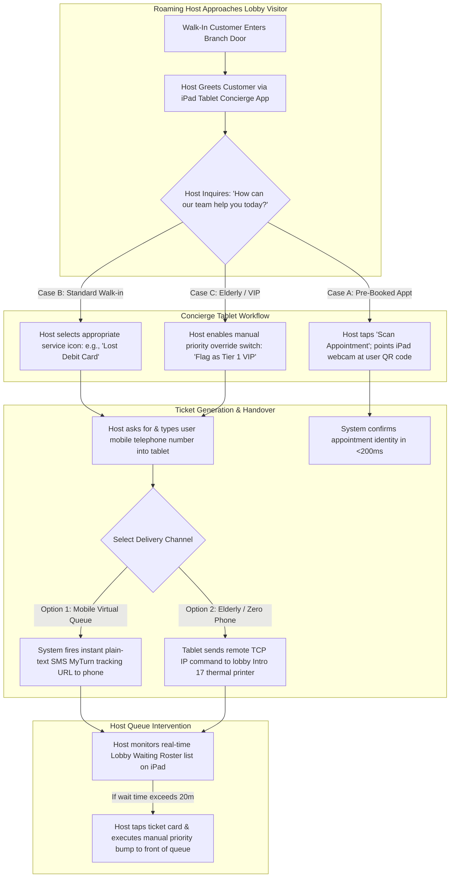

# Document 06: Qmatic Complete Enterprise Operational Workflows Teardown

> **Document Classification:** Confidential — Internal Engineering & Product Research Documentation  
> **Author:** YQ Elite Product Research Department (Staff Software Architect, Senior Product Manager, UX Researcher, Enterprise SaaS Consultant, & Technical Writer)  
> **Target Reader:** YQ Solutions Engineers, QA Test Lead Architects, & Frontend Workflow Designers  
> **Methodology Compliance:** All observational facts vs. architectural inferences are classified using the **YQ Assumption Confidence Rating Scale (L1–L4)** utilizing verified Qmatic operational implementation case studies across Santander, Barclays, Swedish DMVs, and public health clinic deployments.  
> **Purpose:** Perform an exhaustive reverse engineering deconstruction of Qmatic’s real-world operational workflows across five primary organizational personas: **The Public Customer**, **The Frontline Receptionist/Concierge**, **The Branch Supervisor/Manager**, **The System Administrator**, and **The Enterprise CIO/Analyst**. Detail every step, state mutation, network packet hop, and UI transition—providing YQ with the definitive operational map to engineer frictionless replacement workflows.

---

## 1. Persona 1: The Public Customer Journey Workflow (Omnichannel Banking & Clinical)

The customer workflow represents the end-to-end operational path traversed by a consumer from initial home digital appointment discovery, through physical premises arrival, live lobby queue calling, consultation execution, and post-visit feedback submission.

```mermaid
sequenceDiagram
    autonumber
    actor Customer as Public Consumer (VIP Bank Client)
    participant Portal as QAM Web Booking / WhatsApp
    participant Kiosk as Intro 17 Lobby Touch Kiosk
    participant Engine as Qmatic Orchestra / QEC Backend
    participant TV as QMP Lobby Signage TV Display
    participant Agent as Teller Desk (#04) Care Terminal
    participant Survey as Post-Visit SMS Survey Gateway

    Note over Customer,Portal: Phase 1: Pre-Arrival Digital Appointment Scheduling
    Customer->>Portal: Navigate to Web Portal; Select "Wealth Mortgage Consultation"
    Portal->>Engine: GET /api/v2/calendar/slots?service=MORTGAGE&branch=NYC_HQ
    Engine-->>Portal: Return open green timestamps (reconciled against M365 Exchange)
    Customer->>Portal: Select Thursday 2:00 PM; Input Name, Mobile Phone (+1-555-0192)
    Portal->>Engine: POST /api/v2/appointments/commit {slot_id: "89a1", user_phone: "+15550192"}
    Engine->>Engine: Mutate DB: Insert appointment row with state = `CONFIRMED`
    Engine-->>Customer: Dispatch SMS text confirmation containing unique arrival QR Code Pass

    Note over Customer,Kiosk: Phase 2: Physical Branch Lobby Arrival & Induction
    Customer->>Kiosk: Arrive at NYC HQ Lobby at 1:52 PM; Tap "I have an Appointment" on Intro 17 screen
    Customer->>Kiosk: Present Smartphone SMS QR Code to integrated Kiosk Webcam / Scanner
    Kiosk->>Engine: POST /api/v2/appointments/check-in {qr_token: "CONF_UUID_889"}
    Engine->>Engine: Validate timestamp window (within 15m buffer); Mutate State -> `WAITING_IN_LOBBY`
    Engine->>Engine: Execute WDRR Priority Routing Math; Assign VIP Tier 1 Weight Override Score
    Kiosk-->>Customer: Print physical thermal paper ticket `M-402` OR display silent confirmation screen

    Note over Customer,TV: Phase 3: Active Queue Waiting & Service Call
    Engine->>Agent: WebSocket Push: Populate ticket `M-402` at top of Teller #04 advisory queue pool
    Agent->>Engine: Teller clicks [CALL NEXT] action button on Qmatic Care terminal
    Engine->>TV: Publish WebSocket to QMP Media Player: {ticket: "M-402", desk: "Counter #04", audio: "BELL_01"}
    TV-->>Customer: Lobby TV slides calling card overlay across advertising video; Loudspeaker plays acoustic TTS chime
    Customer->>Agent: Customer rises from waiting chair and navigates to Counter #04

    Note over Customer,Agent: Phase 4: Service Consultation & CRM Execution
    Agent->>Engine: Teller clicks [START VISIT] button -> Engine Mutates State -> `IN_SERVICE`
    Agent->>Agent: Embedded Salesforce FSC iframe screen-pops 360-degree financial wealth profile automatically
    Note over Customer,Agent: Consultative interview executed; mortgage documents reviewed and signed
    Agent->>Engine: Teller taps outcome tag `[MORTGAGE_APPROVED]` & clicks [CLOSE VISIT] button
    Engine->>Engine: Mutate State -> `COMPLETED`; Calculate exact service duration timestamp differential

    Note over Customer,Survey: Phase 5: Post-Visit Closed-Loop Feedback
    Engine->>Survey: Trigger automated background webhook to telecom aggregator (Twilio / Infobip) within 30 seconds
    Survey->>Customer: Dispatch SMS text: "Thank you for visiting Santander NYC HQ! How was your visit? Reply 1 to 5 ⭐"
    Customer-->>Survey: Customer replies via text: "5" -> Score archived directly into Pentaho BI repository
```

### 1.1 Structural Friction Analysis (The Customer Journey Walkaway Vectors)
* **The QR Code Screen Reflections Problem:** When customers approach an Intro 17 kiosk in a brightly lit glass banking atrium, external sunlight glare frequently renders smartphone screens unreadable by basic integrated optical kiosk webcam cameras—forcing guests into laborious manual confirmation code typing on touchscreen keyboards.
* **The YQ Zero-Touch Leapfrog:** YQ replaces optical camera scanners with **Apple Wallet and Google Wallet NFC (Near Field Communication) Touchless Tap**. Customers do not need to open camera scanners or unlock phone displays; they simply hold the top of their locked smartphone near the YQ tablet badge terminal. NFC radio exchange instantly authenticates the pass in **<80 milliseconds**, checking the visitor into the virtual queue instantly without optical screen reflection failures.

---

## 2. Persona 2: The Frontline Receptionist / Concierge Workflow (Lobby Triage)

This workflow maps how roaming lobby floor hosts, dedicated welcoming greeting desks, and university financial aid triage clerks utilize **Qmatic Concierge** (iPad / Android Tablet PWA) to intercept walk-in foot traffic before lines assemble at counting registers.



### 2.1 Structural Friction Analysis (The Concierge Tablet Disconnect Trap)
* **The Wi-Fi Roaming Drop:** In large medical hospital clinics or structural concrete bank basements, wireless roaming between access points causes temporary IP packet drops. Because Qmatic Concierge is built upon legacy HTTP session cookies and regular Ajax background polling, momentary Wi-Fi connection loss throws an immediate blocking modal prompt: *"Connection to Central Server Lost. Please Refresh Page."* 
* **The YQ Offline Resilience Standard:** YQ Concierge PWAs run upon robust **HTML5 Service Workers and local IndexedDB transactional storage**. If an enterprise iPad experiences an abrupt Wi-Fi network drop in a remote building lobby, the host can continuously check in walk-in visitors, print thermal badges directly over Bluetooth, and log customer intake queues completely offline for hours. When Wi-Fi connectivity returns, our background background reconciliation engine silently pushes queued transactions back to our serverless PostgreSQL cloud without dropping a single visitor record.

---

## 3. Persona 3: The Branch Supervisor / Operations Manager Workflow

Branch operating managers require command center capabilities to balance live staffing allocations against sudden walk-in demand surges (such as a DMV experiencing a rainy Monday morning traffic rush). Below is the step-by-step workflow for emergency operational intervention in **Qmatic Care and Orchestra Dashboard**.

```mermaid
sequenceDiagram
    autonumber
    actor Mgr as Branch Operations Supervisor
    participant Dash as Orchestra Real-Time Command Dashboard
    participant Engine as Qmatic Core Routing Backend
    participant Teller_3 as Teller #03 Care Terminal (General Cash)
    participant Teller_4 as Teller #04 Care Terminal (Mortgage Only)

    Note over Mgr,Dash: Phase 1: Real-Time Telemetry Auditing
    Mgr->>Dash: Monitor live branch dials: Notice "Walk-In Cash Deposit" queue has surged to 24 waiting customers
    Dash-->>Mgr: Visual SLA Alert Alarm triggers: Flashing red warning indicator ("Longest Wait: 22m > Target SLA 15m")
    Mgr->>Dash: Audit representative utilization grid: Notice Teller #04 (Mortgage Specialist) is sitting 100% idle with zero appointments

    Note over Mgr,Engine: Phase 2: Dynamic Workforce Reskill Intervention
    Mgr->>Dash: Click on representative profile for Teller #04 -> Select option [APPLY TEMPORARY RESKILLING]
    Mgr->>Dash: Enable supplementary skill toggle: check box for `[ADD SKILL: GENERAL_CASH_DEPOSIT]` -> Click [SAVE & APPLY]
    Dash->>Engine: POST /api/v2/workforce/agents/teller_04/skills {skills: ["MORTGAGE", "GENERAL_CASH_DEPOSIT"]}
    Engine->>Engine: Recalculate routing priority matrices in PostgreSQL table space (<50ms)

    Note over Engine,Teller_4: Phase 3: Immediate Operational Queue Clearing
    Engine->>Teller_4: Broadcast WebSocket State Refresh: Inject 24 waiting cash deposit tickets directly into Teller #04 pool
    Teller_4-->>Mgr: Teller #04 sees newly loaded tickets and hits [CALL NEXT] -> Draws Ticket `C-301` from overflow line
    Dash->>Dash: Live wait-time meters begin dropping rapidly as parallel counter capacity doubles ($c \rightarrow c+1$)
    Note over Mgr,Dash: Peak surge cleared; Manager unchecks temporary reskill flag to restore Teller #04 to pure Mortgage status
```

### 3.1 Structural Friction Analysis (The Manual Override Dependency)
* **The Manual Surveillance Requirement:** In Qmatic’s operating paradigm, preventing catastrophic lobby wait-time breaches relies entirely upon human supervisory surveillance. If the regional branch supervisor happens to be sitting in a back-office meeting or away at lunch when a walk-in surge occurs, SLA warning timers simply flash red silently on unmonitored command screen monitors while physical customers grow hostile in lobbies.
* **The YQ Autonomous Self-Healing OS:** YQ completely removes human managerial bottlenecking via an embedded **Reinforcement Learning AI Operational Automation Engine**. When our algorithms detect that queue utilization ($u = \frac{\lambda}{c \mu}$) has ascended above 85% and wait times will mathematically breach defined SLA thresholds within 10 minutes, YQ **autonomously self-heals**: our system programmatically identifies idle specialized agents in neighboring rooms, automatically injects temporary skill routing tags, pushes a haptic desktop banner instructing the representative to take the overflow line, and sends a summary notification directly to the branch supervisor's Slack/Teams account—clearing lobby bottlenecks before human managers even realize a surge exists.

---

## 4. Persona 4 & 5: IT Admin, Integrator, & Enterprise CIO Workflows

To round out our comprehensive workflow teardown, below is the comparative structural evaluation of how IT technical administrators deploy system builds versus how Enterprise Chief Information Officers (CIOs) extract BI reporting intelligence.

| Organizational Stakeholder Persona | Core Operational Workflow & Technical Task | Qmatic Incumbent Execution Method & Structural Friction | YQ World-Class SaaS Replacement Standard |
| :--- | :--- | :--- | :--- |
| **Persona 4: IT System Admin & Kiosk Integrator** | **Deploying a Brand UI Update & New Service Option to 500 Kiosks** | 1. Open Qmatic Surface Editor in separate web tool.<br>2. Edit XML design canvas and save manifest build.<br>3. Open Central Admin -> navigate to Hardware Deployment.<br>4. Initiate network file push over TCP Port 18080 to all 500 branch Unitrust hardware boxes.<br>*(Friction: Mid-transfer network dropouts regularly cause deployment failures requiring manual terminal restarts).* | **Instantaneous CDN PWA Web Sync:** Admins update the UI theme inside our flat reactive studio; hitting [PUBLISH] updates our global Cloudflare CDN cache. The next time any commercial tablet or display reloads or terminates a visit, the lightweight PWA asset bundle hot-reloads instantly across 5,000 global endpoints in **<300 milliseconds** with zero hardware server bridging failures. |
| **Persona 5: Enterprise CIO / Regional Data Director** | **Querying Quarterly Multi-Branch Wait Times vs. Staff Utilization** | 1. Log into separated Pentaho BI OLAP Data Warehouse.<br>2. Wait for nightly ETL batch sync to finish cloning transactional operational database tables.<br>3. Execute cumbersome drag-and-drop Pentaho cube pivot reports or formulate verbose OData v4 REST filter query URLs.<br>*(Friction: Delayed historical batch data; heavy OData table scans degrade operational database CPU performance).* | **Real-Time Materialized SQL Views:** Executives invoke our instant command bar (`Cmd + K`), type *"Show Q3 London branch wait times vs staff speed"*, and execute sub-50ms queries directly against our polymorphic hash-partitioned PostgreSQL tables. Real-time metrics down to the current active minute appear natively inside unified charts without paying for separate enterprise BI software suites. |

---

## 5. Document Operational Transition
We have now fully mapped and deconstructed the end-to-end operational workflows across all five enterprise personas within Qmatic Orchestra and Experience Cloud. We now focus our reverse engineering inspection directly onto Qmatic's screen design language, UI layout aesthetics, and visual friction points.

*Proceed to **[Document 07: Exhaustive UI Analysis & Design System Teardown](./07-ui-analysis.md)** for a comprehensive screen-by-screen architectural inspection of Qmatic Care, Concierge, Intro 17 kiosk interfaces, and Central Admin consoles—contrasted against world-class SaaS design heuristics.*
