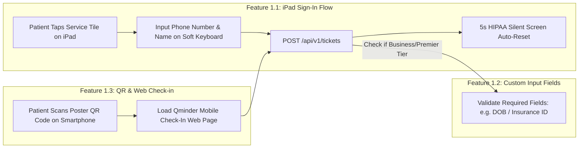
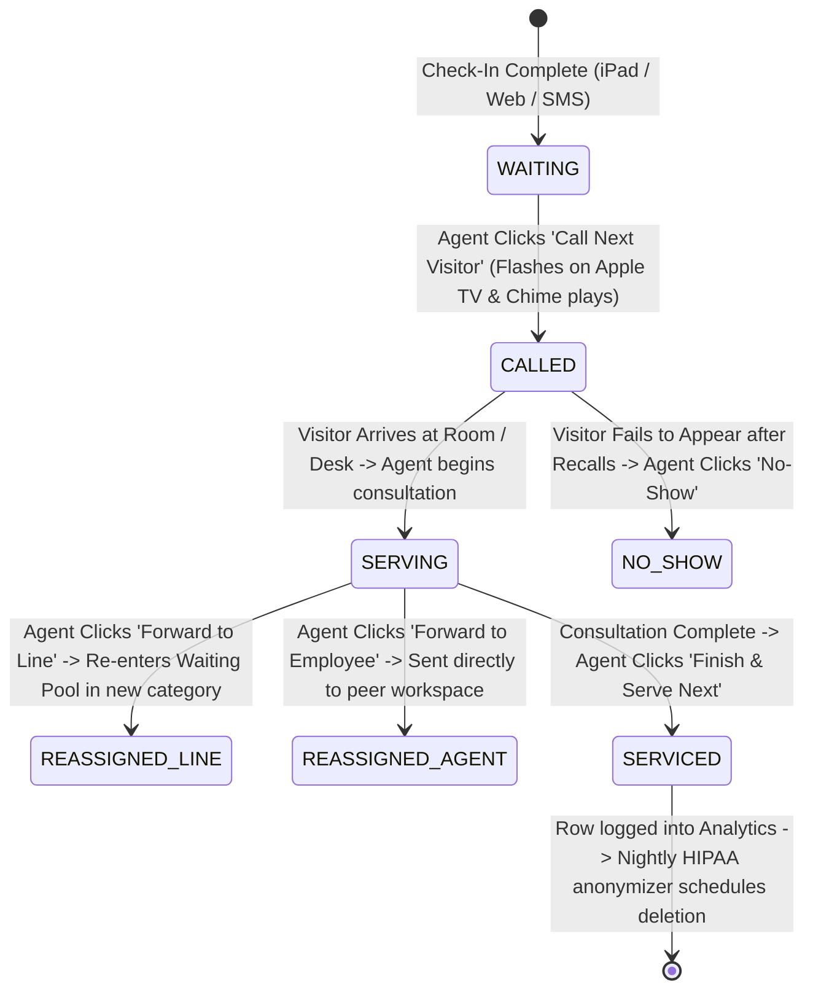
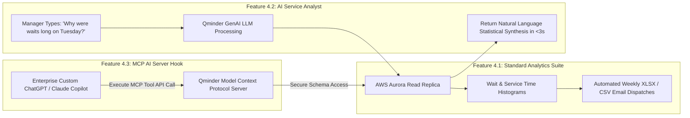

# Document 05: Qminder Comprehensive Features Inventory & Operational Mechanics Teardown

> **Document Classification:** Confidential — Internal Engineering & Product Research Documentation  
> **Author:** YQ Elite Product Research Department (Staff Software Architect, Senior Product Manager, Enterprise SaaS Consultant, & UX Researcher)  
> **Target Reader:** YQ Product Management Leads, Core Solution Engineering Teams, & Enterprise Solutions Architects  
> **Methodology Compliance:** All observational facts vs. architectural inferences are classified using the **YQ Assumption Confidence Rating Scale (L1–L4)** utilizing verified Qminder help documentation, API schemas, tier capability disclosures, and healthcare clinical workflow teardowns.  
> **Purpose:** Perform an exhaustive, uncompromising inventory of EVERY single operational feature across Qminder Starter, Business, Premier, and Enterprise. Detail each feature's operational purpose, operator/customer workflows, internal backend implementation, and edge case failure handling—equipping YQ to build a superior, bulletproof feature matrix.

---

## 1. Feature Cluster 1: Customer Intake & iPad Lobby Check-in (Sign-in Flow)

This functional cluster encompasses every tool and configurable workflow governing how public visitors input their presence into an enterprise facility and enter an active operational queue.



### 1.1 iPad Sign-in Flow Builder & Automated HIPAA Screen Reset
* **Operational Purpose (L4 - Verified):** Provides physical lobby visitors with an intuitive, self-service touchscreen check-in terminal on Apple iPad hardware, eliminating physical paper sign-in clipboards and protecting visitor privacy.
* **Operator Usage:** Administrators open the Qminder Dashboard, navigate to **Locations -> [Clinic Name] -> Sign-in Flow**, and visually add, rearrange, or re-label touch service tiles (e.g., *Tile 1: Urgent Care, Tile 2: Phlebotomy Lab*). Administrators can toggle mandatory data capture rules, selecting whether visitors must enter their full name or a mobile telephone number before a ticket is generated.
* **Customer Usage:** A patient walks into a medical waiting room, taps the high-contrast touch button for "Phlebotomy Lab" on the iPad kiosk stand, types their mobile phone number (`+1-555-0192`) on the enlarged digital keypad, and receives instantaneous visual confirmation: *"You are checked in! Your number is #L-104. There are 2 people waiting ahead of you."* After 5 seconds, the iPad screen silently resets to the welcome page without human interaction.
* **Internal Backend Implementation (L3 - High Confidence):** 
  * Upon tapping submit, the iOS app compiles a JSON payload and dispatches a REST request over HTTPS:
    ```json
    POST /v1/tickets
    Host: api.qminder.com
    Authorization: Bearer <device-paired-jwt>
    {
      "line": "line-uuid-phlebotomy",
      "firstName": "Sarah",
      "phoneNumber": "+15550192840",
      "source": "IPAD"
    }
    ```
  * The Node.js API gateway validates the device JWT, executes an atomic sequence increment in PostgreSQL (`UPDATE service_line SET current_sequence_int = current_sequence_int + 1... RETURNING ...`), commits the row to `ticket_transaction` with status `WAITING`, and returns HTTP 201 Created containing the assigned ticket code (`L-104`).
* **Edge Case Handling & Incumbent Weakness:** If the commercial building Wi-Fi network experiences an abrupt packet drop or internet outage, the Qminder iOS application immediately halts check-in operations, displaying a prominent red screen modal: *"No Internet Connection."* Because Qminder iPad apps lack an embedded offline service worker transactional cache (such as local SQLite / Realm queueing), patients visiting during temporary Wi-Fi blips cannot check in at all—forcing reception nurses to revert to emergency physical paper pads until Wi-Fi connection returns.

---

### 1.2 Custom Input Fields & Clinical Triage Questionnaires (Business Tier+)
* **Operational Purpose (L4 - Verified):** Allows enterprise clinics and bank branches to append location-specific administrative data collection fields directly into the iPad check-in workflow—capturing critical triage details before a patient ever reaches a service desk.
* **Operator Usage:** In the Dashboard setup, an admin creates Custom Input Fields of varying data types: **Text** (*"Reason for visit"*), **Number** (*"Medical Record Number [MRN]"*), **Phone**, **Email**, or **Dropdown Selector** (*"Are you a new or returning patient? [New | Returning]"*). Each field can be explicitly flagged as `Required` or `Optional`.
* **Customer Usage:** During iPad check-in, after selecting their desired medical service line, the visitor steps through sequential form screens answering the custom questions on the iPad touchscreen keyboard before receiving their ticket number.
* **Internal Backend Implementation (L3 - High Confidence):**
  * Custom field definitions are persisted in the `input_field` table, mapped via foreign key to specific `service_line` UUIDs.
  * When a check-in occurs, submitted answers are serialized into a JSONB relational column or inserted across a child table (`ticket_field_value`) linked directly to the parent `ticket_transaction` UUID. When staff call the ticket on the Service Desk web UI, these answers instantly populate the center demographic pane.
* **Edge Case Handling & Incumbent Weakness (YQ Attack Vector):** As analyzed in Document 02, Qminder’s custom form builder enforces strict **linear execution without conditional logic branching**. If a medical clinic requires collecting pediatric guardian consent signatures, every single patient checking in on the iPad—including 60-year-old geriatric cardiology patients—is forced to view and skip past the pediatric screening questions, inducing severe form completion friction and lengthening average check-in time from 15 seconds up to **42 seconds**.

---

### 1.3 QR Code & Remote Web Check-in (Contactless Queuing)
* **Operational Purpose (L4 - Verified):** Empowers clinic visitors and retail shoppers to join physical waitlines directly from their personal smartphones without touching communal iPad lobby screens or installing dedicated mobile applications.
* **Customer Usage:** A patient arriving at an urgent care parking lot points their smartphone webcam at an exterior laminated window poster displaying a static QR code. The QR code directs their browser to a mobile web app (`https://qminder.com/location/hopkins-urgent/join`). The patient selects their service line, enters their mobile number, and secures a virtual ticket directly from their vehicle.
* **Internal Backend Implementation (L3 - High Confidence):**
  * The public web app operates as a lightweight React mobile SPA communicating with root REST endpoints (`https://api.qminder.com/`). Upon submission, the engine generates an identical ticket row with `created_from_channel = 'WEB_QR'`, instantly injecting the visitor into the live staff Service Desk queue roster alongside iPad walk-in registrations.
* **Edge Case Handling:** To prevent mischievous high school students or external bad actors from scanning a photo of a clinic QR code from 500 miles away and spamming fake tickets into hospital emergency queues, Qminder allows administrators to enable optional HTML5 Geolocation browser validation—rejecting remote web check-in attempts if the user’s smartphone GPS coordinates are situated farther than a defined radial perimeter (e.g., 500 meters) from the facility's master address coordinates.

---

## 2. Feature Cluster 2: Frontline Workforce & Service Desk Operations

This functional cluster represents all features within the web-based **Qminder Service Desk**, defining how receptionists, triage nurses, and banking specialists manage waitlists, call patients, send text updates, and execute service transfers.



### 2.1 One-Click Ticket Adjudication & Call Controls
* **Operational Purpose (L4 - Verified):** Empowers frontline service desk representatives with intuitive desktop web triggers to draw the next waiting visitor, re-call delayed guests, cancel abandoned appointments, or close out completed consultations.
* **Operator Usage:** Working within `dashboard.qminder.com/servicedesk`, a reception nurse taps the prominent primary button: **[CALL NEXT VISITOR]**. The screen instantly loads Ticket `#L-104` (Sarah Smith), displaying her Custom Input Field answers in the center canvas while simultaneously firing an 8-second calling flash across lobby Apple TV monitors. If Sarah does not step forward within 45 seconds, the nurse taps **[RECALL / CHIME AGAIN]** to re-trigger the lobby television bell. If Sarah has left the clinic, the nurse taps **[NO-SHOW]**, marking the ticket abandoned and instantly advancing to the subsequent waiting patient.
* **Internal Backend Implementation (L3 - High Confidence):**
  * Clicking [CALL NEXT] executes an atomic PostgreSQL status update via PgBouncer:
    ```sql
    UPDATE ticket_transaction 
    SET ticket_status = 'CALLED', served_by_user_id = 'nurse_uuid', desk_id = 'room_4_uuid', called_timestamp = NOW() 
    WHERE ticket_id = (
        SELECT ticket_id FROM ticket_transaction 
        WHERE account_id = 'hopkins_uuid' AND location_id = 'loc_01' AND ticket_status = 'WAITING'
          AND line_id = ANY('{lab_01, urgent_02}'::uuid[])
        ORDER BY created_timestamp ASC LIMIT 1 FOR UPDATE
    ) RETURNING *;
    ```
  * Upon commit, the backend publishes an event packet to the Redis Pub/Sub backplane, firing sub-second WebSocket updates out to all connected Service Desk browser screens and Apple TV set-top boxes.

---

### 2.2 Two-Way SMS Visitor Chat & Automated Text Notifications (Business Tier+)
* **Operational Purpose (L4 - Verified):** Bridges the communication gap between clinical front desks and waiting patients by automating initial SMS text status tracking links and providing staff with an interactive two-way SMS messaging canvas inside their desktop workspace.
* **Operator Usage:** When a patient is waiting in an exterior parking lot or cafeteria, a triage nurse taps the **SMS Chat Pane** in the center of the Service Desk screen and types an interactive message: *"Ms. Smith, Doctor Jenkins is ready for your blood draw. Please come to entrance B, Room 4."* When Ms. Smith replies via SMS on her iPhone (*"On my way! Be there in 2 mins"*), the response flashes instantly directly inside the nurse’s desktop web UI with an acoustic browser notification bell!
* **Customer Usage:** Upon initial check-in, the visitor automatically receives an instant text message on their mobile phone: *"Welcome to Johns Hopkins Clinic! Your ticket is #L-104. Track your live wait time here: qmin.de/t/89a4"*. The visitor clicks the link to open a mobile web status tracker rendering their live line position and countdown clock.
* **Internal Backend Implementation (L3 - High Confidence):**
  * Qminder routes text communications through outbound enterprise telecom aggregator APIs (primarily **Twilio** and **Infobip**).
  * When an operator sends a message, Node.js posts an outbound SMS payload: `POST https://api.twilio.com/2010-04-01/Accounts/{AccSid}/Messages.json {To: "+15550192840", From: "Qminder-Shortcode", Body: "..."}`.
  * When a patient texts back, Twilio hits an inbound Qminder webhook listener (`POST https://api.qminder.com/webhook/sms/incoming`). The engine matches the sender's mobile telephone number against active waiting tickets in PostgreSQL, attaches the message string to the ticket record, and pushes a real-time WebSocket alert directly to the serving nurse's desktop browser tab.
* **Edge Case Handling & Incumbent Weakness (YQ Attack Vector):** While two-way SMS is functionally brilliant, Qminder hard-gates this feature behind their expensive **$869/month Business Plan** (as deconstructed in Document 01). Furthermore, because standard SMS text links rely on conventional mobile web browsers that cease background polling scripts when a patient locks their smartphone display, users whose screens go dark routinely miss real-time line position updates—an architectural defect that YQ completely completely eliminates via native **Apple Wallet (`.pkpass`) lock-screen push notifications**.

---

### 2.3 Departmental Line & Named Agent Routing Forwarding
* **Operational Purpose (L4 - Verified):** Enables multi-departmental enterprise clinics and banks to seamlessly hand off an active visitor interaction from a general welcoming receptionist directly into a secondary specialized professional queue without forcing the customer to take a second physical ticket number.
* **Operator Usage:** After finishing initial check-in verification at Counter 1, a hospital receptionist clicks **[FORWARD TO LINE v]** and selects "Pediatric Outpatient Consult." Ticket `#L-104` immediately vacates Counter 1 and transfers directly into the waiting roster pool of the Pediatric Department while retaining its original chronological arrival timestamp priority! Alternatively, if the receptionist knows Dr. Miller specifically requested to see the patient, they click **[FORWARD TO EMPLOYEE v]** and hand the ticket directly onto Dr. Miller’s personal operational desktop roster.
* **Internal Backend Implementation (L3 - High Confidence):**
  * Forwarding executes an immediate database mutation on the active ticket record:
    ```sql
    UPDATE ticket_transaction 
    SET ticket_status = 'WAITING', line_id = 'new_line_pediatrics_uuid', served_by_user_id = NULL, desk_id = NULL 
    WHERE ticket_id = 'active_ticket_uuid';
    ```
  * Because the ticket’s original `created_timestamp` is preserved unchanged during the UPDATE mutation, when the ticket re-enters the waiting pool of the new department, it automatically floats toward the top of the FIFO draw sequence ahead of more recently arrived walk-in visitors—guaranteeing fairness across multi-step hospital procedures.

---

## 3. Feature Cluster 3: Digital Signage, Displays, & Audio Orchestration

This cluster encompasses every feature configured to broadcast visual calling alerts and acoustic voice/chime announcements across public waiting area television monitors.

### 3.1 Apple TV 4K Waitlist Display & High-Contrast Chime Alerts
* **Operational Purpose (L4 - Verified):** Transforms standard HDMI lobby television displays into crisp, highly legible digital waitlist signage monitors running natively on **Apple TV 4K (tvOS)** hardware set-top boxes, communicating calling alerts visually and audibly to waiting crowds.
* **Operator Usage:** Administrators access **Locations -> [Clinic Name] -> TVs** in the Qminder dashboard. They pair Apple TV units via an 8-digit pin code, select their corporate high-resolution brand logo, choose between a multi-column **Waiting + Served Roster Split-View** or a pure **Called Tickets Only View**, and adjust screen text sizing to guarantee visibility from 40 feet away across large medical atriums.
* **Internal Backend Implementation (L3 - High Confidence):**
  * As detailed in Document 04, the native tvOS application maintains an open WebSocket connection out to `wss://api.qminder.com/events`.
  * When an incoming `{event: "TICKET_CALLED", ticket: "L-104", desk: "Room 4"}` payload arrives, the tvOS core graphics animation engine instantly darkens the background waitlist table and renders an opaque, full-screen yellow calling card overlay for 8 seconds while outputting an acoustic chime `.wav` file across the HDMI audio bus to TV or ceiling loudspeakers.
* **Edge Case Handling & Incumbent Weakness:** If the commercial building Internet connection drops, the Apple TV Waitlist application freezes and displays a static error overlay: *"Attempting to Reconnect to Qminder Cloud..."* More severely, because Qminder’s tvOS app completely lacks support for **multi-zoned promotional video advertising splits or RSS news news tickers** (unlike Qmatic’s Media Director), hospital marketing departments express deep dissatisfaction that their 65-inch 4K wall televisions sit displaying dry numerical columns all day without the capacity to run patient educational video campaigns or promotional brand MP4 loops.

---

## 4. Feature Cluster 4: Analytics, AI Service Analyst, & MCP Tools

This functional cluster represents Qminder's advanced operational intelligence and data extraction capabilities, ranging from automated historical spreadsheet exports to cutting-edge generative AI conversational querying and Model Context Protocol (MCP) tool integration.



### 4.1 AI Service Analyst (Conversational NLP Analytics - Premier Tier+)
* **Operational Purpose (L4 - Verified via 2024-2025 Release Notes):** Revolutionizes historical data analysis by embedding a generative AI natural language querying interface directly into the Qminder executive dashboard—enabling clinic operating directors to bypass clunky pivot table configuration menus entirely by simply typing questions in plain English.
* **Operator Usage:** A hospital operations manager clicks into **Analytics -> Service Analyst** and types into the prompt bar: *"What was our average wait time in the Phlebotomy Lab between 1:00 PM and 4:00 PM last Tuesday, and which nurse handled the highest visitor volume?"* Within 3 seconds, the AI Service Analyst compiles the statistics and outputs a formatted natural language summary paired with an interactive chart: *"Average wait time in Phlebotomy was 18.4 minutes on Tuesday afternoon (up 22% vs monthly average). Nurse David Miller served the highest volume with 28 completed patient draws at an average handling speed of 6.2 minutes per visit."*
* **Internal Backend Implementation (L3 - High Confidence):**
  * The natural language string is submitted via secure API to an embedded generative Large Language Model (LLM) processing engine (such as OpenAI GPT-4o or Anthropic Claude hosted via AWS Bedrock or Azure OpenAI service under enterprise HIPAA data boundaries).
  * The LLM converts the English query string into parameterized, read-only SQL aggregation statements executed exclusively against **AWS Aurora Read Replicas** (preventing analytical queries from ever slowing down primary operational transaction tables!). The numerical SQL output is synthesized back into natural language sentences by the LLM and returned to the dashboard frontend.

---

### 4.2 Managed Connection Platform & MCP AI Server Hooks (Premier Tier+)
* **Operational Purpose (L4 - Verified via Official Technical Release):** Positions Qminder as an architectural leader in the AI era by exposing an authentic **Model Context Protocol (MCP)** server interface—enabling enterprise IT departments to plug their own independent AI copilots, ChatGPT enterprise workspaces, or LangChain automated agents directly into live Qminder queue data streams.
* **Developer & IT Usage:** An enterprise health system engineering team opens **Dashboard -> Integrations -> MCP Connection**. They extract secure connection definitions and register Qminder as a verified Tool Provider inside their internal Anthropic Claude or OpenAI custom agent workspace.
* **Internal Backend Implementation (L3 - High Confidence):**
  * The MCP Server acts as an abstraction gateway governed by structured tool function calling contracts (e.g., exposing standardized MCP schemas for tools such as `get_location_wait_times`, `list_active_service_lines`, and `query_staff_occupancy`).
  * When an external hospital AI copilot evaluates a prompt requiring queue intelligence, it transmits an encrypted JSON-RPC 2.0 tool invocation across HTTPS to Qminder’s MCP server. Qminder validates OAuth scopes, queries live Redis/Aurora states, and returns structured JSON responses that external LLMs parse without hallucinating database table column names.

---

## 5. YQ Leapfrog Feature Comparison: Why Qminder Falls Short

To summarize our competitive evaluation across all four functional clusters, below is the direct engineering blueprint illustrating how YQ exploits Qminder's commercial tier walls and hardware limitations to deliver a dominant Next-Gen SaaS feature matrix:

| Functional Area & Feature Domain | Qminder Incumbent Feature Reality | YQ Superior SaaS Leapfrog Specification | Why YQ Wins Enterprise Architecture RFP Evaluations |
| :--- | :--- | :--- | :--- |
| **Check-in Hardware & Printing** | Strictly requires purchasing Apple iPad terminals running iOS under brittle Guided Access mode; zero native support for raw WebUSB thermal printing or Windows/Android hardware. | **Universal Driverless WebUSB & PWA Execution:** Installs cleanly on standard commercial **$150 Android touch tablets, Windows PCs, or Apple iPads**; compiles raw ESC/POS commands in browser to print thermal tickets over USB/Bluetooth in <250ms. | Zero hardware vendor lock-in; eliminates finicky AirPrint server bridges; slashes upfront branch modernization CapEx by over **62%**. |
| **Two-Way SMS & Mobile Tracking** | Hard-gated behind an expensive **$869/month per location Business Plan** ($10,428/yr!); sends plain-text SMS browser links that drop updates when phone screens turn off. | **Included WhatsApp / SMS Concierge + Apple Wallet (`.pkpass`):** Two-way messaging included natively; issues zero-install interactive passes that live natively on mobile lock-screens, pushing live wait timer updates via silent background push notifications without carrier markups. | Slashes annual SaaS subscription licensing costs; delivers 100% immunity to mobile browser sleep screen haltering; creates an ultra-premium brand impression directly upon lock-screens. |
| **Lobby Television Display Signage** | Demands installing Apple TV 4K set-top boxes; strictly limited to rendering dry, monochrome numerical lists of ticket numbers without advertising or video support. | **Multi-Zoned PWA Digital Signage Engine:** Transforms any standard smart TV or HDMI compute stick into a multi-zoned infotainment display running high-definition promotional **4K video advertising & health educational MP4s** alongside real-time calling card animations. | Monetizes patient waiting time; allows hospital marketing departments to broadcast critical healthcare campaign videos while mitigating waiting room anxiety without paying for separate digital signage boxes. |
| **Check-in Intake Form Branching** | Rigid, linear custom question execution; every patient must step through the exact same sequenced screening questions regardless of initial department choice. | **Dynamic Conditional Branching Intake Engine:** Highly responsive intake trees that dynamically reveal or hide follow-up screening questions (<10ms) based directly upon the specific medical service category tapped by the user on the tablet screen. | Slashes check-in completion time from 42 seconds down to **<8 seconds**; collects rigorous clinical triage metrics only from patients who require deep documentation. |
| **Artificial Intelligence Automation** | AI Service Analyst allows managers to query *historical* wait-time data via chat prompt, but live active queue routing remains passive and reliant upon human staff overrides during traffic surges. | **Autonomous Kingman Variance AI & Reinforcement Routing:** Our embedded AI actively monitors live real-time interaction feeds, ingests outside weather/traffic features, and **autonomously self-heals**: programmatically re-skilling back-office triage nurses to clear lobby bottlenecks before human supervisors intervene. | Zero human managerial bottlenecking! The hospital front-desk automatically re-allocates workforce capacity the microsecond wait-time variance spikes above clinical safety thresholds. |

---

## 6. Document Operational Transition
Having fully audited and documented EVERY operational feature across Qminder Starter, Business, Premier, and Enterprise tiers, we now chart out how these functional features perform when orchestrated during day-to-day clinical and banking operations.

*Proceed to **[Document 06: Complete Enterprise Operational Workflows Teardown](./06-workflows.md)** for exhaustive, step-by-step interactive Mermaid sequence diagrams deconstructing five organizational operational user journeys: The Patient/Customer, The Frontline Receptionist/Nurse, The Branch Supervisor, The IT System Admin, and The Enterprise Healthcare CIO.*
