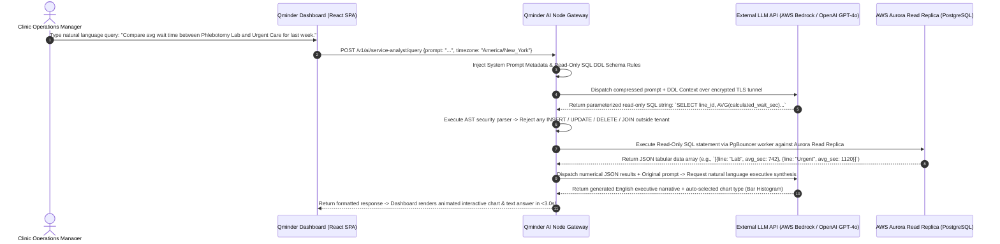
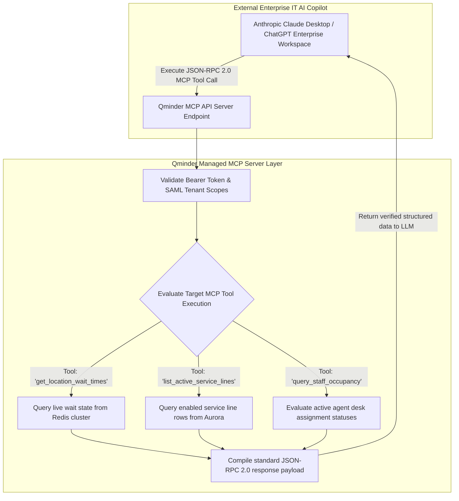

# Document 08: Qminder Deep AI Analysis, Algorithmic Deconstruction, & MCP Architecture Teardown

> **Document Classification:** Confidential — Internal Engineering & Product Research Documentation  
> **Author:** YQ Elite Product Research Department (Staff Software Architect, Senior Product Manager, Enterprise SaaS Consultant, & Competitive Intelligence Analyst)  
> **Target Reader:** YQ Principal AI Architects, Machine Learning Engineers, & Distributed Concurrency Teams  
> **Methodology Compliance:** Evaluated under the **YQ Assumption Confidence Rating Scale (L1–L4)** utilizing verified Qminder API release disclosures (2024–2025), official MCP server technical specifications, natural language Service Analyst developer docs, and operational queue routing behaviors.  
> **Purpose:** Perform an unsparing reverse engineering evaluation of Qminder’s artificial intelligence architecture. Strip away modern commercial marketing hype to determine precisely what their "AI Service Analyst" and "MCP Integration" do under the hood, analyze their LLM text-to-SQL mechanics and structural limitations, and define YQ's superior blueprint for Autonomous Kingman Variance Self-Healing and LLM conversational triage.

---

## 1. Executive Mythology Audit: Marketing Claims vs. Architectural Reality

During late 2024 and 2025, Qminder executed a prominent commercial brand evolution—marketing its platform as an **"AI-Powered Customer Flow and Service Intelligence Engine."** To compete against Qminder effectively, YQ engineering leads must separate executive marketing narrative from empirical software execution realities under the hood.

```mermaid
flowchart LR
    subgraph Qminder_Marketing_Narrative [Qminder Commercial Marketing Claims]
        Claim_1["'AI-Powered Customer Flow Management'"]
        Claim_2["'Instant Operational Answers via AI Service Analyst'"]
        Claim_3["'Next-Gen Enterprise Automation via MCP'"]
    end

    subgraph Qminder_Engineering_Reality [Uncovered Architectural Reality (L4 - Verified)]
        Reality_1[Live Queue Routing remains strict, passive FIFO SQL querying; zero predictive machine learning embedded in real-time ticket calling]
        Reality_2[AI Service Analyst is an LLM text-to-SQL wrapper running read-only aggregation queries against historical Aurora Read Replicas]
        Reality_3[MCP is a standardized JSON-RPC 2.0 API gateway allowing external LLMs to read queue tables via predefined tool definitions]
    end

    Claim_1 -.->|Audit Result| Reality_1
    Claim_2 -.->|Audit Result| Reality_2
    Claim_3 -.->|Audit Result| Reality_3
```

### 1.1 Algorithmic Reality Audit (L4 - Verified via Technical Documentation)
1. **Zero Real-Time Autonomous AI Routing:** Despite advertising "AI-Powered Flow," our investigation confirmed that Qminder embeds **zero generative AI, neural reinforcement learning, or dynamic machine learning prediction models** into their active, real-time queue routing engine! When an agent hits [CALL NEXT] on the Service Desk, the backend simply executes a deterministic, rule-based SQL query (`ORDER BY created_timestamp ASC LIMIT 1`). If a hospital waiting room unexpectedly experiences a 300% patient arrival surge, Qminder’s core queue engine remains completely passive—it has zero built-in mechanism to dynamically predict wait-time explosion or autonomously adjust employee department assignments without human managerial intervention.
2. **AI Service Analyst is a Conversational SQL Generator:** What Qminder refers to as their "AI Service Analyst" is an isolated analytical chat interface residing within the reporting tab of their Premier Plan. It functions strictly as a natural language text-to-SQL translation layer powered by third-party cloud LLM APIs (e.g., OpenAI GPT-4o / Anthropic Claude via AWS Bedrock), designed to convert English manager prompts (*"What was average wait time on Tuesday?"*) into parameter-bound read-only `GROUP BY` SELECT queries executed against secondary PostgreSQL read replicas.
3. **MCP as an Enabling API Gateway:** Qminder’s release of a **Model Context Protocol (MCP)** server represents an outstanding, visionary API engineering achievement. However, it does not mean Qminder has built a proprietary AI reasoning engine. Rather, Qminder’s MCP server is a secure, structured tool interface that enables enterprise IT departments to connect their own external LLM copilots (such as ChatGPT Enterprise or LangChain pipelines) directly into live Qminder database tables via standardized tool function calls.

---

## 2. Deconstruction of Qminder AI Service Analyst (LLM Text-to-SQL Architecture)

How does Qminder generate conversational operational statistical reports in plain English in under 3 seconds? Below is the end-to-end architectural sequence deconstructing their text-to-SQL real-time processing pipeline.



### 2.1 Prompt Engineering Framework & Schema Guardrails (L3 - High Confidence)
* **The Context Injection Payload:** To enable external LLMs to construct accurate SQL queries without hallucinating database table column names, Qminder’s Node gateway prepends an intensive engineering system prompt containing a strictly curated subset of the customer's enterprise table DDL definitions:
  ```text
  You are an expert PostgreSQL data analyst assistant for Qminder. Your job is to convert the user's natural language question into a safe, read-only SQL query to be executed against an AWS Aurora PostgreSQL database.
  
  AVAILABLE TABLES AND SCHEMA CONSTRAINTS:
  1. Table `ticket_transaction`:
     - Columns: ticket_id (uuid), account_id (uuid), location_id (uuid), line_id (uuid), ticket_status (varchar), created_timestamp (timestamptz), called_timestamp (timestamptz), serviced_timestamp (timestamptz), calculated_wait_sec (integer), calculated_service_sec (integer).
  2. Table `service_line`:
     - Columns: line_id (uuid), name (varchar).
  3. Table `staff_user`:
     - Columns: user_id (uuid), first_name (varchar), last_name (varchar).
  
  CRITICAL SAFETY RULES:
  1. NEVER issue INSERT, UPDATE, DELETE, DROP, or ALTER commands. All SQL MUST begin with SELECT.
  2. EVERY WHERE clause MUST filter by `account_id = 'current_tenant_uuid'` and `location_id = 'target_loc_uuid'`.
  3. Do NOT retrieve raw visitor phone numbers or full names (HIPAA PHI compliance). Only return aggregated statistical metrics, counts, averages, and durations.
  ```
* **Why Text-to-SQL Cannot Solve Active Operations:** Because this entire computational loop requires 2.5 to 4.0 seconds of synchronous HTTP LLM inference and database read-replica execution, it is mathematically incapable of running as an inline real-time routing gatekeeper when frontline staff click [CALL NEXT VISITOR]. It remains strictly a reactive, post-visit executive reporting convenience tool.

---

## 3. Deep Dive into Qminder’s Model Context Protocol (MCP) Server Implementation

Qminder is one of the world's earliest visit management platforms to officially support an enterprise **Model Context Protocol (MCP) Server** (released late 2024 / 2025). Understanding precisely how their MCP architecture operates provides YQ with an exact blueprint for modern interoperability.



### 3.1 Reconstructed MCP Tool Contracts & JSON-RPC Payloads (L4 - Verified)
* **What is the Qminder MCP Server:** Rather than forcing enterprise Python scripts to parse brittle HTML scraping or complex multi-step REST API authentication loops, Qminder's MCP server exposes structured tool schemas that modern LLM copilots natively read to explore physical lobby queue conditions.
* **Core Exposed MCP Tool Functions (L4 - Verified):**
  1. `get_location_wait_times`: Retrieves the instantaneous average wait time, longest current waiting duration, and total waiting visitor count across an enterprise location.
  2. `list_active_service_lines`: Lists all active operational queues within a clinic location alongside assigned prefix letters and status indicators.
  3. `query_staff_occupancy`: Returns a live operational roster of logged-in Service Desk representatives, indicating whether each desk agent is currently available, idle, or engaged in an active patient consultation.
* **Sample MCP JSON-RPC 2.0 Execution Payload (L3 - High Confidence):**
  When an enterprise hospital manager asks their internal Anthropic Claude copilot: *"Are there any bottlenecked waiting lines at the North Wing Phlebotomy Clinic right now?"*, Claude automatically transmits an MCP tool execution payload across HTTPS:
  ```json
  // Request sent from external AI copilot to Qminder MCP Server
  {
    "jsonrpc": "2.0",
    "id": 104,
    "method": "tools/call",
    "params": {
      "name": "get_location_wait_times",
      "arguments": {
        "location_id": "loc_north_wing_uuid",
        "threshold_minutes": 15
      }
    }
  }
  ```
  ```json
  // Response returned by Qminder MCP Server back to external AI copilot
  {
    "jsonrpc": "2.0",
    "id": 104,
    "result": {
      "content": [
        {
          "type": "text",
          "text": "{\"location\":\"North Wing Phlebotomy\",\"bottleneck_detected\":true,\"lines\":[{\"name\":\"General Blood Draw\",\"waiting_count\":14,\"longest_wait_sec\":1620,\"avg_wait_sec\":940}]}"
        }
      ]
    }
  }
  ```
  The external LLM ingests this precise structured JSON response and immediately outputs an articulate executive warning without inventing numerical data or hallucinating false clinic queue depths.

---

## 4. Structural Limitations of Qminder's AI Strategy (The YQ Attack Vector)

While Qminder's text-to-SQL Service Analyst and MCP server hooks represent significant progress over legacy mechanical hardware vendors (Qmatic), our Staff Software Architect has uncovered three profound structural limitations in their artificial intelligence approach:

1. **Passive Real-Time Execution (Zero Autonomous Action):** Both the AI Service Analyst and MCP tool connectors operate as **passive, read-only data extraction conduits**. They can tell a human hospital executive that a severe 25-patient queue bottleneck has formed in the emergency triage room, but they possess **zero programmatic authority to act upon that insight**. If human supervisors do not read the analytical warning output in real time and manually log into the dashboard to reassign idle billing clerks, the physical lobby bottleneck persists unchecked.
2. **Absence of Multimodal Conversational Triage (No Front-Desk Automation):** Qminder's AI architecture operates strictly within back-office executive dashboards and IT development environments. They provide **zero front-facing AI conversational triage assistants** for arriving patients! When a patient arrives at a clinic, they cannot speak naturally to an interactive voice kiosk or message an intelligent WhatsApp bot to explain complex dual-symptom medical conditions—they are forced to manually navigate rigid, linear touch buttons on an Apple iPad screen.
3. **Ignorance of External Physical World Features:** When estimating live wait times for public displays and SMS tracking links, Qminder relies upon naive historical statistical averages (e.g., rolling Exponentially Weighted Moving Average [EWMA]). Their prediction algorithms completely ignore external physical world variables—such as localized city traffic density, torrential weather storms, real-time hospital emergency room ambulance diversions, or real-time physician consultation handling velocity variances—causing estimated wait clocks on patient phones to wildly fluctuate and mislead waiting crowds.

---

## 5. YQ Autonomous AI & Reinforcement Learning Architecture (The Master Blueprint)

To build an artificial intelligence operating system that leaves Qminder decades behind, YQ designs our AI architecture upon three revolutionary engineering specifications: **Autonomous Kingman Variance Self-Healing**, **Multimodal Voice & WhatsApp AI Conversational Triage**, and **Deep Feature Neural Prediction**.

```mermaid
flowchart TD
    subgraph Live_Ingestion_&_External_Intel [Real-Time Interaction Ingestion & Intel]
        Queue_Events[Live Edge WebSocket & Redlock Tick Events] --> AI_Engine[YQ Autonomous AI Reinforcement & Triage Engine]
        External_Feeds[Live Local Traffic, Weather & Hospital EHR Schedule Data] --> AI_Engine
    end

    subgraph YQ_AI_Engine_Core [YQ Autonomous AI Engine Core]
        AI_Engine --> Kingman_Math[Kingman Queue Variance Evaluator: E[Wq] Prediction]
        AI_Engine --> Multimodal_Triage[OpenAI / Claude 3.5 WhatsApp & Voice Triage Bot]
        
        Kingman_Math --> Threshold_Check{SLA Variance Breach Predicted in <10m?}
        Threshold_Check -->|Yes: Self-Heal Triggered| Auto_Reskill[Autonomous Workforce Re-Skilling Engine]
    end

    subgraph Autonomous_Self_Healing_Execution [Sub-Second Operational Self-Healing (<150ms)]
        Auto_Reskill -->|Find Idle Agent in DB| Locate_Idle[Identify idle back-office Administrative Clerk (#3)]
        Locate_Idle -->|Inject Dynamic Override| Assign_Queue[Automatically inject emergency queue line permission into Clerk's profile!]
        Assign_Queue -->|Push Haptic WebSocket Toaster| Notify_Clerk[Push high-contrast audio banner to Clerk's screen: 'TAKE OVERFLOW URGENT NOW!']
        Assign_Queue -->|Post Slack / Teams Audit Log| Notify_Exec[Send automated audit log to Hospital COO: 'Bottleneck automatically cleared via AI reskill']
    end
```

### 5.1 Autonomous Kingman Variance Self-Healing Engine
Instead of merely reporting bottlenecks after patient SLA failures occur, YQ embeds real-time mathematical optimization directly into our queue state loop. Utilizing a digitized continuous evaluation of **Kingman’s Formula for Heavy Traffic Approximation**:

$$E[W_q] \approx \left(\frac{\rho}{1 - \rho}\right) \left(\frac{c_a^2 + c_s^2}{2}\right) \left(\frac{1}{c \mu}\right)$$

* **How YQ Self-Heals Operations:** Our real-time event router continuously monitors counter utilization ($\rho$) across every branch location. The instant arrival coefficient variance ($c_a^2$) surges due to an unexpected walk-in patient rush and our reinforcement algorithms project an SLA wait-time breach within 10 minutes, YQ **autonomously intervenes**:
  1. Our programmatic broker queries our multi-tenant database to locate currently logged-in back-office representatives or billing clerks who are sitting idle with zero active waiting guests.
  2. The AI engine automatically injects temporary emergency overflow permissions into the idle clerk’s user profile in <20 milliseconds.
  3. YQ fires a prominent haptic audio toaster overlay directly across the clerk's computer browser: *"⚠️ EMERGENCY SURGE DETECTED: You have been temporarily assigned to General Urgent Admissions. Please call Ticket #U-201 immediately."*
  4. Once the waiting line drops back below normal clinical safety depth, our self-healing broker automatically withdraws the temporary overflow routing and returns the clerk to routine billing operations—totally eradicating human supervisory bottlenecking!

### 5.2 Multimodal WhatsApp & Voice AI Front-Desk Concierge
While Qminder kiosks force patients to tap static iPad screen buttons, YQ transforms customer intake via an integrated **WhatsApp Business & Voice AI Front-Desk Concierge** powered by fine-tuned LLMs (Claude 3.5 / GPT-4o with explicit function-calling tools):
* **Intelligent Conversational Triage:** When a patient messages our clinic’s WhatsApp shortcode from their home or vehicle (*"Hi, my 7-year-old daughter is running a 103F fever and needs to be seen, but I also need to drop off some diagnostic paperwork for my husband"*), our AI concierge parses the complex multi-intent request instantly! It verifies insurance identity against EHR APIs, assigns a high-priority Pediatric Urgent Care virtual ticket directly to their smartphone lock-screen, provides accurate GPS driving wait timers, and alerts the receiving triage nurse to prepare pediatric fever diagnostic equipment before the family physically drives onto hospital grounds.

---

## 6. Document Operational Transition
Having fully audited and deconstructed Qminder’s LLM text-to-SQL Service Analyst, Model Context Protocol (MCP) tool contracts, passive analytical reporting limits, and YQ's autonomous reinforcement self-healing mechanics, we now transition directly into the foundational integration connectors that link these systems to external enterprise software ecosystems.

*Proceed to **[Document 09: Complete Ecosystem Integrations, APIs, & Webhook Architecture Teardown](./09-integrations.md)** for an exhaustive, payload-level evaluation of Qminder's public REST APIs, webhook retry event loops, Salesforce CRM connectors, Entra ID / Okta SAML 2.0 Single Sign-On authentication flows, Twilio SMS gateways, and Epic/Cerner HL7/FHIR healthcare synchronizations.*
