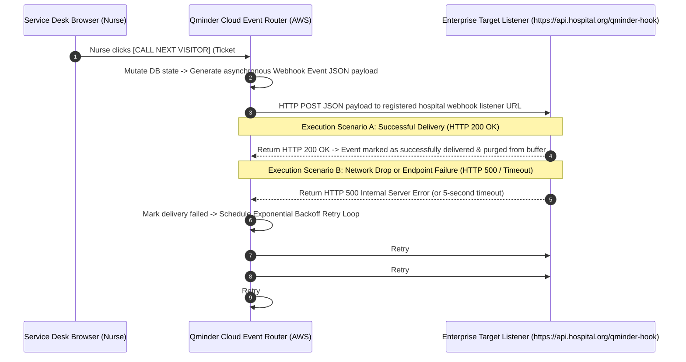
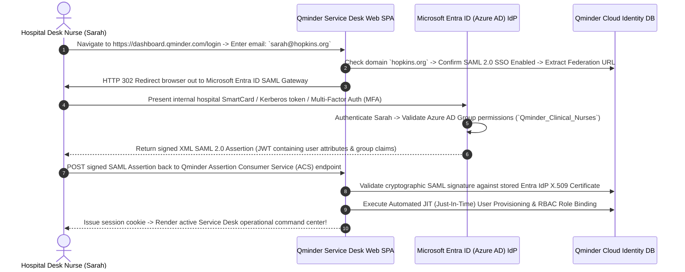

# Document 09: Qminder Complete Ecosystem Integrations, APIs, & Webhook Architecture Teardown

> **Document Classification:** Confidential — Internal Engineering & Product Research Documentation  
> **Author:** YQ Elite Product Research Department (Staff Software Architect, Senior Product Manager, Enterprise SaaS Consultant, & Integration Specialist)  
> **Target Reader:** YQ API Architects, Core Integration Leads, & Enterprise Solutions Engineers  
> **Methodology Compliance:** Evaluated under the **YQ Assumption Confidence Rating Scale (L1–L4)** utilizing verified Qminder REST API specifications (`api.qminder.com/v1`), webhook JSON event schemas, SAML 2.0 Azure AD / Entra ID enterprise gallery integration manuals, and healthcare EHR implementation guidelines.  
> **Purpose:** Perform an exhaustive, payload-level reverse engineering teardown of every third-party integration, REST API endpoint, real-time webhook event, SAML/SSO identity pipeline, CRM synchronization connector, telecom gateway, and EHR synchronization framework within Qminder—providing YQ engineers with the precise API blueprints needed to engineer a superior cloud integration hub.

---

## 1. Developer API Ecosystem & Public REST Contract Deconstruction

Qminder exposes a publicly accessible, stateless HTTP REST API designed to allow custom third-party business intelligence systems, digital signage monitors, and internal CRM databases to interface directly with physical branch queue operations.

```mermaid
flowchart TD
    subgraph Enterprise_Third_Party_Clients [External Integration Clients]
        CRM_App[Salesforce / HubSpot CRM Engine] -->|REST HTTPS / Bearer Token| Gateway[Qminder Cloud REST API Gateway]
        Custom_BI[Enterprise Tableau / PowerBI Cron Scraper] -->|REST HTTPS / Bearer Token| Gateway
        Node_SDK[Official TypeScript / JS Library ('qminder-api')] -->|REST HTTPS / Bearer Token| Gateway
    end

    subgraph Qminder_API_Endpoints [Qminder API URL Routing Hierarchy]
        Gateway --> Legacy_V1[Base Endpoint: `https://api.qminder.com/v1/` (Tickets, Lines, Users, Devices)]
        Gateway --> Modern_Root[New Root Endpoint: `https://api.qminder.com/` (Locations & Custom Forms)]
    end

    subgraph Database_&_Rate_Throttle_Tier [Security, Rate Limiting & Storage]
        Legacy_V1 & Modern_Root --> Throttle[API Rate Limiter: 300 Requests / Minute / API Key]
        Throttle -->|Success: Exec Query| Aurora_DB[(AWS Aurora PostgreSQL Cluster)]
        Throttle -->|Limit Breached| HTTP_429[Return HTTP 429 Too Many Requests (Retry-After Header)]
    end
```

### 1.1 REST API Topology & Authentication Mechanics (L4 - Verified via Developer Docs)
* **Base Endpoint Segmentation:** Noticeably, Qminder operates across a bifurcated REST URL topology:
  1. **Legacy V1 Base URL (`https://api.qminder.com/v1/`):** Houses over 80% of routine operational interactions—including listing waiting tickets (`GET /v1/tickets`), executing ticket calling triggers (`POST /v1/tickets/{id}/call`), and querying location device rosters (`GET /v1/locations/{id}/devices`).
  2. **Modern Root URL (`https://api.qminder.com/` without `/v1/`):** Deployed for newer, modern administrative operations including automated location creation, advanced custom input field definition builders, and Model Context Protocol (MCP) tool configurations.
* **Authentication Security (API Keys):** Authentication relies upon standard HTTP Bearer headers (`Authorization: Bearer <API_KEY>`). Administrators generate production secret tokens directly from their account setup console. Unlike modern granular OAuth 2.0 scopes (which restrict tokens to read-only or department-specific executions), Qminder API keys operate as **global account-wide administrative credentials**—a compromised key grants an external script total access to read all historical visitor records or arbitrarily delete active hospital service lines across all global locations.

### 1.2 Core REST API Payload Schemas (L3 - High Confidence)
To illustrate Qminder's structural developer contract, below is the formal specification for initiating a programmed check-in via their external REST API:

**Endpoint:** `POST https://api.qminder.com/v1/tickets`  
**Required Authentication:** `Authorization: Bearer <qminder_api_key>`  
**Request Header:** `Content-Type: application/json`

```json
// Incoming REST JSON Check-In Payload
{
  "line": "e6a2b890-4c12-4f28-910a-345891a04921",
  "firstName": "Sarah",
  "lastName": "Smith",
  "phoneNumber": "+15550192840",
  "email": "sarah.smith@example.com",
  "source": "API",
  "extraParameters": [
    {
      "fieldId": "f8923a10-2b41-4190-8910-481920a01948",
      "value": "Annual Cardiology Checkup"
    },
    {
      "fieldId": "c9012a48-8120-4b92-8012-9012847a9102",
      "value": "1984-06-14"
    }
  ]
}
```

```json
// Outbound HTTP 201 Created Response Payload
{
  "id": "t_98102a48-1902-4c81-8021-019284910482",
  "number": 104,
  "status": "WAITING",
  "created": "2026-08-04T14:22:08.412Z",
  "line": {
    "id": "e6a2b890-4c12-4f28-910a-345891a04921",
    "name": "Cardiology Consultation",
    "color": "#3B82F6"
  },
  "source": "API",
  "firstName": "Sarah",
  "lastName": "Smith",
  "phoneNumber": "+15550192840",
  "formattedNumber": "C-104"
}
```

### 1.3 API Rate Limiting & Throttling (HTTP 429) (L3 - High Confidence)
* **The Throttling Threshold:** To prevent erratic third-party cron automation scripts or localized denial-of-service loops from saturating their AWS Aurora database worker pools, Qminder enforces an API throttling ceiling of approximately **300 requests per minute per authenticated API key**.
* **The Throttling Fallacy (Why High-Traffic Hospitals Suffer):** When an API client breaches this threshold, Qminder instantaneously blocks execution and returns an `HTTP 429 Too Many Requests` error containing a standard `Retry-After` header string. In large medical centers integrating Qminder directly into high-volume electronic kiosks or real-time patient analytics monitors, simultaneous peak morning check-ins routinely collide with automated hourly data scraper jobs—triggering HTTP 429 lockouts that freeze check-in kiosks across active hospital lobbies for up to 60 seconds!

---

## 2. Real-Time Event Streaming & Webhook Delivery Architecture

While REST APIs allow developers to pull data from Qminder, building real-time responsive integrations (such as flashing an external emergency room indicator lamp or updating a Salesforce CRM ticket record instantaneously when an agent taps Call Next) requires **Webhook Event Subscriptions**.



### 2.1 Supported Webhook Event Types & JSON Schemas (L4 - Verified via Docs)
Qminder enables account developers to register external HTTPS destination URLs directly within their dashboard setup to receive instant POST payloads upon the execution of specific transactional state mutations:
* `ticket.created`: Fired instantly when a patient completes an iPad check-in, submits a mobile QR web form, or joins via API.
* `ticket.called`: Fired precisely when a representative taps [CALL NEXT VISITOR] or [RECALL] on the Service Desk.
* `ticket.serviced`: Fired when a nurse completes a consultation and taps [FINISH & SERVE NEXT].
* `ticket.cancelled`: Fired when a ticket is abandoned via [NO-SHOW] or removed by an administrator.

```json
// Sample Real-Time Webhook JSON Payload Delivered upon 'ticket.called'
{
  "event": "ticket.called",
  "timestamp": "2026-08-04T14:35:12.890Z",
  "account": {
    "id": "acc_johns_hopkins_uuid",
    "name": "Johns Hopkins Outpatient Networks"
  },
  "location": {
    "id": "loc_main_hub_uuid",
    "name": "Main Cardiology Atrium"
  },
  "ticket": {
    "id": "t_98102a48-1902-4c81-8021-019284910482",
    "number": 104,
    "formattedNumber": "C-104",
    "status": "CALLED",
    "created": "2026-08-04T14:22:08.412Z",
    "called": "2026-08-04T14:35:12.845Z",
    "line": {
      "id": "e6a2b890-4c12-4f28-910a-345891a04921",
      "name": "Cardiology Consultation"
    },
    "user": {
      "id": "usr_nurse_jenkins_uuid",
      "firstName": "David",
      "lastName": "Jenkins",
      "email": "djenkins@hopkins.org"
    },
    "desk": {
      "id": "desk_room_4_uuid",
      "name": "Room 4 - Exam Hub"
    },
    "visitor": {
      "firstName": "Sarah",
      "lastName": "Smith",
      "phoneNumber": "+15550192840",
      "extraParameters": [
        { "title": "Reason for Visit", "value": "Annual Cardiology Checkup" },
        { "title": "Date of Birth", "value": "1984-06-14" }
      ]
    }
  }
}
```

### 2.2 Webhook Delivery Resilience & Retry Limits (L3 - High Confidence)
* **The Exponential Backoff Limit:** If a client's receiving webhook server is undergoing database patching or fails to respond within a 5-second timeout window (returning HTTP 500, 502, or 504 errors), Qminder places the event into an automated exponential backoff retry buffer. The cloud router re-attempts delivery after **1 minute, 5 minutes, and 30 minutes**.
* **The Dead Letter Packet Loss Deficit:** If the client server remains unresponsive past the third retry attempt (30 minutes), Qminder **silently drops the event payload from its temporary operational cache** without providing an internal dead-letter queue (DLQ) retention vault or manual "Replay Webhooks" recovery button inside the developer dashboard! High-security hospitals that suffer temporary firewall connectivity drops irreversibly lose transactional check-in reconciliation records—an unacceptable engineering blind spot for enterprise patient tracking software.

---

## 3. Enterprise Identity, Authentication, & SAML 2.0 / Entra ID (Azure AD) SSO

For large medical centers and government municipal networks employing thousands of distributed employees, managing personal email passwords for every desk receptionist creates acute security and onboarding friction. To serve Tier-1 enterprises, Qminder integrates standard SAML 2.0 Single Sign-On (SSO) architecture.



### 3.1 Microsoft Entra ID (Azure AD), Okta & SAML 2.0 Configuration (L4 - Verified)
* **Official Microsoft Entra Gallery Application:** Qminder holds a prominent position within the official Microsoft Entra ID (formerly Azure Active Directory) Enterprise Application Gallery. IT security managers can add Qminder to their enterprise identity hub with a single click, entering their Microsoft Entra Identifier and App Federation Metadata URL into Qminder’s Account Integrations panel.
* **Just-In-Time (JIT) Provisioning & RBAC Mapping:** When a newly hired hospital receptionist authenticates via Microsoft Entra ID for the first time, Qminder’s assertion consumer service evaluates incoming SAML attribute statements (`givenname`, `surname`, `email`, `memberOf`). If the user does not exist in PostgreSQL, Qminder automatically provisions a new `staff_user` record and assigns appropriate Role-Based Access Control (RBAC) departmental permissions—ensuring new staff access active service desk screens without manual administrator intervention.
* **The SCIM 2.0 Automated Deprovisioning Deficit (L3 - High Confidence):** While Qminder handles standard SAML 2.0 authentication brilliantly, their enterprise identity tier currently lacks native support for the **System for Cross-domain Identity Management (SCIM 2.0) automated deprovisioning API protocol**! When a bank employee is terminated or a hospital nurse leaves the healthcare system, disabling their user profile inside Microsoft Entra ID stops them from logging in *in the future*, but it does **not automatically terminate active, previously authenticated JWT session cookies** currently live within Qminder browser tabs! To instantly purge terminated employees from active operational rosters, IT security teams are forced to write custom scripts calling Qminder’s REST `DELETE /v1/users/{id}` API endpoint—a major enterprise security friction point.

---

## 4. CRM, EHR Healthcare Sync, & Telecom Gateway Connectors

Beyond core identity and developer APIs, Qminder maintains specialized turn-key integration pipelines connecting physical lobby waitlists directly into industry-standard business platforms:

| Target Integration & Platform Type | Core Technical Architecture & Data Workflow | Operational Value & Enterprise Utility | Architectural Limitations & Incumbent Friction |
| :--- | :--- | :--- | :--- |
| **Salesforce CRM & HubSpot** *(CRM & Sales Operations)* | Uses bidirectional REST API and Webhook event pipelines to link Qminder check-ins directly into Salesforce customer Contact records and Support Case objects. | When a banking customer checks in on an iPad, Qminder searches Salesforce by phone number, pulls high-net-worth VIP status tags, and fires an instant screen-pop to the desk officer's computer monitor. | Custom mapping requires expensive professional setup services or relying on external middleware connectors like Zapier and Make, incurring extra multi-tier per-action cloud compute billing! |
| **Epic Systems & Oracle Cerner** *(Healthcare EHR Systems)* | Communicates via secure HL7 v2 messaging feeds and FHIR (Fast Healthcare Interoperability Resources) middleware bridges under HIPAA BAA protection. | When a patient inputs their phone number on a hospital iPad kiosk, Qminder reconcile identity against Epic scheduling tables, automatically verifying appointment arrival without exposing PHI to waiting room crowds. | **Not a Self-Serve Feature:** Requires purchasing custom-quoted Enterprise Plan contracts ($18,000 to $45,000+/yr) and undergoing rigorous multi-week hospital interface implementation projects. |
| **Twilio & Infobip** *(Global SMS Telecom Gateway)* | Relies upon outbound REST HTTP APIs to dispatch automated transactional SMS waitlist links and route interactive two-way SMS conversations. | Enables patients to wait outside in parking cars or cafeterias while tracking real-time queue position web links on their smartphones. | **Hard-Gated behind $869/Mo Business Tier:** Single locations paying $429/mo are strictly blocked from sending text alerts; plain-text SMS browser links freeze updates when mobile screens sleep. |
| **Zapier & No-Code Webhooks** *(Automated Workflow Connectors)* | Maintains an official verified Zapier application connector exposing automated triggers (`New Ticket`, `Ticket Called`) and executable actions (`Create Ticket`). | Enables municipal clerks and university registrars to connect Qminder lobby data directly into over 5,000 standard SaaS productivity tools (Google Sheets, Slack, Airtable) without writing custom API scripts. | Zapier polling delays introduced during high-traffic surges can create noticeable 5-to-15 minute sync lagging across connected spreadsheet tracking ledgers! |

---

## 5. YQ Leapfrog API & Webhook Blueprint: GraphQL, OpenTelemetry, & Real-Time SSE

To deliver an integration ecosystem that surpasses Qminder in enterprise RFPs, YQ rebuilds our API, Webhook, and Identity architecture around modern engineering specifications:

1. **GraphQL Unified Endpoint & Granular OAuth 2.0 Scopes:** Instead of forcing external developers to traverse bifurcated REST root and `/v1/` endpoints, YQ exposes a singular, highly efficient **GraphQL Endpoint (`https://api.yq.com/graphql`)** alongside standard REST interfaces. Developers query the exact relational fields they require in a single payload without over-fetching. Furthermore, all YQ API keys operate under granular **OAuth 2.0 Access Scopes**—ensuring external marketing digital signage scripts can read active wait times without ever gaining administrative authority to modify customer PHI rows or delete branch service lines.
2. **Real-Time Server-Sent Events (SSE) & Dead-Letter Webhook Vaults:** YQ eliminates silent webhook packet loss by providing an immutable **Dead-Letter Webhook Vault (DLQ)** directly within our user Command Palette dashboard. If an enterprise hospital server goes offline for 48 hours, every unconfirmed webhook event is securely encrypted in AWS S3 / Cloudflare Object Storage; administrators simply press **[REPLAY FAILED EVENTS]** upon restoring server connectivity to execute immediate reconciliation without losing a single transaction. Furthermore, for client web integrations, YQ natively streams real-time state updates over **Server-Sent Events (SSE / HTTP/2)**, slashing battery usage and firewall connection blocks compared to heavy WebSockets!
3. **Native SCIM 2.0 Instant Token Revocation:** YQ supports full **SCIM 2.0 automatic lifecycle deprovisioning** natively. When an employee profile is disabled inside Microsoft Entra ID or Okta, an automated SCIM push instantly terminates all active JWT bearer session cookies across every open browser tab globally in **<50 milliseconds**—guaranteeing military-grade access termination compliance for high-security hospital and financial institutions.

---

## 6. Document Operational Transition
Having fully audited Qminder’s public REST API payloads, rate throttling limits (HTTP 429), webhook exponential backoff drops, SAML 2.0 Single Sign-On pipelines, and Epic EHR middleware connectors, we now synthesize the entirety of our reverse engineering findings into a strategic master evaluation.

*Proceed to **[Document 10: Master Strategic Synthesis, SWOT Analysis, & YQ Leapfrog Roadmap](./10-strengths-weaknesses.md)** for our final executive evaluation: detailing what Qminder does brilliantly, exposing their structural vulnerabilities, mapping out a definitive 9-dimension comparative benchmarking matrix against YQ, and providing our founders with the execution roadmap to disrupt their accounts.*
