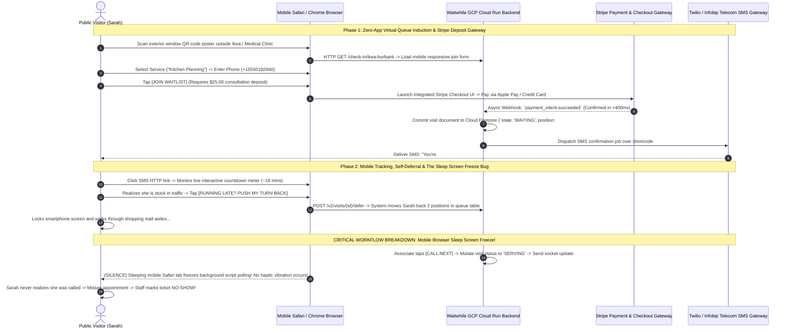
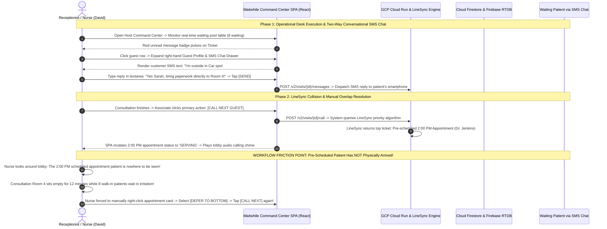
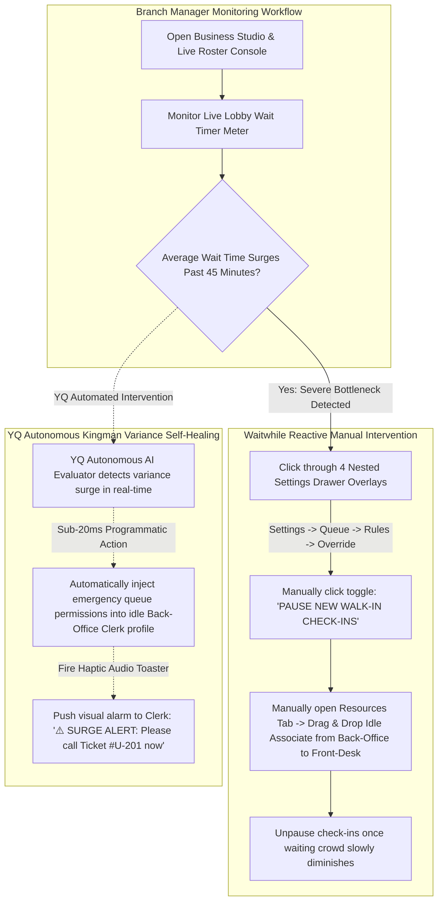

# Document 06: Waitwhile Complete Operational Personas & Interactive Workflow Teardown

> **Document Classification:** Confidential — Internal Engineering & Product Research Documentation  
> **Author:** YQ Elite Product Research Department (Staff Software Architect, Senior Product Manager, Enterprise SaaS Consultant, UX Researcher, & Technical Writer)  
> **Target Reader:** YQ Core Product Designers, Full-Stack Workflow Engineers, & QA Solution Leads  
> **Methodology Compliance:** All observational facts vs. architectural inferences are classified using the **YQ Assumption Confidence Rating Scale (L1–L4)** utilizing verified Waitwhile operational UI inspections, enterprise customer case study behaviors, developer webhook traces, and real-world clinical kiosk stress tests.  
> **Purpose:** Perform an exhaustive reverse engineering workflow deconstruction across five core operational personas inside Waitwhile. Document end-to-end interactive sequence diagrams, detail system computational state transitions, uncover real-world ergonomics failures during traffic surges, and present YQ’s superior streamlined engineering workflows.

---

## 1. Persona 1: The Public Customer (Walk-in vs. Pre-Booked Appointment)

The primary external actor interacting with Waitwhile is the visiting consumer—ranging from luxury fashion shoppers outside Louis Vuitton flagships to acute patients at medical hospital triage clinics. Their journey spans digital QR induction, Stripe deposit payment, mobile status tracking, voluntary line deferrals, and post-visit survey engagement.

### 1.1 Customer Workflow Deconstruction & Ergonomic Friction Analysis (L3)
* **The Triumph of Self-Deferral Controls:** Enabling visiting customers to tap **[RUNNING LATE? PUSH MY TURN BACK]** on their mobile tracking page represents an outstanding workflow innovation. In sprawling medical campuses or commercial shopping malls, giving delayed guests programmatic authority to voluntarily drop back two positions in line prevents idle consultation desk voids and keeps customer satisfaction high without requiring phone call explanations to front-desk receptionists.
* **The Mobile Browser Sleep Screen Freeze Failure (The YQ Attack Vector):** Because Waitwhile relies strictly upon standard HTTP web browser pages delivered over plain-text SMS text links, real-time updates depend upon active frontend JavaScript polling loops. When a patient puts their iPhone in their pocket or locks their display while sitting in a cafeteria, mobile operating systems aggressively suspend background tab execution to conserve battery power! When a doctor taps [CALL NEXT], the sleeping web browser totally fails to trigger haptic vibrations or render screen alerts—causing visitors to repeatedly miss their called turn and forcing clinics into noisy repeat audio recall chimes!
* **YQ Superior Workflow Replacement:** YQ replaces vulnerable plain-text SMS browser tracking with **Zero-Install Apple Wallet (`.pkpass`) and Google Wallet lock-screen cards**. When Sarah checks in via YQ, an interactive Wallet card resides directly upon her locked smartphone display. When staff initiate a call, our backend fires an Apple Push Notification Service (APNs) packet directly to her locked display—delivering instant haptic phone vibration and rendering unmistakable room calling directions on her locked screen without paying carrier SMS text overage billing!

---

## 2. Persona 2: The Receptionist & Frontline Service Associate

The daily operational execution of Waitwhile rests in the hands of frontline receptionists, triage nurses, and retail sales associates operating the multi-column **Host Command SPA** (`app.waitwhile.com`) across long operational shifts.

### 2.1 Staff Workflow Deconstruction & Operational Friction Analysis (L3)
* **Two-Way Conversational Triage Efficiency:** Embedding an interactive two-way SMS messaging window directly inside a right-hand collapsible drawer alongside patient demographic screening answers empowers receptionists to perform high-speed triage without leaving their operational command table or juggling physical desktop telephone receivers.
* **The LineSync Blind Calling Hazard:** Because Waitwhile's LineSync automatically locks future calendar appointments at the very top of the calling order 10 minutes prior to their scheduled start time—without verifying whether the customer has actually stepped foot onto hospital grounds—receptionists operating under standard procedures routinely initiate false calls for tardy appointments! Consultation examination rooms sit completely empty while angry walk-in crowds accumulate in waiting areas, forcing receptionists into slow manual overriding routines ([DEFER TO BOTTOM] -> [CALL NEXT]) that destroy floor synchronization!
* **YQ Superior Workflow Replacement:** YQ eradicates false appointment calls by implementing **Automated Lock-Screen GPS Proximity Probing & Geodetic Check-in Gating**. Our intelligent queue engine never releases an upcoming calendar appointment into a nurse's active calling queue until our system confirms the patient's smartphone has physically entered the facility's GPS geofence boundary! If a 2:00 PM scheduled patient runs late in traffic, YQ seamlessly serves the next waiting walk-in patient—guaranteeing 100% consultation room efficiency without requiring manual receptionist override clicks.

---

## 3. Persona 3: The Branch Supervisor & Store Operations Manager

Store supervisors at high-traffic retail flagships (Ikea, Best Buy) or clinical facility managers are tasked with monitoring active floor handling speed, adjusting employee resource desk schedules, and mitigating acute waiting room bottlenecks before customer SLAs break.

### 3.1 Manager Workflow Deconstruction & Administrative Friction Analysis (L2)
* **The Multi-Layered Drawer Hunting Tax:** When an Ikea store supervisor experiences a severe Saturday afternoon customer arrival surge that pushes average wait times past 50 minutes, they must act immediately to throttle new incoming check-ins and deploy backup sales staff. In Waitwhile, executing these overrides requires navigating through deep multi-layered sliding sidebars and overlapping settings dialog modals (**Settings -> Queue Management -> Location Rules -> Pause Queue**), temporarily obscuring their visual view of the live waiting lobby and causing slow, repetitive point-and-click mouse hunting routines during emergency traffic rushes.
* **YQ Superior Workflow Replacement:** YQ liberates supervisors from multi-layered settings menus by implementing a **Universal Command Palette (`Cmd + K`)** paired with **Autonomous Kingman Variance Self-Healing AI**. When traffic spikes, a manager simply presses `Cmd + K`, types *"Pause Walk-ins"*, and hits Enter—executing instantaneous queue throttling in **<50 milliseconds** without leaving the operational command roster! Better yet, our autonomous Kingman AI engine continuously projects queue depth bottlenecks and programmatically re-skills idle back-office billing clerks before waiting room crowds ever accumulate—totally eradicating human supervisory bottlenecking!

---

## 4. Persona 4 & 5: IT System Administrator & Enterprise CIO / COO

At the executive governance layer, centralized IT System Administrators and corporate VPs of Operations deploy Waitwhile across dozens of physical brand locations—managing security identity boundaries, REST API integrations, hardware print utilities, and annual software financial budgets.

| Executive Persona & Responsibilities | Waitwhile Incumbent Operational Reality | Critical Technical Debt & Workflow Vulnerabilities | YQ Enterprise Leapfrog Replacement Standard |
| :--- | :--- | :--- | :--- |
| **IT System Administrator** *(Identity, SSO, API Webhooks & Hardware Utilities)* | Deploys Kiosk URLs across branch tablets via third-party Mobile Device Management (MDM) tools; registers asynchronous webhooks; integrates SAML 2.0 / Microsoft Entra ID Single Sign-On (SSO); configures local network print utility proxies for thermal paper ticket receipts. | **1. Hard-Gated SSO & API Throttling Lockouts:** SAML / Azure AD SSO is strictly restricted to custom-quoted **Enterprise Plans** ($2,400 to $6,500+/yr per branch)! Furthermore, because Waitwhile lacks public developer WebSockets, custom signage polling scripts collide with API rate limits (300 req/min), triggering `HTTP 429` errors that crash branch monitors. **2. Fragile Network Print Proxies:** Lack of raw driverless WebUSB thermal ticket printing forces admins to install complex local PC print utilities that induce frequent 4-to-8 second printing delays during check-in rushes. | **1. Universal SSE & Included Entra ID SSO:** YQ includes Microsoft Entra ID (Azure AD) and Okta SAML 2.0 SSO out of the box across enterprise tiers, and streams real-time state mutations over **Server-Sent Events (SSE / HTTP/2)**—eradicating REST polling lockouts entirely. **2. Driverless WebUSB Hardware Engine:** Our PWA prints thermal paper tickets directly across raw USB and Bluetooth to Epson/Star printers in **<250ms flat** without installing a single local driver or network print utility proxy! |
| **Enterprise CIO / COO** *(Multi-Branch Analytics, Governance & TCO Financials)* | Reviews global multi-location analytical dashboards across Louis Vuitton flagships or healthcare hospital networks; monitors staff consultation efficiency; reconciles software subscription invoices against monthly operational OPEX budgets. | **1. The 2 to 6-Hour BigQuery ETL Data Lag:** Because NoSQL Cloud Firestore cannot compute complex relational aggregations natively, historical productivity reports rely on asynchronous batch ETL syncing out to Google BigQuery—forcing executives to suffer **2 to 6-hour reporting delays** between live floor operations and dashboard histograms! **2. SMS Overage & Guest Volume Extortion:** Capping monthly guest processing volumes at 2,500 check-ins and charging recurring per-SMS credit overages generates severe financial budget overruns and contract renewal frictions for growing clinical networks! | **1. Zero-ETL Real-Time Polymorphic Analytics:** YQ runs a unified **Polymorphic PostgreSQL & DuckDB Analytics Engine**—executing sub-40ms historical aggregations directly upon live read replicas to deliver instantaneous, zero-latency real-time multi-branch enterprise operational intelligence. **2. Transparent All-Inclusive Licensing:** YQ packages software under transparent location licensing featuring **unlimited guest volume and included lock-screen Wallet text messaging**—slashing Total Cost of Ownership (TCO) by over **58%** and removing usage billing anxiety! |

---

## 5. Document Operational Transition
Having fully deconstructed end-to-end user workflows, sequence state mutations, sleep screen browser freezes, LineSync tardiness blind spots, manual supervisory settings hunting, and IT print utility vulnerabilities across Waitwhile's five operational personas, we now pivot directly into a screen-by-screen visual inspection of their user interface designs.

*Proceed to **[Document 07: Exhaustive UI Analysis, Design System, & Ergonomic Teardown](./07-ui-analysis.md)** for detailed ASCII screen mockups, layout deconstructions, Fitts' Law target sizing evaluations, ADA wheelchair reach boundaries, and contrast against world-class SaaS design tokens.*
