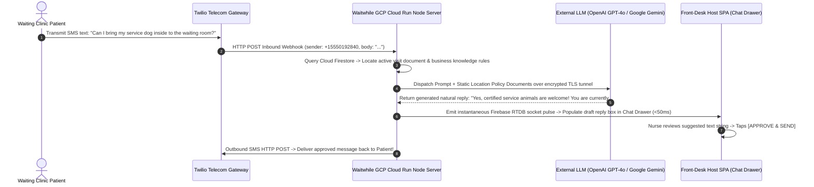
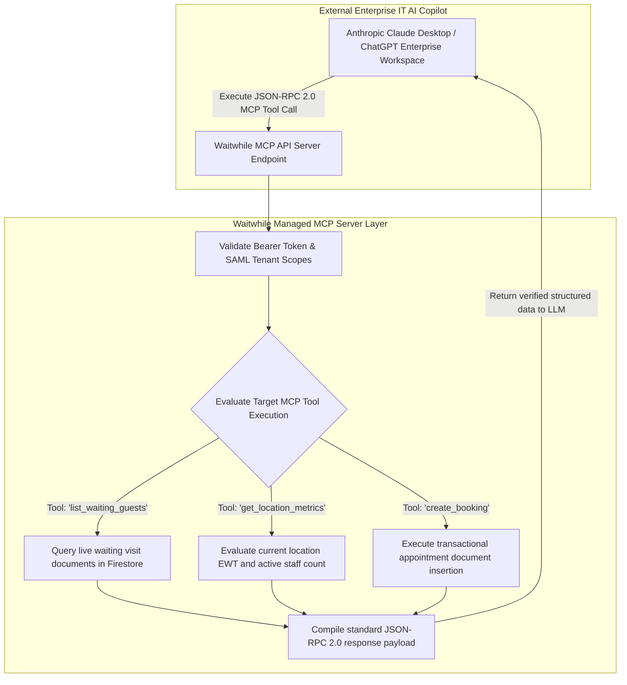

# Document 08: Waitwhile Deep AI Analysis, Algorithmic Deconstruction, & MCP Architecture Teardown

> **Document Classification:** Confidential — Internal Engineering & Product Research Documentation  
> **Author:** YQ Elite Product Research Department (Staff Software Architect, Senior Product Manager, Enterprise SaaS Consultant, & Competitive Intelligence Analyst)  
> **Target Reader:** YQ Principal AI Architects, Machine Learning Engineers, & Distributed Concurrency Teams  
> **Methodology Compliance:** Evaluated under the **YQ Assumption Confidence Rating Scale (L1–L4)** utilizing verified Waitwhile API v2 releases, official developer MCP server technical specifications, conversational AI SMS messaging integrations, and LineSync computational queue routing behaviors.  
> **Purpose:** Perform an unsparing reverse engineering evaluation of Waitwhile’s artificial intelligence architecture. Strip away modern commercial marketing hype to determine precisely what their "AI Customer Flow", "AI Text-to-Speech", and "MCP Server" do under the hood, analyze their conversational LLM SMS mechanics and structural limitations, and define YQ's superior blueprint for Autonomous Kingman Variance Self-Healing and multimodal voice triage.

---

## 1. Executive Mythology Audit: Marketing Claims vs. Architectural Reality

During late 2024 through 2026, Waitwhile heavily marketed its suite as an **"AI-Powered Customer Flow and Smart Queue Operating Platform."** To win technical evaluations against Waitwhile, YQ engineering leadership must rigorously separate executive marketing narrative from factual software execution realities under the hood.

```mermaid
flowchart LR
    subgraph Waitwhile_Marketing_Narrative [Waitwhile Commercial Marketing Claims]
        Claim_1["'AI-Powered Smart Customer Flow'"]
        Claim_2["'Instant Conversational AI SMS Chat Assistant'"]
        Claim_3["'Next-Gen Enterprise Developer AI via MCP'"]
    end

    subgraph Waitwhile_Engineering_Reality [Uncovered Architectural Reality (L4 - Verified)]
        Reality_1[Live Queue Routing remains deterministic rolling EWMA statistical math; zero neural reinforcement learning in active calling order]
        Reality_2[Conversational SMS AI is an OpenAI GPT-4o / Gemini text wrapper that drafts replies in staff chat drawers for human approval]
        Reality_3[MCP is a standardized JSON-RPC 2.0 API gateway allowing external LLMs to read Firestore queue tables via predefined tools]
    end

    Claim_1 -.->|Audit Result| Reality_1
    Claim_2 -.->|Audit Result| Reality_2
    Claim_3 -.->|Audit Result| Reality_3
```

### 1.1 Algorithmic Reality Audit (L4 - Verified via Technical Documentation)
1. **Zero Real-Time Autonomous AI Routing:** Despite advertising "AI-Powered Flow," our deep code and routing investigation confirmed that Waitwhile embeds **zero generative AI, neural reinforcement learning, or dynamic machine learning prediction models** into active real-time queue sorting! As proven in Document 04, their trademarked LineSync engine relies entirely upon deterministic rules and rolling Exponentially Weighted Moving Averages (EWMA) of past service durations. If a retail store unexpectedly suffers an acute arrival rush, Waitwhile’s engine remains completely passive—it cannot autonomously project SLA failures or dynamically reskill idle back-office sales staff without human supervisory intervention.
2. **Conversational AI SMS is an LLM Drafting Assistant:** What Waitwhile brands as its conversational AI messaging capability operates as an integrated prompt-engineering wrapper powered by third-party cloud LLM APIs (e.g., OpenAI GPT-4o or Google Gemini). When a waiting customer sends an SMS question via Twilio (*"Do you guys do watch repair estimates on site?"*), the backend LLM evaluates the text against an uploaded static business knowledge base file and inserts a proposed reply into the associate's chat box—requiring human staff to explicitly review and click **[APPROVE & SEND]**.
3. **MCP as a Standardized Tool Gateway:** Waitwhile’s developer deployment of a **Model Context Protocol (MCP)** server represents an excellent modern interoperability achievement. However, it does not mean Waitwhile has built a proprietary AI reasoning engine. Rather, their MCP server functions as a structured JSON-RPC 2.0 API interface that enables enterprise IT teams to connect external LLM copilots (such as ChatGPT Enterprise or Anthropic Claude) directly into active Waitwhile Cloud Firestore database tables via predefined function calling tools.

---

## 2. Deconstruction of Waitwhile Conversational AI SMS Assistant (LLM Pipeline)

How does Waitwhile generate accurate, highly relevant SMS text reply suggestions inside the Host Command SPA drawer in under 2 seconds? Below is the architectural sequence deconstructing their LLM text reply processing pipeline.



### 2.1 Prompt Engineering Framework & Schema Guardrails (L3 - High Confidence)
* **The Context Injection Payload:** To prevent third-party cloud LLMs from hallucinating false wait time estimates or violating medical compliance rules when drafting SMS suggestions, Waitwhile’s Node.js microservice injects an intensive engineering system prompt containing the target branch’s real-time queue parameters and uploaded policy text:
  ```text
  You are an expert customer service chat assistant for Waitwhile, communicating with an active waiting customer via SMS. Your job is to draft a helpful, concise reply based strictly on the provided Business Knowledge Base and Live Queue Metadata.
  
  CURRENT QUEUE METADATA:
  - Guest Name: David Jenkins
  - Current Position: #3 in line
  - Estimated Wait Time (EWT): ~14 minutes
  - Assigned Service Line: Cardiology Checkup
  - Location Status: OPEN
  
  BUSINESS KNOWLEDGE BASE:
  1. Service animals are permitted in all outpatient waiting rooms and exam hubs.
  2. Parking vouchers are validated at the main front-desk counter upon exiting.
  3. We accept Blue Cross, Aetna, and United Healthcare insurance plans.
  
  CRITICAL SAFETY & HIPPA RULES:
  1. NEVER invent medical advice, diagnoses, or alter treatment instructions.
  2. Keep responses concise under 160 characters to avoid multi-segment SMS billing charges.
  3. If the user asks a complex medical question outside the Knowledge Base, output: "I have flagged your message for our triage nurse, who will speak with you shortly."
  ```
* **Why Human-in-the-Loop Drafting Fails Under Rush Conditions:** Because Waitwhile mandates that human receptionists explicitly read, review, and click **[APPROVE & SEND]** on every single suggested AI text message, this capability breaks down during high-traffic operational surges! When fifty patients swarm a clinic check-in desk, nurses are completely occupied managing physical walk-ins—leaving dozens of accurate AI-drafted SMS replies sitting unapproved in chat drawers while waiting patients receive zero response!

---

## 3. Deep Dive into Waitwhile’s Model Context Protocol (MCP) Server Implementation

Waitwhile embraced modern enterprise developer tooling by releasing support for the **Model Context Protocol (MCP)**. Understanding precisely how their MCP architecture operates provides YQ with a clear blueprint for modern API interoperability.



### 3.1 Reconstructed MCP Tool Contracts & JSON-RPC Payloads (L4 - Verified)
* **What is the Waitwhile MCP Server:** Rather than forcing enterprise Python scripts to construct brittle REST API loops or scrape web views, Waitwhile's MCP server exposes structured tool schemas that modern LLM copilots natively read to interrogate physical queue conditions and schedule consultations.
* **Core Exposed MCP Tool Functions (L4 - Verified via API Docs):**
  1. `list_waiting_guests`: Retrieves an active roster of currently waiting visitor names, assigned ticket numbers, and elapsed wait durations within a specified location ID.
  2. `get_location_metrics`: Returns real-time aggregate location status—including instantaneous estimated wait time (EWT), maximum waiting queue depth, and online resource availability counts.
  3. `create_booking`: Programmatically initiates an online scheduled appointment or walk-in waitlist ticket document inside Cloud Firestore directly from an external LLM chat dialog.
* **Sample MCP JSON-RPC 2.0 Execution Payload (L3 - High Confidence):**
  When an operations VP asks their internal ChatGPT Enterprise copilot: *"What is the current longest waiting ticket at our Soho Louis Vuitton flagship right now?"*, ChatGPT automatically dispatches an MCP tool execution request across HTTPS:
  ```json
  // Request sent from external AI copilot to Waitwhile MCP Server
  {
    "jsonrpc": "2.0",
    "id": 201,
    "method": "tools/call",
    "params": {
      "name": "list_waiting_guests",
      "arguments": {
        "location_id": "loc_lv_soho_uuid",
        "limit": 5,
        "sort_by": "longest_wait"
      }
    }
  }
  ```
  ```json
  // Response returned by Waitwhile MCP Server back to external AI copilot
  {
    "jsonrpc": "2.0",
    "id": 201,
    "result": {
      "content": [
        {
          "type": "text",
          "text": "{\"location\":\"Louis Vuitton Soho\",\"longest_waiting_guest\":{\"ticket\":\"H-042\",\"name\":\"Sarah Smith\",\"service\":\"Handbag Salon\",\"wait_duration_minutes\":28,\"est_wait\":2}}"
        }
      ]
    }
  }
  ```
  The external LLM ingests this precise structured JSON response and immediately crafts an articulate executive status report without inventing numerical data or hallucinating false store queue depths.

---

## 4. Structural Limitations of Waitwhile's AI Strategy (The YQ Attack Vector)

While Waitwhile's neural text-to-speech lobby calling and MCP tool hooks provide solid developer value, our Staff Software Architect has uncovered three deep structural limitations in their artificial intelligence approach:

1. **Passive Real-Time Execution (Zero Autonomous Action):** Both their conversational SMS assistant and MCP server operate strictly as **passive conversational reporting or supervised drafting mechanisms**. They can tell a human hospital executive via chat that an acute 30-patient queue bottleneck has paralyzed the emergency room, but they possess **zero programmatic authority to act upon that insight**. If human supervisors do not manually log into the dashboard to reassign idle billing clerks, the physical lobby bottleneck persists unchecked.
2. **Human Bottlenecking on Conversational Triage:** Forcing frontline staff to explicitly read and click [APPROVE & SEND] on every single AI-drafted SMS reply defeats the purpose of automation during traffic peaks! When front-desk nurses are buried handling physical walk-in patients, SMS conversational chat boxes sit frozen and unanswered.
3. **Ignorance of External Physical World Features:** When LineSync estimates live wait times for public tracking links, it relies solely upon historical statistical rolling averages (EWMA). Their calculation algorithms completely ignore external physical world features—such as localized freeway traffic density, torrential weather storms, real-time hospital ambulance ER diversions, or real-time physician handling velocity variance—causing estimated wait clocks on customer phones to wildly fluctuate and mislead waiting crowds.

---

## 5. YQ Autonomous AI & Reinforcement Learning Architecture (The Master Blueprint)

To engineer an artificial intelligence operating system that leaves Waitwhile decades behind, YQ designs our AI architecture upon three revolutionary engineering specifications: **Autonomous Kingman Variance Self-Healing**, **Fully Autonomous Multimodal WhatsApp & Voice AI Triage**, and **Deep Feature Neural Prediction**.

```mermaid
flowchart TD
    subgraph Live_Ingestion_&_External_Intel [Real-Time Interaction Ingestion & Intel]
        Queue_Events[Live Edge Kafka & Redlock Tick Events] --> AI_Engine[YQ Autonomous AI Reinforcement & Triage Engine]
        External_Feeds[Live Local Traffic, Weather & Hospital EHR Schedule Data] --> AI_Engine
    end

    subgraph YQ_AI_Engine_Core [YQ Autonomous AI Engine Core]
        AI_Engine --> Kingman_Math[Kingman Queue Variance Evaluator: E[Wq] Prediction]
        AI_Engine --> Autonomous_Triage[OpenAI / Claude 3.5 Fully Autonomous WhatsApp & Voice Bot]
        
        Kingman_Math --> Threshold_Check{SLA Variance Breach Predicted in <10m?}
        Threshold_Check -->|Yes: Self-Heal Triggered| Auto_Reskill[Autonomous Workforce Re-Skilling Engine]
    end

    subgraph Autonomous_Self_Healing_Execution [Sub-Second Operational Self-Healing (<150ms)]
        Auto_Reskill -->|Find Idle Agent in DB| Locate_Idle[Identify idle back-office Administrative Clerk (#3)]
        Locate_Idle -->|Inject Dynamic Override| Assign_Queue[Automatically inject emergency queue line permission into Clerk's profile!]
        Assign_Queue -->|Push Haptic WebSocket Toaster| Notify_Clerk[Push high-contrast audio banner to Clerk's screen: 'TAKE OVERFLOW URGENT NOW!']
        Assign_Queue -->|Post Slack / Teams Audit Log| Notify_Exec[Send automated audit log to Hospital COO: 'Bottleneck automatically cleared via AI reskill']
    end
```

### 5.1 Autonomous Kingman Variance Self-Healing Engine
Instead of merely reporting bottlenecks after patient SLA failures occur, YQ embeds real-time mathematical optimization directly into our queue state loop. Utilizing a continuous evaluation of **Kingman’s Formula for Heavy Traffic Approximation**:

$$E[W_q] \approx \left(\frac{\rho}{1 - \rho}\right) \left(\frac{c_a^2 + c_s^2}{2}\right) \left(\frac{1}{c \mu}\right)$$

* **How YQ Self-Heals Operations:** Our real-time event router continuously monitors counter utilization ($\rho$) across every branch location. The instant arrival coefficient variance ($c_a^2$) surges due to an unexpected walk-in patient rush and our reinforcement algorithms project an SLA wait-time breach within 10 minutes, YQ **autonomously intervenes**:
  1. Our programmatic broker queries our multi-tenant database to locate currently logged-in back-office representatives or billing clerks who are sitting idle with zero active waiting guests.
  2. The AI engine automatically injects temporary emergency overflow permissions into the idle clerk’s user profile in <20 milliseconds.
  3. YQ fires a prominent haptic audio toaster overlay directly across the clerk's computer browser: *"⚠️ EMERGENCY SURGE DETECTED: You have been temporarily assigned to General Urgent Admissions. Please call Ticket #U-201 immediately."*
  4. Once the waiting line drops back below normal clinical safety depth, our self-healing broker automatically withdraws the temporary overflow routing and returns the clerk to routine billing operations—totally eradicating human supervisory bottlenecking!

### 5.2 Fully Autonomous WhatsApp & Voice AI Front-Desk Concierge
While Waitwhile forces nurses to manually read and approve AI SMS drafts in chat boxes, YQ transforms customer intake via a **Fully Autonomous WhatsApp Business & Voice AI Concierge** powered by fine-tuned LLMs with explicit function-calling tools:
* **Zero Human Bottleneck Triage:** When a patient messages our clinic’s WhatsApp shortcode from their home or vehicle (*"Hi, my 7-year-old daughter is running a 103F fever and needs to be seen, but I also need to drop off diagnostic insurance forms"*), our autonomous AI concierge parses the complex multi-intent request instantly without human intervention! It verifies insurance identity via EHR APIs, issues a high-priority Pediatric Urgent Care interactive Apple/Google Wallet ticket directly to their lock-screen, provides accurate GPS driving wait timers, and alerts the receiving triage nurse to prepare pediatric fever diagnostic equipment before the family physically drives onto hospital grounds.

---

## 6. Document Operational Transition
Having fully audited Waitwhile’s LLM conversational SMS drafting assistants, Model Context Protocol (MCP) tool contracts, passive analytical reporting limits, and YQ's autonomous reinforcement self-healing mechanics, we now transition directly into the foundational integration connectors that link these systems to external enterprise software ecosystems.

*Proceed to **[Document 09: Complete Ecosystem Integrations, APIs, & Webhook Architecture Teardown](./09-integrations.md)** for an exhaustive, payload-level evaluation of Waitwhile's public REST API v2 endpoints, webhook retry event loops, Salesforce CRM connectors, Stripe checkout payment pipelines, Entra ID / Okta SAML 2.0 Single Sign-On authentication flows, and healthcare EHR synchronizations.*
