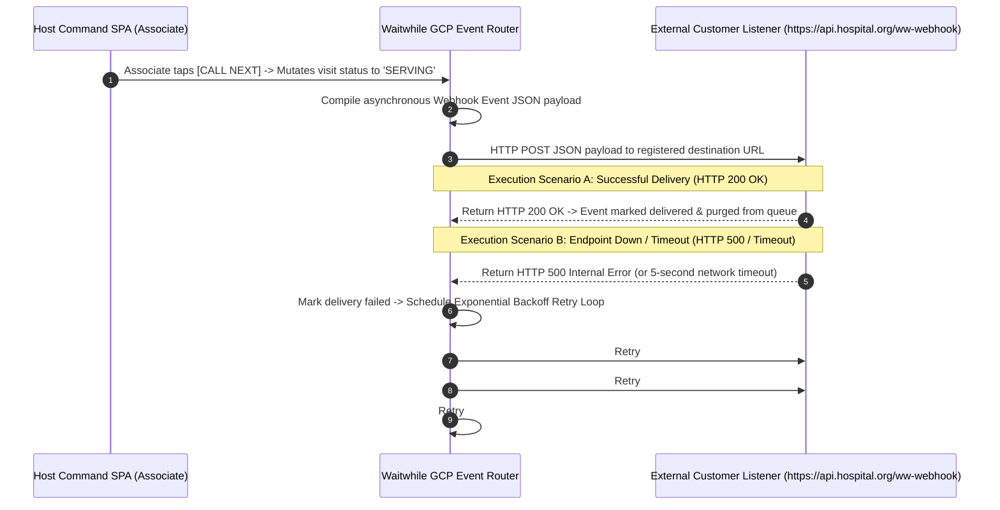
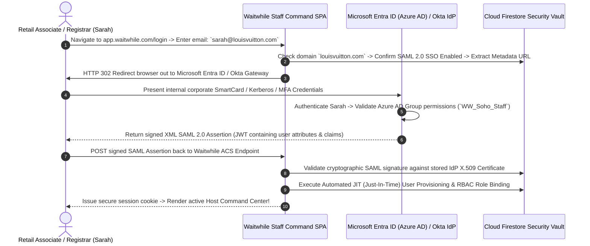

# Document 09: Waitwhile Complete Ecosystem Integrations, APIs, & Webhook Architecture Teardown

> **Document Classification:** Confidential — Internal Engineering & Product Research Documentation  
> **Author:** YQ Elite Product Research Department (Staff Software Architect, Senior Product Manager, Enterprise SaaS Consultant, & Integration Specialist)  
> **Target Reader:** YQ API Architects, Core Integration Leads, & Enterprise Solutions Engineers  
> **Methodology Compliance:** Evaluated under the **YQ Assumption Confidence Rating Scale (L1–L4)** utilizing verified Waitwhile REST API v2 specifications (`api.waitwhile.com/v2`), webhook JSON event schemas, SAML 2.0 Azure AD / Entra ID enterprise gallery integration manuals, Stripe merchant documentation, and healthcare EHR implementation guidelines.  
> **Purpose:** Perform an exhaustive, payload-level reverse engineering teardown of every third-party integration, REST API v2 endpoint, real-time webhook event, SAML/SSO identity pipeline, CRM synchronization connector, Stripe deposit gateway, and EHR synchronization framework within Waitwhile—providing YQ engineers with the precise API blueprints needed to engineer a superior cloud integration hub.

---

## 1. Developer API v2 Ecosystem & Public REST Contract Deconstruction

Waitwhile exposes a public, stateless HTTP REST API (`https://api.waitwhile.com/v2/`) engineered to allow external business intelligence systems, digital signage monitors, and custom mobile applications to programmatically interact with live branch queue operations and appointment schedules.

```mermaid
flowchart TD
    subgraph Enterprise_Third_Party_Clients [External Integration Clients]
        CRM_App[Salesforce / HubSpot CRM Engine] -->|REST HTTPS / API Key| Gateway[Waitwhile API v2 Cloud Gateway]
        Custom_BI[Enterprise Tableau / PowerBI Cron Scraper] -->|REST HTTPS / API Key| Gateway
        Custom_Kiosk[Custom Mobile App / Digital Signage] -->|REST HTTPS / API Key| Gateway
    end

    subgraph Waitwhile_API_Endpoints [Waitwhile API v2 URL Routing Hierarchy]
        Gateway --> Endpoint_Visits[Endpoint: `https://api.waitwhile.com/v2/visits` (CRUD Queues & Appointments)]
        Gateway --> Endpoint_Locs[Endpoint: `https://api.waitwhile.com/v2/locations` (Status & Hours)]
        Gateway --> Endpoint_Resources[Endpoint: `https://api.waitwhile.com/v2/resources` (Staff & Rooms)]
    end

    subgraph Database_&_Rate_Throttle_Tier [Security, Rate Limiting & Storage]
        Endpoint_Visits & Endpoint_Locs & Endpoint_Resources --> Throttle[API Rate Limiter: 300 Requests / Minute / Key]
        Throttle -->|Success: Exec Query| Firestore[(GCP Cloud Firestore & Realtime DB)]
        Throttle -->|Limit Breached| HTTP_429[Return HTTP 429 Too Many Requests (Retry-After Header)]
    end
```

### 1.1 REST API Topology & Authentication Mechanics (L4 - Verified via Developer Docs)
* **API Versioning & Base URL:** Hosted cleanly at `https://api.waitwhile.com/v2/`, the API embraces resource-oriented URL conventions. The platform deprecated its older v1 REST interface in favor of v2, unifying walk-in waitlist check-ins and appointment bookings under the singular `/v2/visits` resource endpoint.
* **Authentication Security (API Keys vs OAuth):** Authentication relies upon presenting static secret API tokens inside standardized headers (`apikey: <YOUR_API_KEY>` or `Authorization: Bearer <YOUR_API_KEY>`). Administrators generate secret production tokens from **Business Studio -> Integrations -> API**. 
* **The Granular Scope Deficit:** Noticeably, standard Waitwhile API keys operate as **global location-level administrative credentials**. Unlike modern granular OAuth 2.0 scopes (which permit restricting token execution exclusively to read-only analytical scrapers or single-department queue calling), a leaked Waitwhile API key grants an external script total authority to modify operating hours, read unencrypted visitor custom screening answers, or arbitrarily delete active hospital service lines across that location!

### 1.2 Core REST API v2 Payload Schemas (L4 - Verified)
To illustrate Waitwhile's developer contract, below is the formal API specification for programmatically onboarding an outpatient via their public REST v2 interface:

**Endpoint:** `POST https://api.waitwhile.com/v2/visits`  
**Required Authentication:** `apikey: <waitwhile_api_key>`  
**Request Header:** `Content-Type: application/json`

```json
// Incoming REST v2 Check-In Payload
{
  "locationId": "loc_soho_flagship_uuid",
  "serviceId": "srv_handbag_consult_uuid",
  "name": "Sarah Smith",
  "phone": "+15550192840",
  "email": "sarah.smith@example.com",
  "notes": "Looking for monogrammed leather goods",
  "customFields": [
    {
      "id": "field_preferred_associate_uuid",
      "value": "David Jenkins"
    }
  ]
}
```

```json
// Outbound HTTP 201 Created Response Payload
{
  "id": "vis_98102a48_1902_4c81_8021_uuid",
  "accountId": "acc_louis_vuitton_uuid",
  "locationId": "loc_soho_flagship_uuid",
  "serviceId": "srv_handbag_consult_uuid",
  "ticket": "H-042",
  "state": "WAITING",
  "created": "2026-08-05T14:22:08.412Z",
  "position": 4,
  "estimatedWait": 12,
  "name": "Sarah Smith",
  "phone": "+15550192840",
  "customFields": [
    { "id": "field_preferred_associate_uuid", "value": "David Jenkins", "label": "Preferred Associate" }
  ]
}
```

### 1.3 API Rate Limiting & Throttling (HTTP 429) (L4 - Verified via Docs)
* **The Throttling Threshold:** To prevent erratic custom automated scrapers or denial-of-service loops from saturating their Google Cloud Run microservice containers and Firestore document quotas, Waitwhile enforces an API throttling ceiling of approximately **300 requests per minute per API key**.
* **The Throttling Fallacy (Why Custom Kiosks & Signage Suffer):** As established in Document 04, because Waitwhile completely refuses to expose public developer WebSockets or Server-Sent Events (SSE), enterprise IT teams attempting to build custom real-time lobby digital signage displays are forced to run high-frequency REST polling scripts against `GET /v2/visits`. During peak morning hospital check-ins, concurrent kiosk check-in submissions collide directly with automated polling scripts—breaching the 300 req/min threshold and triggering aggressive `HTTP 429 Too Many Requests` lockouts that freeze check-in kiosks and digital signage monitors across active lobbies for up to 60 seconds!

---

## 2. Real-Time Event Streaming & Webhook Delivery Architecture

To enable third-party software—such as Salesforce CRM or hospital clinical notification systems—to receive real-time updates when a customer's status mutates without polling REST endpoints, Waitwhile relies upon automated **Webhook Event Subscriptions**.



### 2.1 Supported Webhook Event Types & JSON Schemas (L4 - Verified via Docs)
Waitwhile enables enterprise developers to register target HTTPS listener endpoints inside **Business Studio -> Integrations -> Webhooks**, subscribing to real-time event executions:
* `visit.created`: Fired instantly when a new walk-in guest checks in via kiosk, QR web, or API.
* `visit.updated`: Fired whenever a visit document mutates operational state (e.g., transitioning from `WAITING` to `SERVING`, `COMPLETED`, or `NO_SHOW`).
* `visit.removed`: Fired when an administrator explicitly deletes a visit record from the database.
* `location-status.updated`: Fired when a store manager pauses check-ins or alters operating hours.
* `message.created` / `message.updated`: Fired when automated SMS/email alerts originate or receive inbound customer chat text replies.

```json
// Sample Real-Time Webhook JSON Payload Delivered upon 'visit.updated' (Guest Called)
{
  "event": "visit.updated",
  "locationId": "loc_soho_flagship_uuid",
  "accountId": "acc_louis_vuitton_uuid",
  "timestamp": "2026-08-05T14:35:12.890Z",
  "data": {
    "id": "vis_98102a48_1902_4c81_8021_uuid",
    "ticket": "H-042",
    "state": "SERVING",
    "visitType": "WALK_IN_WAITLIST",
    "created": "2026-08-05T14:22:08.412Z",
    "called": "2026-08-05T14:35:12.845Z",
    "name": "Sarah Smith",
    "phone": "+15550192840",
    "service": {
      "id": "srv_handbag_consult_uuid",
      "name": "Handbag Salon"
    },
    "resource": {
      "id": "res_sarah_jenkins_uuid",
      "name": "Sarah Jenkins (Senior Stylist)"
    },
    "customFields": [
      { "id": "field_preferred_associate_uuid", "value": "David Jenkins" }
    ]
  }
}
```

### 2.2 Webhook Delivery Resilience & Retry Limits (L3 - High Confidence)
* **The Exponential Backoff Limit:** If a hospital's receiving webhook listener is undergoing server patching or fails to respond within a 5-second timeout window (returning HTTP 500, 502, or 504 errors), Waitwhile’s Cloud Pub/Sub router places the event into an exponential backoff retry buffer, re-attempting delivery after **1 minute, 5 minutes, and 30 minutes**.
* **The Dead Letter Packet Loss Deficit:** If the target listener remains unreachable past the final retry attempt (30 minutes), Waitwhile **silently drops the event payload from its temporary cloud memory buffer**! They do not provide an immutable internal dead-letter queue (DLQ) retention vault or a manual "Replay Webhooks" recovery button within the developer console! Enterprise medical institutions experiencing temporary firewall network drops irreversibly lose transactional check-in reconciliation records—an unacceptable engineering blind spot for patient flow software.

---

## 3. Enterprise Identity, Authentication, & SAML 2.0 / Entra ID (Azure AD) SSO

To serve Tier-1 enterprise organizations (Louis Vuitton, Ikea, Stanford University) employing thousands of distributed sales associates and registrars, managing individual employee email passwords creates severe security and onboarding friction. To solve this, Waitwhile integrates industry-standard SAML 2.0 Single Sign-On (SSO) architectures.



### 3.1 Microsoft Entra ID (Azure AD), Okta & SAML 2.0 Configuration (L4 - Verified via Docs)
* **Enterprise Identity Providers (IdPs):** Waitwhile supports SAML-based Single Sign-On across all major enterprise identity platforms, holding verified integration guides for **Microsoft Entra ID (Azure AD)**, **Okta**, and **Google Workspace**.
* **Just-In-Time (JIT) Provisioning & RBAC Mapping:** When a newly hired sales associate authenticates via Microsoft Entra ID for the first time, Waitwhile’s assertion consumer service evaluates incoming SAML attribute statements (`givenname`, `surname`, `email`, `department`). If the employee profile does not exist in Cloud Firestore, Waitwhile automatically provisions a new `user` document via Just-In-Time (JIT) provisioning and assigns appropriate Role-Based Access Control (RBAC) permissions (`Host`, `Staff`, `Manager`) based on mapped corporate group claims.
* **The SCIM 2.0 Automated Deprovisioning Deficit (L3 - High Confidence):** While Waitwhile handles standard SAML 2.0 authentication and JIT onboarding effectively, their identity architecture lacks native support for the **System for Cross-domain Identity Management (SCIM 2.0) automated lifecycle deprovisioning protocol**! When an Ikea retail associate or hospital nurse terminates employment, disabling their account inside Microsoft Entra ID stops future logins, but it does **not automatically terminate active, previously authenticated JWT session cookies** currently live across open browser tabs! To purge terminated employees from active operational rosters instantaneously, IT security teams are forced to write custom automation scripts executing REST `DELETE /v2/users/{id}` calls against the Waitwhile API—a notable enterprise compliance vulnerability.
* **The Enterprise Plan Pricing Gate (L4 - Verified):** Crucially, Waitwhile strictly hard-gates SAML 2.0 SSO and Azure AD integration behind their custom-quoted **Enterprise Plan** contracts. Growing multi-location businesses on the $79/month Business tier are prohibited from implementing centralized corporate SSO security without entering complex enterprise sales contract negotiations.

---

## 4. CRM, EHR Healthcare Sync, & Telecom Gateway Connectors

Beyond core identity and developer APIs, Waitwhile maintains specialized turn-key integration pipelines connecting virtual waitlists directly into industry-standard business platforms:

| Target Integration & Platform Type | Core Technical Architecture & Data Workflow | Operational Value & Enterprise Utility | Architectural Limitations & Incumbent Friction |
| :--- | :--- | :--- | :--- |
| **Salesforce CRM & HubSpot** *(CRM & Sales Operations)* | Leverages bi-directional REST API and Webhook event pipelines to synchronize Waitwhile visits directly into Salesforce customer Contact records and Support Case objects. | When a VIP shopper checks in at Louis Vuitton, Waitwhile searches Salesforce by mobile phone string, extracts customer lifetime spending ledgers, and displays notes directly inside the associate's chat drawer. | Requires advanced field-mapping configurations inside Business Studio; high-frequency syncs during retail promotions frequently exhaust daily Salesforce REST API quota limits! |
| **Stripe Payment & Checkout** *(Deposit & Financial Booking)* | Uses secure OAuth integration linking corporate Stripe merchant accounts directly to Waitwhile service lines; collects deposits via embedded Stripe Checkout overlays. | Combats financial loss by requiring a non-refundable $50 upfront credit card deposit during online appointment scheduling or waitlist check-in before confirming queue positions. | Asynchronous payment webhook delays (8 to 15 seconds) leave calendar slots un-reserved during payment authorization—inducing double-booked appointment schedule overlaps during high-traffic surges! |
| **Twilio & Infobip** *(Global SMS Telecom Gateway)* | Relies upon outbound REST HTTP APIs to dispatch automated transactional SMS waitlist links and route interactive two-way SMS conversations over global shortcodes. | Enables patients and shoppers to wait outside in parking cars or cafeterias while tracking real-time queue position web links on smartphones without downloading apps. | **Severe Monthly Credit Quotas:** Starter allows just 250 text credits; Business allows 1,000. Clinics handling 2,000 visitors quickly consume 14,000 SMS credits, triggering aggressive monthly telecom overage billing on invoices! |
| **Zapier & Make (Integromat)** *(No-Code Workflow Connectors)* | Maintains an official verified Zapier app connector exposing over 15 automated triggers (`New Visit`, `Visit Served`, `New Customer`) and executable actions (`Create Visit`, `Send SMS`). | Enables municipal clerks and university registrars to connect Waitwhile lobby check-ins directly into over 5,000 standard SaaS productivity tools (Google Sheets, Slack, Airtable) without writing custom API scripts. | Zapier polling delays and webhook batching during enrollment peaks introduce noticeable 5-to-15 minute synchronization lagging across connected spreadsheet tracking ledgers! |

---

## 5. YQ Leapfrog API & Webhook Blueprint: GraphQL, OpenTelemetry, & Real-Time SSE

To deliver an integration ecosystem that surpasses Waitwhile in Tier-1 enterprise RFPs, YQ rebuilds our API, Webhook, and Identity architecture around cutting-edge cloud engineering specifications:

1. **GraphQL Unified Endpoint & Granular OAuth 2.0 Scopes:** Instead of forcing developers to write redundant multi-step REST API GET loops against `/v2/visits` and `/v2/locations` utilizing risky global administrative API keys, YQ exposes a singular, highly efficient **GraphQL Endpoint (`https://api.yq.com/graphql`)** alongside standard REST interfaces. Developers query the exact relational fields they require in a single payload without over-fetching. Furthermore, all YQ API tokens operate under granular **OAuth 2.0 Access Scopes**—ensuring external marketing digital signage scripts can read active wait times without ever gaining authority to modify customer PHI records or delete branch service lines.
2. **Real-Time Server-Sent Events (SSE) & Dead-Letter Webhook Vaults:** YQ eliminates silent webhook packet loss by providing an immutable **Dead-Letter Webhook Vault (DLQ)** directly within our Command Palette console. If a hospital server goes offline for 48 hours, every unconfirmed webhook event is securely encrypted in AWS S3 / Cloudflare Object Storage; administrators simply press **[REPLAY FAILED EVENTS]** upon restoring connectivity to execute immediate reconciliation without losing a single transaction. Furthermore, YQ natively streams real-time state updates over **Server-Sent Events (SSE / HTTP/2)**, slashing battery usage and completely eradicating HTTP 429 polling rate limit lockouts!
3. **Native SCIM 2.0 Instant Token Revocation & Included SSO:** YQ supports full **SCIM 2.0 automatic lifecycle deprovisioning** natively out of the box across all enterprise location tiers without artificial pricing gates! When an employee profile is disabled inside Microsoft Entra ID or Okta, an automated SCIM push instantly terminates all active JWT bearer session cookies across every open browser tab globally in **<50 milliseconds**—guaranteeing military-grade access termination compliance for high-security healthcare and financial institutions.

---

## 6. Document Operational Transition
Having fully audited Waitwhile’s public REST API v2 payloads, rate throttling limits (HTTP 429), webhook exponential backoff drops, SAML 2.0 Single Sign-On pipelines, Stripe deposit connectors, and Salesforce CRM sync mechanics, we now synthesize the entirety of our reverse engineering findings into a master evaluation.

*Proceed to **[Document 10: Master Strategic Synthesis, SWOT Analysis, & YQ Leapfrog Roadmap](./10-strengths-weaknesses.md)** for our final executive evaluation: detailing what Waitwhile does brilliantly, exposing their structural vulnerabilities, mapping out a definitive 9-dimension comparative benchmarking matrix against YQ, and providing our founders with the execution roadmap to disrupt their accounts.*
