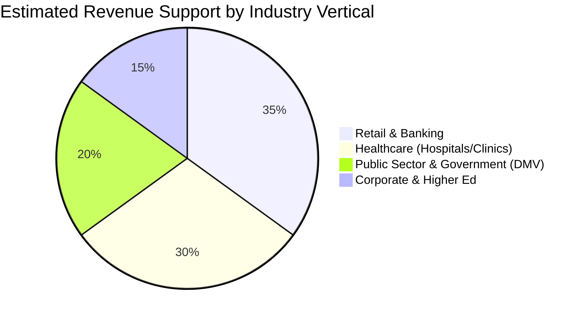

# Competitor Evaluation Template: Executive Summary & Market Positioning

> **Company Name:** `[INSERT COMPANY NAME]`
> **Primary Headquarters:** `[INSERT LOCATION]`
> **Estimated ARR / Market Scale:** `[INSERT ESTIMATED ARR / CUSTOMER COUNT / VALUATION]`
> **Core Focus & Dominant Verticals:** `[e.g., Healthcare, Retail, Government, Corporate Offices]`
> **Date of Evaluation:** `[YYYY-MM-DD]`
> **Primary Document Author:** Senior Product Manager & Enterprise SaaS Consultant

---

## 1. Executive Summary & Core Value Proposition

`[Provide an exhaustive, multi-paragraph analysis of the competitor's market positioning. Deconstruct how they pitch themselves to enterprise CIOs, Operations Directors, and Customer Experience Leaders. Differentiate between their marketing positioning and actual software reality.]`

### 1.1 Core Business Problem Addressed
* `[Detail precisely what operational bottlenecks this competitor primarily solves, such as branch overcrowding, appointment scheduling chaos, or facility lobby security.]`

### 1.2 Target Buyer Persona & Procurement Motions
* **Primary Decision Makers:** `[e.g., VP of Retail Operations, Chief Medical Information Officer, VP of Facilities]`
* **Day-to-Day Administrators:** `[e.g., Branch Managers, Head Nurse, Lobby Reception Desk Lead]`
* **Sales Motion:** `[e.g., Top-down Direct Enterprise Sales vs. Product-Led Growth (PLG) self-serve checkout]`

---

## 2. Target ICPs & Industry Vertical Allocation

*(Note: Adjust chart percentages above based on research findings and reference empirical support).*

* **Primary Vertical 1: `[INSERT NAME]`:** `[Evaluate specific feature configurations tailored for this industry — e.g., EHR integration for Healthcare or branch routing for Banking.]`
* **Primary Vertical 2: `[INSERT NAME]`:** `[Evaluate specific feature configurations tailored for this industry.]`
* **Secondary Verticals:** `[Examine edge case adoption.]`

---

## 3. Pricing Economics & Commercial Packaging

### 3.1 Tier Structure & Gating Mechanics
`[Detail their exact licensing tiers. Do they charge per location, per concurrent agent/host, per SMS interaction, or via enterprise custom contracts?]`

| Plan Name | Indicative Pricing | Core Features Included | Critical Features Gated / Excluded |
| :--- | :--- | :--- | :--- |
| **Tier 1 (e.g., Starter)** | `[$ / model]` | `[List capabilities]` | `[List exclusions]` |
| **Tier 2 (e.g., Professional)** | `[$ / model]` | `[List capabilities]` | `[List exclusions]` |
| **Tier 3 (e.g., Enterprise)** | `[Custom / Annual]` | `[List capabilities]` | `[List exclusions]` |

### 3.2 Add-on Fee Structures & Hidden Costs
* **Hardware Fees:** `[Evaluate mandatory terminal purchases or hardware lease fees.]`
* **Messaging Usage Costs:** `[Examine surcharges for SMS, WhatsApp, or email overages.]`
* **Implementation & Professional Services:** `[Identify if enterprise deployments require mandatory consulting or integration onboarding fees.]`

---

## 4. Consolidated Evaluation Scorecard (vs. YQ Target Architecture)

| Evaluation Vector | Competitor Score (0.0 – 5.0) | Confidence Level (L1–L4) | Core Deficit vs. YQ Target Architecture |
| :--- | :---: | :---: | :--- |
| **1. Cloud Architecture & Scalability** | `[0.0 - 5.0]` | `[L1 - L4]` | `[Concise technical summary]` |
| **2. Real-time Sync & Edge Resiliency** | `[0.0 - 5.0]` | `[L1 - L4]` | `[Concise technical summary]` |
| **3. Enterprise Security & Governance** | `[0.0 - 5.0]` | `[L1 - L4]` | `[Concise technical summary]` |
| **4. UX & Zero-Friction Journey** | `[0.0 - 5.0]` | `[L1 - L4]` | `[Concise technical summary]` |
| **5. Omnichannel Communication** | `[0.0 - 5.0]` | `[L1 - L4]` | `[Concise technical summary]` |
| **6. Hardware & IoT Integration** | `[0.0 - 5.0]` | `[L1 - L4]` | `[Concise technical summary]` |
| **7. API & Developer Ecosystem** | `[0.0 - 5.0]` | `[L1 - L4]` | `[Concise technical summary]` |
| **OVERALL COMPOSITE RATING** | **`[CALCULATE AVG]`** | **`[AVG LEVEL]`** | **`[Strategic positioning conclusion]`** |

---

## 5. High-Level Strategic Verdict for YQ
`[Provide a synthesis by the Senior Product Manager and SaaS Consultant on how YQ should commercially and structurally attack this incumbent's market position.]`
