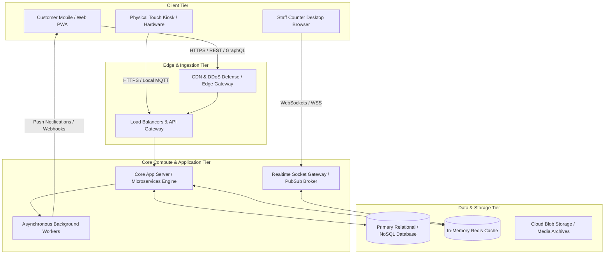
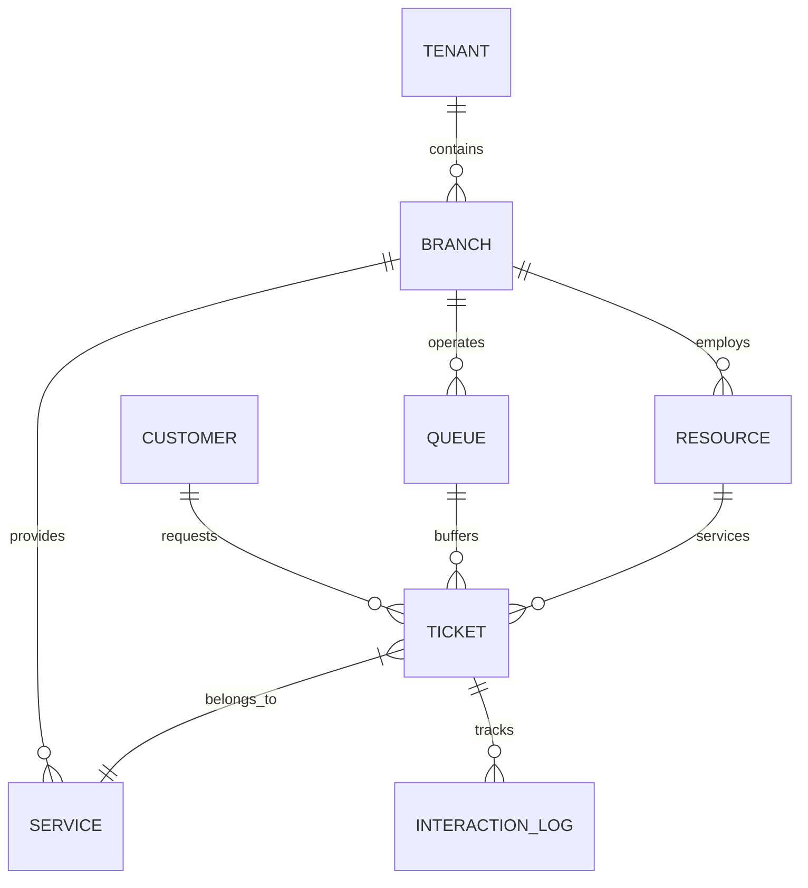

# Competitor Evaluation Template: Architecture & Infrastructure Inferences

> **Company Name:** `[INSERT COMPANY NAME]`
> **Primary Document Author:** Staff Software Architect & Competitive Intelligence Analyst
> **Architectural Evaluation Date:** `[YYYY-MM-DD]`

---

## 1. High-Level System Architecture & Cloud Topology

`[Provide an extensive engineering teardown of the competitor's observable cloud infrastructure, network routing, and deployment boundaries. Explicitly distinguish between confirmed direct facts [L1] and deduced inferences [L2-L4].]`

### 1.1 Inferred Technology Stack & Platform Ecosystem
* **Cloud Infrastructure Provider:** `[e.g., AWS, Azure, Google Cloud, Hybrid On-Prem. State evidence and L-rating.]`
* **Frontend Web Application Stack:** `[e.g., React, Angular, Vue, Legacy jQuery/Bootstrap. Derive from browser asset bundles or DevTools testing.]`
* **Backend Runtime & Framework:** `[e.g., Node.js/NestJS, Python/Django, Java/Spring Boot, C#. .NET Core, Ruby on Rails. Evidence via headers, job descriptions, error stack traces.]`
* **Database & Data Sharding Model:** `[e.g., PostgreSQL, Amazon Aurora, MongoDB, MS SQL Server. Identify if multi-tenancy is achieved via shared tables with TenantID vs. isolated database schemas per enterprise customer.]`

---

## 2. Real-time Synchronization & Socket Protocol Deconstruction

### 2.1 Live State Propagation Protocol
`[Analyze precisely how live queue state, appointment changes, or visitor check-in events are broadcast to active receptionist counter terminals, customer mobile phones, and lobby TV signage.]`

* **Protocol Type:** `[e.g., True bi-directional WebSockets (wss://), Server-Sent Events (SSE), Firebase Realtime DB Sync, or aggressive HTTP REST Long-Polling.]`
* **Payload Structure & Efficiency:** `[Analyze whether the live stream sends complete heavyweight resource objects or optimized delta state diffs.]`
* **Reconnection & Resilience Strategy:** `[Document client behavior during brief packet dropouts. Does the client reload the entire webpage, re-authenticate the socket, or silently resume missed messages via sequence numbering? Include L-Rating.]`

---

## 3. Database Schema Inferences & Entity Relationships

`[Reconstruct the core data entities supporting this platform based on API payloads, webhook schema designs, and functional capabilities. Annotate with primary relationship cardinality.]`

### 3.1 Key Entity Structural Analysis
* **`Tenant` & `Branch` Organization:** `[Detail structural hierarchy. How are locations geographically or operationally nested? Can custom operational rules be defined at a sub-branch level?]`
* **`Ticket` / `Visit` / `Appointment` Polymorphism:** `[Evaluate whether the competitor treats walk-in Queue Tickets, pre-booked Appointments, and Visitor On-Site Check-ins as completely separate siloed tables, or as polymorphic states of a unified Customer Journey Interaction entity.]`
* **Audit Trail & Historical Immutability:** `[Assess if status mutations (e.g., Ticket waiting -> Serving -> Closed) rewrite row state or write immutable event logs (Event Sourcing).]`

---

## 4. Reliability, Failover, and Edge Offline Resilience

* **High Availability (HA) Topology:** `[Detail Multi-AZ or Multi-Region redundancy implementations.]`
* **Hardware Kiosk Edge Offline Mode:** `[Document how on-site physical kiosks and reception counter machines perform when wide-area network (WAN) internet access drops. Does ticket printing stop entirely, or is there a local network gateway storage sync capability? Rate L1-L4.]`

---

## 5. Architectural Bottlenecks & YQ Vulnerability Exploits
`[Synthesize the architectural technical debt uncovered in this analysis. Explain how YQ's architecture directly solves these performance, reliability, and scaling flaws.]`
