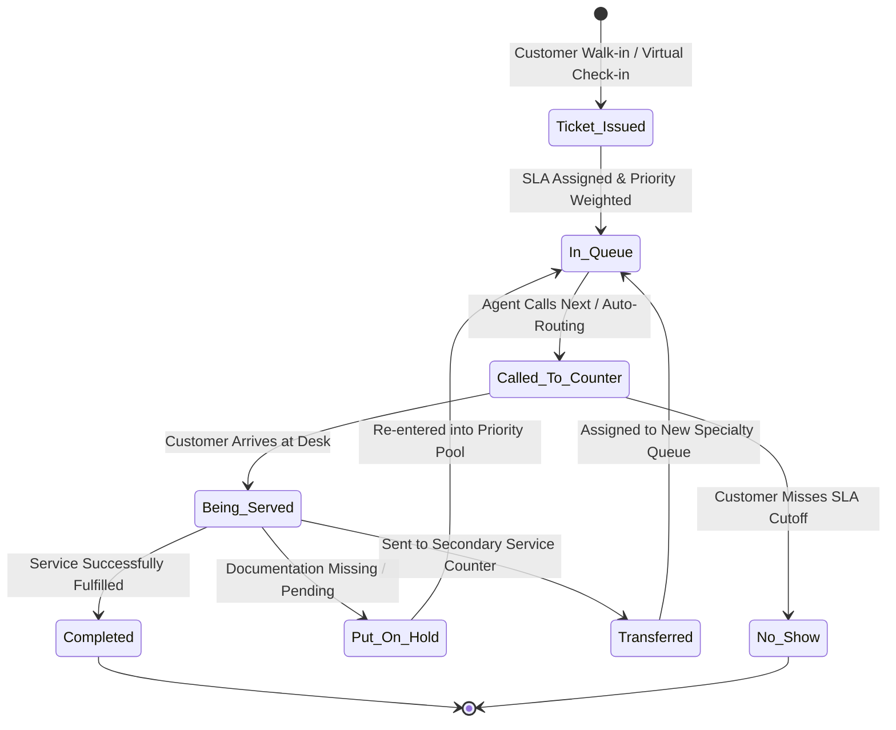

# Competitor Core Engine Deep Dive: Queue Management & Routing Engine

> **Company Name:** `[INSERT COMPANY NAME]`
> **Primary Document Author:** Staff Software Architect & Senior Product Manager
> **Evaluation Focus:** Virtual Queueing, Walk-In Ticketing, Wait-Time Algorithms, & Dynamic SLA Routing

---

## 1. Engine Functional Architecture & Scope

`[Provide an exhaustive engineering breakdown of how this competitor implements virtual and physical queue management. Detail the exact workflows from ticket origination to terminal counter fulfillment.]`

---

## 2. Ticket Origination & Virtual Intake Channels

### 2.1 Intake Channel Versatility
* **On-Site Physical Kiosk (Touchscreen):** `[Detail thermal ticket printing, multilingual selection menus, and queue branch assignment.]`
* **QR Code Zero-Contact Virtual Queue:** `[Analyze mobile onboarding UX. Does scanning a QR code launch a native app install requirement, an interactive SMS conversation, or a lightweight progressive web app (PWA)?]`
* **Remote Pre-Arrival Virtual Ticketing:** `[Evaluate whether customers can reserve a queue token remotely via company website, WhatsApp, or Google Maps before physically arriving at the premises.]`

### 2.2 Customer Identification & Duplicate Prevention
* **Anti-Spam & Fraud Controls:** `[How does the system prevent malicious actors or disruptive customers from generating dozens of virtual queue tickets simultaneously via QR scanning or API requests? Are phone number OTP (One-Time Password) validations required?]`

---

## 3. Algorithmic Routing & Priority Calculation Mechanics

### 3.1 Multi-Service & Priority Routing Logic
`[Deconstruct how tickets are ordered and distributed to available service desk counters. Contrast FIFO (First-In, First-Out) vs. weighted priority queuing.]`

* **VIP & SLA Overrides:** `[Analyze how priority tiers (e.g., Platinum Bank Customers, Emergency Outpatients) disrupt standard queue ordering. What starvation-prevention heuristics exist to ensure normal-priority walk-ins aren't perpetually delayed by continuous VIP arrivals?]`
* **Agent Skills-Based Routing:** `[Can counters be bound to multi-skilled agents (e.g., Counter 4 handles "Cash Deposits" and "Mortgage Applications", but prioritizes Mortgages when wait time > 15 mins)?]`

### 3.2 Estimated Wait Time (EWT) & Little's Law Algorithmic Evaluation
`[Examine the precision of their reported Estimated Wait Times.]`
* **Underlying Algorithmic Formula:** `[Is EWT derived from a simplistic static calculation ($EWT = \text{Queue Position} \times \text{Historical Avg Service Time}$), an exponentially weighted moving average (EWMA) of the last $N$ service interactions, or an advanced machine learning regression model factoring in staffing velocity and time of day? Tag with L-rating.]`
* **Dynamic Adjustment & Volatility Buffers:** `[How does the system smooth EWT displays on customer mobile screens when a service interaction stalls or when counters suddenly close?]`

---

## 4. Multi-Queue & Inter-Branch Transfers

* **Escalation & Multi-Stage Services:** `[Evaluate workflows where a customer must complete sequential consultations (e.g., DMV: Triage Desk -> Document Verification Counter -> License Photo Station -> Cashier). Does the system reissue new ticket numbers or preserve a single master routing identity across desks?]`
* **Load-Balancing Across Geographies:** `[Does the platform offer real-time branch balancing—recommending that virtual queue applicants redirect to an underutilized secondary branch located 5 miles away?]`

---

## 5. Technical Debt & Strategic Opportunities for YQ
`[Synthesize specific architectural shortcomings in this competitor's queuing engine and formulate YQ's leapfrog development priorities.]`

* **Competitor Weakness / Technical Debt:** `[Identify slow routing updates, inaccurate wait predictions, or clumsy transfer flows.]`
* **YQ Superior Engineering Blueprint:** `[Detail YQ's proposed architectural countermeasure—e.g., implementing real-time reinforcement learning for SLA wait-time predictions and tokenized multi-stage state machines.]`
