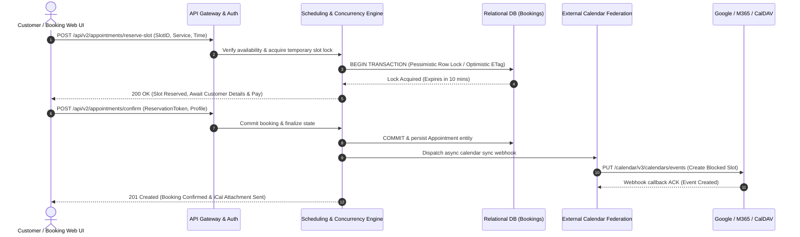

# Competitor Core Engine Deep Dive: Appointment Scheduling & Calendar Sync

> **Company Name:** `[INSERT COMPANY NAME]`
> **Primary Document Author:** Staff Software Architect & Enterprise SaaS Consultant
> **Evaluation Focus:** Multi-Resource Scheduling, Distributed Concurrency, Buffer Mechanics, & Calendar Federation

---

## 1. Scheduling Engine Architecture & Scope

`[Provide a rigorous architectural analysis of how this competitor manages future appointment scheduling, recurrent booking structures, and complex multi-resource allocations.]`

---

## 2. Multi-Resource & Complex Booking Rules

### 2.1 Composite Resource Allocation
`[Deconstruct whether an appointment slot requires the simultaneous availability of multiple interdependent resources (e.g., a Medical Procedure requiring: Specialist Doctor + Operating Room + Specialized Radiology Equipment).]`
* **Allocation Algorithms:** `[How does the query engine compute free/busy intersections across multiple distinct resource tables without causing expensive O(N²) database table scans? Include L-Rating.]`

### 2.2 Buffer Management & Travel Timers
* **Pre/Post-Service Buffers:** `[Does the platform support configurable mandatory cleanup or administrative prep buffers between consecutive appointments? Can buffers dynamically expand based on specific service types?]`
* **Staff Travel & Multi-Location Time Rules:** `[For roaming field agents or rotating branch staff, does the booking engine automatically calculate travel buffer delays between physical branch locations?]`

---

## 3. Concurrency, Distributed Locking, and Double-Booking Prevention

`[An appointment engine is critically defined by its ability to prevent race conditions when concurrent end-users attempt to claim the exact same remaining time slot.]`

* **Locking Strategy Deconstruction:** `[Assess whether the architecture implements Pessimistic Locking (placing an exclusive DB lock on the time slot for 5-15 minutes during checkout) or Optimistic Concurrency Control (validating timestamp version tags at commit time and throwing a 409 Conflict error on collisions). Label L1-L4.]`
* **Idempotency Standards:** `[Evaluate network request resiliency. If a mobile user submits an appointment confirmation POST request twice due to cellular lag, does the backend enforce UUID idempotency keys to prevent duplicate calendar events?]`

---

## 4. Calendar Federation & Bi-Directional Synchronization

### 4.1 Enterprise Exchange & Workspace Federation
* **Supported Integrations:** `[Microsoft 365, Exchange Server On-Premise, Google Workspace, Apple CalDAV, Salesforce Calendars.]`
* **Synchronization Latency & Protocols:** `[Determine if external calendar synchronization operates via real-time webhook subscriptions (e.g., Microsoft Graph API Delta / Webhooks, Google Calendar Push Notifications) or periodic background polling cron jobs (e.g., checking Exchange every 15 minutes). Notice: periodic polling introduces catastrophic double-booking vulnerabilities during the polling interval window.]`
* **Bi-Directional Conflict Resolution:** `[If a staff member creates a personal appointment directly inside their desktop Outlook client, how rapidly does the competitor's engine ingress that blockage to close public web appointment slots? Who wins if an Outlook edit and a public customer booking collide simultaneously?]`

---

## 5. Technical Debt & Strategic Opportunities for YQ

* **Competitor Weakness / Technical Debt:** `[Identify laggy calendar sync, clumsy timezone handling, lack of multi-resource booking, or lock contention latency under high volume.]`
* **YQ Superior Engineering Blueprint:** `[Detail YQ's proposed counter-architecture—such as building a high-performance in-memory interval tree microservice in Rust/Go for instant time-slot intersection calculation, paired with real-time Graph API webhook subscriptions.]`
