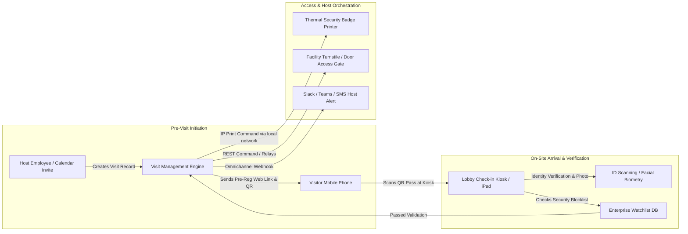

# Competitor Core Engine Deep Dive: Visitor & Visit Management

> **Company Name:** `[INSERT COMPANY NAME]`
> **Primary Document Author:** Enterprise SaaS Consultant & Staff Software Architect
> **Evaluation Focus:** Visitor Pre-Registration, On-Site Kiosks, Access Control Protocols, & Security Compliance

---

## 1. Visit Management Engine Architecture & Scope

`[Provide a thorough architectural analysis of how this competitor manages on-site physical visits, visitor check-in kiosks, host notifications, and facility security workflows (e.g., platforms like Envoy, Proxyclick, or Traction Guest).]`

---

## 2. Visitor Onboarding & Verification Workflows

### 2.1 Pre-Registration & Zero-Touch Onboarding
* **Pre-Arrival Induction:** `[Evaluate online pre-registration capabilities. Can visitors sign electronic non-disclosure agreements (NDAs), complete health/safety questionnaires, and upload government photo identification via a secure mobile browser link 24 hours prior to arrival?]`
* **QR Code & Wallet Pass Access:** `[Does the system deliver dynamic Apple Wallet / Google Wallet passes containing cryptographic QR codes for immediate turnstile scanning upon lobby entry?]`

### 2.2 On-Site Kiosk Interaction & ID Verification
* **Tablet / Hardware Compatibility:** `[Deconstruct kiosk hardware requirements. Does the application operate exclusively on iPad native apps, Android enterprise tablets, or standard web browser kiosks? What offline fallback exists if the WiFi drops during visitor intake?]`
* **ID Scanning & Optical Character Recognition (OCR):** `[Evaluate physical driver's license or passport verification capabilities. Does the system capture hardware camera photos and perform OCR extraction of full names, license numbers, and birth dates? Identify backend processing APIs (e.g., Acuant, Microblink, AWS Textract).]`
* **Legal NDA Capture & Digital Signature Retention:** `[Analyze legal compliance features. Are digital signatures cryptographically signed, timestamped, and bound to immutable PDF records stored in compliant enterprise cloud vaults?]`

---

## 3. Host Notification & Employee Orchestration

### 3.1 Real-Time Host Alerts
* **Notification Channels:** `[Detail supported instant messaging integrations: Slack, Microsoft Teams, Cisco Webex, email, SMS, and automated voice phone calling.]`
* **Interactive Host Commands:** `[Can an employee respond directly inside Slack or Microsoft Teams with an interactive button (e.g., "I will be down in 5 minutes", "Send visitor to Conference Room B", or "Deny Entry") that immediately updates the reception desk screen or kiosk display? Rate L-Level.]`

---

## 4. Hardware Access Control & Facility Integrations

### 4.1 Physical Security Equipment Interoperability
* **Thermal Badge Printing Protocols:** `[Deconstruct printer communication architecture (e.g., Brother, Dymo, Zebra printers). Does the cloud backend print directly via IPP (Internet Printing Protocol), print via Bluetooth/AirPrint from tablet kiosks, or utilize a local network proxy service running on a receptionist desktop PC?]`
* **Access Control System (ACS) Connectors:** `[Evaluate integration depth with corporate security turnstiles and badge access networks (e.g., LenelS2, CURE 9000, Brivo, Honeywell, Gallagher, Avigilon). How does the engine map temporary visitor identities to transient active keycard profiles in the ACS?]`
* **Watchlist & Background Screening:** `[Does the platform check incoming visitor names against corporate blocklists, sex offender databases, or government export control watchlists (e.g., OFAC, denied parties lists) prior to opening access barriers?]`

---

## 5. Technical Debt & Strategic Opportunities for YQ

* **Competitor Weakness / Technical Debt:** `[Identify clumsy iPad-only hardware restrictions, lack of unified visitor + virtual queuing integration, brittle local printer connectivity, or non-existent Slack/Teams interactive loop features.]`
* **YQ Superior Engineering Blueprint:** `[Detail YQ's solution—such as creating a universal edge browser WebUSB/WebBluetooth printing layer, integrating an interactive Microsoft Teams/Slack bot with real-time video previewing, and merging visitor guest check-ins directly into a unified queue routing engine.]`
