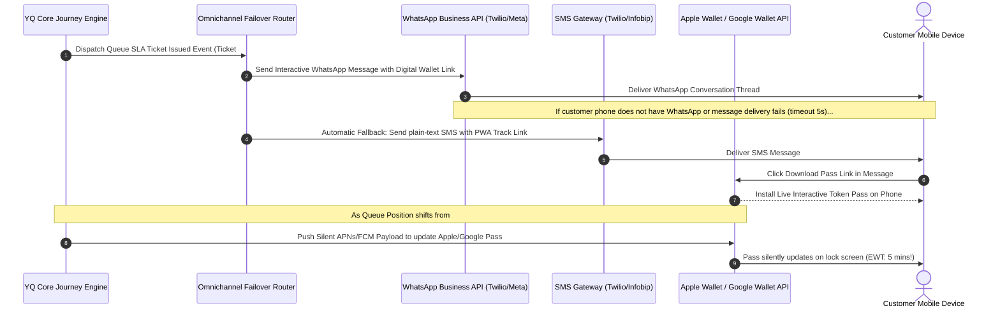

# Competitor Core Engine Deep Dive: Customer Journey & Omnichannel Messaging

> **Company Name:** `[INSERT COMPANY NAME]`
> **Primary Document Author:** Staff Software Architect, Senior Product Manager, & UX Researcher
> **Evaluation Focus:** WhatsApp Business API, SMS Fallback, Voice IVR, Apple/Google Wallet Passes, & Conversational AI

---

## 1. Omnichannel Gateway Architecture & Scope

`[Provide an extensive architectural teardown of how this competitor orchestrates external customer communications across the pre-visit, on-site queuing, and post-visit feedback journey.]`

---

## 2. Channel Integration & Conversational Sophistication

### 2.1 WhatsApp Business API Integration
* **Template vs. Conversational Capabilities:** `[Does the platform simply transmit unidirectional static notification alerts via WhatsApp, or does it utilize interactive message templates (Quick Reply buttons, Call-to-Action URLs, List Messages) enabling bidirectional customer control (e.g., clicking a button to instantly delay their appointment by 15 minutes)?]`
* **Gateway Providers & Resilience:** `[Identify underlying telecom communication providers via network inspection or integration docs—e.g., direct Meta Cloud API, Twilio, Infobip, MessageBird, or Gupshup. Evaluate webhook ingestion reliability for message delivery receipts (Delivered / Read).]`

### 2.2 SMS, Voice IVR, & Automated Email Workflows
* **SMS Global Delivery & Fallback Mechanics:** `[Document rate-limiting behavior, short code vs. long code sender ID implementations, and automatic escalation pathways when SMS messages fail to deliver due to carrier throttling.]`
* **Automated Voice Call & IVR Calling (Accessibility):** `[Evaluate auditory notification integration. Can elderly or visually impaired customers opt to receive automated phone text-to-speech (TTS) voice phone calls announcing when their queue number is approaching or when an appointment confirmation is required? Identify TTS voice synthesis quality and engines used (e.g., Amazon Polly, ElevenLabs, Google Cloud TTS).]`

---

## 3. Digital Wallet Pass Integration (Apple Wallet & Google Wallet)

### 3.1 Dynamic Pass Mechanics & Real-Time Push Updates
`[Deconstruct digital wallet token implementations. Digital wallet passes represent an elite, zero-install alternative to downloading a dedicated mobile App Store application.]`

* **Pass Construction & Visual Layout:** `[Analyze visual presentation, barcode formatting (QR vs. Aztec vs. Code128), and brand customization options on Apple (.pkpass) and Google Wallet items.]`
* **Live Update Orchestration:** `[Determine how live queue position changes and estimated wait time decreases are updated directly onto the smartphone lock screen. Document the architecture of silent background push notifications sent via Apple Push Notification service (APNs) and Google Firebase Cloud Messaging (FCM) to alter pass JSON data in real-time. Label L1-L4.]`

---

## 4. Post-Visit Feedback & Closed-Loop CX Analytics

* **Automated Post-Service Survey Ingestion:** `[Examine how customer interactions transition to post-visit evaluation upon ticket closure. Does the messaging gateway instantly fire an interactive Net Promoter Score (NPS), Customer Satisfaction (CSAT), or free-text qualitative survey via WhatsApp or SMS within 30 seconds of exit?]`
* **Real-Time Managerial Escalation Loops:** `[If a customer replies with an NPS rating under 4 or negative feedback keywords, does the platform possess automated alert webhooks to instantly notify a branch manager via SMS or Slack to enable direct service recovery before the customer leaves the building?]`

---

## 5. Technical Debt & Strategic Opportunities for YQ

* **Competitor Weakness / Technical Debt:** `[Identify rigid SMS-only communication, lack of WhatsApp interactivity, static email formatting, high telecom usage markups, and absence of live updating Apple/Google Wallet tokens.]`
* **YQ Superior Engineering Blueprint:** `[Detail YQ's solution—such as constructing an omnichannel routing engine with multi-gateway cost-routing, conversational AI receptionist agents on WhatsApp, and rich live-updating Apple Wallet passes displaying real-time countdown progress meters.]`
