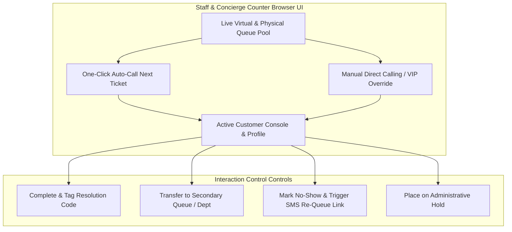

# Competitor Core Engine Deep Dive: Staff Concierge & Agent Workspace

> **Company Name:** `[INSERT COMPANY NAME]`
> **Primary Document Author:** UX Researcher, Senior Product Manager, & Staff Software Architect
> **Evaluation Focus:** Reception Concierge Controls, Service Counter Execution UI, Queue Transfers, & Manager Overrides

---

## 1. Staff Workspace Architectural & UX Overview

`[Provide a comprehensive operational and user-experience teardown of the frontend client workspace utilized by front-desk receptionists, service counter staff, triage nurses, and facility branch managers.]`

---

## 2. Service Counter Desk Controls (Agent UI)

### 2.1 Ergonomics, Interaction Speed, and Cognitive Load
* **Interface Fluidity & Layout Architecture:** `[Evaluate UI ergonomics for high-volume environments (e.g., bank teller desks, busy DMV counters). Can staff complete a standard consultation loop—Call Next -> Verify Profile -> Add Transaction Notes -> Complete & Call Next—entirely via keyboard shortcuts without reaching for a mouse? Rate cognitive load from 1 to 5.]`
* **Real-time Latency & State Syncdom:** `[When an agent clicks "Call Next", what is the exact observable network delay before the lobby TV display screen chimes and the customer's phone receives an SMS/WhatsApp notification? Document WebSocket responsiveness and error state handling during server lag.]`

### 2.2 Customer Profile Enrichment & CRM Integration
* **360-Degree Context View:** `[When a ticket or appointment is called to a counter, does the workspace display an enriched customer profile (e.g., past interaction history, lifetime value, loyalty tier, previous unresolved tickets, and uploaded pre-visit documents)?]`
* **CRM Window Integration:** `[Examine pre-built integration methods for external CRM portals (e.g., Salesforce Service Cloud, Zendesk, Dynamics 365). Does the staff application run as an embedded iframe inside Salesforce, or does it utilize automated screen-pop routing to launch customer CRM tabs upon calling a ticket?]`

---

## 3. Advanced Concierge & Triage Reception Controls

### 3.1 Receptionist Intake & Multi-Service Routing
* **Walk-In Triage Efficiency:** `[Analyze the specialized lobby concierge interface used by greeters equipped with tablet devices at building entrances. How rapidly can a greeter look up an existing appointment or insert a walk-in customer into a priority virtual queue?]`
* **Complex Multi-Service Assignment:** `[Can a concierge assign a single walk-in customer to a complex chained sequence of services (e.g., VIP Banking Concierge: Step 1: Safety Deposit Box Access -> Step 2: Wealth Advisor Consultation -> Step 3: Notary Verification) in a single unified interaction workflow? Deconstruct routing execution mechanics.]`

---

## 4. Branch Manager Supervision & Live Override Console

### 4.1 Real-Time SLA Monitoring & Interventions
* **SLA Threshold Alerts:** `[Analyze live manager dashboards. Does the console display real-time heatmaps of waiting room overcrowding, counter utilization rates, and SLA violation countdown timers (e.g., flashing visual alerts when any wait time exceeds 25 minutes)?]`
* **Dynamic Counter Re-Allocation:** `[Evaluate managerial operational controls. When an unexpected walk-in surge occurs in "General Billing", how effortlessly can a branch manager execute an administrative override to instantly reassign three back-office agents or "Loan Applications" counters to begin calling Billing tickets? Is this routing change reflected instantaneously on the agents' desktop screens via websocket pushes without requiring page refreshes?]`

---

## 5. Technical Debt & Strategic Opportunities for YQ

* **Competitor Weakness / Technical Debt:** `[Identify cluttered legacy window layouts, heavy reliance on mouse clicking, lack of keyboard shortcuts, delayed screen updates, poor CRM integration, and lack of real-time managerial supervisory tools.]`
* **YQ Superior Engineering Blueprint:** `[Detail YQ's solution—such as designing a slick, dark-mode/light-mode reactive counter workspace built in React/Vite with sub-50ms WebSocket updates, exhaustive customizable keyboard shortcut navigation, automatic Salesforce/Zendesk screen pops, and an AI-assisted dynamic manager alert engine.]`
