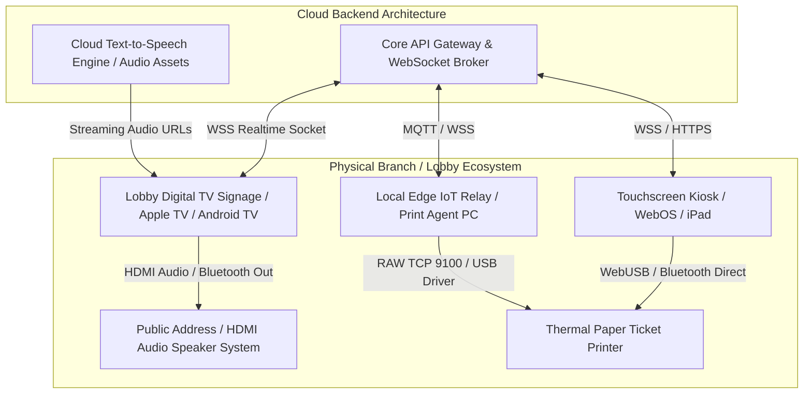

# Competitor Core Engine Deep Dive: Hardware Kiosk & Signage Ecosystem

> **Company Name:** `[INSERT COMPANY NAME]`
> **Primary Document Author:** Staff Software Architect & UX Researcher
> **Evaluation Focus:** Touch Kiosk Hardware, Lobby Digital Signage, Audio Calling Systems, & Local Edge Printing

---

## 1. Hardware & IoT Ecosystem Architecture

`[Provide an engineering breakdown of how this competitor interacts with physical premise infrastructure: walk-in kiosk kiosks, thermal ticket printers, lobby TV displays, and acoustic voice call-out systems.]`

---

## 2. Physical Touch Kiosk Terminal Solutions

### 2.1 Hardware Interoperability & Vendor Lock-In
* **Proprietary vs. Open Agnostic Platforms:** `[Assess whether the competitor mandates purchasing expensive proprietary kiosk enclosures and customized touchscreen hardware directly from them (e.g., legacy Qmatic kiosks), or if they deploy open modern web app kiosks running on enterprise iPads, Android tablets, or standard Windows/Linux touchmonitors. Label L-Rating.]`
* **Kiosk OS Lock-down & Kiosk Mode Execution:** `[Document recommendations or MDM (Mobile Device Management) profiles utilized to prevent public users from exiting the ticketing application, browsing the web, or accessing system operating system controls.]`

### 2.2 Thermal Ticket Printing Protocols
`[Thermal paper printing remains a critical vulnerability in cloud-first SaaS deployments due to network perimeter security blocking cloud servers from initiating direct printing commands to local IP printers.]`
* **Local Printing Topology:** `[Deconstruct printer command orchestration. Does the platform utilize:
  (a) **WebUSB / WebBluetooth APIs** enabling browser-based tablet kiosks to communicate directly with thermal receipt printers (e.g., Star Micronics, Epson, Zebra) without servers?
  (b) **Dedicated IoT Edge Relays / Local Windows Background Services** installed on a receptionist PC that continuously polls the cloud via MQTT/WSS and translates jobs into RAW printer port 9100 TCP instructions?
  (c) **Direct Cloud-to-IP Printer Webhooks** utilizing vendor IoT printing protocols? Include L-Rating.]`
* **Paper-Out & Kiosk Fault Monitoring:** `[Does the cloud administrative console alert remote facilities managers when a physical kiosk touchscreen goes offline, battery drains, or when thermal receipt printer paper rolls are near exhaustion via SNMP or status heartbeats?]`

---

## 3. Lobby Digital Signage & TV Display Consoles

### 3.1 Signage Engine Capabilities & Visual Layouts
* **Signage Hardware Support:** `[Evaluate deployment options for waiting room television screens. Does the platform provide native streaming apps for Apple TV, Amazon Firestick, Android TV, Samsung Tizen / LG WebOS, or does it operate via a simple full-screen web browser URL loaded on a mini PC?]`
* **Multi-Zone Visual Customization:** `[Examine visual canvas flexibility. Can marketing managers divide the 4K television display into dynamic split zones—such as displaying active ticket queue call numbers in the left column, estimated wait times in the footer, and full-motion promotional video advertising or RSS news feeds in the right content window?]`

### 3.2 Auditory Callout & Voice Chimes (TTS Engine)
* **Acoustic Orchestration:** `[Analyze how audible queue announcements are broadcast through lobby speaker networks when an agent hits "Call Next".]`
* **Speech Synthesis (TTS) Versatility:** `[Does the system emit simple bell chimes coupled with pre-recorded static numerical audio snippets, or does it integrate dynamic cloud Text-to-Speech (TTS) neural voice synthesis capable of pronouncing complex customer names in 30+ regional languages and dialects (e.g., "Now serving Mr. Jonathan Smith at Counter Number Four")? Where is audio decoding rendered—on the local signage device or pre-rendered in cloud storage? Rate L-Level.]`

---

## 4. Technical Debt & Strategic Opportunities for YQ

* **Competitor Weakness / Technical Debt:** `[Identify restrictive hardware vendor lock-in, unreliable local printer drivers, clumsy signage setup requiring expensive dedicated PC hardware, and robotic legacy voice announcements.]`
* **YQ Superior Engineering Blueprint:** `[Detail YQ's solution—such as providing a completely hardware-agnostic, zero-configuration PWA kiosk app supporting direct WebUSB thermal printing, native Apple TV & WebOS apps with smooth micro-animations, and integrated neural AI speech synthesis (ElevenLabs/OpenAI Audio API) for natural-sounding lobby announcements.]`
