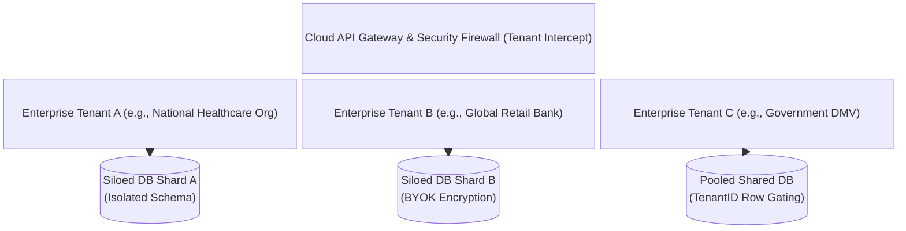

# Competitor Evaluation Template: Enterprise Readiness, Security, & Compliance

> **Company Name:** `[INSERT COMPANY NAME]`
> **Primary Document Author:** Enterprise SaaS Consultant & Staff Software Architect
> **Evaluation Date:** `[YYYY-MM-DD]`

---

## 1. Multi-Tenancy Architecture & Data Isolation Models

`[Provide an exhaustive analysis of how this competitor structures tenancy isolation across enterprise deployments. Differentiate between pooled storage models and isolated single-tenant compute or database shards.]`

### 1.1 Tenant Isolation Architecture Deconstruction
* **Data Sharding Model:** `[Assess whether the backend architecture enforces:
  (a) **Pooled Schema:** All enterprise tenants reside inside a single massive relational database table set separated only by a WHERE TenantID = 'UUID' row filtering constraint.
  (b) **Isolated Schemas:** Every enterprise organization receives a dedicated relational database schema (e.g., Postgres Schema) within a shared instance.
  (c) **Siloed Database Instances:** High-security enterprise accounts receive totally isolated dedicated database instances (e.g., dedicated AWS Aurora Cluster or MongoDB Atlas shard). Tag with L1-L4 confidence rating.]`
* **Custom Customization & Config Extensibility:** `[Evaluate how enterprise clients customize branding, operational business rules, data retention policies, and language localization across individual branches without corrupting global tenant inheritance structures.]`

---

## 2. Authentication, Identity Federation, and SCIM Auto-Provisioning

### 2.1 Enterprise SSO & Federated Identity
* **Supported Protocols:** `[Document support for Security Assertion Markup Language (SAML 2.0) and OpenID Connect (OIDC).]`
* **Identity Provider (IdP) Interoperability:** `[Confirm enterprise interoperability with Okta, Microsoft Entra ID (formerly Azure AD), Ping Identity, OneLogin, and Duo Security.]`
* **SCIM 2.0 User Auto-Provisioning:** `[Evaluate Automated user lifecycle management via SCIM (System for Cross-domain Identity Management). When an employee terminates employment in Microsoft Entra ID or Okta, does the competitor's cloud engine immediately and automatically revoke active dashboard logins and API access tokens across all branches? Include L-Rating.]`

---

## 3. Role-Based (RBAC) & Attribute-Based (ABAC) Access Control

### 3.1 Permission Hierarchy Deconstruction
`[Deconstruct the granularity of internal access controls governing staff, receptionists, branch supervisors, and corporate compliance executives.]`

* **Standard Static Roles (RBAC):** `[Detail out-of-the-box user role groups: e.g., Super Administrator, Regional Director, Branch Manager, Triage Greeter, Counter Agent, and Read-Only Auditor.]`
* **Attribute-Based Dynamic Governance (ABAC):** `[Determine if the authorization engine permits fine-grained policy evaluation based on operational context attributes—such as restricting an agent's access to view patient medical appointment records unless their physical IP address matches the specific hospital branch network AND their active login shift time matches the branch operating schedule.]`

---

## 4. Regulatory Compliance, Encryption, & Data Governance

### 4.1 Global Regulatory Certifications
* **SOC2 Type II:** `[Confirm audit report availability covering Security, Availability, Processing Integrity, Confidentiality, and Privacy trust services criteria.]`
* **HIPAA / HITECH Compliance:** `[Evaluate healthcare readiness. Does the competitor formally execute Business Associate Agreements (BAAs) with covered entities? How does the database isolate and encrypt Protected Health Information (PHI) within appointment notes or visitor intake questionnaires?]`
* **GDPR & CCPA Data Governance:** `[Analyze compliance with European and California privacy regulations. Does the platform provide automated self-serve admin endpoints to execute "Right to be Forgotten" (erasure of all historical visitor/queue records linked to an email or phone number) within mandated timeframes?]`

### 4.2 Cryptography & Key Management
* **Data Encryption Standards:** `[Verify encryption algorithms at rest (e.g., AES-256) and in transit (TLS 1.3 enforcement; deprecation of legacy TLS 1.0/1.1).]`
* **BYOK / CMK (Customer-Managed Key) Support:** `[Determine if top-tier enterprise customers can connect their own AWS KMS or Azure Key Vault hardware security modules (HSMs) to manage and revoke database encryption keys independently of the SaaS vendor.]`

---

## 5. Audit Logging & SIEM Security Integration

* **Immutable Audit Trails:** `[Evaluate logging capabilities. Does the system record an immutable audit log entry for every administrative action, configuration change, user data export, and login failure?]`
* **SIEM Webhook & Stream Integration:** `[Determine if audit log streams can be natively exported in real-time to corporate Security Information and Event Management (SIEM) consoles such as Splunk, Datadog Security, Databricks, or IBM QRadar via syslog or EventBridge.]`

---

## 6. Technical Debt & Strategic Opportunities for YQ
`[Synthesize security and enterprise architectural gaps in this competitor and map YQ's superior enterprise compliance roadmap.]`
