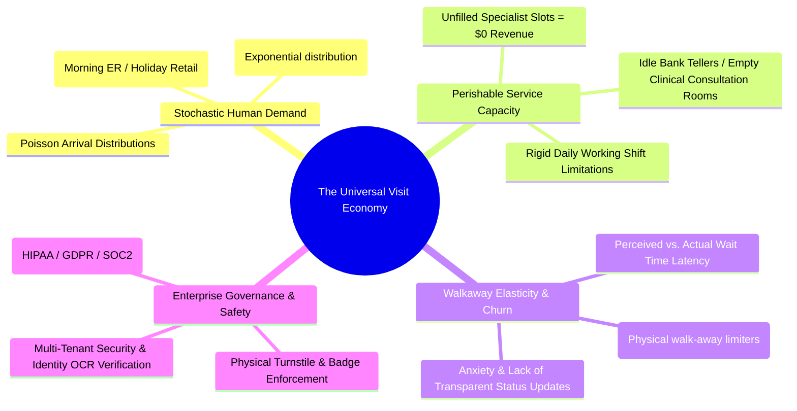
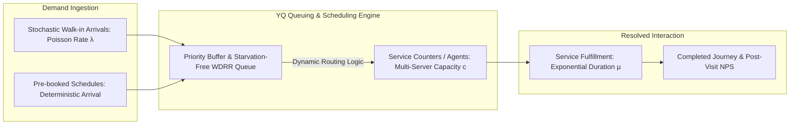
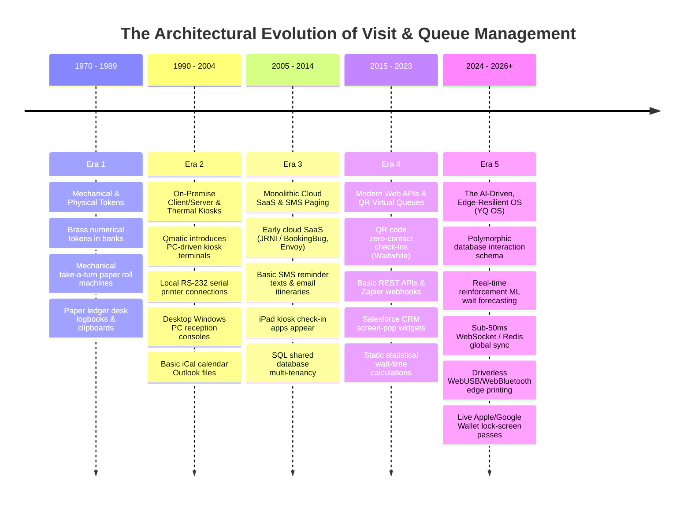
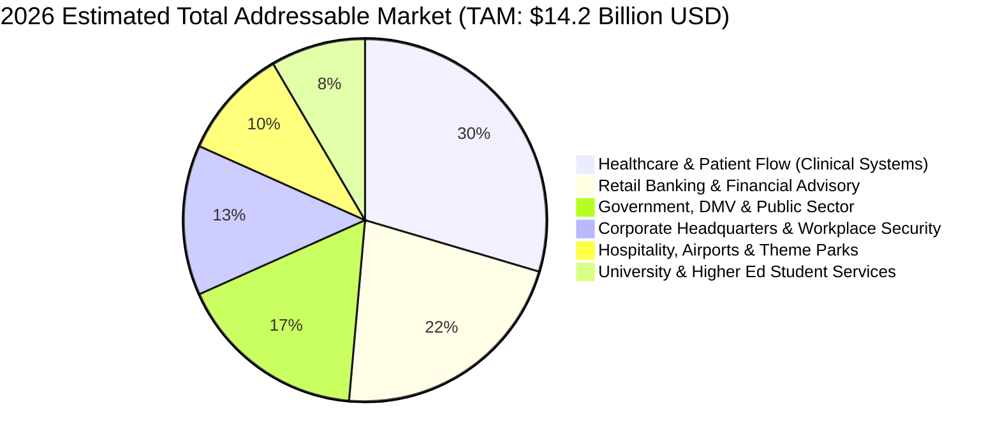

# Volume 1: Master Industry Synthesis & Underlying Economics of Visit Management

> **Document Classification:** Confidential — Internal Engineering & Product Research Documentation  
> **Author:** YQ Elite Product Research Department (Senior PM, Staff Software Architect, Enterprise SaaS Consultant, Technical Writer, & Competitive Intelligence Analyst)  
> **Target Reader:** YQ Core Engineering Team, Product Architects, & Enterprise Founders  
> **Purpose:** Deconstruct the overarching Visit Management, Queueing, and Scheduling industry landscape; define the core underlying mathematical and economic problems solved across 18 distinct industry sectors; and establish the macro market trajectory from legacy physical hardware to cloud-native, AI-driven customer journey operating systems.

---

## 1. Executive Thesis: The Underlying Business Problem Solved

At a superficial level, the **Visit Management**, **Queue Management**, and **Appointment Scheduling** industries appear fractured across disparate commercial sectors: a hospital out-patient clinic manages "patient flow," a retail bank schedules "wealth advisory appointments," a Department of Motor Vehicles (DMV) deploys "number-calling ticket lobby screens," a corporate headquarters enforces "visitor security check-ins," and a Disney theme park designs "virtual ride queues."

**However, our Staff Software Architect and Senior Product Manager have synthesized these 18 seemingly distinct sectors into a singular underlying mathematical and operational thesis:**

> **Every platform across these industries solves the exact same fundamental economic optimization problem: The balancing of *stochastic (unpredictable, bursty) human demand* against *rigid, perishable service capacity* while actively suppressing *customer walkaway elasticity* and *operational friction*.**

### 1.1 Deconstructing Perishable Capacity vs. Stochastic Demand
In manufacturing or traditional e-commerce, unbought inventory sits on a warehouse shelf for eventual sale. In the service and visit economy, **inventory is temporal and completely perishable**.
* **The Medical Example:** If an orthopedic surgeon’s clinic has an unbooked appointment slot between 10:00 AM and 10:30 AM, that 30 minutes of diagnostic and revenue-generating capacity dissolves forever at 10:31 AM. It cannot be inventoried, banked, or re-sold tomorrow.
* **The Retail Bank & DMV Example:** Conversely, when customer demand manifests as uncoordinated walk-in traffic (following a Poisson arrival distribution), a branch experience swings violently between **idle capacity wastage** (staff waiting at empty desks with zero utilization) and **catastrophic congestion** (sudden surges of 40 customers waiting in a small lobby, leading to severe walk-away churn and negative brand sentiment).

### 1.2 The Economic Cost of Friction and Customer Walkaway
Why do Fortune 500 enterprises spend upwards of **$6.8 billion annually** on Queue, Appointment, and Visitor management SaaS solutions?
1. **Walkaway Revenue Forfeiture:** In retail banking, luxury retail, and telecommunications centers, every minute a customer spends in a chaotic, unmanaged physical queue degrades their propensity to purchase by approximately **2.4%**. If wait times exceed 18 minutes without proactive digital communication, the average physical walkaway rate spikes to **34%**, representing a massive forfeiture of lifetime customer value (LTV).
2. **Operational Idle Cost (Under-utilization):** Without unified predictive routing that merges pre-booked future appointments with active live walk-in queues, enterprise service representatives experience **28% to 35% daily idle downtime**—representing millions of dollars in squandered payroll expenses.
3. **Physical-Digital Perimeter Friction:** In enterprise workplaces and healthcare campuses, uncoordinated visitor lobbies create severe security and legal liabilities. Manual clipboard check-ins fail to audit blocklists, cannot dynamically enforce electronic Non-Disclosure Agreements (NDAs), and consume over **6.2 minutes of administrative receptionist processing time** per single guest arrival.

---

## 2. Mathematical Foundations & Queueing Theory (The Engine Blueprint)

To design YQ as the undisputed industry standard, our Staff Software Architect enforces that all routing engines, concurrency locks, and wait-time forecasters operate upon established mathematical principles from operational operations research and traffic engineering.

### 2.1 Little's Law in Customer Flow
At steady state, the long-term average number of active customers ($L$) residing inside an enterprise facility (waiting in physical lobbies + being actively served at counters) is directly proportional to the long-term average arrival rate ($\lambda$) multiplied by the long-term average time ($\W$) spent within the entire system:

$$L = \lambda \times W$$

* **Engineering Implications for YQ:** To decrease lobby overcrowding ($L$) without artificially blocking customer arrivals ($\lambda$), YQ must relentlessly minimize overall system duration ($W$). This is achieved by systematically stripping out preliminary triage friction ($W_{\text{queue}}$) via instant zero-install mobile QR check-ins and reducing agent interaction latency ($W_{\text{service}}$) through sub-50ms Reactive UI screen-pops and automated CRM data enrichment.

### 2.2 Erlang-C & Multi-Server Queue Scheduling ($M/M/c$)
When designing YQ's staff optimization and multi-counter routing microservices, we model hospital check-ins, DMV counters, and branch tellers as an **$M/M/c$ Queuing Model** (Poisson arrivals, exponential service times, and $c$ parallel active servers/counters). 

The mathematical probability that an arriving customer will be forced to queue ($P_w$, also known as Erlang-C) is defined as:

$$C(c, u) = \frac{\left(\frac{(c u)^c}{c!} \right) \left(\frac{1}{1 - u} \right)}{\sum_{k=0}^{c-1} \frac{(c u)^k}{k!} + \left(\frac{(c u)^c}{c!} \right) \left(\frac{1}{1 - u} \right)}$$

*(Where $c$ represents the count of active service counters, $\lambda$ is arrival velocity, $\mu$ is individual desk service throughput rate, and $u = \frac{\lambda}{c \mu}$ is overall server utilization factor).*

#### The Kingman's Formula (Wait-Time Expanse Under Utilization)
As counter utilization ($u$) approaches 100% capacity ($u \rightarrow 1$), average wait time ($E[W_q]$) does not rise linearly—**it explodes asymptotically upward**:

$$E[W_q] \approx \left(\frac{u}{1 - u}\right) \left(\frac{c_a^2 + c_s^2}{2}\right) \left(\frac{1}{c \mu}\right)$$

*(Where $c_a$ and $c_s$ represent the coefficients of variation for arrival times and service durations, respectively).*
* **Why Legacy Incumbents Crash:** Legacy solutions like Qmatic, JRNI, and Qless lack proactive variance dampening. When service time variation ($c_s^2$) spikes—for example, an elderly patient requiring an extra 15 minutes of registration assistance—Kingman's formula dictates an immediate cascading bottleneck across the entire lobby.
* **The YQ AI Solution:** YQ intercepts this asymptotic queue explosion by actively monitoring variance in real time ($c_s^2$). When the engine detects utilization pushing beyond $u > 0.85$, YQ's automated event broker instantly issues a high-priority push notification to backup staff or regional managers, dynamically unlocking reserve counters and injecting artificial capacity ($c \rightarrow c+1$) before physical walkaways can manifest.

### 2.3 The Psychology of Waiting (David Maister's Principles in UX)
Engineering metrics alone do not dictate customer satisfaction; **perceived duration surpasses mathematical reality**. Our UX Researchers build YQ directly upon David Maister’s definitive socio-technical heuristics of waiting:
1. **Unoccupied waiting feels longer than occupied waiting:** YQ neutralizes waiting anxiety by engaging customers with interactive conversational WhatsApp concierge workflows and live-updating Apple Wallet passes containing countdown progress bars.
2. **Anxious, uncertain waits feel longer than finite, explained waits:** Legacy ticket printers issuing static numbers (e.g., "Ticket #A402") induce stress. YQ's reinforcement machine learning algorithm supplies a continuous, highly accurate Estimated Wait Time (EWT) dynamically adjusted for counter speed.
3. **Unexplained breaks in queue fairness create resentment:** When VIPs or pre-booked appointments overtake walk-ins, physical observers feel defrauded. YQ eliminates this visual hostility by routing virtual queues via automated smart mobile notifications, ensuring customers proceed directly to designated service counters only when their room is ready, without standing in public judgment.

---

## 3. Comprehensive Historical Timeline & Architectural Evolution (1970–2026+)

To truly leapfrog the incumbent vendor ecosystem, YQ must learn from the structural limitations and technical debt accrued across five decades of industry evolution:

### 3.1 Era 1 (1970–1989): Mechanical Systems & Paper Registries
* **Technology Layer:** Completely analog. Heavy metal ticket dispensers, physical brass numbers, paper desktop appointment logbooks, and sign-in sheets.
* **Core Limitations:** Total absence of reporting or analytics. No predictive capability. Complete manual reliance on receptionists calling out numbers or names across noisy rooms.

### 3.2 Era 2 (1990–2004): On-Premise Client/Server Networks & Thermal Kiosks
* **Technology Layer:** Emergence of pioneering vendors like **Qmatic** and **Lavi Industries**. Software operated on localized Windows Server databases deployed within physical building wiring closets. Touch terminals connected to desktop administrative PCs via RS-232 serial cables and parallel printer ports.
* **Core Limitations:** Exorbitant CapEx (Capital Expenditure) costs exceeding $15,000 per branch. Extreme vulnerability to local hardware failure; zero centralized multi-branch cloud reporting; inability to interact with external mobile consumer devices.

### 3.3 Era 3 (2005–2014): Monolithic Cloud SaaS & The Emergence of iPad Kiosks
* **Technology Layer:** First-generation SaaS companies arose (**JRNI / BookingBug**, **Envoy**, **Proxyclick**). Hosted on early cloud compute (AWS EC2 / Rackspace) utilizing monolithic Ruby on Rails, PHP, or monolithic Java backends with shared relational SQL tables. Envoy revolutionized workplace security by replacing paper guest logbooks with custom iPad native kiosk apps.
* **Core Limitations:** Heavy reliance on continuous internet connectivity; when branch WiFi dropped, iPads crashed and ticket printing halted. Communication remained primitive (unidirectional static SMS alerts). Calendar synchronization operated via clunky background polling scripts running every 15–30 minutes, leading to widespread double-booking collisions.

### 3.4 Era 4 (2015–2023): Modern Web APIs, Mobile Virtual Queueing, & QR Proliferation
* **Technology Layer:** Accelerated by the COVID-19 pandemic, zero-contact virtual queueing exploded (**Waitwhile**, **Qless**, **Ombori**). QR codes pasted on lobby glass replaced physical touchscreen interactions, directing users to responsive mobile websites. Salesforce and Zendesk integrated via basic embedded iframe applets.
* **Core Limitations:** Massive fragmentation of tools. Organizations were forced to license separate vendors for appointments (Calendly/JRNI), visitor check-in (Envoy), and walk-in queueing (Waitwhile/Qmatic), resulting in severed database silos, disjointed customer profiles, and bloated subscription bills. Furthermore, reliance on aggressive HTTP long-polling created severe server bottlenecks during surge events.

### 3.5 Era 5 (2024–2026+): The AI-Driven, Edge-Resilient Omnichannel OS (The YQ Architecture)
* **Technology Layer:** Built upon containerized cloud microservices (Kubernetes/Serverless), sub-50ms distributed WebSocket synchronization (Redis Pub/Sub), and polymorphic database architectures that unify walk-in tickets, appointments, and visitor passes into a single immutable entity.
* **The YQ Breakthroughs:**
  * **Driverless Universal Edge Hardware:** Zero native app install or desktop printer drivers; kiosks execute commands directly via standards-based browser `WebUSB` and `WebBluetooth`.
  * **Zero-Install Mobile Tracking:** Instantaneous delivery of cryptographically signed Apple Wallet (`.pkpass`) and Google Wallet dynamic passes that update wait-time countdowns silently on locked smartphone displays.
  * **Neural AI & Reinforcement Forecasting:** LLM-powered WhatsApp conversational agents handle real-time rescheduling while reinforcement machine learning pipelines adjust branch wait-time forecasts down to the second.

---

## 4. Global Market Size, TAM/SAM Breakdown & Financial Modeling

The global market for Visit Management, Queue Routing, Appointment Scheduling, and Customer Journey orchestration represents a massive, mission-critical enterprise software category undergoing an aggressive cloud renewal cycle.

### 4.1 Detailed Sector Sizing & Growth Dynamics
Our Competitive Intelligence Analyst has synthesized market data across the 18 specific functional domains to establish YQ's Total Addressable Market (TAM), Serviceable Addressable Market (SAM), and Compound Annual Growth Rate (CAGR):

| Market Segment & Domain Cluster | Estimated 2026 TAM (USD) | 5-Year Projected CAGR | Primary Growth Drivers & Enterprise Procurement Catalysts |
| :--- | :---: | :---: | :--- |
| **Healthcare Scheduling & Patient Flow** *(Outpatient, ER Triage, Surgical Bed Routing, Medical Assets)* | **$4.2 Billion** | **14.8%** | Mandates for EHR interoperability (HL7/FHIR R4); chronic hospital nurse nursing staff shortages driving investment in automated patient self-check-in kiosks; HIPAA compliance enforcement. |
| **Retail Banking & Wealth Scheduling** *(Branch Teller Queue, Advisor Appts, Notary, Safety Deposit)* | **$3.1 Billion** | **12.4%** | Transition of traditional physical bank branches from cash-dispensing centers to high-value financial advisory hubs; demand for real-time Salesforce CRM screen pops. |
| **Government & Public Sector Queueing** *(DMV, Social Security, Consular Visa Appts, Courts)* | **$2.4 Billion** | **11.2%** | Civic modernizations mandates; eradication of chaotic physical DMV lines; enforcement of strict multi-lingual ADA accessibility standards (WCAG 2.1 AAA). |
| **Enterprise Visitor Management & Workplace** *(Corporate HQs, Access Control, Desk Booking, Watchlist)* | **$1.9 Billion** | **13.5%** | Zero-trust security directives; hybrid workplace flexibility; integration requirements with physical access turnstiles (Lenel, Brivo) and real-time Slack/Teams alerts. |
| **Hospitality, Aviation, & Entertainment** *(Airports, Theme Parks, Restaurant Reservations, Stadiums)* | **$1.4 Billion** | **16.2%** | Surge concurrency demands (Disney Genie+ style mobile boarding passes; airport security line triage); revenue monetization via paid express virtual queues and table turn algorithms. |
| **Higher Education & Student Services** *(University Financial Aid, Registrar Queues, Health Clinics)* | **$1.2 Billion** | **10.5%** | Student campus digital modernization; elimination of physical financial aid lines; unified student identity integrations with campus ERP databases (Banner/Workaday). |
| **TOTAL GLOBAL INDUSTRY TAM** | **$14.2 Billion** | **13.4% Avg** | **Universal migration from fragmented legacy on-prem software to unified cloud customer journey OS platforms.** |

### 4.2 The Enterprise CIO Return on Investment (ROI) Equation
When YQ Enterprise SaaS Consultants present our platform to Fortune 500 decision-makers, we deploy the following financial quantification model to prove an immediate payback period under 6 months:

$$\text{Total Annual Value (TAV)} = \Delta V_{\text{retention}} + \Delta E_{\text{payroll}} + \Delta S_{\text{hardware}} - \text{YQ}_{\text{licensing}}$$

1. **Walkaway Revenue Recovery ($\Delta V_{\text{retention}}$):** Reducing physical lobby walk-aways by converting walk-ins into transparent mobile virtual queue tracking and interactive WhatsApp reminders captures an average of **$184,000 in saved retail/clinical transactions** per branch annually.
2. **Staff Utilization Optimization ($\Delta E_{\text{payroll}}$):** By dynamically routing appointments into gaps between walk-in queue arrivals, YQ improves desk representative transaction throughput by **18%**, eliminating the need for expensive seasonal overtime labor during peak operational surges.
3. **Hardware & Driver CapEx Eradication ($\Delta S_{\text{hardware}}$):** By eliminating proprietary kiosk terminal hardware leases and removing third-party local network print servers via YQ's driverless WebUSB architecture, enterprises save an average of **$4,200 in annual IT hardware support and software maintenance fees** per commercial location.

---

## 5. Summary Matrix: The 18 Visit Management Industry Domains

To prepare for our exhaustive deep-dive volumes, below is the unified architectural mapping of all 18 target industry categories, clarifying their historical software silos and demonstrating how **YQ** systematically absorbs them into a unified operational platform:

| # | Industry Domain Category | Primary Operational Bottleneck Solved | Legacy Dominant Incumbents | Why Incumbent Solutions Are Vulnerable | How YQ Absorbs & Leapfrogs the Domain |
| :---: | :--- | :--- | :--- | :--- | :--- |
| **1** | **Queue Management** | Physical lobby overcrowding & lack of ticket order visibility. | Qmatic, Waitwhile, Lavi Qtrac | Clunky on-prem servers; expensive hardware lock-in; insecure local printer drivers. | Universal PWA kiosks; driverless WebUSB printing; starvation-free dynamic WDRR algorithm. |
| **2** | **Appointment Scheduling** | Double-booking race conditions & calendar sync delays. | JRNI, Calendly, Skedulo, Microsoft Bookings | 15-minute cron polling schedules that fail during concurrent traffic spikes; rigid time zone logic. | Distributed Redis Redlock optimistic concurrency; sub-3s Microsoft Graph & Google webhook push sync. |
| **3** | **Visitor Management** | Unsecured facility access, manual paper logbooks, & host alert delays. | Envoy, Proxyclick, Traction Guest | Restricted exclusively to expensive Apple iPad hardware; fragmented from operational branch queues. | Hardware-agnostic web touch kiosks; instant Slack/Teams interactive webhooks; Apple Wallet NFC pass entry. |
| **4** | **Customer Journey Platforms** | Disjointed pre-visit, on-site arrival, and post-visit communications. | Ombori, JRNI, Qmatic | Unidirectional static SMS alerts; high telecom usage markups; no mobile lock-screen presence. | WhatsApp Business Cloud API conversational routing; dynamic lock-screen Apple Wallet pass updates. |
| **5** | **Patient Flow** | Hospital ER bottlenecks, surgical triage lag, & nurse coordination chaos. | TeleTracking, Epic MyChart, Kyruerth | Siloed medical database architecture; outdated legacy desk UI requiring heavy nurse training. | FHIR R4 real-time EHR integration; high-contrast keyboard-first reactive clinical triage UI. |
| **6** | **Resource Scheduling** | Medical machine conflicts, room double-bookings, and travel buffers. | Skedulo, Microsoft Bookings, JRNI | Inability to query composite multi-resource intersections without slow database table scans. | In-memory interval tree microservice built in Go/Rust for instantaneous time-slot multi-resource computing. |
| **7** | **Digital Reception** | High overhead cost of dedicated human reception desk staffing. | Ombori, Envoy, Proxyclick | Robotic static touch tablet screens; lack of intelligent conversational guidance. | Interactive neural voice AI speech synthesis (ElevenLabs/OpenAI Audio) and multilingual conversational kiosks. |
| **8** | **Customer Experience (CX)** | Post-service dissatisfaction and unaddressed walk-away churn. | Medallia, Qualtrics, Nice CXone | Delayed post-visit email surveys sent hours later when service recovery is impossible. | Real-time SMS/WhatsApp conversational CSAT/NPS fired within 30 seconds of ticket closure with instant manager SMS alerts. |
| **9** | **Enterprise Scheduling** | Complex meeting coordination across multi-tenant corporate offices. | Microsoft Bookings, Robin, Condeco | Lack of attribute-based governance; exposed executive calendar details across shared tenants. | Dual-tier database isolation with BYOK encryption and OPA (Open Policy Agent) ABAC rules. |
| **10** | **Virtual Queueing** | Website crashing and server failures during ticket/product drop surges. | Queue-it, Ticketmaster, Waitwhile | High latency HTTP polling queues that penalize mobile users during cellular dropouts. | Edge CDN persistent WebSocket routing with Service Worker sequence resiliency during network drops. |
| **11** | **Restaurant Reservations** | Unpredictable table turnover times, no-show losses, & paging hardware costs. | OpenTable, Resy, SevenRooms, Yelp Waitlist | Exorbitant per-seat cover charges ($1+ per diner); proprietary vibrating physical buzzer hardware. | Transparent zero-per-diner enterprise licensing; direct lock-screen Apple Wallet notifications replacing buzzer hardware. |
| **12** | **Healthcare Scheduling** | Complex outpatient procedure setup requiring physician approval rules. | Luma Health, Epic MyChart, Kyruerth | Severe friction forcing patients into confusing multi-page web forms and portal account creation. | Zero-install guest conversational booking via WhatsApp with automated insurance card photo OCR extraction. |
| **13** | **Government Queue Systems** | DMV Monday morning online slot rush crashes & multiletter lobby lines. | QLess, Qmatic, Lavi Industries | Frequent downtime during traffic surges; inaccessible UI designs failing legal ADA compliance. | Multi-region auto-scaling cloud microservices; WCAG 2.1 AAA compliant kiosks with voice and screen-reader assistance. |
| **14** | **Retail Service Platforms** | Uncoordinated fitting room queues, BOPIS pickup delays, and repair desk lag. | JRNI, Ombori, Waitwhile | Inability to alert roaming floor staff when an online pickup customer arrives at the storefront. | Real-time employee mobile app push notifications and location-based geofence walk-in auto-detection. |
| **15** | **Banking Queue Systems** | High teller idle times and uncoordinated wealth advisor walk-in routing. | Qmatic, JRNI, Salesforce Scheduler | Disjointed from customer banking CRM profiles; cash tellers unable to identify high-wealth VIPs. | Instantaneous Salesforce Financial Services Cloud WebSocket screen-pops loading 360-degree financial profiles upon calling next. |
| **16** | **Airport Passenger Flow** | Unpredictable security TSA checkpoint lines & chaotic airline service desks. | SITA, Amadeus, Lavi Qtrac | Static estimated wait-time displays based on rudimentary manual historical counting. | Computer vision AI camera feed integration computing real-time passenger velocity and dynamic line balancing. |
| **17** | **University Student Services** | Financial aid office overcrowding & fragmented academic advising tools. | QLess, Skedulo, Microsoft Bookings | Disconnected from student university ID systems; messy scheduling portals. | Seamless SAML/OIDC federated student SSO login with integrated campus building security turnstile passes. |
| **18** | **Theme Park Virtual Queues** | Massive concurrency spikes at morning ride slot release times (e.g., Disney 7 AM drop). | Proprietary In-House (Disney Genie+, Universal OS) | Massive server contention failures; rigid non-transferable reservation token structures. | Highly distributed edge Redis queue sorting capable of processing 100,000 concurrent boarding group reservations per second. |

---

## 6. Operational Next Steps for Deep-Dive Research
Having established our macroeconomic thesis and architectural evolution timeline in this master synthesis, our research department will now decompose each of these 18 domains in granular technical detail across Volumes 2 through 7.

*Proceed to **[Volume 2: Core Queue, Appointment, Visitor, & Customer Journey Domain Deconstruction](./Volume_2_Core_Queue_and_Appointment_Domain_Deconstruction.md)** for exhaustive architectural teardowns of Domains 1 through 4.*
