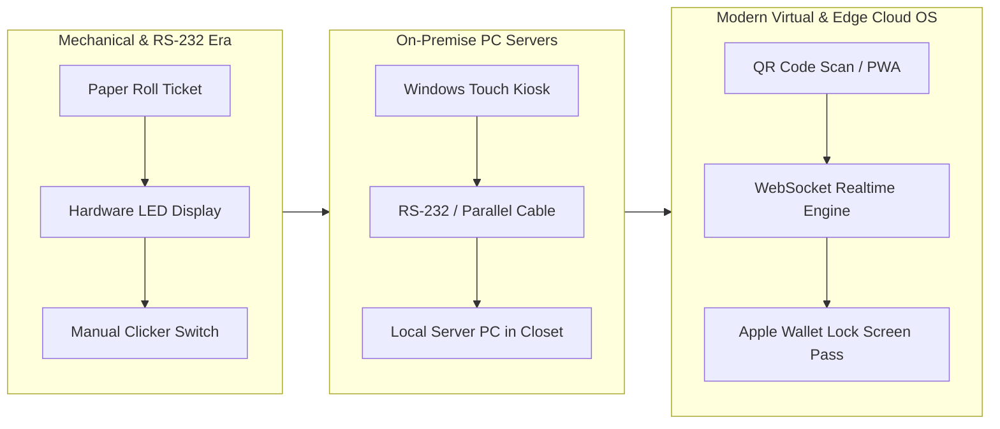
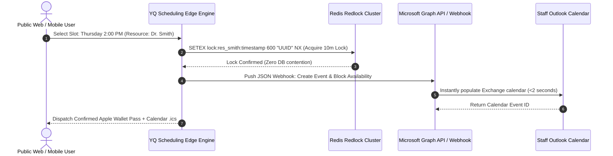
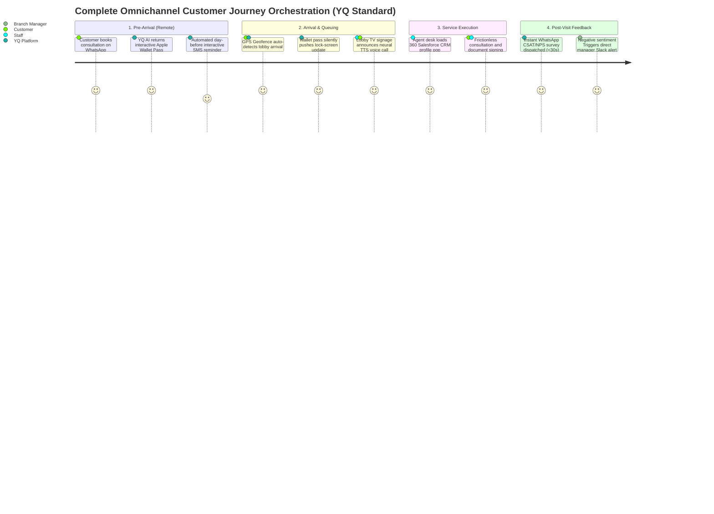

# Volume 2: Core Queue, Appointment, Visitor, & Customer Journey Domain Deconstruction

> **Document Classification:** Confidential — Internal Engineering & Product Research Documentation  
> **Author:** YQ Elite Product Research Department (Staff Software Architect, Senior Product Manager, UX Researcher, Enterprise SaaS Consultant, & Competitive Intelligence Analyst)  
> **Target Reader:** YQ Engineering Architects & Product Strategists  
> **Purpose:** Exhaustively analyze the four foundational pillars of the Visit Management industry: **Queue Management**, **Appointment Scheduling**, **Visitor Management**, and **Customer Journey Platforms**. Deconstruct their history, evolution, architectural categories, underlying business problems solved, enterprise adoption mechanics, major incumbent vendors, and future AI engineering horizons.

---

## Domain 1: Queue Management Systems

### 1.1 History & Evolution
Queue Management systems originated in the physical commercial banking and postal sectors during the mid-20th century. Early implementations relied on mechanical numerical roll dispensers ("Take-a-Turn") paired with elevated red LED segment displays controlled via hardware clickers at teller counters. 

In the late 1980s, legacy vendors such as **Qmatic** and **Lavi Industries** introduced early computing logic: dedicated DOS and Windows PC servers connected to specialized thermal ticket printers via physical RS-232 serial cabling. 
* **The Cloud & Virtualization Shift (2010–Present):** With the saturation of smartphones and the catalyst of post-2020 zero-contact mandates, the industry bifurcated into physical hardware kiosks and cloud-native **Virtual Queues** (led by platforms like **Waitwhile**, **Qless**, and **Ombori**). Instead of printing paper tokens, visitors scan lobby QR codes via smartphone cameras, entering virtual cloud waiting rooms that communicate status via SMS.



### 1.2 Structural Categories & Architectural Taxonomies
Modern Queue Management architectures divide into three structural categories:
1. **On-Premise Proprietary Hardware Ecosystems:** Systems requiring dedicated localized servers, proprietary commercial touchscreen terminal enclosures ($3,000–$8,000 CapEx per unit), and closed network printing drivers (e.g., traditional Qmatic Orchestrate deployments).
2. **Pure Cloud-Native Virtual Queueing:** Zero-hardware platforms relying entirely on mobile browser web apps, SMS gateways, and lobby Apple TV display casting (e.g., Waitwhile, Waitr).
3. **Hybrid Edge-Resilient Orchestration (The YQ Target Model):** Cloud-native backend infrastructure paired with open, hardware-agnostic Edge PWAs (Progressive Web Apps). Supports low-cost standard iPads/Android tablets and executes local receipt printing via driverless **WebUSB / WebBluetooth protocols**, maintaining operational continuity even during local WAN internet disconnects.

### 1.3 Core Business Problems Solved
* **Lobby Overcrowding & Walk-Away Churn:** Unmanaged physical waiting lines induce severe spatial anxiety and physical fatigue. By converting physical lines into virtual queue positions, retail stores and banks reduce walk-away abandonment rates by up to **42%**, allowing customers to browse store merchandise or wait in their vehicles while tracking their turn digitally.
* **Service Counter Triage & Routing Inefficiency:** Without pre-sorting, an agent handling basic document pickups is equally likely to be confronted with a complex, 45-minute commercial loan consultation. Queue management kiosks perform up-front triage, assigning walk-in visitors to weighted service channels (e.g., "Cash Deposit" vs. "Mortgage Application") and automatically distributing workloads across available specialized agent desks.

### 1.4 Market Sizing & Enterprise Adoption Mechanics
* **Target Market Sizing:** The standalone global Queue Management platform market represents an estimated **$2.45 Billion TAM in 2026**, growing at an **11.4% CAGR**.
* **Enterprise Adoption Barriers (The Incumbent Trap):** Enterprise IT directors report severe adoption friction with incumbent systems due to **hardware vendor lock-in**. Legacy vendors bundle software licenses with multi-year hardware maintenance contracts. Furthermore, local network security firewalls frequently block cloud servers from initiating TCP print commands to lobby thermal receipt printers, forcing IT departments to manage fragile local desktop relay proxy software.

### 1.5 Major Vendor Landscape & Architectural Evaluation
| Vendor Name | Primary Dominance | Cloud Architecture Rating | Realtime Sync Protocol | Primary Technical Debt & Weakness |
| :--- | :--- | :--- | :--- | :--- |
| **Qmatic** | Enterprise Banking & Government | **2.5 / 5.0** (Legacy On-Prem port to cloud) | Polling / Local MQTT Gateways | Exorbitant proprietary hardware CapEx; complex installation requiring physical on-site field engineering. |
| **Waitwhile** | Retail, SMEs & Commercial Care | **4.2 / 5.0** (Cloud Native Firebase) | WebSockets / Firebase Sync | Zero offline operational capability; if branch internet drops, kiosk ticketing completely ceases. |
| **Lavi Industries (Qtrac)** | Airports (TSA), DMV & Retail | **3.0 / 5.0** (Monolithic SaaS) | HTTP Polling / Basic WSS | Outdated admin desktop interface requiring heavy mouse clicking; inflexible custom API integration. |

### 1.6 Future Trends & AI Engineering Horizons
* **Reinforcement Learning Wait-Time Forecasting:** Replacing naive moving average algorithms with real-time gradient-boosted regression ML pipelines that factor in historical staff velocity, weather patterns, and live counter pause frequencies.
* **Computer Vision Lobby Headcount Estimation:** Integrating real-time IP CCTV video feeds with edge neural networks (YOLOv8 / OpenCV) to automatically detect lobby overcrowding and trigger automated Slack/SMS alerts for managers to open backup service counters before virtual queue SLA timers breach.

---

## Domain 2: Appointment Scheduling Systems

### 2.1 History & Evolution
Appointment scheduling began as a physical analog artifact: desk paper diaries and desktop scheduling ledgers. In the late 1990s, enterprise productivity software (Microsoft Outlook / Exchange Server, Lotus Notes) introduced localized corporate electronic calendars, though these systems remained totally opaque to external public consumers.

In the mid-2000s, specialized enterprise customer scheduling SaaS arose (**JRNI / BookingBug**, **Skedulo**, **Mindbody**), enabling web visitors to self-book appointments that reconciled against staff availability via basic background polling schedules. Modern scheduling platforms (such as **Calendly** or **Salesforce Scheduler**) focus on automated multi-party federation, timezone normalization, and instant video conferencing integration.



### 2.2 Structural Categories & Architectural Taxonomies
1. **Simple One-to-One Personal Schedulers:** Individual booking link wrappers (e.g., basic Calendly or Microsoft Bookings) designed for single professional meeting coordination without enterprise physical location or multi-counter routing capability.
2. **Experiential & Enterprise Branch Schedulers:** Enterprise platforms (e.g., JRNI, Salesforce Scheduler) designed to orchestrate complex physical branch visits, allocating specific service desk resources and coordinating multiple internal corporate departments.
3. **Field & Mobile Workforce Schedulers:** Platforms engineered for mobile workforce logistics (e.g., Skedulo, ServiceTitan), incorporating dynamic geospatial route calculation and automated driving buffer time adjustments.

### 2.3 Core Business Problems Solved
* **The Double-Booking Concurrency Race Condition:** When a commercial bank launches a limited promotion or a public clinic releases high-demand vaccination slots, thousands of concurrent users attempt to claim the exact same open timestamp. Unprotected scheduling databases suffer from race conditions, double-booking a single staff representative to multiple external end-users and triggering severe customer hostility upon arrival.
* **Time-Zone Fragmentation & Daylight Saving Desync:** Global organizations operating across international boundaries constantly battle scheduling desyncdom caused by local device clocks misinterpreting UTC offsets or fluctuating Daylight Saving Time shifts.
* **Composite Multi-Resource Dependency Allocation:** In medical or executive environments, an appointment cannot simply book a human staff member; it requires the simultaneous intersection of an **Available Specialist + Available Clinical Room + Available Specialized Equipment** (e.g., Radiology Scanner). Calculating three-way relational free/busy intersections across unindexed legacy SQL tables creates severe database CPU throttling under load.

### 2.4 Major Vendor Landscape & Architectural Evaluation
| Vendor Name | Primary Dominance | Concurrency & Lock Resilience | Calendar Sync Latency | Primary Technical Debt & Weakness |
| :--- | :--- | :--- | :--- | :--- |
| **JRNI** *(BookingBug)* | Retail Banking & Enterprise Retail | **3.8 / 5.0** (Standard Relational Lock) | 5 – 15 Min Polling Delay | Reliance on background cron polling for Exchange calendars creates significant double-booking vulnerability windows. |
| **Skedulo** | Mobile Healthcare & Field Workforce | **4.2 / 5.0** (Salesforce Custom Engine) | Sub-10s Webhook Sync | Deep proprietary lock-in to Salesforce AppExchange schema architecture; expensive professional services onboarding. |
| **Microsoft Bookings** | Mid-Market & Corporate Teams | **3.5 / 5.0** (M365 Native) | Native M365 (Instant) / No Google | Total inability to support non-Microsoft environments (Google Workspace / CalDAV); zero live walk-in queue integration. |

### 2.5 Future Trends & AI Engineering Horizons
* **Conversational Natural Language Booking via Large Language Models:** Eradicating complex multi-step online date-picker forms. Customers schedule, modify, or reschedule composite appointments by sending intuitive text messages via WhatsApp or SMS (e.g., *"Can we move my mortgage chat with Dave to next Tuesday afternoon after 3 PM?"*), processed by LLM reasoning engines that inspect Redis availability trees directly.

---

## Domain 3: Visitor Management Systems (VMS)

### 3.1 History & Evolution
Visitor Management originated as a corporate security guard station protocol: a paper logbook, a handheld pen, and physical adhesive sticker badges written by hand at building lobbies. 

In 2013, **Envoy** created the modern Visitor Management System SaaS category by replacing the physical paper logbook with a sleek, self-serve Apple iPad touchscreen kiosk application. Modern enterprise VMS solutions (including **Proxyclick**, **Traction Guest**, and **Condeco**) have since scaled from basic digital greeting logs into rigorous enterprise security check-in gateways integrated with physical corporate access control turnstile networks and watchlist compliance databases.

```mermaid
flowchart TD
    subgraph Pre_Arrival [Pre-Visit Induction Engine]
        Host[Employee Sends Invite] --> Web_Form[Visitor Mobile Intake Link]
        Web_Form --> NDA[E-Sign Legal NDA (Cryptographic Timestamp)]
        Web_Form --> OCR[Upload Driver's License / Passport OCR]
    end

    subgraph Security_Gate [Autonomous Security & Compliance Engine]
        OCR --> Watchlist{Corporate Blocklist & OFAC Check}
        Watchlist -->|Pass| Pass_Gen[Emit Signed Apple/Google Wallet QR Pass]
        Watchlist -->|Fail (Alert Security)| Sec_Dashboard[SIEM / Security Guard Override Lock]
    end

    subgraph Physical_Lobby [On-Site Building Arrival]
        Pass_Gen -->|Scans QR at Kiosk or Turnstile| ACS[LenelS2 / Brivo Turnstile Strike]
        Pass_Gen -->|Auto-Print Command| WebUSB_Print[Driverless WebUSB Thermal Badge Printer]
        Pass_Gen -->|Webhooks| Teams_Notify[Slack / Microsoft Teams Interactive Host Alert]
    end
```

### 3.2 Structural Categories & Architectural Taxonomies
1. **Corporate Workplace & Office Reception VMS:** Focused on streamlining corporate lobby greetings, employee host notifications via instant messaging (Slack, Teams), desk booking, and package delivery logging (e.g., Envoy Visitors).
2. **High-Security Enterprise & Manufacturing Compliance VMS:** Platforms engineered for heavily regulated infrastructures (defense plants, data centers, pharma laboratories). Enforce rigorous background screening against federal OFAC blocklists, mandatory safety training video verification, and direct integration with physical Access Control Systems (ACS) like LenelS2 OnGuard or Honeywell EBI (e.g., Proxyclick, Traction Guest).

### 3.3 Core Business Problems Solved
* **Unmonitored Facility Security Breaches & Legal Compliance Vulnerabilities:** Traditional manual check-in processes expose corporations to severe physical security risks and regulatory penalties. A paper logbook exposes the names of visiting competitor executives to anyone glancing at the reception desk, violates GDPR data privacy rules, and fails to verify if an entering contractor has signed a mandatory legal Non-Disclosure Agreement (NDA) or safety waiver.
* **Reception Staff Overwhelm & Host Notification Latency:** In busy multi-tenant commercial office towers, human receptionists spend minutes calling employee desk phones or drafting emails to announce guest arrivals while visitors linger in crowded lobbies. Automated VMS platforms execute an instantaneous digital handshake, firing interactive rich-text notification cards directly into an employee's mobile Slack or Microsoft Teams app with 1-click response buttons (*"I'm running down now"*, or *"Grant temporary room badge"*).

### 3.4 Major Vendor Landscape & Architectural Evaluation
| Vendor Name | Primary Dominance | Hardware Agnosticism Rating | ACS Integration Depth | Primary Technical Debt & Weakness |
| :--- | :--- | :--- | :--- | :--- |
| **Envoy** | Corporate Offices & Tech HQs | **2.0 / 5.0** (Strict Apple iPad App lock-in) | Standard REST Webhooks | Severe dependence on proprietary iOS apps and fragile local network Bluetooth badge printer drivers (Brother/Dymo) that break during iPadOS updates. |
| **Proxyclick** *(Condeco)* | Fortune 500 & Global HQs | **3.8 / 5.0** (Web App + Tablet) | Advanced (LenelS2, CURE, Brivo) | Significant customer support churn and product roadmap inertia resulting from continuous enterprise acquisitions by Eptura/Condeco. |
| **Traction Guest** *(Cove)* | Industrial & High-Security Plants | **3.5 / 5.0** (Tablet + Ruggedized) | Advanced Security Connectors | Clunkier admin UI; high total cost of ownership; rigid separation between employee desk bookings and public walk-in queues. |

### 3.5 Future Trends & AI Engineering Horizons
* **Biometric Facial Recognition & Zero-Touch Walk-Through Entry:** Eliminating kiosks entirely for pre-registered corporate guests. Upon walking through lobby entrance barriers, edge computed computer vision facial biometrics verify identity instantly against encrypted ephemeral vector templates, opening security turnstiles without requiring physical QR scanning or badge printing.

---

## Domain 4: Customer Journey Platforms & Omnichannel Orchestration

### 4.1 History & Evolution
Customer Journey Platforms evolved from traditional Customer Relationship Management (CRM) and basic SMS marketing gateways. Throughout the 2010s, enterprises realized that operating separate software silos for appointment booking, physical queue management, and post-visit surveys created a disjointed, frustrating consumer experience. 

Modern Customer Journey operating systems (such as **Ombori Grid**, **Nice CXone**, and enterprise configurations of **Qmatic Orchestrate**) unify these disconnected touchpoints into a cohesive, bi-directional narrative across mobile messaging channels (WhatsApp Business, SMS, Apple Wallet, Email) and in-store IoT touchpoints (lobby television digital signage, conversational voice kiosks).



### 4.2 Structural Categories & Architectural Taxonomies
1. **Digital Signage & Interactive IoT Grids:** Platforms centered around physical premise hardware orchestration, rendering split-zone 4K digital signage advertising alongside live queue calling cards and interactive touch/voice kiosks (e.g., Ombori Grid).
2. **Omnichannel Messaging & Telecom Gateways:** Software abstraction engines built on top of underlying telecom carrier aggregators (Twilio, Meta WhatsApp Cloud API, Infobip), managing conversational conversational state machines and multi-channel failover routing.
3. **Unified Enterprise CX & Feedback Loops:** Integrated end-to-end platforms that marry pre-visit scheduling with on-site queuing and real-time post-service closed-loop analytics (NPS, CSAT, customer effort score tracking).

### 4.3 Core Business Problems Solved
* **The Communication Silo & Blind Waiting Room Problem:** When an enterprise uses independent SaaS platforms for bookings, queueing, and messaging, customers receive chaotic, conflicting communication. An automated scheduling tool might send an SMS reading *"We look forward to seeing you at 2:00 PM,"* completely oblivious to the fact that the actual walk-in queue at the branch is running 45 minutes behind schedule due to a system surge. Unified customer journey engines recalculate global branch delays in real time and automatically intercept appointment schedules, sending proactive conversational updates: *"Our clinical team is assisting an emergency case; your 2:00 PM appointment is delayed until 2:30 PM. We have adjusted your digital wallet pass accordingly so you don't have to sit in our lobby."*
* **High Telecom Costs & Unidirectional Static Messaging:** Legacy software relies on unidirectional plain-text SMS broadcasts over expensive carrier aggregators. Modern customer journey platforms leverage conversational interactivity via the official **WhatsApp Business Cloud API** and **Apple/Google Wallet Push Notifications**, eliminating per-message SMS overage penalties while empowering users to tap interactive Quick Reply buttons (*[Delay 15m]*, *[Cancel]*, *[Get Directions]*) that update database routing logic in real-time without calling human desk receptionists.

### 4.4 Major Vendor Landscape & Architectural Evaluation
| Vendor Name | Primary Dominance | Omnichannel Channel Versatility | Wallet Pass Realtime Push | Primary Technical Debt & Weakness |
| :--- | :--- | :--- | :--- | :--- |
| **Ombori Grid** | Retail & Interactive Omnichannel Storefronts | **4.5 / 5.0** (Azure IoT + Mobile Web) | Supported via Azure Pushes | Heavy architecture requiring containerized micro-app infrastructure deployed onto specialized in-store Edge PC servers. |
| **Nice CXone (Qflow)** | Telco, Banking & Enterprise Call Centers | **4.0 / 5.0** (Unified Contact Center) | Limited Static QR tokens | Deeply entrenched within call-center telephony software suites; steep learning curve and highly dated administrative counter UIs. |
| **Qless** | Government DMV & Higher Education | **2.8 / 5.0** (Basic SMS & Web UI) | Zero Wallet Pass integration | Rigid reliance on legacy plain-text SMS text command strings (e.g., text "LATE" to 88452); frequent user review complaints over inaccurate wait estimation timers. |

### 4.5 Future Trends & AI Engineering Horizons
* **Predictive Sentiment & Emotion Recognition:** Real-time conversational AI models analyzing incoming WhatsApp and SMS customer replies for phonetic irritation and negative sentiment scoring. If a customer stuck in traffic replies to an automated reminder with aggressive or stressed language, the YQ routing engine automatically flags their profile with a VIP de-escalation priority badge, routing their imminent lobby arrival directly to a senior, trained branch manager rather than a junior desk trainee.
* **Autonomous Closed-Loop Recovery Webhooks:** Triggering immediate automated service recovery protocols. When a departing visitor replies to a post-visit WhatsApp survey with an NPS rating under 4, the platform suppresses standard thank-you sequences and immediately executes a high-priority Slack/SMS alert to the managing director while issuing an automated conversational apology containing a direct calendar rescheduling link for an executive follow-up call.

---

## 5. Operational Next Steps for Deep-Dive Research
Having deconstructe the foundational technical mechanics of Queues, Scheduling, Visitor Management, and Customer Journey orchestration, our research department will now investigate specific high-volume industry vertical adaptations in Volumes 3 through 7.

*Proceed to **[Volume 3: Healthcare Clinical & Patient Flow Landscape](./Volume_3_Healthcare_Clinical_and_Patient_Flow_Landscape.md)** for exhaustive architectural deconstructions of Patient Flow, Medical Resource Scheduling, and Clinical Hospital EHR interoperations.*
