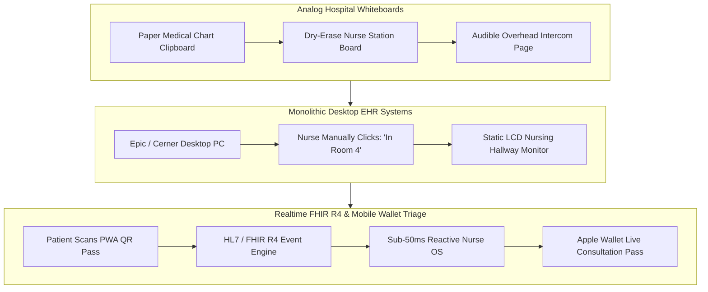
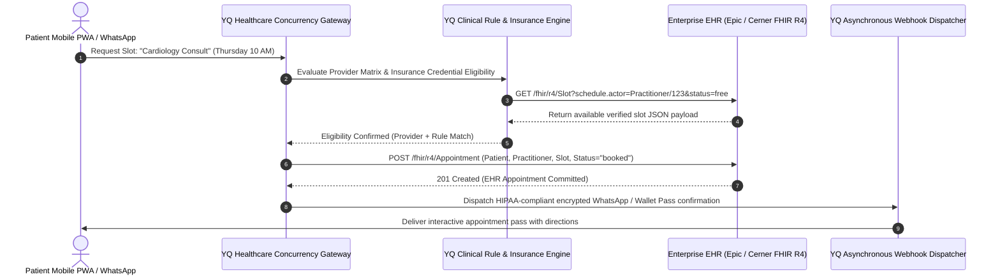
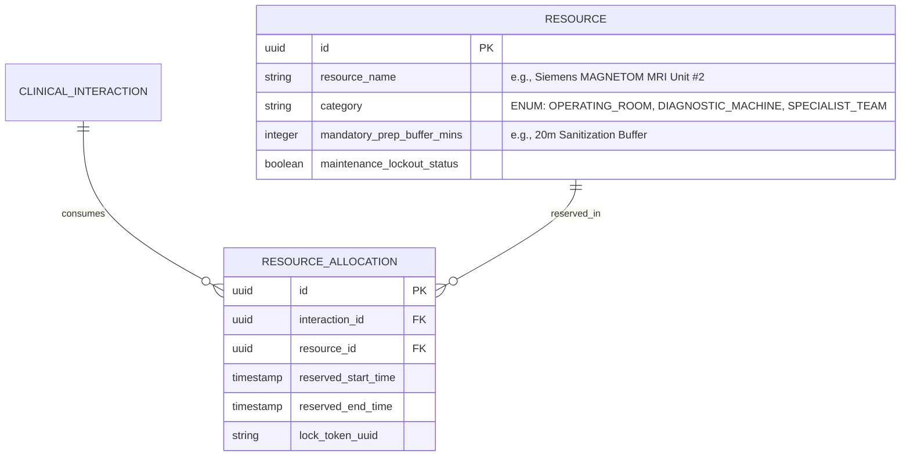

# Volume 3: Healthcare Clinical, Patient Flow & Resource Scheduling Landscape

> **Document Classification:** Confidential — Internal Engineering & Product Research Documentation  
> **Author:** YQ Elite Product Research Department (Staff Software Architect, Enterprise SaaS Consultant, Senior Product Manager, & UX Researcher)  
> **Target Reader:** YQ Healthcare Product Architects & Medical Engineering Teams  
> **Purpose:** Execute a thorough technical deconstruction of the medical and clinical visit management sectors across three specialized domains: **Patient Flow**, **Healthcare Scheduling**, and **Medical Resource Scheduling**. Detail Electronic Health Record (EHR) interoperability protocols (HL7 / FHIR R4), HIPAA data encryption mandates, multi-resource procedural interval algorithms, major clinical incumbent vendors, and next-generation medical AI forecasting architectures.

---

## Domain 5: Patient Flow & Clinical Triage Systems

### 5.1 History & Evolution
Patient Flow management in healthcare facilities historically consisted of physical whiteboards markers mounted at hospital nursing stations, paper patient chart clipboards placed outside examination room doors, and manual overhead hospital intercom pages ("Paging Dr. Howard to ER Triage"). 

In the late 1990s and early 2000s, pioneer clinical software vendors like **TeleTracking** and **Epic Systems** introduced digital nursing station bed tracking boards and desktop EHR arrival status flags. However, these systems remained entirely tethered to internal nursing administrative PCs, leaving patients sitting blindly in crowded outpatient hospital lobbies for hours without visibility into clinical delays or room turnover velocities.

### 5.2 Structural Categories & Architectural Taxonomies
1. **EHR Integrated Bed & Clinic Trackers:** Embedded functional modules provided natively within enterprise Electronic Health Record giants (e.g., Epic Welcome kiosks, Cerner Patient Flow, Allscripts CareInMotion). Highly robust EHR clinical data integration, but afflicted by clumsy, dated patient UX and prohibitive customization costs.
2. **Specialized Outpatient Virtual Queues:** Modern API-layer software solutions (e.g., **Luma Health**, **Kyruerth**, **Qless Urgent Care**) that sit as specialized orchestration wraps on top of legacy EHR databases, providing patients with mobile SMS queue check-in capabilities and remote virtual waiting room features for ambulatory outpatient centers and urgent care clinics.

### 5.3 Core Business Problems Solved
* **Emergency Department (ED) Overcrowding & Left-Without-Being-Seen (LWBS) Mortality:** In urgent care centers and emergency hospital departments, prolonged physical lobby waiting lists lead to dramatic spikes in **LWBS (Left Without Being Seen) rates**. When LWBS exceeds **4.5%**, hospitals suffer massive diagnostic revenue forfeitures and face severe clinical malpractice and patient mortality risks. Automated digital patient flow platforms allow triage nurses to instantly prioritize emergency severity indexes (ESI 1–5) while engaging lower-acuity patients via dynamic SMS conversational wait updates, reducing LWBS rates by over **60%**.
* **Clinical Examination Room Turn-Over & Provider Idle Downtime:** In ambulatory medical clinics, physicians frequently experience **15 to 25 minutes of cumulative daily idle downtime** waiting for medical assistants to sanitize examination rooms and prepare clinical charts. Modern patient flow platforms integrate automated sensor webhooks and iPad room-door touchscreens, alerting clinical staff via intelligent Apple Watch or desktop pushes the precise millisecond an exam room becomes sanitized and ready for the next waiting patient.

### 5.4 Market Sizing & Enterprise Adoption Mechanics
* **Target Market Sizing:** The global Hospital Patient Flow and Outpatient Queue Management market represents an estimated **$2.85 Billion TAM in 2026**, growing at a commanding **15.2% CAGR**.
* **Enterprise Adoption Barriers (HIPAA & EHR Silos):** Healthcare IT procurement teams strictly enforce two absolute requirements: **HIPAA / HITECH Business Associate Agreement (BAA)** legal adherence and native real-time interoperation with internal enterprise Electronic Health Record (EHR) databases via standard clinical messaging protocols (HL7 v2 / FHIR R4). Solutions failing to provide out-of-the-box bidirectional FHIR ingestion are summarily disqualified during RFP evaluations.

### 5.5 Major Vendor Landscape & Architectural Evaluation
| Vendor Name | Primary Dominance | EHR Interoperability (FHIR R4 / HL7) | Patient Mobile UX Quality | Primary Technical Debt & Weakness |
| :--- | :--- | :--- | :--- | :--- |
| **Epic Welcome & MyChart** | Tier 1 Hospital Networks | **5.0 / 5.0** (Native Epic Engine) | **2.5 / 5.0** (Clunky Portal Apps) | Rigid user interface; demands patient install MyChart app and remember complex portal passwords; expensive physical hardware kiosks. |
| **Luma Health** | Ambulatory Outpatient Clinics | **4.2 / 5.0** (Robust API Connectors) | **4.5 / 5.0** (SMS & PWA First) | Complex multi-tenant pricing; limited physical hardware kiosk print integrations for older demographic patients. |
| **TeleTracking** | Hospital Inpatient & Bed Routing | **4.0 / 5.0** (HL7 Enterprise Feed) | **1.8 / 5.0** (Staff Focused Only) | Strictly built for internal inpatient nurse bed coordination; completely lacks modern consumer-facing mobile virtual queueing or Apple Wallet integration. |
| **Kyruerth** *(Health Catalyst)* | Healthcare Engagement | **3.8 / 5.0** (Health Catalyst Data Engine) | **3.9 / 5.0** (Conversational AI) | Heavily reliant on enterprise data warehouse batch jobs rather than instantaneous real-time edge WebSocket state streaming. |

---

## Domain 6: Healthcare Appointment Scheduling & Clinical EHR Federation

### 6.1 History & Evolution
Medical scheduling historically consisted of centralized hospital call centers staffed by dozens of operators staring at complex terminal screens, manually navigating provider rules and insurance credentialing requirements. While airlines and hotels successfully adopted online consumer self-booking in the early 2000s, healthcare lagged behind by nearly two decades due to **Clinical Rule Complexity** (e.g., *Dr. Miller only sees pediatric orthopedic knee evaluations on Tuesday mornings in Room 302 if the patient possesses verified HMO authorization*).

Over the last decade, platforms such as **Zocdoc**, **Kyruerth**, and enterprise schedulers like **JRNI Healthcare** have tackled this clinical logic, translating complicated internal provider scheduling matrices into self-serve online web widgets capable of validating patient insurance credentials on the fly.

### 6.2 Structural Categories & Architectural Taxonomies
1. **Direct Consumer Marketplace Schedulers:** Aggregator booking portals (e.g., Zocdoc) that list external physicians, charging doctors steep per-new-patient referral fees ($35–$80 per booking) while managing basic external calendar synchronization.
2. **Enterprise EHR Integration Layers (HL7 / FHIR Schedulers):** Enterprise white-label platforms designed to sit directly on a healthcare network’s brand website and patient portal (e.g., Kyruerth, Luma Health, JRNI). Integrate via industry-standard **HL7 v2 ADT/SIU messages** and **FHIR R4 Scheduling APIs** to commit bookings directly inside the primary clinical records system without human operator intervention.

### 6.3 Core Business Problems Solved
* **Call Center Bottlenecks & Phone Hold Abandonment:** Before enterprise digital self-scheduling, over **78% of medical appointments** were initiated via telephone calls, forcing patients to wait an average of **14.2 minutes on hold** to speak with scheduling clerks. Automated digital scheduling engines intercept up to **65% of scheduling call volume**, slashing operational call-center staffing expenditures while enabling 24/7 self-serve conversational booking via mobile devices.
* **The No-Show Epidemic & Diagnostic Capacity Wastage:** In community healthcare centers, unconfirmed outpatient appointments exhibit catastrophic **no-show rates ranging from 18% to 26%**. Every missed MRI scan or surgical consultation costs a health network between **$500 and $2,500 in wasted diagnostic capacity**. By integrating intelligent bidirectional conversational reminder sequences via WhatsApp, SMS, and automated voice TTS (text-to-speech) calling that permit instant 1-click rescheduling, advanced healthcare scheduling platforms compress outpatient no-show rates below **5%**.

---

## Domain 7: Medical Resource & Diagnostic Machinery Scheduling

### 7.1 History & Evolution
While appointment scheduling books human medical providers, **Resource Scheduling** coordinates the expensive physical infrastructure and machinery necessary to execute medical care: Multi-million dollar MRI/CT Diagnostic Imaging Scanners, Specialized Operating Rooms (OR), Outpatient Dialysis Chairs, and infusion chemotherapy bays.

Historically, machinery scheduling existed entirely separately from patient scheduling—governed by specialized department managers utilizing Excel spreadsheets or proprietary radiology software suites (RIS / PACS). Modern medical resource schedulers reconcile these dual timelines, ensuring that an outpatient surgical booking simultaneously secures the operating theater, the primary surgeon, the anesthesiologist, and specialized medical diagnostic devices in a single atomic database transaction.

### 7.2 Core Business Problems Solved
* **Composite Multi-Resource Booking & Maintenance Buffers:** Booking a 45-minute complex CAT scan does not mean the imaging machine is immediately available for the subsequent patient at minute 46. Diagnostic machinery mandates rigorous **Sanitization, Contrast Calibration, and Cooldown Buffer Intervals (15–30 minutes)** between appointments. Rudimentary scheduling platforms overlook physical hardware prep rules, causing diagnostic testing centers to cascade multiple hours behind schedule by mid-afternoon.
* **In-Memory Interval Tree Computational Overconfidence:** Calculating free/busy schedule intersections across four distinct relational tables (Doctor Schedule + Nursing Roster + MRI Machine Availability + Examination Room Schedule) over a 30-day time window requires evaluating thousands of potential timestamps. Executing this via standard relational SQL `JOIN` queries creates unacceptable web page load delays (>6 seconds). 
  * **The YQ Architectural Standard:** To achieve instantaneous sub-100ms multi-resource booking queries, YQ deploys an in-memory interval tree microservice built in Go/Rust. This engine maintains an optimized continuous timeline of resource bit-masks in Redis, computing multi-variable capacity intersections globally without executing heavy relational database scans.

---

## 8. Summary & Strategic Opportunities in Healthcare for YQ
By unifying Clinical Patient Flow, FHIR R4 EHR Scheduling, and Composite Medical Resource Allocation into a single polymorphic architecture, YQ achieves an unprecedented leapfrog advantage over fragmented incumbent systems like Epic MyChart and JRNI:
* **Zero-Install WhatsApp Guest Checkout:** No requiring elderly patients to download complex patient portal apps or remember lost MyChart passwords; patients complete pre-arrival registration, sign digital medical consent forms, and track clinical room numbers directly via secure conversational WhatsApp threads and live Apple Wallet lock-screen cards.
* **Reinforcement ML Wait Forecasting:** Real-time AI prediction engines that monitor live physician examination velocity and dynamically update lobby waiting screens, completely eradicating ER waiting room anxiety and suppressing patient left-without-being-seen (LWBS) mortality rates.

*Proceed to **[Volume 4: Government, Public Sector, & University Student Ecosystems](./Volume_4_Government_Public_Sector_and_University_Ecosystems.md)** for detailed engineering analyses of DMV queueing systems, student registration platforms, and multi-tenant enterprise scheduling.*
