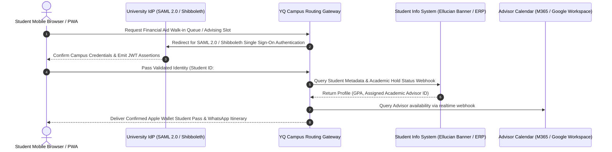
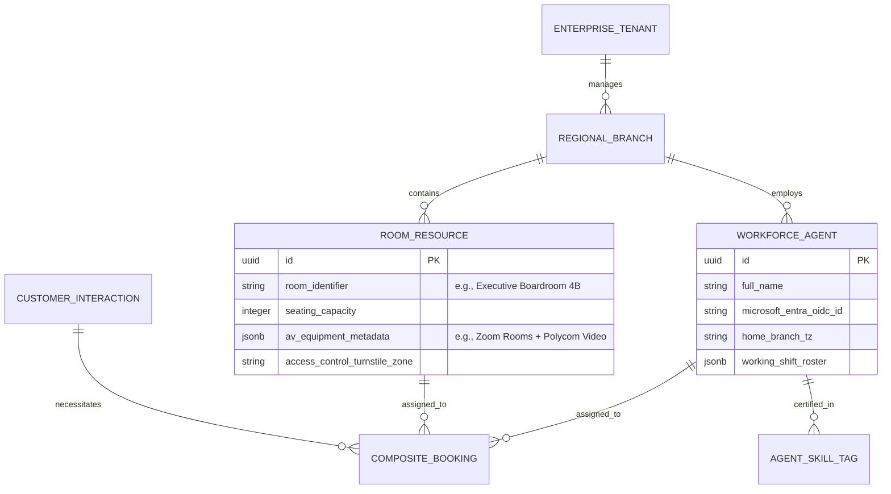

# Volume 4: Government DMV, Public Sector, University, & Enterprise Scheduling Ecosystems

> **Document Classification:** Confidential — Internal Engineering & Product Research Documentation  
> **Author:** YQ Elite Product Research Department (Staff Software Architect, Enterprise SaaS Consultant, Senior Product Manager, & UX Researcher)  
> **Target Reader:** YQ Public Sector & Enterprise Architecture Teams  
> **Purpose:** Execute a deep-dive engineering analysis of high-volume, high-friction civic and enterprise sectors across three distinct domains: **Government Queue Systems (DMV / Consular)**, **University Student Services**, and **Enterprise Workforce & Room Scheduling**. Deconstruct surge traffic resilience patterns, strict multi-lingual ADA accessibility compliance mandates (WCAG 2.1 AAA), legacy mainframe integrations, major vendor incumbents, and civic AI modernization trajectories.

---

## Domain 8: Government Queue Systems (DMV, Public Sector & Consular)

### 8.1 History & Evolution
The Department of Motor Vehicles (DMV), Social Security Administration offices, and international Consular visa processing centers represent the universal archetype of customer service hostility and physical queue friction. Throughout the 20th century, civic services operated on purely analog walk-in ticketing models, requiring citizens to congregate in external physical lines hours before building openings.

In the early 2000s, specialized municipal vendors such as **Qmatic**, **QLess**, and **Lavi Industries** introduced numerical kiosks and multi-room ticket routing television displays. Over the last decade—spurs driven by civil modernization mandates—governmental agencies have aggressively adopted cloud-native online appointment booking and mobile virtual queuing to eliminate physical lobby lines entirely.

```mermaid
flowchart TD
    subgraph Surge_Ingestion [Monday Morning Online Slot Drop Surge]
        Citizens[15,000+ Concurrent Citizen Users] --> WAF[Cloudflare Edge WAF / Bot Defense]
        WAF --> Queue_It[Edge Cloud Virtual Waiting Room (Buffer)]
    end

    subgraph Core_Gov_Engine [YQ Civic Multi-Region Backend]
        Queue_It --> Rate_Limit[API Gateway Token Leaky Bucket Rate Limiting]
        Rate_Limit --> Redlock[Redis Redlock Distributed Concurrency Engine]
        Redlock --> Civic_DB[(Isolated FedRAMP High PostgreSQL Schema)]
    end

    subgraph Physical_DMV [On-Site Municipal Branch Execution]
        Civic_DB --> Kiosk[ADA / WCAG AAA Compliant Kiosk (High-Contrast / Audio)]
        Civic_DB --> Signage[Multilingual Lobby TV Display (Neural TTS Voice)]
        Civic_DB --> Mainframe[Async Webhook Sync to Legacy Municipal Mainframe]
    end
```

### 8.2 Structural Categories & Architectural Taxonomies
1. **Traditional Municipal On-Premise Installations:** Rigid physical kiosk systems deployed on local city servers with zero external mobile web capability, requiring heavy on-site technical support and proprietary ticket consumables (e.g., legacy Qmatic DMV deployments).
2. **Cloud-Native Virtual Civic Queues:** Web-based ticketing platforms allowing citizens to join virtual queues via SMS or online portals before driving to the municipal building (e.g., QLess, Waitwhile).
3. **High-Security Civic & FedRAMP Compliant OS (The YQ Target Model):** Multi-region cloud microservice architectures adhering to NIST 800-53 and FedRAMP high-security standards. Integrates driverless WebUSB kiosk hardware with deep conversational multilingual AI routing, capable of surviving massive concurrent traffic surges during online appointment release windows without server degradation or database locking timeouts.

### 8.3 Core Business Problems Solved
* **Monday Morning Slot Release Surge Concurrency & Server Collapse:** When a state DMV or visa processing center releases its weekly batch of appointment timestamps at 8:00 AM on Monday morning, system traffic instantaneously skyrockets by **5,000%**. Legacy appointment engines fail under this intense concurrency, suffering from database locking deadlocks and HTTP 504 Gateway Timeouts that lock citizens out and generate immediate negative political scrutiny.
  * **The YQ Architectural Standard:** To guarantee zero downtime under extreme civic load surges, YQ integrates an automated edge virtual waiting room buffer paired with a Redis Redlock distributed concurrency engine. Temporary 10-minute slot locks are adjudicated in memory in under 5 milliseconds, completely protecting the primary relational database from concurrent connection overload.
* **Strict Universal Accessibility (ADA & WCAG 2.1 AAA Enforcement):** Public sector software faces zero legal tolerance for non-accessible digital interface design. Under federal law (Section 508 / ADA), every citizen—regardless of age, visual impairment, deafness, or native language—must be capable of accessing self-serve queue kiosks and web booking forms independently.
  * **The YQ Accessibility Advantage:** YQ public touch kiosks incorporate an immediate ADA tactile toggle that expands font target heights above 64 pixels, elevates contrast ratios above 7:1, activates multilingual neural text-to-speech (TTS) auditory screen reading via standard 3.5mm headphone jack insertion, and positions all touch interactive zones within ADA wheelchair reach envelope limits (<48 inches from floor).

### 8.4 Major Vendor Landscape & Architectural Evaluation
| Vendor Name | Primary Dominance | Security & Compliance Rating | Surge Load Resilience | Primary Technical Debt & Weakness |
| :--- | :--- | :--- | :--- | :--- |
| **QLess** | Government DMVs & Municipal Courts | **3.5 / 5.0** (Standard Cloud) | **3.0 / 5.0** (Prone to load lag) | Outdated staff receptionist desktop terminal UI; rigid reliance on clumsy plain-text SMS commands; frequent user complaints regarding unpredictable wait-time countdown timers. |
| **Qmatic** | Global Public Sector & Enterprise | **3.8 / 5.0** (Qmatic Cloud Solutions) | **3.5 / 5.0** (Monolithic scaling) | Prohibitively high CapEx costs for proprietary kiosks; complex local hardware proxy installations that fail during OS network updates. |
| **Lavi Industries (Qtrac)** | Airports, TSA, & Municipal Services | **3.2 / 5.0** (Standard SaaS) | **3.5 / 5.0** (Standard Load Balancing) | Flat interface aesthetics; lack of dynamic conversational WhatsApp chat integration or Apple Wallet lock-screen push notifications. |

---

## Domain 9: University & Higher Education Student Services

### 9.1 History & Evolution
University campus registration, financial aid counseling, academic advising, and student health center triage represent massive, highly seasonal customer routing challenges. Historically, student administration relied on disjointed departmental software: the registrar operated legacy student information systems (SIS like Ellucian Banner or Oracle Peoplesoft), financial aid offices managed physical walk-in clipboard lines, and campus health centers deployed standalone medical scheduling software.

Over the last decade, higher education institutions have initiated campus-wide digital modernization programs, seeking to unify student appointment booking and virtual walk-in queueing under a single, federated campus portal accessible via students' smartphones.



### 9.2 Structural Categories & Architectural Taxonomies
1. **Fragmented Departmental Apps:** Individual academic departments independently licensing disconnected consumer scheduling widgets (e.g., faculty members buying personal Calendly or Microsoft Bookings accounts), resulting in a chaotic, disjointed student experience across campus buildings.
2. **Federated Campus Customer Journey Platforms:** Enterprise implementations (such as QLess Higher Ed or YQ Campus OS) that integrate centrally via **SAML 2.0 / Shibboleth Single Sign-On (SSO)** with university identity providers and underlying Student Information System (SIS) ERP databases, unifying financial aid, registrar, admissions, and health clinic queues under one student digital wallet ID.

### 9.3 Core Business Problems Solved
* **Extreme Seasonal Traffic Peaks & Campus Line Crises:** University campus services experience intense, non-linear traffic concentration during three distinct annual time windows: **Fall Semester Orientation**, **Spring Course Drop/Add Week**, and **Final Exam Period**. During these seasonal peaks, physical lines outside Financial Aid and Registrar offices frequently spill out of administration buildings, inducing student panic and consuming hundreds of hours of administrative staff crisis intervention.
* **Siloed Student Identity & Lack of Academic Context:** When a student enters a financial aid or advising consultation, campus advisors utilizing basic ticketing tools spend the first **4 to 6 minutes of the meeting** asking for student ID numbers and manually loading academic profiles across legacy terminal screens. YQ eliminates this administrative latency by consuming SSO token claims upon virtual queue check-in, firing instantaneous WebSocket screen-pops on the advisor’s desktop that automatically pre-load the arriving student's exact GPA, degree audit, financial hold status, and past counseling history.

---

## Domain 10: Enterprise Workforce & Room Scheduling Systems

### 10.1 History & Evolution
Enterprise scheduling transcends public-facing interactions, governing internal complex coordination within multi-tenant corporate offices and mobile professional organizations. Throughout the 2000s, internal space and conference room management was executed natively via Microsoft Exchange shared room resources or standalone facility management software (**Condeco**, **Robin**, **Teem**). Simultaneously, field workforce appointment routing was mastered by specialized mobile field logistics platforms (**Skedulo**, **ServiceTitan**).

Modern enterprise organizations require a converged scheduling architecture capable of orchestrating hybrid workplace desk bookings, executive visitor conference room assignment, and mobile field appointments across disparate, multi-tenant corporate federations.



### 10.2 Core Business Problems Solved
* **Cross-Tenant Calendar Federation & Privacy Governance:** In global Fortune 500 corporations formed via mergers and acquisitions, staff frequently exist across separate, disconnected Microsoft Entra ID (Azure AD) or Google Workspace tenants. Organizing a composite executive meeting or client consultation across disparate corporate domains fails when legacy scheduling platforms cannot federate calendar availability without exposing confidential meeting subjects across boundaries.
  * **The YQ ABAC Security Solution:** YQ deploys an Attribute-Based Access Control (ABAC) governance layer across enterprise federations. External clients and cross-tenant employees query availability bit-masks via GraphQL APIs that cleanly report composite free/busy intersection blocks while cryptographically masking confidential meeting title strings and internal executive participant rosters.
* **Geospatial Mobile Workforce Route Optimization:** For mobile healthcare nurses, field facility inspectors, and itinerant wealth management advisors, an appointment schedule cannot simply treat back-to-back bookings as contiguous time segments. Travelling staff require dynamic **Geospatial Travel Buffer Calculations** that factor in real-time transit distance and peak-hour driving delays between successive municipal or corporate addresses. YQ integrates automated Mapbox/Google Maps Matrix API routing microservices directly into our scheduling engine, automatically blocking realistic transit buffers around every booked interaction to ensure zero late arrivals.

---

## 11. Summary & Strategic Opportunities in Civic & Enterprise Ecosystems for YQ
By bringing multi-region serverless scaling, strict FedRAMP security architecture, driverless WebUSB kiosk accessibility, and SAML 2.0 campus federation into a singular SaaS operating system, YQ creates an insurmountable structural moat against legacy municipal vendors like QLess and Qmatic:
* **Surge-Immune Virtual Waiting Rooms:** Guaranteed zero database failures during massive DMV Monday morning slot drops via integrated edge buffering and microsecond Redis Redlock concurrency execution.
* **Zero-Friction Student & Executive Wallets:** Immediate delivery of cryptographically signed Apple Wallet passes that function simultaneously as real-time queue wait countdown timers and secure near-field communication (NFC) door turnstile access keys across corporate and university campuses.

*Proceed to **[Volume 5: Retail, Banking, Financial Advisory & Digital Reception Platforms](./Volume_5_Retail_Banking_and_Financial_Service_Platforms.md)** for detailed engineering teardowns of branch commerce, Salesforce CRM real-time websocket pop integrations, and conversational AI lobby avatars.*
