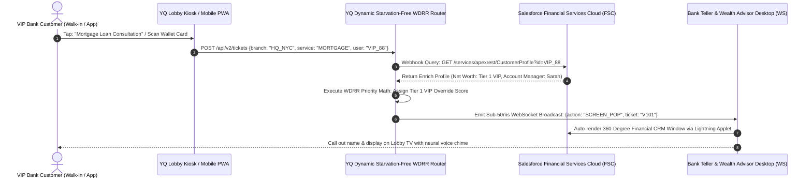

# Volume 5: Retail, Banking, Financial Advisory, & Digital Reception Platforms

> **Document Classification:** Confidential — Internal Engineering & Product Research Documentation  
> **Author:** YQ Elite Product Research Department (Staff Software Architect, Senior Product Manager, Enterprise SaaS Consultant, & UX Researcher)  
> **Target Reader:** YQ Financial Services & Retail Commercial Engineering Teams  
> **Purpose:** Perform a rigorous architectural deconstruction of experiential commerce and high-value physical customer interactions across three interconnected domains: **Retail Service Platforms**, **Banking Queue Systems**, and **Digital Reception (Lobby Avatars)**. Deconstruct real-time Salesforce Financial Services Cloud & Microsoft Dynamics CRM WebSocket screen-pop integrations, VIP priority starvation-prevention algorithms, Buy-Online-Pickup-In-Store (BOPIS) geofenced logistics, major incumbent vendors, and next-generation conversational AI reception terminals.

---

## Domain 11: Retail Service Platforms & BOPIS Queue Orchestration

### 11.1 History & Evolution
Retail store environments historically treated walk-in shopping as an entirely unstructured experience: customers roamed sales floors and congregated at basic FIFO (First-In, First-Out) checkout cash wrap registers. In the late 2000s, the Apple Store revolutionized experiential retail commerce by introducing the "Genius Bar"—a pre-booked appointment and walk-in virtual queue management model that replaced standing checkout lines with roving, tablet-empowered floor associates.

Throughout the late 2010s and accelerated by post-2020 e-commerce shifts, legacy queue vendors (**Ombori**, **Waitwhile**, **JRNI**) expanded into mainstream retail stores, managing luxury styling consultations, jewelry alterations, electronics repair helpdesks, and high-volume **Buy-Online-Pickup-In-Store (BOPIS)** / Click-and-Collect curbside logistics.

```mermaid
flowchart TD
    subgraph BOPIS_Initiation [Online Order & Curbside Arrival]
        Ecom[Customer Places BOPIS Order Online] --> SMS_Invite[YQ Sends WhatsApp / SMS Tracker Pass]
        SMS_Invite --> Geofence[Customer Drives Within 500m Store GPS Geofence]
    end

    subgraph Core_Retail_Engine [YQ Retail Realtime Routing Engine]
        Geofence -->|Automatic Webhook Trigger| Engine[YQ SLA Priority & Triage Router]
        Engine -->|Assign to Retail Associate Bay| Bay_Pool[Associate Floor Worker Pool (Tablets)]
    end

    subgraph Floor_Execution [Store Associate Fulfillment]
        Bay_Pool -->|Sub-50ms WebSocket Push| Tablet_UI[Associate Apple iPad / Android Wearable UI]
        Tablet_UI -->|Associate Clicks: 'Bringing Order Out'| Notify_Customer[Live Apple Wallet Pass & WhatsApp Update]
        Notify_Customer --> Delivery[Order Delivered to Car in <120 Seconds]
    end
```

### 11.2 Structural Categories & Architectural Taxonomies
1. **Curbside & BOPIS Pickup Schedulers:** Dedicated logistics routing tools designed specifically to time customer storefront arrival with back-of-house warehouse item retrieval, minimizing vehicle parking congestion and reducing order handover times (e.g., specialized retail configurations of Waitwhile or Ombori Grid).
2. **Experiential Retail Consultation Bookers:** Enterprise appointment booking and floor clienteling suites (e.g., **JRNI Retail**, Salesforce Scheduler) utilized by luxury department stores, optical clinics, and furniture showrooms to allow affluent shoppers to schedule uninterrupted one-on-one personal styling or interior design consultations.

### 11.3 Core Business Problems Solved
* **BOPIS Handover Friction & Curbside Congestion:** When a consumer drives to a department store to retrieve a pre-purchased e-commerce order, requiring them to park, enter the store, locate a customer service desk, and join a physical line completely defeats the convenience of online shopping. If curbside wait times exceed **3.5 minutes**, retail brand repeat purchase probability degrades by **18%**. 
  * **The YQ Geofence Advantage:** YQ embeds HTML5 Geolocation and Apple Wallet geofenced boundary coordinates directly into digital pickup passes. The microsecond a customer's smartphone crosses the store's 500-meter perimeter parking lot radius, YQ automates a high-priority background webhook to back-of-house warehouse associate tablets, initiating item staging before the customer has even turned their vehicle ignition off.
* **Fitting Room Overcrowding & Walkaway Abandonment:** In apparel and sporting goods retail, long queues outside fitting rooms induce severe customer frustration, driving up to **22% of shoppers** to abandon full clothing garments directly on clothing racks and walk out of the store. Virtual fitting room queueing allows customers to scan a kiosk QR code, continue browsing sales floor merchandise, and receive a haptic phone alert the instant their specific fitting booth number becomes sanitized and unlocked.

---

## Domain 12: Banking Queue Systems & Wealth Management Scheduling

### 12.1 History & Evolution
Commercial retail bank branches have undergone the most profound structural operational transformation in modern commercial history. Throughout the 20th century, bank branches functioned primarily as transactional transaction clearing centers—characterized by labyrinthine rope barrier lines leading to dozens of teller windows handling basic cash deposits and check check cashing.

With the advent of automated teller machines (ATMs) and ubiquitous mobile banking apps, transactional walk-in foot traffic plummeted. Today, retail bank branches operate as high-value **Financial Advisory Hubs**. Platforms such as **Qmatic**, **JRNI Banking**, and **Salesforce Financial Services Cloud (FSC) Scheduler** are deployed to orchestrate high-touch, consultative appointments for mortgages, commercial loans, notary public authentications, and safety deposit box access.



### 12.2 Structural Categories & Architectural Taxonomies
1. **Legacy Branch Teller Queueing Systems:** On-premise or cloud-ported ticket dispensers focused solely on numerical routing across physical teller counting windows (e.g., legacy Qmatic, Lavi Qtrac). Often totally divorced from the bank’s core financial databases and customer CRM profiles.
2. **CRM-Federated Financial Journey OS (The YQ Target Model):** Deeply integrated enterprise appointment and walk-in routing systems that operate as real-time orchestration extensions of **Salesforce Financial Services Cloud**, **Microsoft Dynamics 365**, and core banking software (Fiserv, FIS). Capable of performing instantaneous client enrichment, multi-skilled agent balancing, and VIP priority override routing.

### 12.3 Core Business Problems Solved
* **The Anonymity Trap & Squandered VIP Advisory Conversion:** In a legacy ticketing bank branch, a walk-in retail customer depositing a $50 check prints the exact same anonymous slip ("Ticket #C204") as an affluent commercial enterprise CEO seeking to transfer a $4.5 million commercial portfolio. If the high-net-worth VIP is forced to wait 25 minutes in a generic queue without recognition, the bank risks catastrophic account churn and lost wealth management advisory commissions.
  * **The YQ Real-Time Enrichment Solution:** YQ intercepts walk-in check-in interactions by allowing customers to swipe an ATM card or scan an Apple Wallet banking card at lobby touch terminals. Within **45 milliseconds**, YQ executes an encrypted REST webhook to Salesforce FSC, retrieves the customer's financial wealth tier metadata, and runs our proprietary **Weighted Deficit Round Robin (WDRR)** priority algorithm in Redis. The VIP is instantaneously escalated to the top of the specialized Wealth Advisory queue, triggering an immediate lightning window screen-pop on their dedicated relationship manager's desktop PC.
* **Teller Utilization vs. Specialized Advisor Balancing:** Modern bank branches operate with lean staffing models where tellers must cross-functionally serve basic cash transactions while supporting specialized notary or credit card onboarding consultations. YQ enables dynamic agent skills-based routing: an associate can sit logged in at Counter 3 serving regular "Cash Deposit" tickets, but the microsecond an online pre-booked "Business Loan Application" appointment arrives in the lobby, the YQ routing broker dynamically shifts the agent's active queue profile, routing the loan customer directly to their desk with zero managerial manual override intervention.

### 12.4 Major Vendor Landscape & Architectural Evaluation
| Vendor Name | Primary Dominance | CRM Screen-Pop Intermediary | VIP Algorithmic Priority Depth | Primary Technical Debt & Weakness |
| :--- | :--- | :--- | :--- | :--- |
| **Salesforce FSC Scheduler** | Tier 1 Global Banking Networks | **5.0 / 5.0** (Native Salesforce Engine) | **2.5 / 5.0** (Basic static appointment time blocks) | Extremely heavy and expensive to customize; built specifically for pre-booked appointments with poor real-time live walk-in physical lobby queue management capabilities. |
| **Qmatic Orchestrate** | European & Global Retail Banks | **3.2 / 5.0** (Required custom integration hooks) | **4.0 / 5.0** (Advanced internal queue routing rules) | Outdated on-premise structural technical debt; expensive vendor hardware maintenance lock-in; sluggish UI rendering speed on teller client desktop PCs. |
| **JRNI Banking** | Enterprise Retail & Banking | **4.2 / 5.0** (Robust CRM API connectors) | **3.8 / 5.0** (Standard tier priority buffers) | Higher total cost of ownership; calendar federation synchronization lag during concurrent peak branch operating hours. |
| **Ombori Grid** | Modern Omnichannel Banking | **4.3 / 5.0** (Modern cloud Azure API hooks) | **4.2 / 5.0** (Advanced IoT rule engine) | Requires installing proprietary containerized micro-app edge computing server appliances within physical bank branch facilities. |

---

## Domain 13: Digital Reception, Smart Lobbies & Conversational Avatars

### 13.1 History & Evolution
Corporate reception desks, luxury hotel lobbies, and professional legal/accounting firms historically required dedicated, full-time human administrative desk receptionists to perform basic greeting, guest logging, courier delivery sign-offs, and employee notifications.

With annual administrative salary expenditures ascending above **$55,000 per reception desk seat**, enterprises initiated aggressive operational streamlining. Throughout the 2010s, simple iPad self-check-in tablets (**Envoy**, **Proxyclick**) began displacing human greeters. Today, the cutting edge of **Digital Reception** is being captured by smart lobby platforms utilizing interactive touch kiosks, two-way SIP intercom video telepresence, and conversational AI virtual greeting avatars capable of conducting natural spoken dialogues with arriving visitors in real time.

```mermaid
flowchart TD
    subgraph Visitor_Arrival [Lobby Visitor Approaches Smart Terminal]
        Voice_Input[Visitor Speaks: 'Hi, I'm here for a 2 PM meeting with Alex'] --> Audio_Capture[Kiosk Microphone Array (Noise Cancellation)]
    end

    subgraph YQ_AI_Reception_Engine [YQ Cloud Neural Voice & LLM Router]
        Audio_Capture -->|WebSockets Audio Stream| Whisper[OpenAI Whisper / Fast Speech-to-Text Engine]
        Whisper -->|Text Prompts| LLM[YQ Fine-Tuned GPT-4o / Claude 3.5 Sonnet Router]
        LLM -->|Query Domain DB| Lookup[Validate Appointment & Employee Directory]
        Lookup -->|Generate TTS Response| ElevenLabs[ElevenLabs Ultra-Realistic Neural Speech Synthesis]
    end

    subgraph Fulfillment & Host Alert [Interactive Execution]
        ElevenLabs -->|Acoustic Speaker Output| Kiosk_Audio[Kiosk Speaks: 'Welcome! Alex is on floor 4. I've sent him an alert!']
        Lookup -->|Webhooks| Slack_Notify[Slack / Teams Push with Realtime Visitor Photo]
        Lookup -->|Access Command| Turnstile[Unlock Lobby Turnstile / Print WebUSB Badge]
    end
```

### 13.2 Structural Categories & Architectural Taxonomies
1. **Basic Self-Service Touch Tablets:** Static touch check-in forms operating on consumer tablets (e.g., standard Envoy Visitors or Swivel), requiring guests to manually type their full names and email addresses using on-screen virtual keyboards.
2. **Virtual Video Reception (Telepresence):** Interactive terminal enclosures integrating high-definition webcam feeds and VoIP/SIP communication protocols, allowing a single remote human receptionist sitting in a centralized call center to greeted and monitor visitors across 20 different regional office lobbies simultaneously (e.g., ALICE Receptionist, Proxyclick Telepresence).
3. **Conversational Neural AI Avatars & Smart Grids (The YQ Target Model):** Zero-touch, intelligent lobby kiosks utilizing sophisticated large language models (LLMs), real-time speech-to-text (OpenAI Whisper), and natural neural voice synthesis (ElevenLabs/OpenAI Audio). Arriving visitors engage in spoken conversational dialogue with an intelligent greeting agent that autonomously verifies calendar appointments, checks watchlist compliance, executes turnstile access commands, and dispatches interactive Slack/Teams notifications in sub-800 millisecond voice round-trip times.

### 13.3 Core Business Problems Solved
* **Exorbitant Overhead Cost of Dedicated Human Reception Staffing:** In multi-tenant office parks, suburban professional clinics, and regional utility branches, foot traffic is episodic—a receptionist might greet only 15 visitors throughout an entire 8-hour shift, spending **85% of their working day completely idle**. Replacing physical desk receptionists with YQ Conversational AI kiosks saves enterprise organizations up to **$60,000 annually per lobby**, achieving a rapid **800% ROI in year one** while providing 24/7/365 multi-lingual greeting consistency without human staffing absence or attrition delays.
* **Touchscreen Hygiene Anxiety & Keyboard Data-Entry Friction:** Post-pandemic visitors and elderly users exhibit strong hesitation toward interacting with germ-covered public kiosk touchscreens. Furthermore, typing complex international names or corporate email domains on small iPad virtual keyboards produces a **14% typographical error rate**, causing host check-in notifications to bounce and leaving visitors stranded in lobbies. YQ erases keyboard data entry completely via natural acoustic conversational voice interactions and instantaneous smartphone camera QR wallet pass scanning.

---

## 14. Summary & Strategic Opportunities in Retail, Banking, & Digital Lobbies for YQ
By merging sub-50ms WebSocket Salesforce FSC CRM screen pops, geofenced BOPIS curbside arrival triggers, and ultra-realistic conversational AI voice reception into one unified SaaS operating system, YQ creates an unbeatable commercial moat against incumbents like Salesforce Scheduler, Ombori Grid, and Qmatic:
* **Real-Time VIP Clienteling & Zero Anonymity:** Automatic algorithmic identification and starvation-free priority escalation for affluent banking and retail guests, guaranteeing 100% advisory advisory conversion and zero walk-away churn.
* **Driverless, Agnostic Hardware Deployment:** Eliminating proprietary enterprise hardware maintenance leasing contracts; YQ software installs cleanly as responsive PWAs across commercial iPads, Android panels, and 4K lobby television displays with zero local network desktop printer driver dependencies.

*Proceed to **[Volume 6: High-Throughput Hospitality, Aviation, Entertainment, & CX Analytics](./Volume_6_High_Throughput_Hospitality_Transportation_and_Entertainment.md)** for exhaustive technical deconstructions of restaurant reservations, airport TSA security queues, theme park virtual ride drop concurrency, and post-visit closed-loop sentiment engine architectures.*
