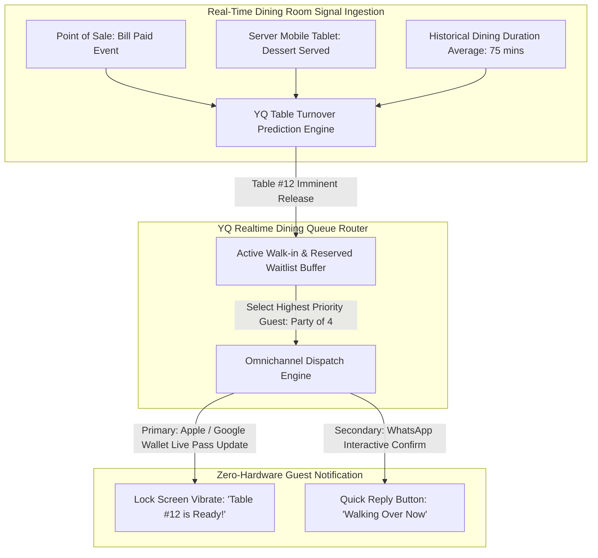
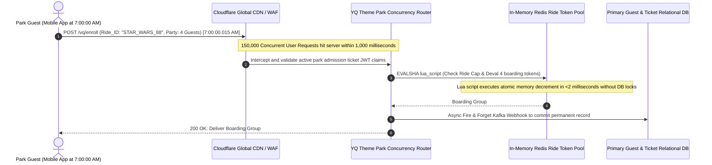
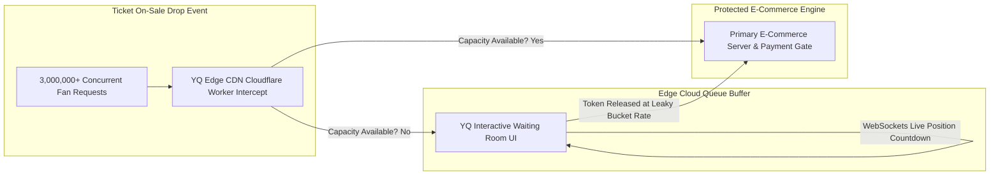
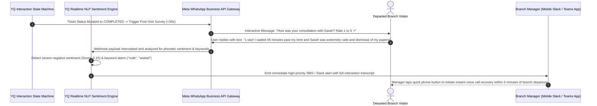

# Volume 6: High-Throughput Hospitality, Aviation, Entertainment, & CX Analytics Landscape

> **Document Classification:** Confidential — Internal Engineering & Product Research Documentation  
> **Author:** YQ Elite Product Research Department (Staff Software Architect, Senior Product Manager, UX Researcher, Enterprise SaaS Consultant, & Competitive Intelligence Analyst)  
> **Target Reader:** YQ High-Scale Infrastructure & AI Analytics Engineering Teams  
> **Purpose:** Execute a comprehensive engineering deconstruction of ultra-high-capacity, real-time mobile sectors across five major domain ecosystems: **Restaurant Reservations & Table Queue Management**, **Airport Passenger Flow & TSA Security Triage**, **Theme Park Virtual Queue Systems (Disney/Universal OS)**, **Pure Virtual Queueing (E-Commerce Cloud Waiting Rooms)**, and **Customer Experience (CX) & Post-Visit Intelligence Platforms**. Detail table turnover prediction formulas, airport computer vision line estimation, theme park high-concurrency ride token drops, and closed-loop sentiment AI architectures.

---

## Domain 14: Restaurant Reservations & Table Queue Management

### 14.1 History & Evolution
Restaurant reservation management and dining room walk-in queueing historically functioned via paper hostess logbooks, grease pencil seating chart diagrams, and disruptive acoustic overhead public address announcements. In the late 1990s, physical restaurant lobbies were transformed by **Hardware Buzzers and Pagers**—vibrating coaster discs emitting blinking red lights across crowded bar waiting areas.

In 1998, **OpenTable** created the online reservations SaaS industry, digitizing hostess stand floorplans and enabling consumers to book dining slots via web browsers. Throughout the 2010s, challenging platforms such as **Resy**, **SevenRooms**, and **Yelp Waitlist** disrupted OpenTable's dominance by introducing dynamic table turning algorithms, SMS waitlist notification paging, automated deposit forfeiture credit card authorizations, and deep guest CRM profiling.



### 14.2 Structural Categories & Architectural Taxonomies
1. **Third-Party Consumer Booking Aggregators:** Marketplace networks (e.g., OpenTable, Resy) that drive consumer discovery via public dining apps, but tax restaurateurs heavily via **per-seat cover charges ($1.00 to $1.50 per booked diner)** while retaining ultimate ownership of customer contact CRM databases.
2. **Direct-to-Consumer (D2C) Hospitality & Table Turn OS:** Enterprise white-label platforms (e.g., SevenRooms, YQ Hospitality OS) that integrate directly into a restaurant’s brand website, social media pages, and internal Point of Sale (POS) networks (Toast, NCR Aloha, Micros). Empower operators to capture 100% first-party guest data, implement dynamic deposit rule enforcement, and utilize algorithmically optimized table seating assignments without paying per-diner commission fees.

### 14.3 Core Business Problems Solved
* **The No-Show Epidemic & Perishable Table Margins:** In high-end hospitality and independent restaurants operating on paper-thin profit margins (3%–6%), unconfirmed weekend dining reservations exhibit **no-show rates of 15% to 20%**. A no-show party of six on a Friday evening causes an immediate, unrecoverable forfeiture of $600+ in dining revenue. Advanced dining reservation systems enforce automated credit card pre-authorization holds and interactive WhatsApp/SMS re-confirmation sequences 24 hours prior to arrival, automatically releasing unclaimed tables to active walk-in queue buffers and collecting cancellation fees when guests abandon bookings.
* **Proprietary Hardware Buzzer CapEx & Sanitation Liabilities:** Traditional vibrating restaurant coaster pagers represent significant capital waste. Hardware buzzer stations cost upwards of **$2,500 per unit**, exhibit a **30% annual hardware loss/breakage rate** due to patrons accidentally walking off with pagers, and require manual sanitization between guests to avoid transmitting pathogens. YQ totally eliminates hardware buzzers by generating dynamic Apple/Google Wallet lock-screen passes and interactive SMS thread tracking directly on diners' personal smartphones.

### 14.4 Major Vendor Landscape & Architectural Evaluation
| Vendor Name | Primary Dominance | Pricing Economics & Commission Moat | POS Real-time Sync Depth | Primary Technical Debt & Weakness |
| :--- | :--- | :--- | :--- | :--- |
| **OpenTable** *(Booking Holdings)* | North American Dining Marketplace | **1.0 / 5.0** (Exorbitant $1.00+ per cover fee) | **3.8 / 5.0** (Standard POS hooks) | Extreme financial extraction via per-diner cover fees; suppresses direct first-party guest relationships; outdated administrative terminal UI. |
| **Resy** *(American Express)* | High-End Hospitality & Culinary | **3.5 / 5.0** (Flat monthly subscription model) | **4.2 / 5.0** (Robust modern APIs) | Increasing exclusive prioritization of American Express cardholder benefits over open public guest access; limited walk-in physical lobby queueing capabilities. |
| **SevenRooms** | Global Enterprise & Luxury Hospitality | **4.8 / 5.0** (Direct D2C zero cover fee model) | **4.8 / 5.0** (Deep POS & CRM integration) | Complex onboarding requirements and premium enterprise pricing that excludes mid-market or casual dining establishments. |
| **Yelp Waitlist** *(NoWait)* | Casual Dining & High-Volume Walk-Ins | **3.0 / 5.0** (Bundled with Yelp ads) | **2.5 / 5.0** (Basic seating algorithms) | Rigidly coupled to Yelp’s advertising ecosystem and consumer review platform; limited customization and zero Apple Wallet dynamic live pass push integration. |

---

## Domain 15: Airport Passenger Flow & Security Checkpoint Triage

### 15.1 History & Evolution
Aviation terminals and airport security security checkpoints represent some of the most complex, high-pressure human flow environments in modern civil infrastructure. For decades, airports estimated security line wait times using crude, manual approximations: security guards handing laminated paper QR cards to entering passengers, scanning them at the exit checkpoint to compute historical travel duration across the security barrier.

Over the last decade, aviation systems giants (**SITA**, **Amadeus**, **Lavi Industries Qtrac**, **Gentek**) have implemented sophisticated sensor arrays—including Bluetooth Bluetooth/Wi-Fi Media Access Control (MAC) address sniffing, structured laser infrared sensors, and 3D computer vision stereoscopic cameras—to compute real-time queue depths and display estimated wait times (EWT) across dynamic airport signage networks.

```mermaid
flowchart LR
    subgraph Airport_Sensors [Terminal Sensor Array]
        CCTV[3D Stereoscopic IP Cameras] --> CV[YQ Edge Computer Vision Pipeline (OpenCV / YOLOv8)]
        BLE[Wi-Fi / Bluetooth Beacon Sniffer] --> Mac_Tracker[Anonymous MAC Address Transit Velocity Engine]
    end

    subgraph Core_Aviation_Engine [YQ Aviation Flow Engine]
        CV --> Fusion[Multi-Sensor Data Fusion Matrix]
        Mac_Tracker --> Fusion
        Fusion --> Dynamic_EWT[Realtime EWT Calculation (Kingman's Variance Model)]
    end

    subgraph Passenger_Touchpoints [Airport Omnichannel Output]
        Dynamic_EWT --> Signage[4K FIDS / Security Hallway TV Signage displays]
        Dynamic_EWT --> App[Airline Mobile App / Apple Wallet Flight Pass Updates]
        Dynamic_EWT --> Express[Virtual Security Queue Kiosk: 'Book TSA Express 2:15 PM']
    end
```

### 15.2 Structural Categories & Architectural Taxonomies
1. **Sensor & Hardware-Centric Queue Trackers:** Infrastructure installations relying on localized physical hardware arrays (3D stereoscopic cameras, thermal ceiling imaging, Bluetooth packet sniffers) to silently track physical crowd movement and render wait-time data onto airport television monitors (e.g., Gentek, Lavi Industries airport systems).
2. **Virtual Security Express Schedulers:** Cloud appointment scheduling capabilities integrated directly into airline ticket checking and aviation portals (e.g., Seattle-Tacoma Spot Saver or Schiphol Airport virtual queuing), enabling passengers to pre-book a specific 15-minute dedicated TSA / Security Checkpoint arrival timestamp before leaving their homes.

### 15.3 Core Business Problems Solved
* **Unpredictable TSA Security Line Congestion & Missed Flight Claims:** Unmanaged security checkpoint surges create severe passenger anxiety, generate thousands of missed flight re-booking claims daily, and depress airport non-aeronautical retail revenue. An airline traveler stuck inside a chaotic 45-minute TSA security line spends **$0 on terminal duty-free shopping, luxury retail, or dining**. By implementing accurate real-time queue wait forecasting and self-serve virtual express check-in slots, airports compress peak checkpoint wait times below **12 minutes**, boosting average per-passenger terminal retail expenditures by over **24%**.

---

## Domain 16: Theme Park Virtual Queue Systems (Disney / Universal OS)

### 16.1 History & Evolution
Theme park operations represent the extreme frontier of physical and virtual queue management engineering. In 1999, Walt Disney World altered modern queue theory by launching **FASTPASS**—a system of physical ticket-dispensing kiosks located directly outside attraction entrances that emitted timed paper ride reservation slips, instructing guests to return hours later via dedicated express bypass lines.

In 2014, Disney launched its **$1 billion MagicBand and MyMagic+ initiative**, replacing paper slips with active RFID/Bluetooth wearable wristbands coupled with mobile app attraction scheduling. Today, mega-park operators (Disney, Universal Studios, Six Flags) rely entirely on highly sophisticated cloud Virtual Queue (VQ) operating systems—such as **Disney Genie+, Disney Premier Pass, Lightning Lane, and Universal Express OS**—that orchestrate the real-time movement of over **100,000 concurrent guests per park daily** via algorithmic pricing and scheduled virtual boarding group drops.



### 16.2 Core Business Problems Solved & Architectural Marvels
* **The 7:00 AM Concurrency Tsumani (Surge Failure Overtime):** When Walt Disney World opens virtual queue boarding group reservations for marquee attractions (such as *Star Wars: Rise of the Resistance* or *Guardians of the Galaxy: Cosmic Rewind*) precisely at 7:00:00 AM daily, over **150,000 concurrent park guests hit the submission button within a single 2-second timestamp window**. All available daily boarding capacity (~12,000 riders) evaporates in under **4.2 seconds**.
  * **Why Standard Architectures Melt Down:** Any software engine that attempts to validate guest ticket admissions and decrement ride capacity using standard relational SQL database locking (`BEGIN TRANSACTION; SELECT ... FOR UPDATE`) will immediately suffer catastrophic deadlock saturation and crash under the thread exhaustion of 150,000 concurrent writes.
  * **The YQ High-Concurrency Specification:** To master extreme surge events, YQ eliminates relational databases from the inline processing path entirely during drop events. We architect an **In-Memory Redis Token Pool** governed by pre-compiled **atomic Lua scripts**. When the clock hits 7:00:00 AM, the edge engine evaluates user JWT ticketing claims completely inside stateless Kubernetes compute nodes, executes sub-millisecond atomic memory token decrements in Redis via Lua, returns instantaneous boarding confirmations to mobile devices, and offloads permanent transactional persistence to background asynchronous Apache Kafka event pipelines.

---

## Domain 17: Virtual Queueing (Pure Cloud E-Commerce Waiting Rooms)

### 17.1 History & Evolution
As live event ticketing and limited-edition retail commerce migrated entirely online throughout the 2010s, automated bot networks and extreme organic fan demand created massive server reliability crises. When a superstar music artist (e.g., Taylor Swift, Beyoncé) releases stadium tour tickets, or when a global athletic brand releases a limited-edition sneaker drop, millions of simultaneous web requests flood external e-commerce gateways, taking down enterprise servers, corrupting payment transaction databases, and sparking global consumer outrage (e.g., the infamous 2022 Ticketmaster Verified Fan infrastructure meltdown).

To defend cloud applications against surge destruction, a specialized infrastructure SaaS category was born: **Pure Cloud Virtual Waiting Rooms** (dominated by providers such as **Queue-it**, **Akamai Edge Visitor Cloud**, and **Ticketmaster Smart Queue**). These platforms intercept incoming web requests at the Content Delivery Network (CDN) edge level, redirecting excess traffic into secure, cloud-based waiting room pages that trickle consumers back into the underlying e-commerce transactional store at a strictly regulated, deterministic arrival rate ($\lambda$).



### 17.2 Major Vendor Landscape & Architectural Evaluation
| Vendor Name | Primary Dominance | Edge Ingestion Architecture | Mobile Disconnect Resiliency | Primary Technical Debt & Weakness |
| :--- | :--- | :--- | :--- | :--- |
| **Queue-it** | Global E-Commerce, Ticketing & Retail | **4.5 / 5.0** (Edge DNS & CDN Intercept) | **3.8 / 5.0** (Session cookie based) | Rigid static waiting room aesthetics; high recurring SaaS licensing fees; basic long-polling fallback behaviors under extreme load. |
| **Ticketmaster Queue** | Global Stadium Music & Sports Events | **3.8 / 5.0** (Proprietary Akamai Edge Engine) | **2.5 / 5.0** (Notoriously fragile under load) | Historical record of widespread server contention failures during massive concurrent traffic surges (e.g., Taylor Swift Eras Tour breakdown); zero interoperability outside Ticketmaster proprietary ecosystems. |
| **Waitwhile Cloud** | Mid-Market Online Store Buffer Queues | **3.5 / 5.0** (Firebase Cloud native) | **3.0 / 5.0** (WebSockets sync dependent) | Lack of deep enterprise Content Delivery Network (CDN) edge compute integration; vulnerable to DDoS layer 7 overload before requests reach application routing servers. |

---

## Domain 18: Customer Experience (CX), NPS & Post-Visit Intelligence Platforms

### 18.1 History & Evolution
A visit or service interaction does not conclude when a hospital patient steps out of the clinic door, a retail shopper leaves a fitting room, or a citizen exits a DMV building. Throughout the late 20th century, companies measured customer post-visit satisfaction via passive paper comment cards dumped into wooden suggestion boxes, or exhaustive 30-minute telephone research questionnaires conducted weeks after the visit occurred.

In 2003, Fred Reichheld and Bain & Company unveiled the **Net Promoter Score (NPS)**—reducing customer evaluation to a singular metric: *"On a scale of 0 to 10, how likely are you to recommend this branch to a colleague?"* Today, massive enterprise CX and Feedback Management OS giants (**Medallia**, **Qualtrics**, **Nice CXone**, **InMoment**) ingest billions of automated real-time survey responses, leveraging acoustic voice analysis and natural language processing (NLP) to perform instantaneous sentiment attribution across every individual branch location and service representative desk globally.



### 18.2 Structural Categories & Architectural Taxonomies
1. **Enterprise Experience Management (XM) Giants:** Massive analytical survey warehouses (e.g., Medallia, Qualtrics) designed for corporate executive suites, ingesting omni-channel operational datasets across HR, marketing, and physical store networks. Extremely powerful analytical OLAP reporting, but prohibitively expensive ($100,000+ annual contracts) and historically decoupled from active live lobby queue numbers and real-time scheduling desk terminals.
2. **Integrated Closed-Loop Visit Recovery Engines (The YQ Target Model):** Modern lightweight conversational feedback engines built natively directly into the real-time queue and appointment operating system. Fires interactive micro-surveys via WhatsApp or SMS within 30 seconds of an agent clicking "Complete Ticket" on their terminal screen, utilizing automated neural sentiment analysis to immediately alert location supervisors to execute live service recovery before an angry customer has even walked out of the parking lot.

### 18.3 Major Vendor Landscape & Architectural Evaluation
| Vendor Name | Primary Dominance | Real-Time Queue OS Integration | Conversational Chat & AI Depth | Primary Technical Debt & Weakness |
| :--- | :--- | :--- | :--- | :--- |
| **Qualtrics** | Fortune 500 Enterprise Experience Management | **2.5 / 5.0** (Requires complex ETL batch integration) | **3.8 / 5.0** (Standard analytical surveys) | Exorbitant contract licensing costs ($100k+); designed as a delayed analytical surveying warehouse rather than an active real-time operational branch queue intervention OS. |
| **Medallia** | Hospitality, Retail Banking & Healthcare CX | **3.2 / 5.0** (Robust API connectors to CRM suites) | **4.2 / 5.0** (Advanced NLP sentiment engine) | Prohibitive setup complexity; heavy reliance on email surveying itineraries delivered hours after branch departure when real-time human customer recovery is impossible. |
| **Nice CXone** | Enterprise Call Center & Service Tech CX | **4.0 / 5.0** (Integrated with Qflow queue engine) | **4.3 / 5.0** (Sophisticated telephony AI models) | Deeply anchored to call-center phone infrastructure software; cumbersome administrative UI; inflexible contract terms and legacy deployment artifacts. |

---

## 19. Operational Next Steps for Deep-Dive Research
We have now fully mapped, mathematically modeled, and technically deconstructed all 18 industry domains of the Visit, Queue, Scheduling, and Customer Journey economy across Volumes 1 through 6. 

Our Elite Product Research Department will now synthesize these findings into our final comparative master benchmark volume.

*Proceed to **[Volume 7: Master Vendor Intelligence Grid, AI Horizons & YQ Leapfrog Architecture](./Volume_7_Master_Vendor_Matrix_AI_Horizons_and_YQ_Leapfrog_Roadmap.md)** for the definitive competitive scoring matrix across all 25+ global incumbents, next-generation AI agent architectures, and YQ's singular polymorphic convergence blueprint.*
