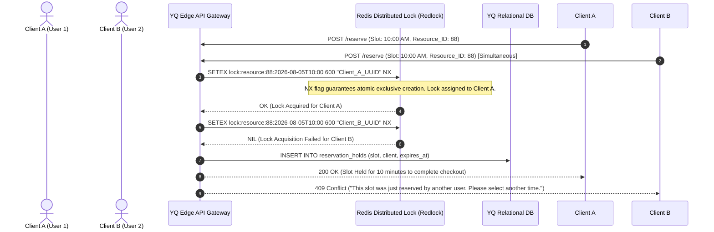

# Domain Synthesis: Concurrency, Double-Booking Prevention & Scheduling Engines

> **Document Status:** Active Standard & Synthesis Benchmark
> **Author:** Staff Software Architect & Technical Writer
> **Purpose:** Comprehensive architectural evaluation of distributed concurrency models, transaction locking mechanics, and bidirectional calendar synchronization protocols across the SaaS landscape.

---

## 1. Executive Summary

In appointment scheduling platforms (such as JRNI, Skedulo, or Waitwhile), the single most catastrophic engineering failure mode is the **Double-Booking Race Condition**—occurring when concurrent users simultaneously claim the same available time slot, or when background calendar synchronization lag overwrites a blocked personal calendar event.

This document establishes YQ's engineering protocol for distributed locking, optimistic concurrency control, and zero-latency webhook calendar federation.

---

## 2. Race Condition Mitigation Models (Incumbent vs. YQ)

---

## 3. YQ Concurrency & Locking Specification

### 3.1 Two-Phase Booking State Machine
To deliver a frictionless UX while guaranteeing database consistency, YQ separates booking into two transactional stages:
1. **Phase 1: Temporary Slot Reservation (Distributed Lock in Redis):**
   When a user clicks a time slot, the edge API executes an atomic Redis `SET resource_id:timestamp client_uuid NX EX 600` command. This secures a lightweight 10-minute temporary reservation without performing heavy relational database locking.
2. **Phase 2: Booking Confirmation (Optimistic Commit & Idempotency):**
   Upon payment or detail submission, the backend validates the Redis lock UUID, commits the final immutable `Appointment` row inside PostgreSQL within an ACID transaction, and immediately deletes the temporary Redis key. Every confirmation request mandates an `Idempotency-Key` header (UUIDv4) to guarantee network retry resiliency during cellular dropouts.

---

## 4. Enterprise Calendar Federation & Real-Time Webhook Engine

Legacy scheduling SaaS platforms rely on polling architectures (e.g., executing background cron jobs every 15 minutes to inspect external Microsoft Exchange or Google Workspace calendars for new events). **This 15-minute sync window represents a critical double-booking vulnerability.**

### 4.1 YQ Real-Time Push Sync Specification
YQ implements exclusively bidirectional event-driven synchronization using official provider Webhooks:
* **Microsoft 365 / Exchange Online:** YQ deploys background workers that register subscriptions with the **Microsoft Graph API Change Notification Webhook** engine. Whenever an employee creates an appointment directly inside Desktop Outlook, Microsoft servers push an encrypted JSON payload to YQ's endpoints within 3 seconds, triggering an immediate slot closure in YQ's Redis availability tree.
* **Google Workspace:** YQ subscribes to **Google Calendar API Push Notifications via Webhooks (`events.watch`)**, ensuring sub-5-second synchronization across all connected staff calendars globally.
