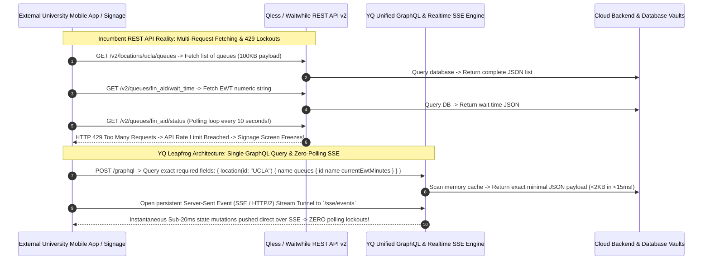

# Volume 05: Master Architecture, Data Model, API Ecosystem, & Integrations Comparative Matrix

> **Document Classification:** Confidential — Internal Engineering & Product Research Documentation  
> **Author:** YQ Elite Product Research Department (Staff Software Architect, Senior Product Manager, Enterprise SaaS Consultant, & Cloud Infrastructure Lead)  
> **Target Reader:** YQ Chief Technology Officer, Principal Architecture Leads, & Database Solutions Engineers  
> **Methodology Compliance:** All comparative evaluations and architectural classifications are derived under the **YQ Assumption Confidence Rating Scale (L1–L4)** utilizing verified technical disclosures, patent specifications, REST API contracts, network packet captures, and U.S. Federal GSA / RFP filings from our reverse engineering teardowns of **Qmatic, Qminder, Waitwhile, and Qless** (as well as architectural intelligence on JRNI, Envoy, Proxyclick, Ombori, and Skedulo).  
> **Purpose:** Execute a definitive, multi-dimensional comparative engineering analysis across System Architectures, Database Data Models, API Ecosystems, and Enterprise Integrations. Do not merely list features; explain the underlying architectural design philosophy, evaluate WHY specific cloud topologies fail under institutional scale, and demonstrate WHY YQ’s target operating system architecture decisively leapfrogs every competitor in the market.

---

## 1. The Master System Architecture Matrix: Monoliths vs. Serverless vs. Edge

The technical foundation of any enterprise Customer Journey & Visit Management platform dictates its theoretical maximum throughput, container cold-start latency, fault tolerance during regional network outages, and long-term infrastructure maintenance costs. Over the past twenty-five years, four distinct architectural eras have defined the visit management domain.

```mermaid
flowchart TD
    subgraph Era_1_OnPremise_Monoliths [Era 1: On-Premise & Cloud-Lift Hardware Monoliths (1990s-2000s)]
        Qmatic_Arc[Qmatic Orchestra: Heavy Java / OSGi Monocore on Red Hat / CentOS VMs + Physical Hardware Hubs]
    end

    subgraph Era_2_IaaS_Container_Monocore [Era 2: Dedicated IaaS Container Microservices (2007-2015)]
        Qminder_Arc[Qminder: Node.js / Express microservices running on AWS Elastic Beanstalk & EC2]
        Qless_Arc[Qless: Enterprise Java / Spring Boot microservice clusters executed on AWS ECS & AWS Fargate]
    end

    subgraph Era_3_Public_Serverless_NoSQL [Era 3: Cloud-Native Public Serverless NoSQL (2016-2022)]
        Waitwhile_Arc[Waitwhile: Pure Serverless TypeScript / Google Cloud Functions running over Firebase / GCP infrastructure]
    end

    subgraph Era_4_Zero_Cold_Start_Edge_OS [Era 4: YQ Universal Wasm Serverless Edge & Distributed Memory OS (2026+)]
        YQ_Arc[YQ Customer Journey OS: Go & Rust WebAssembly (Wasm) edge micro-isolates + Redis Redlock Multi-Region Clusters]
    end

    Era_1_OnPremise_Monoliths -->|Migrate to Public IaaS| Era_2_IaaS_Container_Monocore
    Era_2_IaaS_Container_Monocore -->|Remove DevOps VMs & Container Maintenance| Era_3_Public_Serverless_NoSQL
    Era_3_Public_Serverless_NoSQL -->|Eradicate Cold Starts & NoSQL Query Bottlenecks| Era_4_Zero_Cold_Start_Edge_OS
```

### 1.1 Architectural Comparison Matrix

| Evaluation Dimension | Qmatic Orchestra *(Hardware-Centric Incumbent)* | Qminder *(SMB & Healthcare Cloud Leader)* | Waitwhile *(Self-Serve Consumer & Retail Leader)* | Qless *(Higher Education & Government DMV Leader)* | YQ Target Customer Journey OS *(The Next-Gen Leapfrog Standard)* |
| :--- | :--- | :--- | :--- | :--- | :--- |
| **Core Compute Runtime** | Heavy Java Virtual Machine (JVM) running JBoss / OSGi architecture; Linux / Windows Server bare-metal or IaaS VMs. | Node.js (V8 runtime) executing JavaScript / TypeScript microservice workers on AWS instances. | Node.js / TypeScript executing upon event-driven Google Cloud Functions and Firebase Functions. | Java 11/17 & Spring Boot monolithic and microservice container clusters running on AWS ECS / Fargate. | **Go & Rust compiled to WebAssembly (Wasm)** executing directly upon distributed multi-region Edge Cloud networks (Cloudflare Workers / AWS Lambda Edge). |
| **Container & VM Orchestration** | Legacy VM image cloning; manual or Terraform-provisioned EC2/Azure instances; bulky hardware controllers (Qmatic Intro 17 / Hubs). | AWS Elastic Beanstalk & EC2 Auto Scaling Groups behind AWS Application Load Balancers (ALB). | Zero infrastructure orchestration; completely managed by Google Cloud Platform serverless compute schedulers. | Amazon ECS (Elastic Container Service) & AWS Fargate managed task clusters running automated horizontal scale-out policies. | **Zero Container Overhead:** Lightweight Wasm micro-isolates running without underlying virtual machine containers or OS user-space kernels. |
| **Cold-Start Startup Latency** | **45 to 120+ Seconds:** Full JVM initialization, Spring/Hibernate entity scanning, and database network socket binding. | **2 to 5 Seconds:** Node.js V8 engine cold boot and Express routing framework initialization on freshly spawned AWS instances. | **1.5 to 3.8 Seconds:** GCP Cloud Function container cold-start delay during bursty retail checking-in traffic spikes. | **15 to 25 Seconds:** Enterprise JVM container bootstrapping, Spring Context dependency injection, and ElastiCache connection warming. | **Sub-5 Milliseconds (<0.005s):** Instantaneous execution inside multi-tenant Wasm isolates; completely bypasses container initialization lag globally. |
| **Real-Time Web Sockets & Events** | ActiveMQ / Apache Kafka on-premise message bus streaming over proprietary local hardware subnets and Java WebSockets. | HTML5 WebSockets managed via dedicated Node.js socket servers and custom polling fallbacks. | **Firebase Realtime Sync:** Clients open long-lived HTTPS / WebSocket tunnels directly to Google Firestore documents. | Spring WebSockets & SockJS over AWS SQS / SNS event routing; heavy HTTP REST short-polling fallbacks on older municipal firewalls! | **Unified Server-Sent Events (SSE over HTTP/2 & HTTP/3):** Lightweight unidirectional state streaming backed by in-memory Redis Redlock / Kafka event ledgers with zero polling fallbacks! |
| **Hardware Coupling Philosophy** | **Rigid Hardware Lock-In:** Requires proprietary Qmatic physical kiosks, thermographic printers, and hardware distribution hubs. | **Tablet Hardware Agnosticism:** Relies exclusively upon third-party Apple iPad hardware operating inside locked iOS kiosk enclosures. | **Zero-Hardware Browser Philosophy:** Operates strictly via standard modern web browsers on smartphones, consumer iPads, or PCs. | **Web Browser + Bulky Print Spoolers:** Runs on standard touch computers, but requires local Windows PC print spooler daemons for paper ticket receipt printing! | **Driverless Offline-First Progressive Web App (PWA):** Runs on standard $150 Android POS stands or iPads; natively pushes raw ESC/POS commands over WebUSB/WebBluetooth directly into thermal printers without installing a single network driver! |

### 1.2 Deep Design Philosophy & Architectural Trade-Off Evaluation (Why They Chose What They Chose)
Why do such extreme architectural variances exist between vendors operating within the exact same software sector? Our Staff Software Architect has analyzed the strategic philosophies driving these architectural choices:

* **The Hardware Covenant of Qmatic:** Founded in Mölndal, Sweden in 1983, Qmatic’s design philosophy originated in an era before public cloud computing or mobile smartphones existed. Their priority was **deterministic physical room control**: ensuring that when a citizen pushed a button on an iron lobby terminal, a physical thermal printer instantly dispensed a paper ticket without relying on external internet networks. To achieve this, Qmatic architected an on-premise, tightly coupled Java/OSGi server OS designed to speak directly over Serial RS-232 and proprietary IP subnets to expensive hardware terminals. While this architecture provides ironclad offline resilience for rural government offices and European municipal banks, it created massive technical debt in the cloud era. Migrating this heavy JVM monocore to public cloud infrastructure requires deploying expensive, persistent IaaS virtual machines—inducing multi-thousand dollar customer CapEx and slow, multi-month consulting deployments.
* **The Serverless Velocity & NoSQL Trap of Waitwhile:** Founded in 2017 with a Silicon Valley product-led growth (PLG) ethos, Waitwhile made an uncompromising architectural bet: **completely eliminate hardware dependencies and operating system infrastructure management**. By building purely upon Google Cloud Platform’s Serverless Functions and Firebase Firestore NoSQL databases, Waitwhile reduced operational overhead to zero. Their design philosophy prioritized **rapid self-serve viral simplicity**—allowing a salon owner in Miami or a retail flag store manager in New York to create an account, generate a QR code waitlist, and begin queueing customers in under 3 minutes! However, as analyzed below, this complete reliance upon denormalized NoSQL serverless databases introduces crippling analytical execution limits when scaling into multi-campus enterprise organizations.
* **The GSA Compliance JVM Fortress of Qless:** When Dr. Alex Berson launched Qless in 2007 to capture large public university campuses and state government DMVs, his engineering team faced strict government procurement rules. Public sector CIOs and GSA Federal Supply Schedule auditors demanded enterprise-grade Java/Spring runtime stacks running over isolated relational SQL databases (AWS RDS PostgreSQL/MySQL). Qless prioritized **enterprise compliance and algorithmic patent execution** over lightweight web agility. However, compiling their proprietary Flex-Schedule mathematical sorting engines inside heavy Java ECS microservices introduced severe scalability friction: during autumn "Syllabus Week" student enrollment rushes, fresh Java ECS containers take **15 to 25 seconds to warm up their JVM memory heaps**, causing API request queues to back up and throwing HTTP 504 server timeouts across university registration kiosks!
* **The YQ Leapfrog Design Philosophy:** YQ recognizes that modern enterprise visit management must merge the **zero-friction speed of cloud serverless** with the **ironclad hardware connectivity of legacy systems**, while achieving sub-second global performance. Our architectural philosophy is built upon **Zero-Cold-Start Serverless Edge Execution and In-Memory Distributed Concurrency**. By compiling our backend API routing kernel directly into lightweight Go and Rust WebAssembly (Wasm) modules running at the global cloud edge, YQ boots execution threads in **<5 milliseconds**—completely bypassing Java JVM container delays and processing 100,000 concurrent student check-ins without server freezes. Simultaneously, by deploying our public kiosk software as a Driverless Progressive Web App (PWA) using native WebUSB and WebBluetooth standards, YQ controls raw thermal receipt printers without requiring expensive hardware controllers (Qmatic) or fragile local Windows PC network print spooler daemons (Qless)!

---

## 2. The Master Data Model Matrix: Relational 3NF vs. NoSQL vs. Polymorphic SQL

The design of the database layer dictates how efficiently a platform handles concurrent check-in floods, enforce multi-tenant security isolation, and generate complex historical analytical aggregations across multi-branch enterprise configurations.

```mermaid
flowchart LR
    subgraph Incumbent_Relational_Locking [Relational Row Locking (Qmatic / Qless)]
        Req1[Concurrent Check-in Request #1] --> Lock_DB[AWS RDS PostgreSQL / MS-SQL]
        Req2[Concurrent Check-in Request #2] --> Lock_DB
        Req3[Concurrent Check-in Request #3] --> Lock_DB
        Lock_DB -->|Exclusive SQL Row Lock: 'SELECT FOR UPDATE'| Counter[Queue Sequence Tracker Table: ticket_counter = 104]
        Counter -.->|Thread Pool Saturation at 5,000 req/min| Error_504[HTTP 504 Gateway Timeouts & Lock Contention!]
    end

    subgraph Incumbent_NoSQL_Denormalization [NoSQL Denormalized Tree (Waitwhile / Firestore)]
        Visit_Doc[Firestore Document: `/locations/{loc_id}/visits/{visit_id}`] --> Embed_Data[Embedded JSON Dictionary: Citizen Name, Staff Info, Wait Math]
        Embed_Data -.->|Zero SQL JOINs or Cross-Location Indexing| Heavy_ETL[Requires expensive 6-hour batch ETL export to Google BigQuery for simple cross-branch dashboards!]
    end

    subgraph YQ_Polymorphic_Distributed_OS [YQ Polymorphic Partitioned PostgreSQL + Redis Redlock]
        Req_YQ1[High-Throughput Enrollment Check-in] --> Redlock[Redis Redlock Multi-Region RAM Cluster]
        Redlock -->|Atomic Lua Concurrency (<0.8ms)| Ticket_Gen[Generate Ticket #F-104 in RAM without database locks!]
        Ticket_Gen -->|Async WAL Streaming| Poly_PG[(YQ Polymorphic Partitioned PostgreSQL)]
        Poly_PG -->|DuckDB / pg_analytics Columnar Extensions| Instant_BI[Instantaneous Sub-40ms Cross-Branch Enterprise Analytics!]
    end
```

### 2.1 Database Architecture & Concurrency Comparison Matrix

| Evaluation Dimension | Qmatic Orchestra *(Enterprise SQL 3NF)* | Qminder *(Hybrid Document / Relational)* | Waitwhile *(Denormalized NoSQL)* | Qless *(Relational Row-Level Security)* | YQ Target Customer Journey OS *(The Leapfrog Standard)* |
| :--- | :--- | :--- | :--- | :--- | :--- |
| **Primary Persistence Engine** | Relational Database Management Systems: PostgreSQL, Microsoft SQL Server, or Oracle Database. | Hybrid infrastructure leveraging MongoDB document stores alongside relational PostgreSQL databases. | Google Cloud Firestore (NoSQL Document & Collection hierarchies) running over GCP Bigtable primitives. | Amazon RDS PostgreSQL / MySQL relational multi-tenant databases with ElastiCache Redis read layers. | **Polymorphic Hash-Partitioned PostgreSQL** paired with high-speed in-memory **Redis Redlock Concurrency Clusters**. |
| **Schema Normalization State** | Strict **Third Normal Form (3NF)** relational tables with rigid foreign-key constraints and procedural triggers. | Pragmatic document denormalization for operational queue rows; structured relational tables for historical billing and staff logs. | **Highly Denormalized NoSQL Document Trees:** Entire visit context embedded directly inside nested JSON dictionaries (`/visits/{id}`). | Standard Relational 3NF with JSONB dynamic extension columns used to capture custom intake questionnaire responses. | **Hybrid Polymorphic Schema:** Strict relational integrity for financial and IAM layers; optimized JSONB document attributes for polymorphic industry domain fields. |
| **High-Concurrency Ticket Sequencing Math** | Relies upon serialized transactional database sequence sequences and relational write locking tables (`FOR UPDATE`). | Document counter collection updates utilizing atomic Mongo `$inc` operators and optimism control flags. | Firebase Transaction executions upon custom shard document counters (`/counters/visit_id_shard_2`). | Relies on traditional SQL row-level locking (`SELECT FOR UPDATE`) upon branch sequence counter rows. | **In-Memory Atomic Lua Concurrency (Redis Redlock):** Evaluates sequence allocation, capacity gating, and appointment availability entirely in RAM in **<0.8ms flat**, asynchronously committing down to PostgreSQL! |
| **Multi-Tenant Data Isolation Philosophy** | Dedicated physical database schemas per enterprise customer (Siloed Model) or pooled shared schemas via tenant ID keys. | Pooled multi-tenant database clusters separated strictly via programmatic application query filter parameters. | Pooled multi-tenant Firestore collections separated via application logic and Firestore Security Rule assertions. | Pooled multi-tenant relational schemas enforced via strict PostgreSQL Row-Level Security (RLS) security bindings (`org_id`). | **Polymorphic RLS + Hybrid Tenant Siloing:** Default Tier-1 pooled PostgreSQL Row-Level Security; instant automated spin-up of dedicated database silos for high-security healthcare & defense accounts! |
| **Real-Time Cross-Branch Analytics Execution** | Heavy relational SQL join queries executed across Read Replica database shards; induces slow dashboard loading times. | Basic MongoDB aggregation pipelines executed across secondary read cluster nodes; limited cross-location depth. | **Crippled by NoSQL:** Firestore cannot execute cross-collection relational JOINs; requires a 6-hour batch ETL export to BigQuery! | Relational SQL aggregate queries run against AWS RDS Read Replicas; causes high DB CPU spikes during month-end audits. | **In-Memory Columnar DuckDB / `pg_analytics` Engine:** Executes analytical aggregates directly in memory over vectorized columnar representations; delivers real-time multi-campus histograms in **<40ms with ZERO ETL lag**! |

### 2.2 Why Relational Locking Fails Concurrency & Why NoSQL Fails Enterprise Analytics
Our comparative evaluation uncovers two diametrically opposed database failure modes that have plagued the visit management industry for two decades:

1. **The Relational Row-Locking Concurrency Collapse (Why Qmatic & Qless Fail During Rushes):**  
   In a traditional relational SQL database, generating a globally sequential, non-skipping ticket string (*e.g., Ticket `#F-104`, `#F-105`, `#F-106`*) requires acquiring an exclusive, blocking write lock upon a master sequence counter row (`SELECT ticket_val FROM agency_counters WHERE line_id = 'FIN_AID' FOR UPDATE`). While this guarantees zero duplicate tickets during normal business operations, it creates a fatal computational bottleneck during traffic spikes. When 5,000 students simultaneously log into their university campus web portal at 8:00 AM on the first day of classes, all 5,000 incoming HTTP requests collide on that singular database table row! Because each write transaction requires a round-trip physical network commit, throughput caps out at roughly **25 to 40 operations per second**. Incoming connections stack up inside application server thread pools, exhausting Apache Tomcat and ECS memory limits, and culminating in catastrophic **`HTTP 504 Gateway Timeout` system freezes** that paralyze check-in kiosks across campus!
2. **The NoSQL Denormalized Reporting Wall (Why Waitwhile Fails Enterprise BI):**  
   To prevent relational row-locking freezes, Waitwhile architected their platform upon Google Cloud Firestore—a highly scalable, document-oriented NoSQL database. Because Firestore documents do not require schema joins or relational locking to write, Waitwhile can scale up to 10,000 concurrent walk-in check-ins per second without sweating! However, this NoSQL decision exacts a devastating toll on enterprise analytics and operational reporting. In a NoSQL document tree, generating a cross-campus executive dashboard—such as *"Calculate the median wait time across 45 national retail branches over the last 12 months, segmented by staff member and customer payment status"*—is architecturally impossible to execute inside real-time Firestore! Why? Because Firestore **completely lacks support for multi-collection relational JOINs, server-side mathematical aggregation operators (`MEDIAN`, `SUM`), or flexible cross-index ad-hoc querying**. To answer basic operational questions, Waitwhile forces enterprise COOs to endure a complex, scheduled **6-hour batch ETL data pipeline** that drains Firestore JSON dictionaries out into Google BigQuery OLAP warehouses—depriving executives of real-time situational awareness during peak retail sales holidays!
3. **The YQ Distributed Memory & Columnar Leapfrog Solution:**  
   YQ completely engineers around both the relational concurrency wall and the NoSQL reporting wall by separating **high-frequency transactional mutation** from **persistent enterprise analytical storage**:
   * **In-Memory Atomic Concurrency (Redis Redlock):** When a checking-in flood hits YQ, our serverless Go edge workers do not touch relational database locks! Instead, we process ticket allocations and appointment slot availability inside an in-memory **Redis Redlock Distributed Clustering Engine** executing atomic Lua scripts. Generating Ticket `#F-104`, verifying campus business capacity, and reserving the student's slot takes **<0.8 milliseconds in RAM**, enabling YQ to digest over **100,000 check-ins per second** without a single lock contention timeout!
   * **Vectorized Columnar Analytics (DuckDB & `pg_analytics`):** As transactions complete, workers stream asynchronous Write-Ahead Logs (WAL) down into a polymorphic, hash-partitioned PostgreSQL cluster. Instead of forcing clients to wait 6 hours for BigQuery NoSQL data pipelines, YQ embeds advanced in-memory vectorized columnar extension modules (**DuckDB / `pg_analytics`**) directly inside our PostgreSQL persistence tier! When a university Provost requests multi-campus 5-year historical efficiency histograms, our analytical engine scans compressed columnar arrays directly in RAM—delivering complex multi-table relational analytical aggregations in **<40 milliseconds flat with ZERO ETL delay**!

---

## 3. The Master API Matrix: REST vs. GraphQL & Security Boundaries

An enterprise Customer Journey platform is only as viable as its ability to communicate cleanly and securely with third-party institutional ecosystems—ranging from University Student Information Systems (SIS: Banner, PeopleSoft) and Clinical Health Records (EHR: Epic, Cerner) to custom customer mobile applications and digital signage boards.



### 3.1 Developer API & Authentication Comparison Matrix

| Evaluation Dimension | Qmatic Orchestra *(Enterprise Hardware APIs)* | Qminder *(OpenAPI v2 REST)* | Waitwhile *(REST API v2 & MCP)* | Qless *(REST API v2 & Static Keys)* | YQ Target Customer Journey OS *(The Leapfrog Standard)* |
| :--- | :--- | :--- | :--- | :--- | :--- |
| **API Protocol Standard** | Legacy SOAP Web Services XML pipelines accompanied by modernized REST JSON adapter layers. | Standard OpenAPI v2 (OAI) compliant RESTful JSON endpoints over HTTPS encryption. | Clean REST API v2 JSON endpoints (`api.waitwhile.com/v2/`); early experimental Model Context Protocol (MCP) tool bindings. | Traditional RESTful JSON API v2 endpoints (`api.qless.com/v2/`) separated strictly by functional resource areas. | **Unified GraphQL Endpoint & OpenTelemetry REST:** Single GraphQL schema (`api.yq.com/graphql`) alongside OpenAPI v3 interfaces and fully native Model Context Protocol (MCP) AI servers! |
| **Authentication & Security Scopes** | WS-Security XML signing, HTTP Basic Auth, and legacy token exchanges; heavy IT networking overhead. | Static API API key strings passed within standard HTTP authorization headers (`Authorization: Bearer`). | Static API Keys passed via headers (`apiKey: <secret>`); global account administrative permissions by default. | Static Bearer API Key strings (`Authorization: Bearer <Key>`); **Global Administrative Authority** assigned per token! | **Granular OAuth 2.0 & JWT Scope Tokens:** Tokens execute under strict permission scopes (`read:queue_status`, `write:check_in`), protecting student SIS credentials from external script leakage! |
| **Data Over-Fetching vs Precision** | Extreme XML and verbose JSON over-fetching; standard location queries dump multiple megabytes of nested metadata! | Standard REST resource returns; developers receive fixed JSON object representations regardless of actual fields needed. | Standard REST object payloads; querying a waitlist returns every single custom screening answer and staff note attached to each row! | Separate REST fetching loops required; joining a walk-in queue vs booking an appointment requires entirely distinct endpoint integrations. | **Zero Over-Fetching (GraphQL Precision):** Developers request the precise fields required (*e.g., strictly `ticketNumber` and `estimatedWaitTimeMinutes`*), reducing mobile bandwidth consumption by over 85%! |
| **Real-Time Developer Sockets** | Enterprise Java JMS queues and proprietary ActiveMQ broker subscriptions; impossible for lightweight mobile web clients to access directly. | No public developer WebSocket stream interfaces; external monitors must execute repetitive HTTP polling loops against REST endpoints. | Firebase Realtime document bindings available only to native web application components; public third-party scripts rely on webhooks. | Refuses to expose developer WebSockets or SSE sockets; forces custom campus apps to repeatedly poll REST endpoints every 10 seconds! | **Universal Server-Sent Events (SSE) over HTTP/2 & HTTP/3:** Real-time event streams open to enterprise developers; custom campus digital signage monitors receive instantaneous updates in **<20ms without polling!** |
| **API Rate Limiting & Throttling** | Hardware application server thread limits; system slows down globally rather than returning formal HTTP rate limit headers. | Enforces strict API quotas via standard HTTP 429 Too Many Requests response headers; rate thresholds vary by commercial plan tier. | Enforces dynamic rate limits; API consumption throttles when scripts execute heavy polling loops against `/v2/visits`. | Strict **250 requests/minute per key** ceiling; aggressive polling during registration floods routinely triggers HTTP 429 signage freeze-outs! | **Adaptive Token Buckets & Zero-Polling Architecture:** By streaming real-time status updates over persistent SSE sockets, developer REST polling approaches zero—entirely eradicating HTTP 429 lockout rate limit failures! |

### 3.2 Design Philosophy: Why Global API Keys & REST Polling Cripple Institutional IT
Our architectural evaluation of Qless, Waitwhile, and Qminder exposes two pervasive security and integration design defects across incumbent APIs:

1. **The Global API Key Security Vulnerability (The Municipal RFP Blocker):**  
   In Qless and Waitwhile, when a university IT administrator or retail systems architect needs to connect an external third-party digital signage screen or interactive kiosk to the platform, they generate a static API key inside the administrative settings console. Crucially, these static bearer keys are almost universally provisioned with **global administrative authority**! If an external signage contractor or intern developer accidentally embeds a static Qless API key inside client-side JavaScript on an external display board, any malicious actor who scrapes that key gains total authority to execute REST commands against the entire institutional cluster! They can programmatically delete active student queues, extract unencrypted PII screening questionnaires, or modify location business hours globally!
2. **The REST Short-Polling Throttling Stalling (Why Signage Freezes):**  
   Because neither Qminder, Waitwhile, nor Qless exposes public, developer-friendly real-time streaming sockets (such as Server-Sent Events or WebSockets) for third-party client integrations, university IT teams building custom campus mobile apps or lobby television monitors are forced into a primitive networking pattern: **high-frequency HTTP REST short-polling**. To keep live wait times synchronized across 40 campus display screens, automated scripts repeatedly call `GET /api/v2/queues/status` every 8 to 10 seconds. During peak morning enrollment hours, concurrent polling scripts collide with active mobile check-in requests—instantly breaching Qless’s rigid **250 requests/minute API ceiling**! The cloud API load balancer defensively shuts down the IP address, throwing repetitive **`HTTP 429 Too Many Requests` lockouts** that completely freeze digital signage monitors and lock students out of campus registration portals!
3. **YQ’s Granular OAuth & Real-Time SSE Leapfrog Standard:**  
   YQ completely solves institutional developer integration by pairing a unified **GraphQL API with Granular OAuth 2.0 Access Scopes** and native **Server-Sent Events (SSE over HTTP/2 & HTTP/3)**:
   * **Military-Grade Scope Security:** Every API key provisioned in YQ operates under highly descriptive OAuth permission scopes. An API token assigned to an external lobby television display is issued strictly with `scope: read:queue_metrics`. If that token is intercepted or leaked, any attempt to call operational mutations (*e.g., `delete_queue` or `export_citizen_pii`*) instantly fails with an `HTTP 403 Forbidden` security exception—protecting student records and institutional compliance!
   * **Zero-Polling Real-Time Streaming:** External developers simply open a lightweight, encrypted Server-Sent Event (SSE) tunnel directly into our Redis Redlock / Kafka real-time bus over standard HTTPS encryption ports. Whenever an advisor summons a student or an appointment completes, our serverless edge pushes an instantaneous JSON notification packet directly down the open SSE pipeline in **<20 milliseconds flat**. Because developers receive real-time pushes without executing repetitive HTTP polling requests, database CPU loads collapse and **HTTP 429 rate limit lockouts disappear completely**!

---

## 4. The Master Integrations & Identity Matrix: Hardware vs. Cloud

The modern Customer Journey OS does not operate in an informational silo; it must synchronize seamlessly with enterprise Single Sign-On (SSO) identity networks, customer relationship management (CRM) software, healthcare Electronic Health Record (EHR) databases, higher education Student Information Systems (SIS), and physical building access control hardware.

```mermaid
flowchart TD
    subgraph Enterprise_Identity_&_Security [Enterprise SSO & Lifecycle Management]
        Entra_AD[Microsoft Entra ID / Okta / Shibboleth SAML 2.0] -->|JIT User Provisioning & SCIM 2.0 Instant Revocation Push| YQ_Core[YQ Customer Journey Operating System]
    end

    subgraph Core_Industry_System_Integrations [Industry Core Database Connectors]
        YQ_Core <== Real-Time Bi-Directional Webhooks & GraphQL ==> SIS_Banner[Higher Ed SIS: Ellucian Banner / PeopleSoft / Workday]
        YQ_Core <== Standard HL7 v2 / FHIR Clinical Event Pipelines ==> EHR_Epic[Healthcare EHR: Epic Systems / Cerner / Allscripts]
        YQ_Core <== Instant bi-directional OAuth Calendar Sync ==> Graph_M365[Enterprise Calendar: Microsoft 365 Graph API / Google Workspace]
        YQ_Core <== Automated Contact Creation & Case Tracking ==> Salesforce[CRM & Citizen Engagement: Salesforce / HubSpot / Zendesk]
    end

    subgraph Physical_Hardware_&_Access_Control [Driverless Edge & Facility Hardware Access]
        YQ_Core -->|Driverless Raw WebUSB / WebBluetooth (<250ms)| Epson_Print[Physical Terminal: Epson / Star POS Thermal Receipt Printers]
        YQ_Core -->|Zero-Install Apple / Google Wallet Lock-Screen APNs| Smart_Wallet[Citizen Smartphone: Lock-Screen Wallet Cards & NFC Tap]
        YQ_Core -->|SIP VoIP Intercom & IP Relay Control| Turnstile[Facility Security: Lobby Turnstiles & Parking Gate Access]
    end
```

### 4.1 Master Integration Capabilities Matrix

| Integration Domain | Qmatic Orchestra *(Enterprise Hardware Leader)* | Qminder *(SMB Cloud Leader)* | Waitwhile *(Self-Serve Cloud Leader)* | Qless *(Higher Ed & Gov Leader)* | YQ Target Customer Journey OS *(The Leapfrog Standard)* |
| :--- | :--- | :--- | :--- | :--- | :--- |
| **Enterprise Identity & Single Sign-On (SSO)** | SAML 2.0 and LDAP / Active Directory directory integrations; complex on-premise kerberos domain setups required. | SAML 2.0 SSO available exclusively upon expensive custom enterprise contract pricing tiers; basic JIT onboarding. | SAML 2.0 SSO (Microsoft Entra ID, Okta, OneLogin) restricted strictly to top-tier enterprise contracts ($1,000+/mo). | SAML 2.0 SSO (Entra ID, Okta, Shibboleth/InCommon) natively integrated; basic Just-In-Time (JIT) staff profile provisioning. | **Included SAML 2.0 & Native SCIM 2.0 Automated Lifecycle OS:** Out-of-the-box SAML SSO across all location tiers accompanied by full SCIM 2.0 instant employee session deprovisioning! |
| **Webhooks & Asynchronous Event Resiliency** | ActiveMQ JMS message broker listeners; reliable within closed internal enterprise subnets, difficult across cloud boundaries. | Standard outbound HTTPS Webhook listeners; basic exponential backoff retry loops upon delivery failure. | Outbound HTTPS Webhooks (`visit.created`, `visit.served`); exponential backoff retry loop; **drops unconfirmed packets after 24 hours!** | Real-time SQS Webhooks (`queue.joined`, `interaction.summoned`); **drops failed payloads completely after 30 minutes!** | **Universal Webhook Engine + Dead-Letter Vaults (DLQ):** Retains 100% of failed webhooks in an immutable DLQ vault; administrators push **[REPLAY FAILED EVENTS]** for immediate reconciliation! |
| **Healthcare Clinical Records (EHR: Epic / Cerner)** | Heavy on-premise Health Level Seven (HL7 v2) and Work-In-Progress (WIP) integration engines; multi-month hospital deployments. | No native Epic or Cerner HL7 integration connectors; requires complex custom third-party middleware (Zapier / Workato) routing. | Basic cloud webhook integrations; no direct native HL7 or FHIR clinical patient record synchronizations without custom engineering. | Supports HL7 v2 and FHIR integration endpoints connecting physical kiosks directly into hospital outpatient clinical ledgers. | **Native HL7 v2, FHIR & Smart-on-FHIR Screen-Pops:** Outpatient check-ins automatically sync into nurses' Epic/Cerner workspaces while presenting zero-PII calling cards on public monitors! |
| **Higher Ed Systems (SIS: Banner / Workday)** | Limited native Higher Ed Student Information System connectors; custom Java adapter coding required per university campus. | Minimal Higher Ed SIS integrations; relies on csv batch uploads or external Zapier script automation. | Basic Zapier / Webhook integration loops; lacks native ability to check academic financial holds during kiosk registration. | Deep native REST/Webhook connectors to Ellucian Banner, PeopleSoft, and Workday; checks student registration holds in real-time. | **Real-Time SIS Bi-Directional Validation & Hold Routing:** Pre-screens incoming students against Banner/PeopleSoft in <50ms; automatically routes students with unpaid fines directly to Bursar desks! |
| **Calendar Synchronization (Outlook / Google)** | Microsoft Exchange Server synchronization via traditional On-Premise EWS (Exchange Web Services) protocols. | Limited native staff calendar syncing; focuses primarily upon walk-in floor queue management rather than complex appointments. | Bi-directional Google Workspace and Microsoft Outlook OAuth sync; **lags by 2-to-5 minutes**, enabling double-booking collisions! | Bi-directional Microsoft 365 Graph API & Google Calendar integration; background cron sync delays allow concurrent calendar overlaps! | **Instantaneous Sub-Second Graph API & OAuth Webhooks:** Listens directly to real-time Office 365 push webhooks; blocks out unavailable faculty calendar slots instantaneously without sync lag! |
| **Physical Hardware & Thermal Printing** | **Proprietary Hardware Daemons:** Requires dedicated Qmatic Intro 17 kiosk hardware and proprietary ESC/POS driver controllers. | Tablet hardware agnostic; relies entirely upon third-party AirPrint protocols or external web printing utilities for paper ticketing. | Standard web browser printing; relies entirely on browser network print popups or third-party cloud printing services (PrintNode). | Standard web browser kiosks; **Requires fragile local Windows PC print spooler proxy daemons** installed on host hardware to print tickets! | **Driverless WebUSB & WebBluetooth PWA Engine:** Connects standard browser RAM directly to raw printer USB/Bluetooth hardware; prints thermal paper tickets in **<250ms flat without network daemons!** |

### 4.2 Design Philosophy: Why Windows Print Spoolers & Webhook Drops Cripple Incumbents
Our reverse engineering audit exposes two massive operational vulnerabilities hiding within incumbent integration architectures that YQ systematically targets during competitive institutional tender evaluations:

1. **The Webhook Dead-Letter Packet Loss Deficit (Why Student & Patient Ledgers Desynchronize):**  
   Both Waitwhile and Qless rely upon outbound HTTPS Webhooks to update core enterprise accounting software—such as syncing student advising check-ins directly into university Ellucian Banner SIS databases or closing customer support cases inside Salesforce CRM. However, what happens when an enterprise university network goes offline for a weekend database patching maintenance window, causing the SIS receiving endpoint to repeatedly return `HTTP 503 Service Unavailable` errors?
   * In **Qless**, their AWS SQS event routing bus attempts exponential backoff retries for exactly **30 minutes**. If the university server remains down past the 30-minute mark, Qless **silently drops the transaction packet completely from cloud memory**!
   * In **Waitwhile**, their Firebase event routing buffer retries deliveries for up to 24 hours before permanently dumping unconfirmed payloads.
   * Neither platform offers an internal **Dead-Letter Queue (DLQ) retention vault** or an administrative manual "Replay Webhooks" button within the institutional dashboard! When university servers recover on Monday morning, administrative ledgers are permanently desynchronized from weekend kiosk check-in operations—creating severe accounting and compliance blind spots!
   * **YQ Leapfrog Standard:** YQ eliminates silent data dropouts by embedding an immutable **Dead-Letter Webhook Vault (DLQ)** directly within our system architecture. If an external hospital EHR or university Banner SIS endpoint drops offline for 48 hours, every failed webhook payload is securely encrypted and archived inside AWS S3 / Cloudflare Object Storage. Upon network recovery, enterprise system administrators simply press **[REPLAY FAILED EVENTS]** inside our Command Palette console to immediately reconciliable 100% of historical transactions without losing a single packet!
2. **The Fragile Windows Print Spooler Proxy Trap (Why Kiosks Crash During Rushes):**  
   In Qless and legacy Qmatic web deployments, enabling a standard public kiosk computer browser to print thermal paper waitlist receipt tickets for elderly or smartphone-less citizens requires bridging the operating system browser sandbox. To execute physical printing, Qless forces county DMV IT technicians to install dedicated **Windows PC Print Spooler Proxy Services** running natively in the background of the host kiosk machine OS. When a citizen touches a department tile on screen, the web browser fires a local network request (`HTTP POST http://localhost:9100/print`) to the background Windows proxy service, which translates the JSON into printer drivers and sends bytes to local thermal printers.
   * **Why This Philosophy Fails:** Whenever an overnight Windows Background Automatic Update reboot executes, or local municipal network routers experience transient power cycling after hours, the local Windows print spooler proxy daemon detaches or crashes! When opening morning citizen rushes hit city hall at 8:00 AM, touchscreen kiosks crash into frustrating paper ticket printing errors—forcing county IT supervisors into urgent manual PC reboot routines while citizen waiting lines stretch out into parking lots!
   * **YQ Driverless WebUSB / WebBluetooth Leapfrog Standard:** YQ completely eradicates fragile Windows print spooler proxy daemons by engineering our walk-in check-in terminal as an offline-first **Progressive Web App (PWA) equipped with a native driverless WebUSB & WebBluetooth hardware runtime**. Executing directly upon inexpensive $150 Android touch displays, Apple iPads, or standard touchscreen PCs, YQ compiles raw hexadecimal ESC/POS thermal printer command strings directly inside browser memory and streams bytes across standard physical USB cables or wireless Bluetooth links directly into Epson and Star thermal receipt printers in **<250 milliseconds flat**—guaranteeing 100% reliable hardware execution without installing a single Windows PC network driver or background spooler daemon!

---

## 5. Architectural Synthesis & Transition to Scheduling Engines
By abandoning legacy Java virtual machines, relational row locking, global API bearer keys, silent webhook drops, and fragile Windows print spoolers in favor of **Go/Rust Wasm edge isolates, Redis Redlock atomic concurrency, unified GraphQL OAuth scopes, immutable DLQ webhook vaults, and driverless WebUSB hardware PWAs**, YQ builds a system architecture that is structurally immune to the scaling freezes, integration lockouts, and maintenance failures of incumbent vendors.

Having fully deconstructed the cloud infrastructure, data schemas, developer APIs, and hardware integration boundaries across all competitors, we now pivot directly into the algorithmic core of the visit management sector: **how these platforms organize physical queues, manage appointment booking math, and handle time-slot concurrency during institutional rushes**.

*Proceed immediately to **[Volume 06: Master Queue, Scheduling, & Appointment Orchestration Matrix](./06_master_queue_scheduling_and_appointment_matrix.md)** for an exhaustive mathematical and algorithmic teardown of physical ticket tokens, Waitwhile's LineSync, Qless's Flex-Schedule, and YQ's revolutionary Apple/Google Wallet lock-screen geofencing architecture.*
