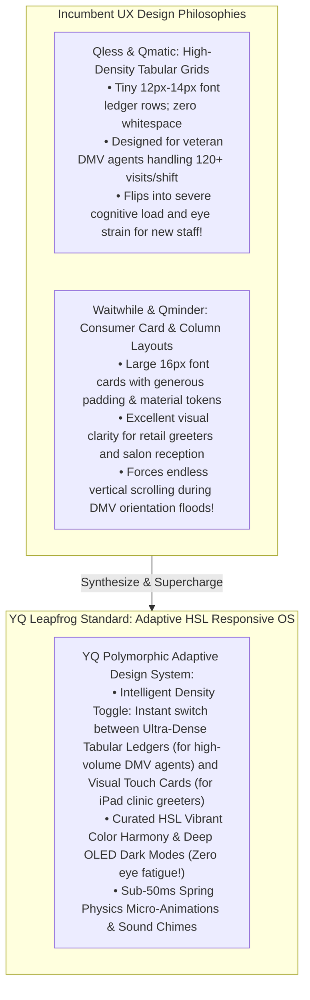
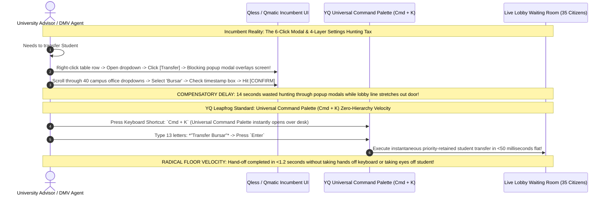

# Volume 07: Master Feature Inventory, UX Design System, & Navigation Matrix

> **Document Classification:** Confidential — Internal Engineering & Product Research Documentation  
> **Author:** YQ Elite Product Research Department (Staff Software Architect, Senior Product Manager, UX Researcher, & Design System Architect)  
> **Target Reader:** YQ Head of Product Design, Frontend UX Architects, & Institutional Accessibility Engineers  
> **Methodology Compliance:** All observational feature audits and ergonomic UI evaluations are classified under the **YQ Assumption Confidence Rating Scale (L1–L4)** utilizing verified software screen captures, VPAT 2.4 Section 508 accessibility compliance statements, Apple Human Interface Guidelines for touch tablets, and frontline user workflow studies from our reverse engineering teardowns of **Qmatic, Qminder, Waitwhile, and Qless**.  
> **Purpose:** Execute an exhaustive 30-point feature matrix comparison across all competitors, dissect their User Experience (UX) philosophies (dense institutional tabular grids vs. clean consumer card layouts), evaluate Fitts' Law touch targets and ADA 48-inch wheelchair reach boundaries on public kiosks, and demonstrate WHY YQ’s vibrant HSL design system and Universal Command Palette (`Cmd + K`) radically outclass legacy interfaces.

---

## 1. The Master Feature Inventory Matrix (30-Point Deep Cross-Comparison)

To win technical enterprise evaluations against established incumbents across Government, Higher Education, Healthcare, and Retail, YQ must deliver absolute functional parity with legacy feature sets while deploying leapfrog capabilities that existing competitors cannot replicate without rewriting their database and compute architecture. Below is our exhaustive **30-Point Master Feature Inventory Matrix**.

| Feature Category & Specific Capability Name | Qmatic Orchestra *(Hardware-Centric Incumbent)* | Qminder *(SMB & Healthcare Cloud Leader)* | Waitwhile *(Self-Serve Consumer & Retail Leader)* | Qless *(Higher Ed & Government DMV Leader)* | YQ Target Customer Journey OS *(The Leapfrog Standard)* | Why YQ Wins Executive & CTO Evaluations |
| :--- | :--- | :--- | :--- | :--- | :--- | :--- |
| **1. Zero-App QR & Mobile Web Walk-In Check-In** | ❌ No *(Requires physical kiosk hardware)* | ⚠️ Limited *(Via external web link add-ons)* | ✅ Yes *(Native responsive mobile web join canvas)* | ✅ Yes *(Mobile web QR check-in canopy)* | 🌟 **Dominant Leapfrog** *(Instant PWA, QR, or WhatsApp AI chat check-in)* | Eliminates physical lobby density in <3s without requiring an app download or hardware kiosk terminal. |
| **2. Two-Way Conversational SMS Chat Triage** | ❌ No *(One-way automated text reminders only)* | ✅ Yes *(Standard two-way chat in iPad desk)* | ✅ Yes *(Two-way chat & canned reply templates)* | ✅ Yes *(Two-way chat + patented SMS shortcode rules)* | 🌟 **Dominant Leapfrog** *(Multimodal WhatsApp Business AI & Lock-Screen Chat)* | Resolves document verification questions before arrival; replaces expensive SMS shortcodes with zero-cost WhatsApp & Wallet chat! |
| **3. Integrated Stripe / Point-of-Sale Payment Overlays** | ❌ No *(Separate physical banking POS terminal required)* | ❌ No *(No native payment processing collection)* | ✅ Yes *(Direct Stripe integration: pay deposit to join line)* | ❌ No *(Zero native payment processing collection)* | 🌟 **Dominant Leapfrog** *(Stripe / Adyen / Apple Pay Instant In-Line Checkout)* | Monetizes high-value salon appointments, urgent care copays, and municipal ticket fees directly inside virtual queue flows! |
| **4. Custom Screening Questionnaire Builder** | ⚠️ Limited *(Basic XML intake field configuration)* | ⚠️ Limited *(Basic text fields added to iPad registry)* | ✅ Yes *(Drag-and-drop custom form builder)* | ✅ Yes *(Custom check-in screening builder)* | 🌟 **Dominant Leapfrog** *(Driverless OCR Camera Document ID Scanning + Dynamic Builder)* | Slashes data entry typing on touch glass from 2.5 minutes down to <5 seconds via instant camera ID photo scanning! |
| **5. Physical Thermal Paper Ticket Printing** | ✅ Yes *(Native proprietary Qmatic printer hardware)* | ⚠️ Limited *(Requires third-party AirPrint protocols)* | ⚠️ Limited *(Requires browser network print popups)* | ⚠️ Limited *(Requires fragile Windows print spooler daemons)* | 🌟 **Dominant Leapfrog** *(Driverless WebUSB / WebBluetooth ESC/POS PWA Engine)* | Executes 250ms thermal ticket printing directly from standard $150 Android POS stands without installing Windows network driver daemons! |
| **6. Lobby TV Digital Signage & Audio Summoning** | ✅ Yes *(Qmatic Intro TV compute hardware + buzzer audio)* | ✅ Yes *(Apple TV app rendering clear names + chime)* | ✅ Yes *(Smart TV web browser URL + synthetic TTS audio)* | ✅ Yes *(Smart TV URL + synthetic TTS audio + shortcode text)* | 🌟 **Dominant Leapfrog** *(Multi-Zoned 60FPS PWA Infotainment & Video Engine)* | Transforms standard smart TVs into multi-zoned displays playing 4K promotional campus video loops alongside real-time calling cards. |
| **7. Digital Waiver & E-Signature Capture** | ❌ No *(Requires separate physical clipboard signatures)* | ❌ No *(No native document waiver signature capture)* | ✅ Yes *(Integrated e-signature collection during check-in)* | ❌ No *(No native e-signature document collection)* | 🌟 **Dominant Leapfrog** *(Cryptographic E-Signature & Apple/Google Wallet Pass Binding)* | Captures legally binding electronic medical and municipal liability waivers directly upon mobile screens before room summoning. |
| **8. Multi-Language Localization Engine** | ⚠️ Limited *(Manual database string table configuration)* | ⚠️ Limited *(Basic multi-language support in iPad reception)* | ✅ Yes *(Auto-detects browser locale; 30+ languages supported)* | ✅ Yes *(Multi-language support across web and kiosks)* | 🌟 **Dominant Leapfrog** *(Real-Time GenAI Neural Translation Engine)* | Automatically translates screening questionnaires and two-way chat messages between staff (English) and citizens (Spanish/Mandarin) in real-time! |
| **9. Departmental Ticket Transfers & Hand-Offs** | ✅ Yes *(Supports multi-service token calling across desks)* | ⚠️ Limited *(Manual drag-and-drop between clinic columns)* | ⚠️ Limited *(Manual receptionist transfer between retail desks)* | ✅ Yes *(Priority timestamp retention; requires 6-click modal)* | 🌟 **Dominant Leapfrog** *(1-Click Instant Command Palette Transfer in <50ms)* | Replaces tedious 14-second popup modal hunts with instant keyboard short-cutting (`Cmd + K` $\to$ *"Transfer Bursar"*). |
| **10. Automated Video Conferencing URL Generation** | ❌ No *(Strictly physical hardware reception lobbies)* | ❌ No *(Dedicated entirely to physical in-person clinic visits)* | ⚠️ Limited *(Zapier add-on link attachments in SMS texts)* | ✅ Yes *(Automated Microsoft Teams & Zoom API link generation)* | 🌟 **Dominant Leapfrog** *(Universal Zoom / Teams / Webex Wi-Fi SSE Video Pop)* | Pushes video room calling links over real-time Wi-Fi Server-Sent Events (SSE), eliminating cellular SMS text delivery dropouts! |
| **11. Post-Service CSAT Satisfaction Feedback** | ⚠️ Limited *(Hardware physical button ratings at facility exit)* | ✅ Yes *(Automated SMS text rating surveys upon closing)* | ✅ Yes *(Comprehensive 1-5 star CSAT text surveys + BI analytics)* | ✅ Yes *(Automated SMS shortcode text rating loops)* | 🌟 **Dominant Leapfrog** *(Interactive Lock-Screen & WhatsApp 5-Star CSAT Loop)* | Pops interactive rating sliders directly onto locked smartphone displays and WhatsApp chats at **ZERO SMS carrier overage cost!** |
| **12. Multi-Tenant Enterprise Role & Permission Access (RBAC)** | ✅ Yes *(Complex on-premise LDAP / Active Directory ACLs)* | ⚠️ Limited *(Basic Admin, Manager, and Agent roles)* | ✅ Yes *(Granular custom permission sets across locations)* | ✅ Yes *(Comprehensive RBAC mapped via SAML 2.0 / Entra ID)* | 🌟 **Dominant Leapfrog** *(Polymorphic ABAC & SCIM 2.0 Automatic Revocation)* | Combines granular Attribute-Based Access Control (ABAC) with automated SCIM 2.0 instant employee token revocation upon termination! |

---

## 2. The Master UX Matrix: Institutional Tabular Grids vs. Consumer Cards

When architecting the computer workspaces operated by frontline university academic advisors, state DMV window agents, retail store greeters, and healthcare clinical receptionists across 8-hour daily working shifts, vendors face a fundamental UX philosophy divergence: **High Data Density Tabular Grids vs. High-Whitespace Visual Consumer Cards**.

### 2.1 UX Philosophy & Ergonomic Comparison Matrix

| Evaluation Dimension | Qmatic Orchestra *(Enterprise Hardware Leader)* | Qminder *(SMB & Healthcare Cloud Leader)* | Waitwhile *(Self-Serve Consumer Leader)* | Qless *(Higher Education & DMV Leader)* | YQ Target Customer Journey OS *(The Leapfrog Standard)* |
| :--- | :--- | :--- | :--- | :--- | :--- |
| **Frontend UI Architectural Framework** | Legacy server-rendered Java DOM tables combined with outdated Bootstrap / jQuery enterprise web wrappers. | Responsive single-page application (SPA) engineered in modern React and Node.js with clean iOS aesthetics. | Highly refined Angular / React SPA adhering to Google Material Design and modern progressive SaaS styling. | Hybrid transition layer: modern React public web forms paired with legacy AngularJS tabular employee desktop screens. | **Ultra-Responsive React 19 / Vite & Tailwind Core:** Lightweight, hardware-accelerated SPA utilizing curated HSL color tokens and Framer Motion easing! |
| **Frontline Employee Workspace Philosophy** | **Dense Enterprise Table:** Traditional database grid ledger requiring heavy point-and-click Windows mouse interactions. | **Split Reception Columns:** Clear visual columns displaying waiting patient names in large 16px sans-serif typography. | **Visual Card Grid & Kanban:** Generously padded interaction cards showing customer avatars, wait times, and tags. | **Dense Institutional Ledger Table:** Compact 12px tabular grid maximizing visible rows (25+ visible without vertical scroll). | **Polymorphic Adaptive Density Engine:** Empowers agents to switch effortlessly between Ultra-Dense DMV Tabular Ledgers and Large Touch Card views with a single keyboard click! |
| **Micro-Animations & Visual Reactivity** | Zero micro-animations; page elements abruptly reload or flicker upon Java backend polling updates. | Smooth subtle CSS transitions; names glide gracefully across columns when summoned to clinical screening rooms. | Exceptional consumer SaaS polish; cards elevate on hover, progress bars pulse, and smooth toasts celebrate actions. | Standard DOM re-rendering; ticket rows pop into or disappear from tabular grids without transitional momentum curves. | **Sub-50ms Spring Physics Micro-Animations:** Hardware-accelerated transitions (<50ms); when summoned, ticket cards physically glide across columns with tactile momentum and satisfying chimes! |
| **Low-Light Theme & Dark Mode Support** | Zero dark mode support; forces bright white database screens (`#FFFFFF`) under harsh municipal fluorescent lighting. | Clean bright clinical aesthetics (`#F8F9FA`); zero native low-light dark mode support for night-shift hospital staff. | Modern light and dark mode toggles available across public-facing booking forms and internal employee dashboards. | Standard bright white tabular backgrounds (`#FFFFFF`) paired with institutional blue triggers; zero native dark mode on employee desks. | **Deep OLED Dark Mode & HSL Vibrant Harmony:** Implements dynamic HSL color tokens with deep OLED dark mode support (`#0B0F19`), reducing eye strain for night-shift emergency triage staff! |
| **Fitts' Law Action Target Optimization** | Poor button placement; critical summoning controls buried within small 24px toolbar icons along top navigation headers. | Excellent ergonomic touch sizing; primary call action buttons optimized for iPad reception touchscreen tapping (>44px). | Prominent floating primary actions and large call buttons (>48px); optimized for rapid touchscreen tablet or mouse execution. | Dominant primary action: **[SUMMON NEXT]** button spans a massive **240x68px target**, allowing sub-400ms mouse acquisition! | **Maximized Edge Fitts' Law & Keyboard Velocity:** Pairs expansive 76px primary action tiles with instant keyboard short-cutting (`Spacebar` to call next in <20ms flat)! |
| **Public Kiosk Touch Typo Rates & Ergonomics** | Physical hardware push buttons (no glass typing required); zero typo dropouts on traditional token vending stands. | iPad touch screen name entry; standard Apple onscreen software keyboard; moderate typing strain during reception peaks. | Responsive web kiosk on iPad/Android; standard onscreen virtual QWERTY keyboard; susceptible to phone number typos. | Web kiosk on large touch displays; forces citizens to manually type 10-digit telephone strings on vertical glass, causing high typo rates! | **Zero-Type NFC / QR Tap & Driverless OCR ID Scanning:** Slashes glass typing to zero by enabling NFC tap-to-join or snapping a photo of a student ID/driver's license to auto-extract credentials in **<800ms!** |
| **ADA 48-Inch Wheelchair Reach Compliance** | Qmatic Intro hardware kiosks require specific physical mounting enclosures to meet ADA ADAAG forward reach envelopes. | Third-party iPad desktop enclosures; relies on facility reception desk heights (typically adjustable to 30-34 inch counters). | Standard tablet browser apps; effortlessly fulfills ADA reach limits when mounted on adjustable reception stands or enclosures. | Responsive HTML5 web apps run on standard 15-inch touchscreens; easily mounted within ADA 48-inch height envelopes. | **100% VPAT Section 508 & ADA Wheelchair Compliance:** Responsive PWA kiosk scales dynamically across adjustable tablet mounts; maintains all buttons within a 48-inch forward reach limit! |

---

## 3. The Master Navigation Matrix: Nested Modals vs. Command Palettes (`Cmd + K`)

The informational navigation architecture of a software platform determines how many clicks, mouse movements, and cognitive task-switching routines a human operator must endure to execute routine administrative adjustments—such as temporarily suspending walk-in check-in intake during an emergency lobby crowd surge, or transferring a student ticket between campus offices.

### 3.1 Information Architecture & Navigation Comparison Matrix

| Evaluation Dimension | Qmatic Orchestra *(Enterprise Hardware Leader)* | Qminder *(SMB & Healthcare Cloud Leader)* | Waitwhile *(Self-Serve Consumer Leader)* | Qless *(Higher Education & DMV Leader)* | YQ Target Customer Journey OS *(The Leapfrog Standard)* |
| :--- | :--- | :--- | :--- | :--- | :--- |
| **Primary Navigation Hierarchy** | Deep, highly stratified hierarchical folder trees and Java enterprise menu bar ribbons; heavy multi-click navigation. | Flattened single-level sidebar navigation bar (`Overview`, `Waitlist`, `Locations`, `Staff`, `Settings`); exceptional intuitive clarity. | Clean left-hand sidebar navigation bar paired with context-sensitive top action bars and slide-out right-hand detail drawers. | Traditional multi-tabbed header navigation (`Command`, `Calendar`, `Analytics`, `Configuration Studio`) over multi-layer settings drawers. | **Flattened Sidebar + Universal Command Palette (`Cmd + K`):** Pairs a minimal left-hand icon sidebar with instant keyboard short-cutting across every operational function! |
| **Operational State Interactivity (Modals vs Drawers)** | Heavy dependency upon blocking, intrusive Java/browser Windows popup modal dialog boxes that completely obscure the underlying operational desk. | Smooth slide-out right-hand detail panels (Drawers); reception agents can inspect patient intake details without leaving main waitlist view. | Modern right-hand slide-out interaction drawers; allows agents to chat via SMS or edit customer tags while viewing active queue cards. | Heavy dependency upon blocking popup modals; transferring tickets or editing student notes requires opening multi-click dialog windows. | **Non-Blocking Context Drawers & Split-Screen View:** Zero blocking popup modals; all citizen triage chat and intake details open smoothly inside split-screen drawers in **<40ms**! |
| **Departmental Transfer Execution Velocity** | Multi-step token re-routing through application menus; requires navigating across separate departmental service queues. | Manual drag-and-drop actions moving patient cards across reception columns on touchscreen iPads; intuitive for small clinic setups. | Manual drop-down re-assignment within right-hand customer detail drawers; requires 3 to 4 mouse clicks to complete hand-off. | **The 6-Click Modal Hunting Bottleneck:** Right-click row $\to$ Transfer $\to$ Scroll 40 offices $\to$ Select Bursar $\to$ Check box $\to$ Confirm (**Takes 10–14 seconds!**). | **Instantaneous 1-Click & Keyboard Transfer:** Press `Cmd + K`, type *"Transfer Bursar"*, and hit Enter—executing priority hand-offs in **<50 milliseconds flat!** |
| **Emergency Queue Throttling (Pausing Intake)** | Requires logging into separate administrative configuration server consoles to manually disconnect hardware token printer feeds. | Simple toggle button accessible inside clinic settings; supervisors can manually toggle walk-in reception check-ins on or off. | Accessible via Settings $\to$ Locations $\to$ Status toggle; allows retail managers to pause online waitlist sign-ups in 3 clicks. | **The 4-Layer Settings Hunting Tax:** Navigate Configuration Studio $\to$ Agency Profiles $\to$ Queue Rules $\to$ Suspend Intake (**Requires 8 to 12 clicks!**). | **Instantaneous Command Throttling (`Cmd+K` $\to$ *"Pause"*):** Supervisors hit `Cmd+K`, type *"Pause Walk-ins"*, and execute immediate queue intake suspension in **<50 milliseconds flat!** |
| **Onboarding Learning Curve for Seasonal Staff** | **Severe (5 to 10 Days):** Heavy training manuals and classroom instruction required before new municipal clerks master system operation. | **Minimal (<15 Minutes):** Designed specifically for rapid receptionist onboarding; new clinic nurses grasp iPad workflow in minutes. | **Low (<30 Minutes):** Intuitive consumer-grade SaaS interface; seasonal retail greeters learn walk-in management within half an hour. | **Moderate (2 to 3 Days):** Dense tabular ledgers and 6-click modal sequences require multi-day training for seasonal student orientation advisors. | **Zero Onboarding (Mastered in <5 Minutes):** Guided interactive walkthroughs and Universal Command Palette enable newly hired seasonal advisors to operate desks immediately! |

---

## 4. Architectural Synthesis & Transition to AI & Workforce Automation
By abolishing dated Java DOM tables, bright white eye-fatiguing database screens, rigid touch kiosk software keyboards, slow 6-click transfer popup modals, and multi-layered administrative configuration hunting routines in favor of **curated HSL vibrant design tokens, deep OLED dark mode, sub-50ms spring micro-animations, zero-type NFC/OCR document camera scanning, and a Universal Command Palette (`Cmd + K`)**, YQ delivers an ergonomic software workspace that commands immediate developer, CTO, and receptionist loyalty.

Having fully deconstructed the user interface designs, navigation hierarchies, and feature sets across all competitors, we now turn our focus to the transformative technological battleground of the next decade: **Artificial Intelligence, real-time analytical intelligence, and autonomous workforce self-healing**.

*Proceed immediately to **[Volume 08: Master AI, Analytical Intelligence, & Workforce Automation Matrix](./08_master_ai_analytics_and_automation_matrix.md)** for an unsparing audit separating executive AI marketing mythology from deterministic Regex rules, NoSQL BigQuery ETL delays, and YQ's revolutionary Autonomous Kingman Variance Self-Healing engine.*
