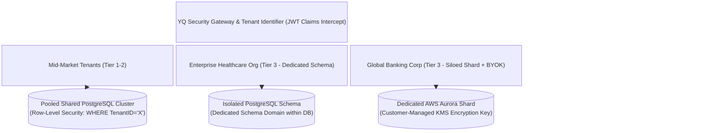

# YQ Target Architecture: Multi-Tenancy Data Isolation, Security & RBAC/ABAC

> **Document Status:** Architectural Blueprint (Target Standard)
> **Owner:** Enterprise SaaS Consultant & Staff Software Architect
> **Classification:** Confidential — Internal Engineering Documentation

---

## 1. Executive Summary

Enterprise Software procurements in Healthcare (HIPAA), Financial Services (SOC2 Type II / PCI-DSS), and Government (DMV / Public Sector) mandate absolute isolation of customer data. A single data leakage incident across multi-tenant boundaries represents an existential failure.

This document specifies YQ's dual-tier multi-tenancy isolation architecture, customer-managed encryption key (BYOK) protocols, and hybrid Role/Attribute-Based Access Control (RBAC/ABAC) security model.

---

## 2. Hybrid Multi-Tenancy Data Isolation Model

To balance SaaS cost efficiency for mid-market clients with stringent zero-trust isolation for Fortune 500 enterprises, YQ architects a **Configurable Dual-Tier Storage Topology**:

### 2.1 Tier 1: Pooled Storage with Automated PostgreSQL Row-Level Security (RLS)
For standard deployments, tenants share optimized database clusters. Isolation is enforced at the database engine level—not just in application code—via **PostgreSQL Row-Level Security (RLS)** policies. Every session query securely embeds a temporary session configuration (`SET LOCAL application.current_tenant_id = 'UUID'`), making cross-tenant query leakage mathematically impossible even if application ORM filtering bugs occur.

### 2.2 Tier 2: Dedicated Schema & Dedicated Database Shard Options
For enterprise healthcare and banking deployments, YQ provisions entirely siloed PostgreSQL schemas or independent, dedicated cloud database instances (AWS Aurora Serverless). These dedicated instances integrate with **AWS KMS / Azure Key Vault Customer-Managed Keys (CMK / BYOK)**, empowering the enterprise organization to revoke database decryption access at any time independently of YQ engineers.

---

## 3. Hybrid Authorization Engine: RBAC + ABAC Governance

While basic SaaS competitors rely solely on static static role designations (Admin, Manager, Staff), YQ incorporates an **Attribute-Based Access Control (ABAC)** evaluation policy engine built upon OPA (Open Policy Agent) specifications.

### 3.1 Real-Time Policy Evaluation Pipeline
When an agent or supervisor attempts an action (e.g., viewing a patient's medical appointment history or performing an SLA priority override), the IAM microservice evaluates four dynamic contextual attributes:
1. **User Identity Role (RBAC):** Is the user assigned the `Counter_Agent`, `Triage_Greeter`, or `Branch_Supervisor` role?
2. **Geopolitical / Network Location Attribute (ABAC):** Does the user's requesting IP address match the approved corporate Intranet subnet or verified GPS boundary of the designated branch location?
3. **Temporal Shift Attribute (ABAC):** Does the interaction timestamp fall within the scheduled employee shift roster and active branch operating hours?
4. **Entity Privacy Classification Attribute (ABAC):** Does the appointment contain Protected Health Information (PHI)? If yes, ensure the requesting agent has signed an active annual HIPAA training attestation flag.

If any attribute fails evaluation, access is immediately blocked with a security audit event dispatched to the customer's SIEM console.
