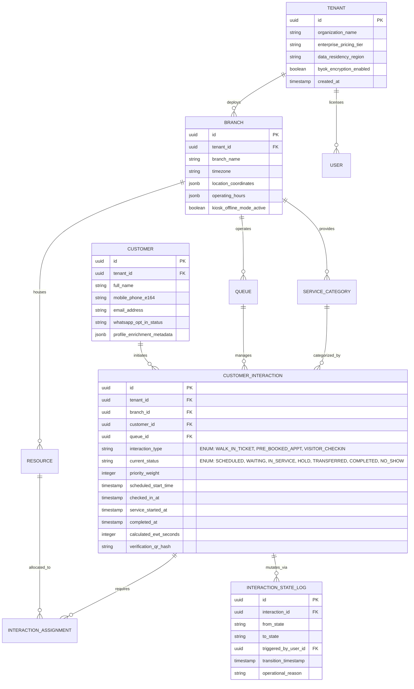

# YQ Target Architecture: Core Domain Models & Relational Schema Specifications

> **Document Status:** Architectural Blueprint (Target Standard)
> **Owner:** Staff Software Architect & Senior Product Manager
> **Classification:** Confidential — Internal Engineering Documentation

---

## 1. Executive Summary & Polymorphic Interaction Philosophy

Legacy platform architectures suffer from disjointed data silos: an on-site walk-in queue ticket, a pre-booked future appointment, and a building facility visitor check-in are historically stored in entirely disconnected database tables with conflicting customer identification schema.

**YQ discards this structural fragmentation.** In YQ's core domain architecture, Queue Tickets, Appointments, and Visitor Check-ins are modeled as polymorphic states of a unified, singular entity: the **`CustomerInteraction`**. This architectural breakthrough guarantees an immediate 360-degree omnichannel operational record across all customer touchpoints.

---

## 2. Definitive Entity Relationship Schema Diagram

---

## 3. Key Table Structural Definitions & Schema Logic

### 3.1 `CUSTOMER_INTERACTION` (The Core Unified Engine)
By designing `CUSTOMER_INTERACTION` with a polymorphic `interaction_type` enumerator (`WALK_IN_TICKET`, `PRE_BOOKED_APPT`, `VISITOR_CHECKIN`), YQ enables seamless workflow morphing:
* **Workflow Transformation Example:** A patient pre-books an appointment (`PRE_BOOKED_APPT`). Upon scanning their dynamic Apple Wallet QR pass at the hospital kiosk on the morning of arrival, the exact same database entity simply updates its status to `WAITING`, assigns itself to the outpatient triage `QUEUE`, and appears instantaneously on the nurse's live queue dashboard without creating fragmented duplicate record entries.

### 3.2 `INTERACTION_STATE_LOG` (Immutable Event Sourcing & Audit)
Every status transformation (e.g., switching a ticket from `WAITING` to `IN_SERVICE` or executing a managerial priority override) MUST insert an immutable row into the `INTERACTION_STATE_LOG` table. 
* **Engineering Justification:** This historical immutable audit event log powers YQ's real-time Business Intelligence dashboard, enables sub-second rollback if a receptionist misclicks an action, and feeds our Machine Learning wait-time training models with exact micro-second timestamps of service velocity across every individual counter and staff member.
