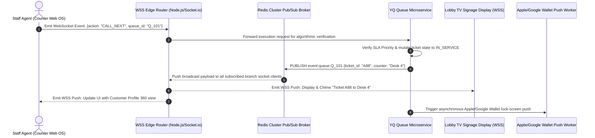

# YQ Target Architecture: Realtime Synchronization, WebSockets & Offline Edge Engine

> **Document Status:** Architectural Blueprint (Target Standard)
> **Owner:** Staff Software Architect
> **Classification:** Confidential — Internal Engineering Documentation

---

## 1. Executive Summary & Real-Time Imperatives

A modern customer journey platform operates in a zero-latency real-time environment. When an agent at Counter #4 hits **"Call Next Ticket"**, three physical phenomena must execute simultaneously within 50 milliseconds globally:
1. The receptionist's web dashboard instantly animates the active customer profile into view.
2. The 4K lobby television signage display flashes the new calling number accompanied by neural speech audio announcements.
3. The customer's mobile phone emits a high-contrast haptic vibration as their Apple/Google Wallet pass updates on their lock screen.

Furthermore, if the local physical premises Internet connection experiences an outage, walk-in touch kiosks MUST continue issuing printed tickets and routing queues locally without failing.

---

## 2. Distributed WebSocket & Redis Pub/Sub Architecture



---

## 3. Offline-First Kiosk Edge Resilience (Local PWA State Machine)

To overcome cloud dependency technical debt, YQ engineers walk-in touch kiosks using an **Offline-First Progressive Web App (PWA)** architecture backed by browser **Service Workers** and **IndexedDB**.

```mermaid
flowchart TD
    subgraph Kiosk_Terminal [YQ Lobby Touch Kiosk (PWA Browser)]
        SW[Service Worker Network Intercept]
        Local_DB[(IndexedDB Local State & Sequence Buffer)]
        Printer_Engine[WebUSB Direct Thermal Printing]
    end

    subgraph Cloud_Backend [YQ Cloud Engine]
        API_Server[Primary Cloud API & DB Cluster]
    end

    Customer_Tap[Customer Taps: "Get Ticket"] --> SW
    SW -->|Network Status: ONLINE| API_Server
    API_Server -->|Return Ticket #A105 & EWT| Printer_Engine
    
    SW -->|Network Status: OFFLINE (WAN Cutoff)| Local_DB
    Local_DB -->|Allocate Buffered Ticket #A106_LOCAL| Printer_Engine
    
    Note over Local_DB,API_Server: Upon Automatic WAN Restoration...
    SW -->|Background Sync (Reconciliation Protocol)| API_Server
    API_Server -->|Merge Local Tickets & Adjust Queues| Local_DB
```

### 3.1 Offline Reconciliation & Buffer Pools
When a Kiosk operates online, YQ Cloud pre-allocates a cryptographic token pool and continuous numerical sequence block into the tablet's local `IndexedDB` storage.
* **During Internet Disconnection:** The Service Worker cleanly intercepts ticket request POSTs, instantly draws an offline token from `IndexedDB`, increments local queue sequence numbers, and executes WebUSB thermal printing with zero perceived latency by the walk-in customer.
* **Upon Network Reconnection:** The Service Worker triggers a background synchronization protocol, transmitting the offline interaction timestamp payload to YQ Cloud, which merges the local tickets into the active central database and recalibrates estimated wait-time algorithms without disruption or numbering collisions.
