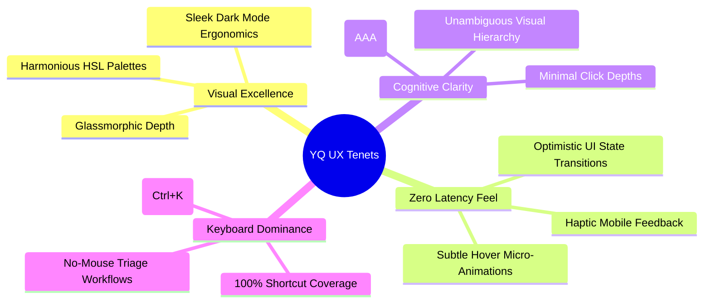

# YQ UX & Design System: Design Principles, UI Tokens & Visual Superiority

> **Document Status:** Design Standard & Engineering Blueprint
> **Owner:** UX Researcher & Senior Product Manager
> **Classification:** Confidential — Internal Engineering Documentation

---

## 1. Executive Summary & Visual Superiority Imperative

Legacy platforms in the customer journey and visitor management sector suffer from bland, outdated corporate user interfaces. They look and feel like administrative database interfaces designed in the late 2000s—plastered with clutter, confusing navigation, and robotic static text.

**YQ operates under an uncompromising design philosophy:** Our interface must generate immediate visual delight ("WOW" factor) at first glance. We mandate the use of vibrant, harmonious HSL color palettes, sleek dark modes, glassmorphism surface layering, micro-animations, and typographic precision to create an enterprise software experience that feels like a consumer-grade application.

---

## 2. Core Design Principles & Micro-Interaction Directives



### 2.1 Dynamic Micro-Animations & Responsive State Transitions
An interface that feels alive encourages seamless interaction. YQ engineers must integrate smooth CSS transitions and Spring-physics micro-animations across every reactive user touchpoint:
* **Queue Ticket Calling Transformation:** When an agent calls a ticket, the active queue card smoothly morphs and elevates across the screen with a 250ms cubic-bezier transition rather than abruptly flashing into existence via static page reloads.
* **Live Pulse Timers:** Customer wait tracking cards embed a subtle, breathing radial gradient animation around the Estimated Wait Time (EWT) clock, intuitively conveying to anxious waiting customers that the tracking engine is actively connected to live branch operations.

---

## 3. Standardized UI Design Tokens & Typography Specifications

To enforce consistent visual architecture across customer PWAs, staff dashboards, and lobby TV displays, all front-end engineers must consume standardized CSS variables defined in YQ's design system token repository:

```css
:root {
  /* Core Brand Identity & Accent HSL Tokens */
  --yq-primary: hsl(252, 87%, 67%);      /* Vibrant Cyber Indigo */
  --yq-primary-hover: hsl(252, 90%, 58%); /* Deepened Active Indigo */
  --yq-accent-cyan: hsl(186, 100%, 50%);  /* High-Energy Neon Cyan for VIP states */
  --yq-alert-ruby: hsl(352, 85%, 60%);    /* SLA Breach & Overcrowding Warning */
  --yq-success-mint: hsl(152, 80%, 48%);  /* Confirmed Check-In & Complete State */

  /* Sleek Dark Mode & Glassmorphic Surface Tokens */
  --yq-bg-canvas: hsl(222, 47%, 7%);      /* Ultra-Deep Obsidian Canvas */
  --yq-bg-surface: hsl(220, 39%, 12%);    /* Elevated Elevated Dashboard Slate */
  --yq-bg-glass: rgba(30, 41, 59, 0.65);  /* Acrylic Glassmorphic Kiosk Panel */
  --yq-glass-border: 1px solid rgba(255, 255, 255, 0.12);

  /* Modern Typography & Scaling Hierarchy (Google Font Integration: Inter & Outfit) */
  --yq-font-display: 'Outfit', -apple-system, sans-serif; /* High-impact headers & numbers */
  --yq-font-body: 'Inter', -apple-system, sans-serif;    /* Clean data grids & controls */
  
  /* Micro-Animation Timings */
  --yq-transition-fast: 150ms cubic-bezier(0.4, 0, 0.2, 1);
  --yq-transition-smooth: 280ms cubic-bezier(0.16, 1, 0.3, 1);
}
```

---

## 4. Universal Accessibility Standards (WCAG 2.1 AAA Enforcement)

* **High-Contrast Touch Kiosk Mode:** Touch kiosk terminals embed an accessible toggle that instantly elevates visual contrast ratios above 7:1, expands touch targets to 64x64 pixels, and activates integrated screen-reader voice guidance for visually impaired visitors.
* **Color Blindness Safe Signage:** Lobby TV displays never rely solely on color codes (e.g., green vs. red) to communicate SLA priority; all states are reinforced with distinct icon symbology and crisp typographic labeling.
