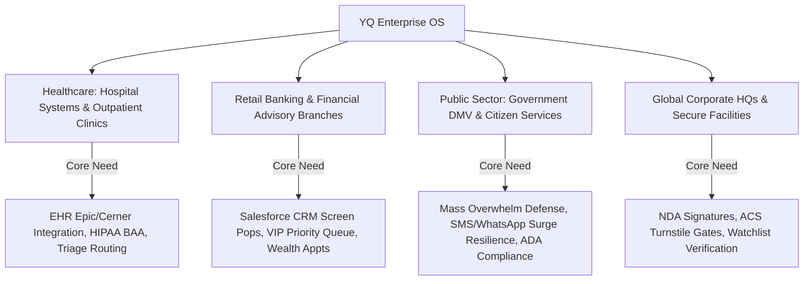
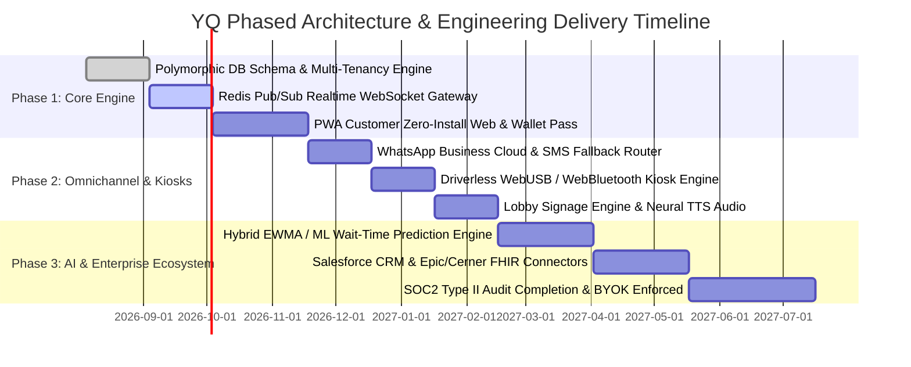

# YQ Product Strategy: Target ICPs, Pricing & Enterprise Roadmap

> **Document Status:** Active Standard & Roadmap Blueprint
> **Owner:** Senior Product Manager & Enterprise SaaS Consultant
> **Classification:** Confidential — Internal Engineering Documentation

---

## 1. Target Ideal Customer Profiles (ICPs) & Vertical Alignment

YQ focuses its go-to-market and architectural customization around four high-value enterprise verticals where queue friction, scheduling delays, and visitor management failures generate measurable financial and operational losses:

---

## 2. disruptive Commercial Packaging & Licensing Economics

Legacy competitors confuse buyers with complicated pricing matrices—charging simultaneous fees per location, per hardware kiosk terminal, per administrative user seat, and expensive surcharge usage tiers for every individual SMS reminder text sent.

### 2.1 YQ Transparent Location-Based Licensing Architecture
YQ obliterates enterprise contract adoption friction by implementing an intuitive, predictable **Per-Branch / Location-Based Enterprise License**:
* **Unlimited User & Agent Seats:** Enterprise clients can license hundreds of front-desk tellers and clinic receptionists per branch without per-user seat penalties, encouraging rapid 100% staff workflow adoption.
* **Universal Channel Inclusion:** All base conversational messaging via WhatsApp Business Cloud API and dynamic Apple/Google Wallet pass updates are bundled directly into the location enterprise subscription tier, eliminating unpredictable telecommunications overage anxiety for CFOs.
* **Hardware Freedom Guarantee:** Zero vendor lock-in. Customers install YQ software across their existing commercial hardware investments (standard Apple iPads, Android tablets, Epson/Zebra USB thermal printers, Apple TVs for lobby signage) without paying recurring hardware maintenance leases to YQ.

---

## 3. Phased Engineering Execution & Delivery Roadmap

### 3.1 Milestone Summary
* **Phase 1 (MVP Foundation - Months 1-3):** Delivery of the unified polymorphic `CUSTOMER_INTERACTION` database schema, PostgreSQL multi-tenancy Row-Level Security, sub-50ms Redis WebSocket sync, and zero-install customer PWAs with dynamic lock-screen Apple Wallet passes.
* **Phase 2 (Omnichannel & Hardware Freedom - Months 4-5):** Deployment of intelligent messaging fallback gateways (WhatsApp -> SMS) and driverless WebUSB/WebBluetooth kiosk terminal printing.
* **Phase 3 (AI Mastery & Enterprise Scale - Months 6-8):** Production release of machine learning reinforcement models for predictive wait times, deep Epic/Salesforce ecosystem webhooks, and formal SOC2 Type II compliance attestation with Customer-Managed Key (CMK) encryption.
